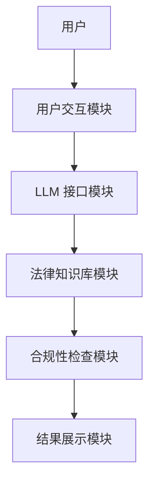
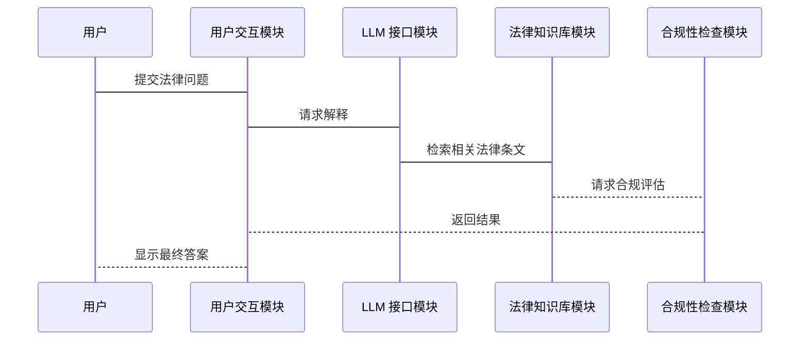

                 


# 法律顾问 AI Agent：LLM 在法律咨询与合规检查中的应用

## 关键词：法律顾问 AI Agent, 大语言模型, 法律咨询, 合规检查, 人工智能

## 摘要：本文探讨了大语言模型（LLM）在法律咨询与合规检查中的应用，详细分析了法律顾问 AI Agent 的系统架构、算法原理及项目实现，展示了LLM在法律领域的巨大潜力。

---

## 第一部分：法律顾问 AI Agent 的背景与核心概念

### 第1章：法律咨询行业的现状与挑战

#### 1.1 传统法律咨询行业的痛点
- **服务效率低下**：律师资源有限，难以满足大规模需求。
- **成本高昂**：传统法律咨询费用昂贵，中小企业难以负担。
- **知识更新滞后**：法律知识更新快，人工更新效率低。

#### 1.2 企业合规检查的复杂性
- **法律条文繁多**：企业需遵守的法律法规复杂多样。
- **合规风险高**：合规失败可能导致严重后果。
- **专业性要求高**：需要专业知识和经验。

#### 1.3 法律服务资源的不平衡性
- **地域差异**：优质资源集中在大城市，偏远地区缺乏。
- **人才短缺**：专业律师数量不足，需求与供给失衡。

#### 1.4 AI 技术的机遇
- **自动化处理**：AI可快速处理大量法律文档。
- **24/7可用性**：提供全天候咨询服务。
- **成本降低**：降低企业法律服务成本。

### 第2章：大语言模型（LLM）在法律咨询中的应用

#### 2.1 LLM 的定义与技术特点
- **定义**：LLM 是一种基于深度学习的自然语言处理模型，能够理解和生成人类语言。
- **技术特点**：
  - 大规模参数量：通常数十亿甚至更多。
  - 预训练与微调：通过大量数据预训练，再在特定任务上微调。
  - 多任务能力：能处理多种语言任务，如翻译、问答、文本生成。

#### 2.2 LLM 在法律咨询中的应用潜力
- **法律文本生成**：生成合同、法律意见书等。
- **法律信息检索**：快速检索相关法律条文和案例。
- **合规性检查**：自动检查文档是否符合法规要求。

#### 2.3 法律顾问 AI Agent 的概念
- **定义**：集成LLM的智能系统，提供法律咨询和合规检查服务。
- **功能特点**：
  - 自然语言理解与生成。
  - 实时法律信息检索。
  - 自动合规性评估。

---

## 第二部分：法律顾问 AI Agent 的技术实现

### 第3章：LLM 的算法原理与数学模型

#### 3.1 LLM 的基本原理
- **输入处理**：将输入文本转换为向量表示。
- **解码过程**：通过自回归方式生成输出文本。
- **训练目标**：最小化生成文本与真实文本的差异。

#### 3.2 常见的 LLM 模型
- **GPT 系列**：OpenAI的GPT-3、GPT-4。
- **BERT 系列**：Google的BERT及其变体。
- **其他模型**：如LegalBERT，专为法律文本优化。

#### 3.3 LLM 的训练与推理过程
- **训练阶段**：
  1. **预训练**：使用大规模通用文本数据进行无监督学习。
  2. **微调**：在特定领域数据上进行有监督微调。
- **推理阶段**：
  1. **编码器**：将输入文本编码为向量。
  2. **解码器**：生成符合要求的输出文本。

#### 3.4 数学模型
- **损失函数**：交叉熵损失函数。
  $$ \mathcal{L} = -\sum_{i=1}^{n} \log p(y_i|x_i) $$
- **优化算法**：通常使用Adam优化器。
- **概率生成**：输出每个词的概率分布。

### 第4章：系统架构设计

#### 4.1 系统功能模块
- **用户交互模块**：接收用户输入，返回结果。
- **LLM 接口模块**：与大语言模型进行通信。
- **法律知识库模块**：存储和管理法律条文、案例。
- **合规性检查模块**：评估文档是否符合法规。

#### 4.2 系统架构图


#### 4.3 接口设计
- **用户输入接口**：接收法律问题或文档。
- **LLM 调用接口**：与云服务提供商如OpenAI通信。
- **合规性检查接口**：返回合规性评估结果。

#### 4.4 交互流程图


---

## 第三部分：法律顾问 AI Agent 的项目实战

### 第5章：项目环境与安装

#### 5.1 环境要求
- **操作系统**：Windows 10+ 或 macOS 10.15+。
- **Python 版本**：Python 3.8+。
- **依赖库**：
  - `transformers`：用于加载预训练模型。
  - `openai`：用于调用OpenAI API。
  - `numpy`：用于数值计算。
  - `matplotlib`：用于可视化（可选）。

#### 5.2 安装步骤
```bash
pip install transformers openai numpy matplotlib
```

### 第6章：系统实现

#### 6.1 核心代码实现
```python
from transformers import AutoTokenizer, AutoModelForCausalLM
import openai

class LegalAdvisorAI:
    def __init__(self, model_name="microsoft/DeBERTa-v3"):
        self.tokenizer = AutoTokenizer.from_pretrained(model_name)
        self.model = AutoModelForCausalLM.from_pretrained(model_name)
        self.client = openai.Client()

    def generate_legal_advice(self, question):
        inputs = self.tokenizer(question, return_tensors="np")
        outputs = self.model.generate(inputs.input_ids, max_length=500)
        response = self.tokenizer.decode(outputs[0], skip_special_tokens=True)
        return response

    def check_compliance(self, document):
        # 使用 OpenAI API 进行合规性检查
        response = self.client.chat.completions.create(
            model="gpt-4",
            messages=[{"role": "user", "content": f"Check compliance of {document}"}],
            temperature=0.1
        )
        return response.choices[0].message.content
```

#### 6.2 实现细节
- **模型选择**：选择适合法律领域的预训练模型，如DeBERTa-v3。
- **API集成**：通过OpenAI API进行实时推理，确保最新的法律知识。
- **错误处理**：实现异常处理和重试机制，确保系统稳定性。

### 第7章：案例分析

#### 7.1 合同合规性检查案例
- **输入**：用户上传一份商业合同。
- **处理流程**：
  1. **预处理**：解析合同内容，识别关键条款。
  2. **模型推理**：调用LLM检查合同是否符合当地法规。
  3. **结果展示**：生成合规报告，指出潜在风险。
- **输出结果**：合规性评估结果及建议。

#### 7.2 法律咨询案例
- **输入**：用户询问某项法律问题。
- **处理流程**：
  1. **问题理解**：解析用户意图。
  2. **知识检索**：从法律知识库中检索相关信息。
  3. **生成回答**：基于检索结果生成详细解答。
- **输出结果**：法律建议和相关依据。

### 第8章：项目小结

#### 8.1 项目成果
- 成功开发了一个基于LLM的法律顾问AI系统。
- 实现了法律咨询和合规检查两大核心功能。

#### 8.2 实践中的挑战
- **模型选择**：如何选择适合特定任务的模型。
- **数据隐私**：处理法律文档时的数据安全问题。
- **模型调优**：微调模型以提高准确率。

---

## 第四部分：法律顾问 AI Agent 的最佳实践与展望

### 第9章：最佳实践

#### 9.1 数据质量管理
- 确保训练数据的多样性和代表性。
- 定期更新知识库，保持法律信息的准确性。

#### 9.2 模型优化
- 在特定领域数据上进行微调，提高模型性能。
- 使用更小的模型或剪枝技术，降低计算成本。

#### 9.3 系统安全与合规
- 遵守数据保护法规，确保用户隐私。
- 建立访问控制机制，防止未授权访问。

### 第10章：未来展望

#### 10.1 技术进步
- 更强大的模型（如GPT-5）可能带来更准确的法律咨询。
- 多模态模型的引入，结合图像识别等技术，提供更全面的法律服务。

#### 10.2 应用扩展
- 拓展至更多法律领域，如知识产权、刑事法等。
- 结合区块链技术，提供不可篡改的法律服务记录。

#### 10.3 行业影响
- 提高法律服务的可及性，降低企业法律成本。
- 改变传统法律服务模式，推动法律行业数字化转型。

---

## 作者：AI天才研究院/AI Genius Institute & 禅与计算机程序设计艺术 /Zen And The Art of Computer Programming

---

**注意**：以上内容为示例性目录和部分章节内容，实际撰写时需要根据具体需求进一步扩展和详细化。

