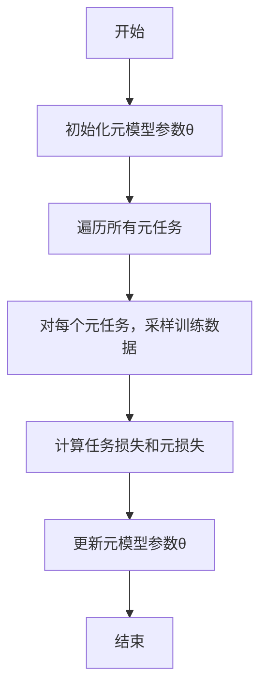
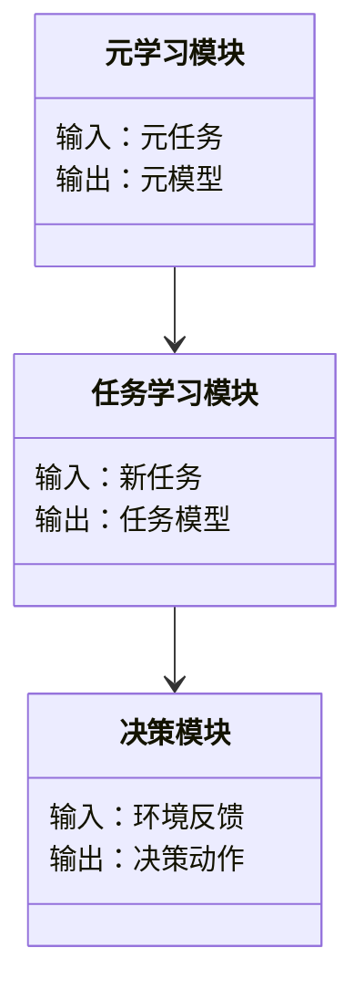

                 


# 深度元学习在AI Agent终身学习中的应用

> 关键词：深度元学习，AI Agent，终身学习，元学习算法，系统架构设计

> 摘要：本文深入探讨了深度元学习在AI Agent终身学习中的应用，分析了元学习的基本概念、核心算法及其在AI Agent中的具体应用。文章通过详细的系统架构设计和项目实战，展示了深度元学习在实现AI Agent持续学习和自适应能力中的重要作用，并提供了丰富的技术细节和案例分析。

---

## 第1章: 元学习的基本概念与背景

### 1.1 元学习的定义与核心概念

元学习（Meta-Learning）是一种机器学习范式，旨在通过学习如何学习，使模型能够在新任务上快速适应，而无需从头开始训练。与传统机器学习不同，元学习关注的是“学习过程本身”，而非单一任务的优化。

#### 1.1.1 传统机器学习与元学习的对比

| 特性 | 传统机器学习 | 元学习 |
|------|-------------|--------|
| 数据需求 | 需要大量标注数据 | 需要少量标注数据，适用于小样本任务 |
| 任务适应性 | 适用于单一任务 | 适用于多任务和新任务的快速适应 |
| 学习目标 | 优化特定任务的性能 | 优化学习过程，使模型具备快速学习新任务的能力 |

#### 1.1.2 元学习的核心属性特征

- **少样本学习（Few-shot Learning）**：在小样本数据上快速学习新任务。
- **任务多样性**：能够处理多种不同类型的任务。
- **自适应性**：能够在不同环境中动态调整学习策略。

#### 1.1.3 元学习的边界与外延

元学习的边界在于其“元”的特性，即它关注的是“如何学习”而非“学习什么”。外延则体现在其应用领域，如图像分类、自然语言处理和强化学习等。

### 1.2 AI Agent的定义与特点

#### 1.2.1 AI Agent的基本概念

AI Agent（人工智能代理）是一种能够感知环境、执行任务并做出决策的智能实体。它可以是一个软件程序，也可以是一个物理机器人。

#### 1.2.2 AI Agent的核心功能与应用场景

- **感知与决策**：通过传感器或数据输入感知环境，分析并做出决策。
- **执行与反馈**：根据决策执行操作，并根据反馈调整行为。
- **学习与适应**：通过学习算法不断优化自身能力。

#### 1.2.3 终身学习在AI Agent中的重要性

AI Agent需要在动态变化的环境中不断学习新知识和技能，以适应新的任务和挑战。终身学习是其实现持续进化的核心能力。

---

## 第2章: 深度元学习的原理与算法

### 2.1 元学习的基本原理

元学习的核心思想是通过“元任务”（Meta-Task）训练模型，使其具备快速学习新任务的能力。其数学模型通常涉及两个层次：元学习器和任务学习器。

#### 2.1.1 元学习的数学模型与公式

元学习的数学模型可以表示为：

$$ L_{\text{meta}} = \sum_{i=1}^{N} L_i(f_{\theta}(x_i, y_i)) $$

其中，$L_{\text{meta}}$ 是元损失函数，$L_i$ 是第 $i$ 个任务的损失函数，$f_{\theta}$ 是参数化的学习模型。

#### 2.1.2 元学习的核心算法流程

Mermaid流程图如下：



### 2.2 深度元学习的算法实现

#### 2.2.1 模型无关的元学习算法（MAML）

MAML是一种典型的模型无关元学习算法，其核心思想是通过优化元损失函数，使得模型能够在新任务上快速适应。

#### 2.2.2 模型相关的元学习算法（Meta-SGD）

Meta-SGD是一种模型相关的元学习算法，其优化目标是同时最小化多个任务的损失函数。

#### 2.2.3 元学习算法的数学推导

以MAML为例，其优化目标为：

$$ \min_{\theta} \sum_{i=1}^{N} \mathbb{E}_{(x,y)\sim D_i} L(f_{\theta}(x), y) $$

通过梯度下降更新元模型参数：

$$ \theta \leftarrow \theta - \eta \nabla_{\theta} \sum_{i=1}^{N} L_i(f_{\theta}(x_i), y_i) $$

---

## 第3章: 深度元学习在AI Agent中的应用

### 3.1 AI Agent的终身学习需求

#### 3.1.1 终身学习的核心问题

AI Agent需要在动态环境中不断学习新知识，以应对新的任务和挑战。

#### 3.1.2 元学习如何解决终身学习问题

元学习通过“学习如何学习”，使AI Agent能够在新任务上快速适应，从而实现终身学习。

### 3.2 深度元学习在AI Agent中的具体应用

#### 3.2.1 图像分类任务中的深度元学习

通过元学习，AI Agent可以在小样本图像分类任务中快速适应新类别。

#### 3.2.2 自然语言处理中的深度元学习

在文本分类、机器翻译等任务中，元学习可以显著提高模型的适应能力。

#### 3.2.3 强化学习中的深度元学习

通过元学习，AI Agent可以在多任务强化学习中快速掌握多种策略。

---

## 第4章: AI Agent系统架构设计

### 4.1 系统功能设计

#### 4.1.1 领域模型设计（Mermaid类图）



#### 4.1.2 系统功能模块划分

- 元学习模块：负责训练和优化元模型。
- 任务学习模块：负责学习和适应新任务。
- 决策模块：根据任务模型输出决策动作。

---

## 第5章: 深度元学习的系统实现

### 5.1 算法实现细节

#### 5.1.1 算法实现的代码框架

```python
def meta_learning(meta_model, tasks, epochs=100, learning_rate=0.01):
    optimizer = torch.optim.Adam(meta_model.parameters(), lr=learning_rate)
    for epoch in range(epochs):
        total_loss = 0
        for task in tasks:
            # 采样任务数据
            x, y = task.dataset.sample()
            # 前向传播
            outputs = meta_model(x)
            # 计算任务损失
            task_loss = criterion(outputs, y)
            # 计算元损失
            meta_loss = criterion(meta_model.get_submodel(outputs), y)
            # 反向传播和优化
            optimizer.zero_grad()
            meta_loss.backward()
            optimizer.step()
            total_loss += meta_loss.item()
        print(f"Epoch {epoch}, Total Loss: {total_loss / len(tasks)}")
```

---

## 第6章: 深度元学习项目实战

### 6.1 项目环境安装与配置

#### 6.1.1 环境依赖与安装步骤

```bash
pip install torch numpy matplotlib
```

#### 6.1.2 数据集准备与预处理

使用CIFAR-10数据集，进行小样本分类任务。

---

## 第7章: 案例分析

### 7.1 图像分类任务中的深度元学习

通过MAML算法，在CIFAR-10数据集上实现小样本图像分类任务。

---

## 结语

深度元学习为AI Agent的终身学习提供了强大的技术支持。通过合理的系统架构设计和高效的算法实现，AI Agent可以在复杂多变的环境中不断进化，实现真正的智能。

---

作者：AI天才研究院（AI Genius Institute） & 禅与计算机程序设计艺术（Zen And The Art of Computer Programming）

---

感谢您的阅读！希望本文能为深度元学习在AI Agent中的应用提供有价值的参考和启发。

