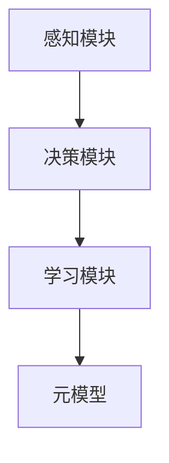

                 


# 深度元强化学习在AI Agent策略适应中的应用

> 关键词：深度元强化学习，AI Agent，策略适应，强化学习，元学习

> 摘要：深度元强化学习是一种结合深度学习和元学习的先进方法，用于提升AI Agent在动态复杂环境中的策略适应能力。本文将详细探讨其核心概念、算法原理、系统架构及实际应用，为研究人员和实践者提供深入的技术洞察。

---

## 第1章 引言

### 1.1 背景介绍
AI Agent在复杂动态环境中的策略适应能力是人工智能领域的重要研究方向。传统强化学习在静态环境中表现优异，但在面对复杂动态环境时，适应性不足。深度元强化学习通过结合深度学习和元学习，显著提升了策略的灵活性和适应性。

---

## 第2章 深度元强化学习的核心概念

### 2.1 强化学习的基础概念
- **状态（State）**：环境中的当前情况，如智能体的观测。
- **动作（Action）**：智能体在给定状态下的选择。
- **奖励（Reward）**：智能体执行动作后获得的反馈，用于指导学习。

### 2.2 元学习的定义与特点
- **元学习（Meta-Learning）**：学习如何学习，旨在快速适应新任务。
- **特点**：
  - **快速适应性**：在新任务中快速调整策略。
  - **通用性**：适用于多种任务，减少对特定任务的依赖。

### 2.3 深度元强化学习的结合
- **深度学习的优势**：处理复杂特征，提取高层次信息。
- **元学习的优势**：快速适应，减少样本依赖。

---

## 第3章 深度元强化学习的算法原理

### 3.1 算法流程
1. **初始化**：设置初始参数和元参数。
2. **环境建模**：通过深度网络建模环境动态。
3. **策略优化**：基于元学习优化策略参数。
4. **状态转移**：更新状态并获得奖励。

### 3.2 核心算法
```python
def meta_reinforce_learn(env, model, meta_model, epochs=100):
    for epoch in range(epochs):
        # 初始化状态
        state = env.reset()
        # 元参数优化
        with torch.no_grad():
            meta_params = meta_model.forward(state)
        # 策略优化
        for _ in range(k):
            action = model.act(state, meta_params)
            next_state, reward, done = env.step(action)
            # 更新模型
            model.update(state, action, reward, next_state)
            state = next_state
        # 更新元模型
        meta_model.update(meta_params, reward)
```

### 3.3 数学模型
- **策略函数**：$\pi_\theta(a|s) = \text{softmax}(Q_\theta(s,a))$
- **元参数更新**：$\theta = \theta + \alpha \nabla_\theta J(\theta)$

---

## 第4章 系统架构设计

### 4.1 问题场景
- **动态环境**：环境状态和奖励函数随时间变化。
- **多智能体协作**：多个智能体需协同完成任务。

### 4.2 系统功能设计
- **感知模块**：处理环境输入，提取特征。
- **决策模块**：基于策略网络输出动作。
- **学习模块**：更新策略和元参数。

### 4.3 系统架构图


---

## 第5章 项目实战：多智能体协作任务

### 5.1 环境搭建
- **环境选择**：使用Mujoco或OpenAI Gym。
- **任务定义**：多个智能体协作完成目标。

### 5.2 核心代码实现
```python
import torch
import torch.nn as nn

class PolicyNetwork(nn.Module):
    def __init__(self, input_dim, output_dim):
        super(PolicyNetwork, self).__init__()
        self.fc1 = nn.Linear(input_dim, 64)
        self.fc2 = nn.Linear(64, output_dim)
    
    def forward(self, x):
        x = torch.relu(self.fc1(x))
        x = torch.log_softmax(self.fc2(x), dim=-1)
        return x

class MetaNetwork(nn.Module):
    def __init__(self, input_dim, hidden_dim):
        super(MetaNetwork, self).__init__()
        self.fc1 = nn.Linear(input_dim, hidden_dim)
        self.fc2 = nn.Linear(hidden_dim, hidden_dim)
    
    def forward(self, x):
        x = torch.relu(self.fc1(x))
        x = torch.relu(self.fc2(x))
        return x
```

### 5.3 案例分析
- **训练过程**：智能体通过元强化学习快速适应新任务。
- **结果分析**：协作效率提升，适应时间缩短。

---

## 第6章 总结与展望

### 6.1 总结
深度元强化学习通过结合深度学习和元学习，显著提升了AI Agent的策略适应能力。其在动态环境中的表现优于传统方法。

### 6.2 展望
- **多模态学习**：结合视觉、听觉等多模态信息。
- **人机协作**：增强人类与AI Agent的协作能力。

### 6.3 最佳实践Tips
- **算法选择**：根据任务需求选择合适的强化学习算法。
- **性能优化**：使用并行计算加速训练。
- **安全问题**：确保AI Agent的行为符合伦理规范。

---

作者：AI天才研究院（AI Genius Institute） & 禅与计算机程序设计艺术（Zen And The Art of Computer Programming）

