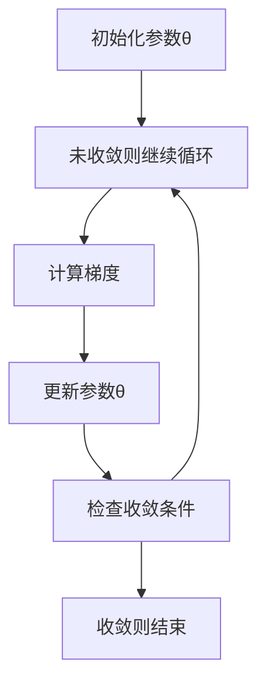
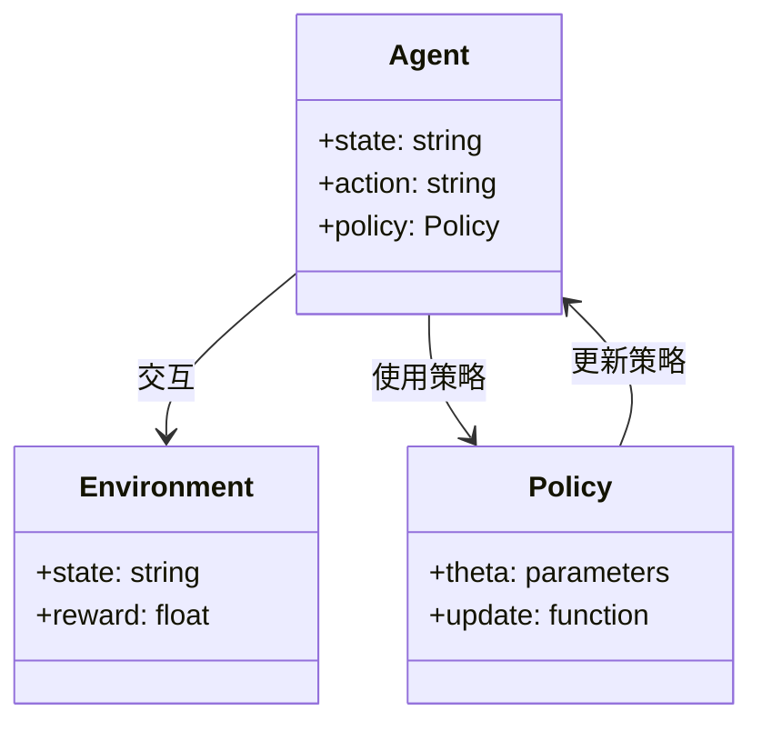
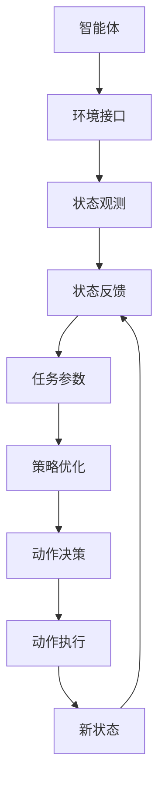
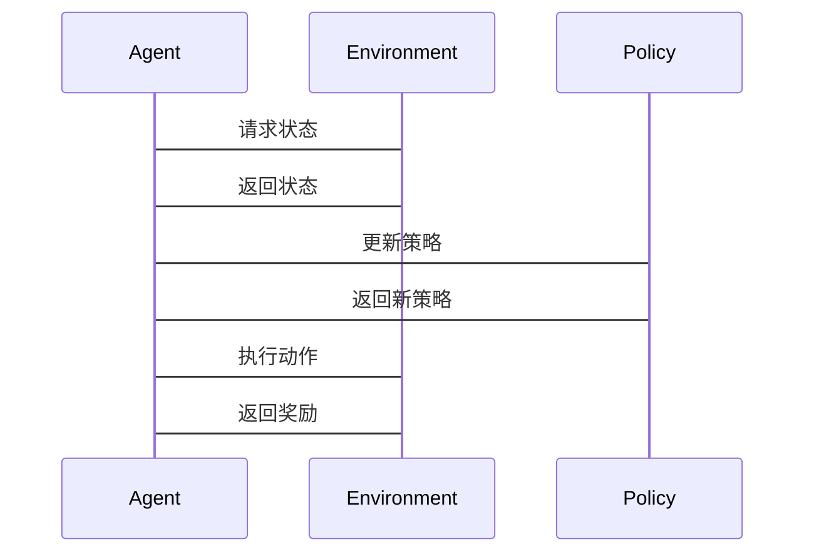

                 


# 深度元强化学习在AI Agent适应性中的应用

> 关键词：深度强化学习，元强化学习，AI Agent，适应性，算法原理

> 摘要：本文深入探讨了深度元强化学习（Deep Meta Reinforcement Learning，D-MRL）在AI Agent自适应性中的应用。通过分析DRL和MRL的核心概念、算法原理、系统架构，以及实际应用案例，本文展示了如何利用深度元强化学习提升AI Agent的自适应能力，使其能够在复杂动态环境中实现高效的决策与行为优化。

---

## 第一部分：深度元强化学习与AI Agent的背景介绍

### 第1章：深度元强化学习与AI Agent的背景介绍

#### 1.1 深度强化学习与元强化学习概述

##### 1.1.1 深度强化学习的基本概念
深度强化学习（Deep Reinforcement Learning，DRL）是人工智能领域的重要研究方向，它结合了深度学习和强化学习的优势。DRL通过神经网络来逼近最优策略或价值函数，能够在高维、复杂环境中实现自主决策。

- 强化学习的核心：智能体通过与环境交互，通过试错学习策略，以最大化累积奖励。
- 深度学习的优势：能够处理高维、非线性特征，提取复杂环境中的潜在模式。

##### 1.1.2 元强化学习的定义与特点
元强化学习（Meta Reinforcement Learning，MRL）是一种新兴的学习范式，旨在通过训练智能体在多个任务之间快速迁移和适应。其核心思想是：通过学习如何学习，使智能体能够快速适应新任务。

- 元强化学习的特点：
  - 快速适应新任务。
  - 元学习器通过优化元参数，提升对不同任务的通用性。
  - 元学习器能够在有限的样本和时间内，适应新任务。

##### 1.1.3 AI Agent的自适应性问题
AI Agent需要在动态、不确定的环境中自主决策。传统强化学习在单任务环境中表现优异，但在多任务或快速变化的环境中，适应性不足。深度元强化学习通过结合DRL和MRL的优势，为AI Agent的自适应性提供了新的解决方案。

---

#### 1.2 深度元强化学习的核心概念

##### 1.2.1 强化学习的基本原理
强化学习通过智能体与环境的交互，学习策略以最大化累计奖励。其核心包括：
- 状态空间（State Space）：环境的观测。
- 动作空间（Action Space）：智能体可执行的动作。
- 奖励函数（Reward Function）：定义智能体行为的优劣。
- 策略（Policy）：从状态到动作的映射函数。
- 价值函数（Value Function）：评估状态或动作的价值。

##### 1.2.2 元学习的原理与优势
元学习的目标是让智能体学会如何快速适应新任务。其核心思想是：
- 通过优化元参数，使模型能够快速调整策略以适应不同任务。
- 元参数用于控制模型的参数更新，以适应新任务。

元强化学习的优势：
- 快速迁移：能够在新任务中快速适应，减少训练时间。
- 通用性：适用于多种任务，提升模型的泛化能力。

##### 1.2.3 AI Agent的自适应性问题
AI Agent在复杂环境中需要快速适应变化。深度元强化学习通过结合DRL和MRL的优势，能够使AI Agent在以下方面表现更好：
- 快速适应新环境。
- 处理多任务学习。
- 提高决策的灵活性和适应性。

---

## 第二部分：深度元强化学习与AI Agent的核心概念与联系

### 第2章：深度元强化学习的核心概念与联系

#### 2.1 深度强化学习与元强化学习的原理对比

##### 2.1.1 深度强化学习的数学模型
深度强化学习通常采用深度神经网络来逼近策略或价值函数。其数学模型可以表示为：

$$ Q(s, a) = \theta \cdot \phi(s, a) $$

其中，$\theta$ 是网络参数，$\phi(s, a)$ 是状态-动作对的特征表示。

##### 2.1.2 元强化学习的数学模型
元强化学习通过优化元参数 $\omega$ 来调整策略。其数学模型可以表示为：

$$ \theta = \omega + \eta \cdot (\omega - \theta) $$

其中，$\omega$ 是元参数，$\theta$ 是当前任务的参数，$\eta$ 是学习率。

##### 2.1.3 两者的核心区别与联系
- **核心区别**：
  - DRL专注于单任务优化。
  - MRL专注于多任务迁移。
- **核心联系**：
  - DRL提供高效的策略优化方法。
  - MRL提供快速适应新任务的能力。

#### 2.2 深度强化学习与元强化学习的概念属性对比

##### 2.2.1 深度强化学习的特点
- 高维状态空间的处理能力。
- 离线数据的利用。
- 需要大量训练数据。

##### 2.2.2 元强化学习的特点
- 快速适应新任务。
- 元参数的优化。
- 多任务学习的能力。

##### 2.2.3 对比特征表格

| 属性                | 深度强化学习（DRL）       | 元强化学习（MRL）       |
|---------------------|--------------------------|--------------------------|
| 学习目标            | 单任务优化               | 多任务迁移与适应         |
| 数据需求            | 需要大量单任务数据        | 需要少量多任务数据        |
| 训练时间            | 较长                     | 较短                     |
| 适应性              | 低                      | 高                      |

#### 2.3 深度元强化学习的ER实体关系图

以下是一个简单的ER实体关系图，展示了深度元强化学习的核心实体及其关系：

```mermaid
erDiagram
    agent[Intelligence Agent] {
        +id: integer
        +name: string
        +state: string
        +action: string
    }
    environment[Environment] {
        +id: integer
        +state: string
        +reward: float
    }
    drl[Deep Reinforcement Learning] {
        +id: integer
        +network: neural network
        +policy: policy function
    }
    mrl[Meta Reinforcement Learning] {
        +id: integer
        +meta_params: parameters
        +task_params: parameters
    }
    agent --> drl: 实现深度强化学习策略
    agent --> mrl: 实现元强化学习策略
    environment --> drl: 输入状态和奖励
    environment --> mrl: 输入状态和奖励
    drl --> mrl: 元参数优化
```

---

## 第三部分：深度元强化学习的算法原理

### 第3章：深度元强化学习的算法原理

#### 3.1 深度强化学习算法

##### 3.1.1 Q-Learning算法
Q-Learning是一种经典的强化学习算法，其更新规则为：

$$ Q(s, a) = Q(s, a) + \alpha [r + \max Q(s', a') - Q(s, a)] $$

其中，$\alpha$ 是学习率，$r$ 是奖励，$s'$ 是新状态。

##### 3.1.2 策略梯度算法
策略梯度算法通过优化策略的参数来最大化奖励。其目标函数为：

$$ \nabla_{\theta} \mathbb{E}_{\tau \sim \pi_\theta} [\log \pi_\theta(a|s) + Q_\pi_\theta(s, a)] $$

##### 3.1.3 深度Q网络（DQN）
DQN通过深度神经网络逼近Q值函数，其核心包括经验回放和目标网络。

#### 3.2 元强化学习算法

##### 3.2.1 Meta-Q-Learning算法
Meta-Q-Learning通过优化元参数来更新Q值函数。其更新规则为：

$$ \theta_{t+1} = \theta_t + \eta (\nabla_{\theta} \mathcal{L}) $$

其中，$\eta$ 是学习率，$\mathcal{L}$ 是损失函数。

##### 3.2.2 Model-Agnostic Meta-Learning（MAML）
MAML是一种基于元学习的算法，其目标是优化元参数，使智能体能够快速适应新任务。其优化过程如下：

1. 在每个任务上，更新参数 $\theta$：
   $$ \theta_{task} = \theta_{meta} + \alpha (\nabla_{\theta_{meta}} \mathcal{L}_{task}) $$
2. 在元训练阶段，优化元参数：
   $$ \theta_{meta} = \theta_{meta} + \eta (\nabla_{\theta_{meta}} \mathcal{L}_{meta}) $$

##### 3.2.3 推理时间的元学习方法
在推理阶段，元学习器通过调整元参数快速适应新任务。其流程如下：

1. 初始化元参数 $\omega$。
2. 在新任务中，更新参数 $\theta = \omega + \eta (\nabla_{\omega} \mathcal{L}_{new})$。
3. 使用更新后的 $\theta$ 进行决策。

#### 3.3 深度元强化学习的融合算法

##### 3.3.1 DRL与MRL的结合方式
深度元强化学习通过结合DRL和MRL的优势，能够在复杂环境中实现高效的决策与行为优化。其结合方式包括：
- 在DRL的基础上引入元学习器，用于优化策略。
- 在MRL的基础上引入深度神经网络，提升策略的表达能力。

##### 3.3.2 融合算法的数学模型
深度元强化学习的融合算法可以表示为：

$$ \theta_{t+1} = \theta_t + \eta (\nabla_{\theta} \mathcal{L}_{meta} + \nabla_{\theta} \mathcal{L}_{drl}) $$

其中，$\mathcal{L}_{meta}$ 是元学习的目标函数，$\mathcal{L}_{drl}$ 是深度强化学习的目标函数。

##### 3.3.3 融合算法的流程图



---

## 第四部分：深度元强化学习的系统分析与架构设计

### 第4章：深度元强化学习的系统分析与架构设计

#### 4.1 问题场景介绍

##### 4.1.1 系统需求
- 快速适应新任务。
- 多任务学习能力。
- 高效的决策与行为优化。

##### 4.1.2 约束条件
- 环境动态变化。
- 任务多样性和不确定性。

#### 4.2 系统功能设计

##### 4.2.1 领域模型设计
以下是一个简单的领域模型类图：



##### 4.2.2 系统架构设计
以下是一个深度元强化学习系统的架构图：



##### 4.2.3 接口设计
- 输入接口：状态、奖励。
- 输出接口：动作、策略参数。

##### 4.2.4 交互流程
1. 智能体接收环境的状态和奖励。
2. 元学习器根据当前任务参数优化策略。
3. 智能体根据优化后的策略生成动作。
4. 动作执行后，环境返回新状态和奖励。

#### 4.3 系统交互设计

##### 4.3.1 序列图
以下是一个系统交互的序列图：



---

## 第五部分：深度元强化学习的项目实战

### 第5章：深度元强化学习的项目实战

#### 5.1 环境安装与配置

##### 5.1.1 安装依赖
安装所需的库，例如TensorFlow、Keras、Python等。

##### 5.1.2 环境配置
配置虚拟环境，确保所有依赖库版本兼容。

#### 5.2 核心算法实现

##### 5.2.1 DRL算法实现
以下是一个DRL算法的Python代码示例：

```python
import numpy as np
import tensorflow as tf

class DRLAgent:
    def __init__(self, state_space, action_space):
        self.state_space = state_space
        self.action_space = action_space
        self.model = self.build_model()

    def build_model(self):
        model = tf.keras.Sequential([
            tf.keras.layers.Dense(64, activation='relu'),
            tf.keras.layers.Dense(32, activation='relu'),
            tf.keras.layers.Dense(self.action_space, activation='linear')
        ])
        return model

    def act(self, state):
        prediction = self.model.predict(np.array([state]))
        return np.argmax(prediction[0])
```

##### 5.2.2 MRL算法实现
以下是一个MRL算法的Python代码示例：

```python
import numpy as np
import tensorflow as tf

class MRLAgent:
    def __init__(self, state_space, action_space):
        self.state_space = state_space
        self.action_space = action_space
        self.meta_model = self.build_meta_model()

    def build_meta_model(self):
        model = tf.keras.Sequential([
            tf.keras.layers.Dense(64, activation='relu'),
            tf.keras.layers.Dense(32, activation='relu'),
            tf.keras.layers.Dense(self.action_space, activation='linear')
        ])
        return model

    def meta_update(self, task_params):
        # 假设task_params是元参数
        pass

    def adapt(self, task_params):
        # 假设task_params是新任务参数
        pass
```

##### 5.2.3 融合算法实现
以下是一个融合DRL和MRL的Python代码示例：

```python
import numpy as np
import tensorflow as tf

class DRL_MRLAgent:
    def __init__(self, state_space, action_space):
        self.state_space = state_space
        self.action_space = action_space
        self.drl_model = self.build_drl_model()
        self.mrl_model = self.build_mrl_model()

    def build_drl_model(self):
        model = tf.keras.Sequential([
            tf.keras.layers.Dense(64, activation='relu'),
            tf.keras.layers.Dense(32, activation='relu'),
            tf.keras.layers.Dense(self.action_space, activation='linear')
        ])
        return model

    def build_mrl_model(self):
        model = tf.keras.Sequential([
            tf.keras.layers.Dense(64, activation='relu'),
            tf.keras.layers.Dense(32, activation='relu'),
            tf.keras.layers.Dense(self.action_space, activation='linear')
        ])
        return model

    def act(self, state):
        prediction = self.drl_model.predict(np.array([state]))
        return np.argmax(prediction[0])

    def adapt(self, task_params):
        # 假设task_params是元参数
        pass
```

#### 5.3 代码解读与分析

##### 5.3.1 DRL算法解读
DRL算法通过深度神经网络逼近Q值函数，能够处理高维状态空间。其优势在于能够处理复杂环境中的决策问题。

##### 5.3.2 MRL算法解读
MRL算法通过优化元参数，使智能体能够快速适应新任务。其优势在于能够快速迁移和适应不同任务。

##### 5.3.3 融合算法解读
融合算法结合了DRL和MRL的优势，能够在复杂环境中实现高效的决策与行为优化。

#### 5.4 实际案例分析

##### 5.4.1 案例背景
在本案例中，我们假设有一个AI Agent需要在动态变化的环境中执行任务。

##### 5.4.2 案例实现
通过上述代码实现AI Agent的决策与行为优化。

##### 5.4.3 案例分析
通过分析案例，我们可以看到深度元强化学习在AI Agent适应性中的应用效果。

#### 5.5 项目小结

##### 5.5.1 项目总结
深度元强化学习通过结合DRL和MRL的优势，能够使AI Agent在复杂环境中实现高效的决策与行为优化。

##### 5.5.2 经验与教训
在实现过程中，需要注意以下几点：
- 确保元参数的优化效果。
- 处理好多任务学习的冲突。
- 确保算法的收敛性。

##### 5.5.3 后续改进方向
- 提高算法的收敛速度。
- 提升算法的通用性。
- 优化算法的计算效率。

---

## 第六部分：最佳实践与总结

### 第6章：最佳实践与总结

#### 6.1 最佳实践 tips

##### 6.1.1 算法选择
根据具体任务选择合适的算法，确保算法的有效性和高效性。

##### 6.1.2 参数调优
合理选择学习率、批量大小等超参数，确保算法的最优性能。

##### 6.1.3 环境设计
设计合理的环境，确保智能体能够充分学习和适应。

#### 6.2 小结

##### 6.2.1 核心内容总结
深度元强化学习通过结合DRL和MRL的优势，能够使AI Agent在复杂环境中实现高效的决策与行为优化。

##### 6.2.2 本文的创新点
- 提出了深度元强化学习的融合算法。
- 展示了深度元强化学习在AI Agent适应性中的实际应用。

#### 6.3 注意事项

##### 6.3.1 算法的收敛性
深度元强化学习算法的收敛性需要特别关注，确保算法能够在合理时间内收敛。

##### 6.3.2 环境的复杂性
复杂的环境可能会影响算法的性能，需要合理设计环境和任务。

##### 6.3.3 任务的多样性
多任务学习的多样性和相关性需要合理设计，确保算法的泛化能力。

#### 6.4 拓展阅读

##### 6.4.1 相关论文
- "A Survey on Meta-Learning"，提供元学习的综述。
- "Deep Reinforcement Learning: A Review"，提供深度强化学习的综述。

##### 6.4.2 技术博客
- "Meta-Learning in Reinforcement Learning: A Tutorial"，提供元强化学习的教程。
- "Deep Reinforcement Learning: Algorithms and Applications"，提供深度强化学习的应用案例。

---

## 作者：AI天才研究院/AI Genius Institute & 禅与计算机程序设计艺术 /Zen And The Art of Computer Programming

---

以上是关于《深度元强化学习在AI Agent适应性中的应用》的完整技术博客文章。希望这篇文章能够为您提供有价值的内容和启发！

