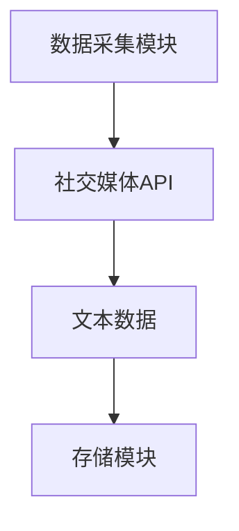
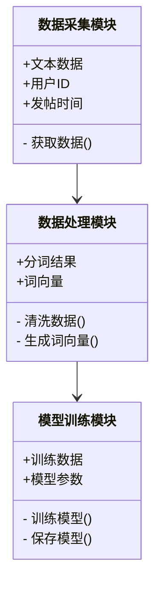
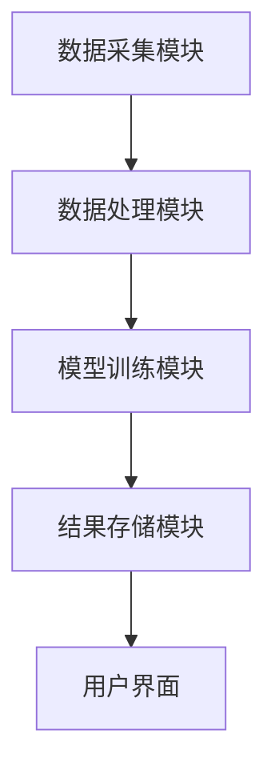
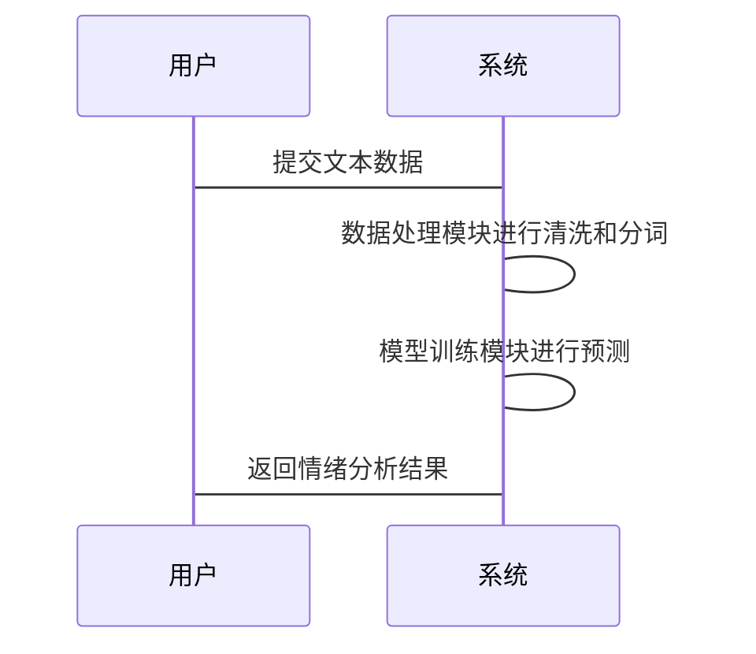

                 


# 深度学习分析社交媒体投资情绪

## 关键词
深度学习, 社交媒体, 投资情绪, 情绪分析, 机器学习, 自然语言处理

## 摘要
本文详细探讨了如何利用深度学习技术分析社交媒体上的投资情绪。从问题背景、核心概念到算法实现，再到系统设计与项目实战，全面解析了深度学习在投资情绪分析中的应用。通过具体的代码示例和系统架构设计，展示了如何构建一个高效的情绪分析系统，帮助投资者更好地理解市场情绪，做出明智的投资决策。

---

# 第4章: 情绪分析系统架构与设计

## 4.1 系统功能设计

### 4.1.1 数据采集模块
数据采集模块负责从社交媒体平台（如Twitter、Reddit、微博等）获取实时或历史投资相关文本数据。为了确保数据的多样性与代表性，通常需要处理以下内容：
- 用户ID
- 发帖时间
- 文本内容
- 关键词标签（如#投资、#股票）



### 4.1.2 数据处理模块
数据处理模块对采集到的文本数据进行预处理，包括分词、去除停用词、词性标注等步骤，为后续模型训练提供高质量的特征向量。

### 4.1.3 模型训练模块
模型训练模块基于预处理后的数据，使用深度学习模型（如LSTM、BERT）进行训练，生成投资情绪分析的预测模型。

## 4.2 系统架构设计

### 4.2.1 领域模型设计
通过领域模型（Domain Model）进行系统功能模块的划分与交互设计。



### 4.2.2 系统架构图



### 4.2.3 接口设计
系统主要接口包括：
- 数据采集接口：从社交媒体API获取数据
- 数据处理接口：对文本进行清洗和分词
- 模型预测接口：接受输入文本，返回情绪类别
- 结果展示接口：在用户界面上显示分析结果

### 4.2.4 交互流程设计



## 4.3 本章小结
本章通过系统功能设计和架构图展示了如何构建一个完整的社交媒体投资情绪分析系统。从数据采集到模型训练，再到结果展示，详细描述了各模块的功能与交互流程，为后续的项目实现奠定了基础。

---

# 第5章: 项目实战

## 5.1 环境安装与配置

### 5.1.1 安装Python与深度学习框架
```bash
# 安装Python 3.8及以上版本
# 安装深度学习框架（如TensorFlow、Keras）
pip install tensorflow numpy pandas scikit-learn
```

### 5.1.2 安装自然语言处理工具
```bash
pip install nltk spacy
python -m spacy download en_core_web_sm
```

## 5.2 数据采集与预处理

### 5.2.1 数据采集代码
```python
import tweepy

# API配置
API_KEY = 'your_api_key'
API_SECRET_KEY = 'your_api_secret_key'
ACCESS_TOKEN = 'your_access_token'
ACCESS_TOKEN_SECRET = 'your_access_token_secret'

# 初始化API
auth = tweepy.OAuth1UserHandler(API_KEY, API_SECRET_KEY)
auth.set_access_token(ACCESS_TOKEN, ACCESS_TOKEN_SECRET)
api = tweepy.API(auth)

# 采集数据
tweets = api.search(q='#投资', count=100, result_type='mixed')
```

### 5.2.2 数据预处理代码
```python
import pandas as pd
from nltk.corpus import stopwords
from sklearn.feature_extraction.text import TfidfVectorizer

# 加载数据
df = pd.DataFrame([tweet.text for tweet in tweets], columns=['text'])

# 分词与去停用词
stop_words = set(stopwords.words('english'))
vectorizer = TfidfVectorizer(stop_words=stop_words)
X = vectorizer.fit_transform(df['text'])
```

## 5.3 模型训练与实现

### 5.3.1 LSTM模型实现
```python
from keras.models import Sequential
from keras.layers import LSTM, Dense, Embedding
from keras.preprocessing.text import Tokenizer

# 初始化模型
model = Sequential()
model.add(Embedding(input_dim=词汇表大小, output_dim=100, input_length=文本长度))
model.add(LSTM(128))
model.add(Dense(3, activation='softmax'))  # 3种情绪类别：积极、消极、中性

# 编译模型
model.compile(loss='sparse_categorical_crossentropy', optimizer='adam', metrics=['accuracy'])

# 训练模型
model.fit(X_train, y_train, epochs=10, batch_size=32)
```

### 5.3.2 模型评估与优化
```python
# 预测与评估
y_pred = model.predict(X_test)
print(classification_report(y_test, y_pred.argmax(axis=1)))
```

## 5.4 项目实战总结
本章通过具体的代码示例，展示了如何从数据采集、预处理到模型训练，最终实现一个完整的社交媒体投资情绪分析系统。读者可以通过这些代码快速上手，并根据实际需求进行优化与扩展。

---

# 第6章: 总结与展望

## 6.1 核心要点总结
- 深度学习在投资情绪分析中的优势
- 系统架构设计的关键步骤
- 项目实战中的实用技巧

## 6.2 未来研究方向
- 更复杂的情绪分类模型
- 结合实时数据的动态分析系统
- 多语言情绪分析

## 6.3 注意事项与Tips
- 数据质量和多样性对模型性能至关重要
- 模型调参需要结合实际场景进行优化
- 系统设计时要考虑可扩展性和可维护性

## 6.4 本章小结
本文总结了深度学习在社交媒体投资情绪分析中的应用，并展望了未来的研究方向，为读者提供了进一步学习和实践的方向。

---

# 附录

## 附录A: 数据集与工具
- 数据集：Kaggle投资情绪数据集
- 工具：Twitter API、spaCy、TensorFlow

## 附录B: 全部代码汇总
```python
# 数据采集
import tweepy
# 数据处理
import pandas as pd
from nltk.corpus import stopwords
from sklearn.feature_extraction.text import TfidfVectorizer
# 模型训练
from keras.models import Sequential
from keras.layers import LSTM, Dense, Embedding
```

---

# 作者
作者：AI天才研究院 & 禅与计算机程序设计艺术

