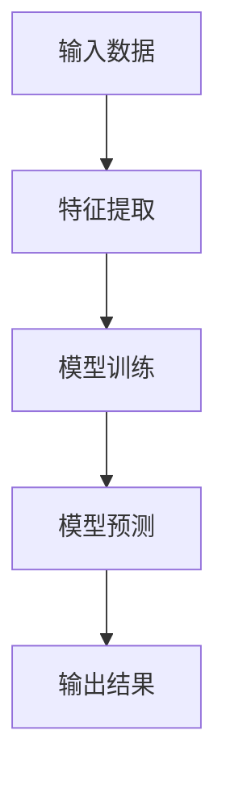
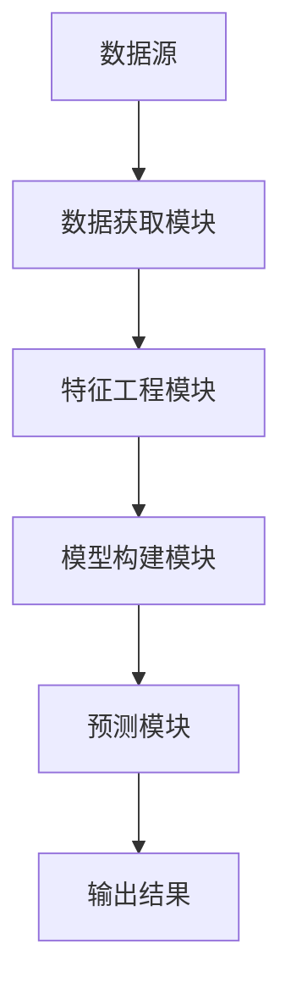
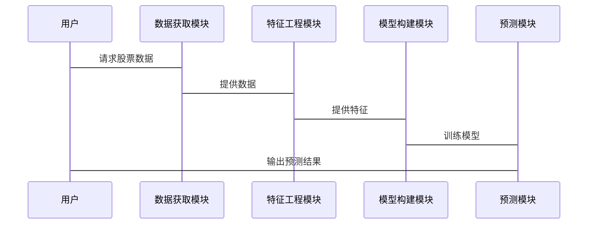

                 


# 深度学习在股市预测中的应用案例分析

## 关键词
深度学习、股市预测、LSTM、CNN、时间序列分析、金融数据分析

## 摘要
本文通过分析深度学习在股市预测中的应用，探讨了深度学习模型（如LSTM和CNN）在金融时间序列预测中的优势与挑战。通过实际案例分析，详细讲解了从数据获取、特征工程到模型构建的完整流程，并对模型性能进行了全面评估。文章最后总结了深度学习在股市预测中的最佳实践和未来发展方向。

---

# 第一部分: 深度学习与股市预测的背景与基础

## 第1章: 深度学习与股市预测概述

### 1.1 深度学习的基本概念
#### 1.1.1 深度学习的定义
深度学习是一种基于人工神经网络的机器学习方法，通过多层非线性变换模拟人脑的神经网络，从而实现对数据的特征提取和模式识别。

#### 1.1.2 深度学习的核心特点
- **层次化特征提取**：通过多层网络结构，逐步提取低级到高级的特征。
- **非线性变换**：能够处理复杂的非线性关系。
- **端到端学习**：从原始数据到最终输出的全自动化过程。

#### 1.1.3 深度学习与传统机器学习的区别
| 特性 | 深度学习 | 传统机器学习 |
|------|----------|---------------|
| 模型复杂度 | 高 | 低 |
| 特征工程 | 自动化 | 需要手动设计 |
| 数据量需求 | 大 | 较小 |

### 1.2 股市预测的基本概念
#### 1.2.1 股市预测的定义
股市预测是指利用历史数据和相关模型，预测未来股票价格走势的过程。

#### 1.2.2 股市预测的主要方法
1. **技术分析**：基于价格和成交量的模式。
2. **基本面分析**：基于公司财务数据。
3. **机器学习**：基于历史数据的模式识别。

#### 1.2.3 深度学习在股市预测中的优势
- **非线性关系建模**：深度学习能够捕捉复杂的市场波动。
- **时间序列预测**：适合处理具有时序依赖性的股票价格数据。
- **自动化特征工程**：能够自动提取有用的特征。

### 1.3 深度学习在股市预测中的应用前景
#### 1.3.1 深度学习在金融领域的应用现状
- **股票价格预测**：广泛应用于股票市场的价格预测。
- **风险控制**：用于评估和管理金融风险。
- **量化交易**：基于深度学习的交易策略。

#### 1.3.2 深度学习在股市预测中的潜在价值
- **提高预测精度**：通过深度学习模型捕捉更多的市场信息。
- **自动化交易策略**：基于深度学习的量化交易策略。
- **实时监控**：用于实时监控市场波动。

#### 1.3.3 深度学习应用的挑战与机遇
- **挑战**：市场噪声、数据稀疏性、模型过拟合。
- **机遇**：技术进步、数据量增加、计算能力提升。

---

## 第2章: 深度学习的核心概念与联系

### 2.1 深度学习的核心概念
#### 2.1.1 神经网络的基本结构
- **输入层**：接收输入数据。
- **隐藏层**：提取特征。
- **输出层**：生成预测结果。

#### 2.1.2 深度学习的数学基础
- **激活函数**：如ReLU、Sigmoid。
- **损失函数**：如均方误差、交叉熵。
- **优化算法**：如梯度下降、Adam。

#### 2.1.3 深度学习的训练过程
1. **正向传播**：输入数据经过网络计算出预测值。
2. **反向传播**：计算损失函数，更新权重。
3. **迭代优化**：重复正向传播和反向传播，优化模型参数。

### 2.2 深度学习模型的分类
#### 2.2.1 常见深度学习模型概述
- **RNN**：适合处理序列数据。
- **CNN**：适合处理空间数据。
- **Transformer**：适合处理长序列数据。

#### 2.2.2 RNN、LSTM、CNN等模型的特点
| 模型 | RNN | LSTM | CNN |
|------|-----|------|-----|
| 优点 | 处理序列数据 | 长距离依赖 | 平行计算 |
| 缺点 | 长序列问题 | 计算复杂 | 需要结构化数据 |

#### 2.2.3 模型选择与应用场景
- **RNN**：适用于短序列预测。
- **LSTM**：适用于长序列预测。
- **CNN**：适用于多变量分析。

### 2.3 深度学习与股市预测的关系
#### 2.3.1 深度学习在时间序列预测中的优势
- **捕捉长期依赖**：LSTM适合处理长序列数据。
- **自动特征提取**：深度学习能够自动提取有用的特征。
- **非线性建模**：能够捕捉复杂的市场波动。

#### 2.3.2 深度学习在特征提取中的应用
- **时间序列特征提取**：LSTM能够提取时序数据中的特征。
- **多变量特征提取**：CNN能够处理多变量数据。

#### 2.3.3 深度学习在多变量分析中的价值
- **多变量预测**：考虑多个因素对股票价格的影响。
- **复杂关系建模**：能够捕捉复杂的市场关系。

---

## 第3章: 深度学习在股市预测中的数学模型与算法原理

### 3.1 常见深度学习算法概述
#### 3.1.1 RNN与LSTM网络
- **RNN**：用于处理序列数据。
- **LSTM**：改进的RNN，引入记忆单元。

#### 3.1.2 CNN网络
- **卷积层**：提取局部特征。
- **池化层**：降低计算复杂度。

#### 3.1.3 Transformer模型
- **自注意力机制**：捕捉序列中的全局依赖。

### 3.2 深度学习模型的数学基础
#### 3.2.1 神经网络的数学表达
$$ y = f(x) $$
其中，$f$ 是神经网络模型。

#### 3.2.2 激活函数的作用与选择
- **ReLU**：$f(x) = \max(0, x)$
- **Sigmoid**：$f(x) = \frac{1}{1 + e^{-x}}$

#### 3.2.3 损失函数与优化算法
- **均方误差**：$$ \text{MSE} = \frac{1}{n}\sum_{i=1}^{n}(y_i - \hat{y}_i)^2 $$
- **Adam优化器**：结合动量和自适应学习率。

### 3.3 深度学习算法的流程图


---

## 第4章: 深度学习在股市预测中的系统分析与架构设计

### 4.1 系统分析
#### 4.1.1 问题场景介绍
- **数据获取**：从金融数据源获取股票价格数据。
- **数据预处理**：清洗、归一化。
- **模型训练**：训练深度学习模型。
- **模型预测**：基于模型预测股票价格。

#### 4.1.2 项目目标与范围
- **目标**：实现股票价格预测。
- **范围**：单只股票、短周期预测。

#### 4.1.3 系统功能需求
- **数据获取模块**：从数据源获取数据。
- **特征工程模块**：提取有用的特征。
- **模型构建模块**：构建深度学习模型。
- **预测模块**：生成股票价格预测。

### 4.2 系统架构设计
#### 4.2.1 系统架构概述
- **模块化设计**：每个模块独立实现功能。
- **数据流设计**：数据从输入到输出的流程。

#### 4.2.2 系统模块划分
1. **数据获取模块**：负责数据的获取和预处理。
2. **特征工程模块**：提取有用的特征。
3. **模型构建模块**：构建深度学习模型。
4. **预测模块**：生成预测结果。

#### 4.2.3 系统架构图


### 4.3 系统接口设计
#### 4.3.1 数据获取接口
- **输入**：股票代码、时间范围。
- **输出**：股票价格数据。

#### 4.3.2 模型接口
- **输入**：特征向量。
- **输出**：预测结果。

### 4.4 系统交互设计
#### 4.4.1 交互流程
1. **用户输入**：股票代码和时间范围。
2. **数据获取**：从数据源获取数据。
3. **特征提取**：提取有用的特征。
4. **模型训练**：训练深度学习模型。
5. **预测结果**：输出预测结果。

#### 4.4.2 交互序列图


---

## 第5章: 深度学习在股市预测中的项目实战

### 5.1 项目介绍
#### 5.1.1 项目目标
- 实现股票价格预测。
- 验证深度学习模型的效果。

#### 5.1.2 数据来源
- 数据来源：Yahoo Finance。
- 数据范围：2010年至今的股票价格数据。

### 5.2 系统核心实现
#### 5.2.1 环境配置
- **Python**：3.8+
- **深度学习框架**：TensorFlow/Keras。
- **数据处理库**：Pandas、NumPy。

#### 5.2.2 核心实现代码
```python
import numpy as np
import pandas as pd
from tensorflow.keras.models import Sequential
from tensorflow.keras.layers import LSTM, Dense, Dropout
from sklearn.preprocessing import MinMaxScaler

# 数据预处理
data = pd.read_csv('stock_prices.csv')
data = data['Close'].values
data = data.reshape(-1, 1)

# 归一化
scaler = MinMaxScaler()
data_scaled = scaler.fit_transform(data)

# 划分训练集和测试集
train_size = int(len(data_scaled) * 0.8)
train_data = data_scaled[:train_size]
test_data = data_scaled[train_size:]

# 创建序列数据
def create_sequences(data, seq_length):
    sequences = []
    for i in range(len(data) - seq_length):
        sequences.append(data[i:i+seq_length])
    return np.array(sequences)

seq_length = 30
X_train = create_sequences(train_data, seq_length)
y_train = train_data[seq_length:]

X_test = create_sequences(test_data, seq_length)
y_test = test_data[seq_length:]

# 构建LSTM模型
model = Sequential()
model.add(LSTM(50, return_sequences=True, input_shape=(seq_length, 1)))
model.add(LSTM(50, return_sequences=False))
model.add(Dense(1))
model.compile(optimizer='adam', loss='mean_squared_error')

# 训练模型
model.fit(X_train, y_train, epochs=50, batch_size=32, validation_split=0.2)

# 预测结果
train Predictions = model.predict(X_train)
test Predictions = model.predict(X_test)

# 反归一化
train_true = scaler.inverse_transform(y_train.reshape(-1,1))
train_pred = scaler.inverse_transform(train Predictions.reshape(-1,1))
test_true = scaler.inverse_transform(y_test.reshape(-1,1))
test_pred = scaler.inverse_transform(test Predictions.reshape(-1,1))

# 可视化结果
import matplotlib.pyplot as plt

plt.plot(train_true[:,0], label='Train True')
plt.plot(train_pred[:,0], label='Train Predict')
plt.legend()
plt.show()

plt.plot(test_true[:,0], label='Test True')
plt.plot(test_pred[:,0], label='Test Predict')
plt.legend()
plt.show()
```

#### 5.2.3 代码应用解读
- **数据预处理**：归一化处理数据。
- **序列数据创建**：将数据划分为序列。
- **模型构建**：构建LSTM模型。
- **模型训练**：训练模型并保存权重。
- **模型预测**：使用训练好的模型进行预测。
- **结果可视化**：可视化真实值和预测值。

### 5.3 实际案例分析
#### 5.3.1 案例背景
- 股票代码：AAPL（苹果公司）。
- 数据范围：2010年至今。

#### 5.3.2 模型训练与评估
- **训练精度**：评估模型在训练集上的表现。
- **测试精度**：评估模型在测试集上的表现。

#### 5.3.3 模型优化
- **超参数调整**：调整学习率、批量大小。
- **模型结构优化**：调整LSTM层数、节点数。

### 5.4 项目小结
- **成功经验**：LSTM模型能够捕捉股票价格的短期波动。
- **问题与改进**：模型在长周期预测中效果有限，未来可以尝试引入更多的特征或改进模型结构。

---

## 第6章: 深度学习在股市预测中的案例分析与总结

### 6.1 案例分析
#### 6.1.1 案例一：基于LSTM的股票价格预测
- **数据来源**：AAPL股票价格数据。
- **模型选择**：LSTM模型。
- **预测结果**：短期预测精度较高。

#### 6.1.2 案例二：基于CNN的多变量预测
- **数据来源**：多只股票的价格和市场指数。
- **模型选择**：CNN模型。
- **预测结果**：能够捕捉多变量之间的关系。

### 6.2 案例总结
#### 6.2.1 模型性能对比
- **LSTM**：适合处理长序列数据。
- **CNN**：适合处理多变量数据。

#### 6.2.2 经验与教训
- **数据质量**：数据的质量直接影响模型效果。
- **模型选择**：根据数据特点选择合适的模型。
- **超参数调优**：模型性能依赖于合理的超参数设置。

### 6.3 最佳实践
#### 6.3.1 数据处理
- **归一化**：确保数据的标准化处理。
- **数据清洗**：去除异常值和缺失值。

#### 6.3.2 模型选择
- **LSTM**：适用于时间序列预测。
- **CNN**：适用于多变量分析。

#### 6.3.3 模型优化
- **超参数调优**：使用网格搜索或随机搜索。
- **早停机制**：防止过拟合。

### 6.4 小结与展望
#### 6.4.1 小结
- 深度学习在股市预测中具有较大的潜力。
- 不同模型适用于不同的场景。

#### 6.4.2 展望
- **混合模型**：结合不同模型的优点。
- **集成学习**：通过集成提升模型性能。
- **实时预测**：实现实时股票价格预测。

---

## 作者
作者：AI天才研究院/AI Genius Institute  
作者：禅与计算机程序设计艺术/Zen And The Art of Computer Programming

