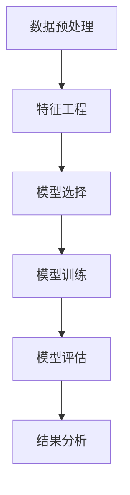
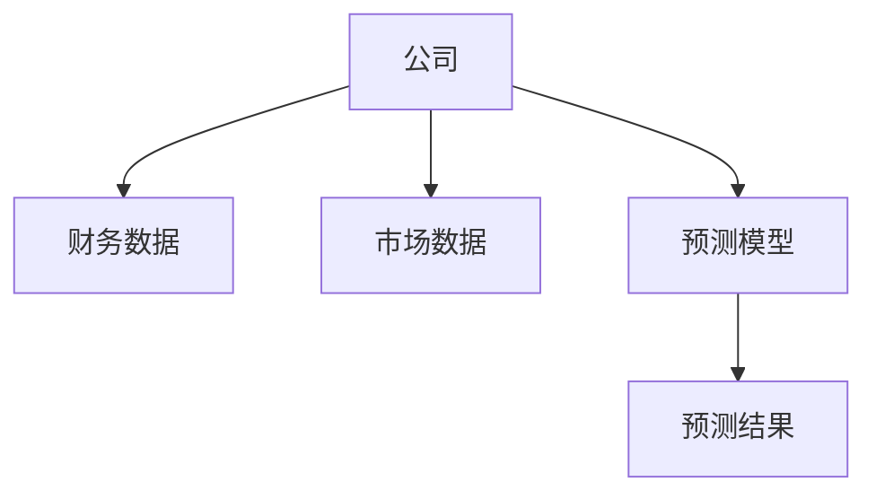
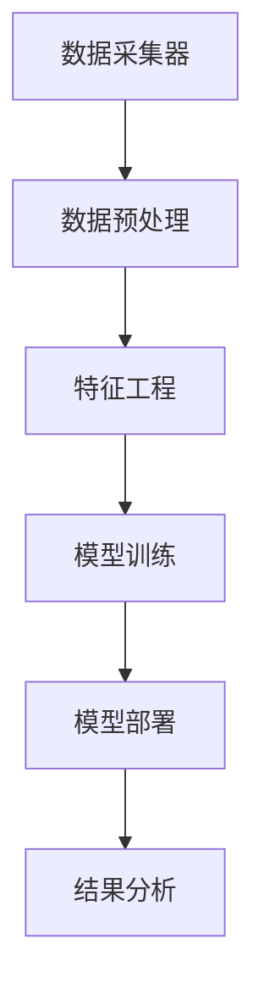
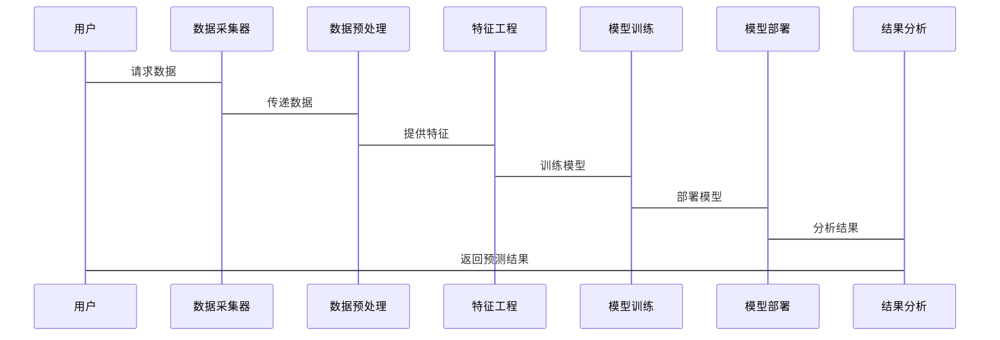

                 


# 深度学习预测公司盈利拐点时机

## 关键词：深度学习，盈利拐点，公司盈利预测，LSTM网络，时间序列分析

## 摘要：  
本文将探讨如何利用深度学习技术预测公司盈利拐点时机。通过结合深度学习算法与公司财务数据，我们提出了一种基于LSTM网络的时间序列预测方法，能够有效识别公司盈利的拐点。本文从理论基础、算法原理、系统设计到项目实战，全面解析深度学习在公司盈利预测中的应用，并通过实际案例展示其优势和效果。

---

# 第一部分: 深度学习与公司盈利预测概述

## 第1章: 深度学习与公司盈利预测的背景

### 1.1 深度学习的基本概念

#### 1.1.1 深度学习的定义与特点
深度学习是一种人工智能技术，属于机器学习的子领域。其核心思想是通过多层非线性变换模拟人脑的神经网络，从数据中学习特征。深度学习的特点包括：
- **非线性表达**：能够处理复杂的非线性关系。
- **特征学习**：自动提取数据中的特征，减少人工特征工程的需求。
- **大数据处理**：适合处理大规模数据，尤其是结构化和非结构化数据。

#### 1.1.2 深度学习的核心算法
深度学习的核心算法包括：
- **神经网络**：如多层感知机（MLP）、卷积神经网络（CNN）、循环神经网络（RNN）等。
- **损失函数**：如交叉熵损失、均方误差等。
- **优化算法**：如随机梯度下降（SGD）、Adam、RMSProp等。

#### 1.1.3 深度学习与传统机器学习的对比
| 对比维度 | 深度学习 | 传统机器学习 |
|----------|----------|---------------|
| 特征工程 | 自动提取 | 需要手动设计 | 
| 模型复杂度 | 高 | 较低 | 
| 数据需求 | 需要大量数据 | 数据量较小也可 |

### 1.2 公司盈利预测的基本概念

#### 1.2.1 盈利预测的定义与重要性
公司盈利预测是指通过对公司财务数据、市场环境、行业趋势等多方面因素的分析，预测公司在未来一段时间内的盈利能力。其重要性体现在以下几个方面：
- **投资决策**：投资者可以通过盈利预测评估公司的投资价值。
- **风险管理**：企业可以通过盈利预测识别潜在风险，制定应对策略。
- **战略规划**：企业可以基于盈利预测制定长期发展规划。

#### 1.2.2 盈利预测的主要方法
常见的盈利预测方法包括：
- **财务指标分析法**：通过分析收入、成本、利润等财务指标预测盈利能力。
- **市场环境分析法**：结合宏观经济指标、行业趋势等因素预测盈利。
- **机器学习法**：利用回归、随机森林等机器学习算法进行预测。
- **深度学习法**：基于LSTM、Transformer等深度学习模型进行时间序列预测。

#### 1.2.3 盈利预测的挑战与难点
盈利预测面临以下挑战：
- **数据噪声**：财务数据可能受到市场操纵、会计调整等因素影响。
- **模型泛化能力**：需要模型能够适应不同行业、不同规模公司的数据。
- **实时性要求**：需要快速生成预测结果，满足实时决策需求。

### 1.3 深度学习在盈利预测中的应用

#### 1.3.1 深度学习在金融领域的应用现状
深度学习在金融领域的应用包括：
- **股票价格预测**：利用LSTM网络预测股票价格走势。
- **风险评估**：通过深度学习模型评估企业的信用风险。
- **欺诈检测**：利用深度学习识别财务报表中的欺诈行为。

#### 1.3.2 盈利预测与公司生命周期的关系
公司生命周期的不同阶段对盈利预测的需求不同：
- **初创期**：注重成本控制和市场开拓，盈利预测需考虑高风险和高不确定性。
- **成长期**：注重收入增长和市场份额扩大，盈利预测需结合行业趋势和市场环境。
- **成熟期**：注重利润稳定和股东回报，盈利预测需关注成本优化和运营效率。

#### 1.3.3 深度学习在预测拐点中的优势
深度学习在预测拐点中的优势包括：
- **非线性建模能力**：能够捕捉复杂的市场波动和公司运营变化。
- **自动特征提取**：无需手动设计特征，减少特征工程的工作量。
- **时序建模能力**：通过LSTM网络能够有效处理时间序列数据中的长程依赖关系。

---

## 第2章: 公司盈利拐点预测的核心概念

### 2.1 盈利拐点的定义与特征

#### 2.1.1 盈利拐点的定义
盈利拐点是指公司在经营过程中，盈利能力从下降转为上升，或者从上升转为下降的关键时间点。拐点通常与公司战略调整、市场环境变化、行业周期波动等因素密切相关。

#### 2.1.2 盈利拐点的特征分析
盈利拐点的特征包括：
- **数据突变性**：拐点前后数据的突变性变化。
- **时间相关性**：拐点通常与特定时间点相关，如季度末、半年报等。
- **多因素驱动**：拐点往往是由多个因素共同作用的结果。

#### 2.1.3 盈利拐点与公司生命周期的关系
公司生命周期的不同阶段对拐点的敏感性不同：
- **初创期**：拐点的出现概率较高，且对公司生存影响重大。
- **成长期**：拐点可能与市场扩张、产品创新等因素相关。
- **成熟期**：拐点通常与行业周期、政策变化等因素相关。

### 2.2 盈利拐点预测的关键因素

#### 2.2.1 财务指标分析
常用的财务指标包括：
- **收入增长率**：反映公司收入增长的速度。
- **净利润率**：反映公司盈利能力。
- **资产负债率**：反映公司财务健康状况。

#### 2.2.2 市场环境分析
市场环境分析包括：
- **宏观经济指标**：如GDP增长率、通货膨胀率等。
- **行业趋势**：如行业周期、政策法规等。
- **市场竞争状况**：如市场份额、竞争对手动态等。

#### 2.2.3 公司内部因素
公司内部因素包括：
- **战略调整**：如新产品推出、市场拓展等。
- **管理团队变化**：如CEO更换、管理结构调整等。
- **内部运营效率**：如成本控制、供应链管理等。

### 2.3 盈利拐点预测的数学模型

#### 2.3.1 时间序列分析模型
时间序列分析模型包括：
- **ARIMA模型**：适用于线性时间序列数据。
- **GARCH模型**：适用于金融时间序列的波动性建模。

#### 2.3.2 机器学习模型
机器学习模型包括：
- **线性回归**：适用于线性关系的预测。
- **随机森林**：适用于非线性关系的预测。
- **XGBoost**：适用于高维数据的预测。

#### 2.3.3 深度学习模型
深度学习模型包括：
- **LSTM网络**：适用于时间序列数据的建模。
- **Transformer模型**：适用于长序列数据的建模。

---

## 第3章: 深度学习预测拐点的核心原理

### 3.1 深度学习在时间序列预测中的优势

#### 3.1.1 LSTM网络的时序预测能力
LSTM网络通过门控机制能够有效捕捉时间序列数据中的长程依赖关系。其结构包括：
- **遗忘门**：控制哪些信息需要遗忘。
- **输入门**：控制哪些信息需要存储。
- **输出门**：控制哪些信息需要输出。

#### 3.1.2 CNN在特征提取中的应用
CNN通过卷积操作能够有效提取时间序列数据中的局部特征。常用的卷积层包括：
- **一维卷积层**：适用于时间序列数据的特征提取。
- **池化层**：适用于降维和特征精简。

#### 3.1.3 混合模型的优势
混合模型结合了LSTM和CNN的优势，能够在时间序列数据中同时捕捉全局和局部特征。常用的混合模型包括：
- **CNN-LSTM模型**：先进行卷积提取特征，再通过LSTM建模时序关系。
- **LSTM-CNN模型**：先通过LSTM建模时序关系，再进行卷积提取特征。

### 3.2 深度学习预测拐点的关键技术

#### 3.2.1 数据预处理与特征工程
数据预处理包括：
- **数据清洗**：处理缺失值、异常值。
- **数据标准化**：将数据标准化到同一范围。
- **数据分段**：将时间序列数据分段为训练集、验证集和测试集。

特征工程包括：
- **特征提取**：从原始数据中提取有用的特征。
- **特征组合**：将多个特征进行组合，形成新的特征。
- **特征降维**：通过主成分分析（PCA）等方法降低特征维度。

#### 3.2.2 模型训练与调优
模型训练包括：
- **模型选择**：选择适合任务的模型结构。
- **超参数调优**：通过网格搜索、随机搜索等方法优化模型超参数。
- **模型训练**：通过反向传播算法优化模型参数。

#### 3.2.3 结果解释与可视化
结果解释包括：
- **预测结果分析**：分析模型预测结果与实际结果的差异。
- **误差分析**：分析预测误差的来源。
- **可视化展示**：通过图表展示预测结果和实际结果。

### 3.3 深度学习预测拐点的流程图



---

## 第4章: 深度学习预测拐点的算法原理

### 4.1 LSTM网络的原理

#### 4.1.1 LSTM的结构与工作原理
LSTM网络由遗忘门、输入门和输出门组成。其数学表达式如下：

遗忘门：
$$ f_t = \sigma(W_f x_t + U_f h_{t-1} + b_f) $$

输入门：
$$ i_t = \sigma(W_i x_t + U_i h_{t-1} + b_i) $$

候选状态：
$$ g_t = \tanh(W_g x_t + U_g h_{t-1} + b_g) $$

输出门：
$$ h_t = f_t \cdot h_{t-1} + i_t \cdot g_t $$

其中，$\sigma$ 表示 sigmoid 函数，$W$ 表示权重矩阵，$U$ 表示门控矩阵，$b$ 表示偏置项。

#### 4.1.2 LSTM的门控机制
门控机制通过遗忘门和输入门控制信息的流动。遗忘门决定了哪些信息需要遗忘，输入门决定了哪些信息需要存储。输出门决定了哪些信息需要输出。

#### 4.1.3 LSTM的数学模型
LSTM的数学模型包括遗忘门、输入门和输出门的计算，以及候选状态和隐藏状态的更新。

### 4.2 深度学习预测拐点的关键技术

#### 4.2.1 数据预处理与特征工程
数据预处理包括：
- **数据清洗**：处理缺失值、异常值。
- **数据标准化**：将数据标准化到同一范围。
- **数据分段**：将时间序列数据分段为训练集、验证集和测试集。

特征工程包括：
- **特征提取**：从原始数据中提取有用的特征。
- **特征组合**：将多个特征进行组合，形成新的特征。
- **特征降维**：通过主成分分析（PCA）等方法降低特征维度。

#### 4.2.2 模型训练与调优
模型训练包括：
- **模型选择**：选择适合任务的模型结构。
- **超参数调优**：通过网格搜索、随机搜索等方法优化模型超参数。
- **模型训练**：通过反向传播算法优化模型参数。

#### 4.2.3 结果解释与可视化
结果解释包括：
- **预测结果分析**：分析模型预测结果与实际结果的差异。
- **误差分析**：分析预测误差的来源。
- **可视化展示**：通过图表展示预测结果和实际结果。

---

## 第5章: 深度学习预测拐点的系统架构设计

### 5.1 问题场景介绍
在实际应用中，我们需要设计一个能够实时预测公司盈利拐点的系统。该系统需要处理大量公司财务数据和市场环境数据，预测公司盈利拐点，并提供实时的预测结果。

### 5.2 系统功能设计

#### 5.2.1 领域模型（ER实体关系图）


#### 5.2.2 系统架构设计


#### 5.2.3 系统接口设计
系统接口包括：
- **数据接口**：用于采集公司财务数据和市场环境数据。
- **模型接口**：用于模型训练和预测。
- **结果接口**：用于展示预测结果。

#### 5.2.4 系统交互设计


---

## 第6章: 深度学习预测拐点的项目实战

### 6.1 环境安装与配置

#### 6.1.1 安装Python环境
```bash
python --version
pip install numpy
pip install pandas
pip install keras
pip install tensorflow
```

#### 6.1.2 安装深度学习库
```bash
pip install tensorflow
pip install keras
pip install scikit-learn
```

### 6.2 系统核心实现源代码

#### 6.2.1 数据预处理代码
```python
import pandas as pd
import numpy as np

# 加载数据
data = pd.read_csv('company_profit.csv')

# 处理缺失值
data = data.dropna()

# 数据标准化
from sklearn.preprocessing import StandardScaler
scaler = StandardScaler()
data_scaled = scaler.fit_transform(data)

# 数据分段
train_data = data_scaled[:int(0.8*len(data_scaled))]
test_data = data_scaled[int(0.8*len(data_scaled)):]

# 划分特征和目标
X_train = train_data[:, :-1]
y_train = train_data[:, -1]
X_test = test_data[:, :-1]
y_test = test_data[:, -1]
```

#### 6.2.2 模型实现代码
```python
from keras.models import Sequential
from keras.layers import LSTM, Dense

# 构建模型
model = Sequential()
model.add(LSTM(64, input_shape=(X_train.shape[1], 1)))
model.add(Dense(1))
model.compile(optimizer='adam', loss='mean_squared_error')

# 训练模型
model.fit(X_train.reshape(X_train.shape[0], X_train.shape[1], 1), y_train, 
          epochs=100, batch_size=32, validation_split=0.2)

# 预测结果
y_pred = model.predict(X_test.reshape(X_test.shape[0], X_test.shape[1], 1))
```

### 6.3 实际案例分析与详细解读

#### 6.3.1 案例背景
假设我们有一家公司的财务数据，包括收入、成本、利润等指标。我们需要预测公司在未来一段时间内的盈利拐点。

#### 6.3.2 数据处理与特征工程
通过数据预处理和特征工程，我们将原始数据转化为适合模型输入的形式。

#### 6.3.3 模型训练与评估
通过训练模型，我们可以得到预测结果，并通过评估指标（如均方误差、R平方值等）评估模型性能。

#### 6.3.4 结果分析与可视化
通过可视化工具（如Matplotlib）展示预测结果和实际结果，分析模型的预测效果。

### 6.4 项目小结

#### 6.4.1 项目总结
通过本项目，我们成功利用深度学习技术预测了公司盈利拐点，验证了深度学习在时间序列预测中的有效性。

#### 6.4.2 项目中的注意事项
- 数据质量对模型性能影响重大，需确保数据的准确性和完整性。
- 模型调优需要结合实际业务需求，选择合适的超参数。
- 结果解释需要结合业务背景，避免片面解读。

---

## 第7章: 深度学习预测拐点的最佳实践与小结

### 7.1 最佳实践 tips

#### 7.1.1 数据处理
- 数据预处理是模型训练的基础，需确保数据的准确性和完整性。
- 特征工程是模型性能提升的关键，需结合业务背景设计合理的特征。

#### 7.1.2 模型选择
- 根据数据类型和任务需求选择合适的模型。
- 对于时间序列数据，推荐使用LSTM、Transformer等深度学习模型。

#### 7.1.3 模型调优
- 通过网格搜索、随机搜索等方法优化模型超参数。
- 使用交叉验证评估模型性能，避免过拟合。

### 7.2 小结

通过本文的探讨，我们深入分析了深度学习在公司盈利拐点预测中的应用，提出了基于LSTM网络的时间序列预测方法，并通过实际案例展示了其优势和效果。深度学习在盈利拐点预测中的应用不仅提高了预测的准确率，还为企业的投资决策和风险管理提供了有力支持。

### 7.3 注意事项

- **数据隐私**：在处理公司财务数据时，需注意数据隐私保护。
- **模型解释性**：深度学习模型通常具有较高的黑箱性，需结合业务背景进行结果解释。
- **模型实时性**：在实际应用中，需考虑模型的实时性要求，优化模型推理速度。

### 7.4 拓展阅读

- **深度学习经典论文**：如“Deep Learning”（Ian Goodfellow等著）。
- **时间序列分析经典书籍**：如《 Forecasting: principles and practice》。
- **深度学习框架**：如TensorFlow、Keras等。

---

## 作者：AI天才研究院/AI Genius Institute & 禅与计算机程序设计艺术 /Zen And The Art of Computer Programming

