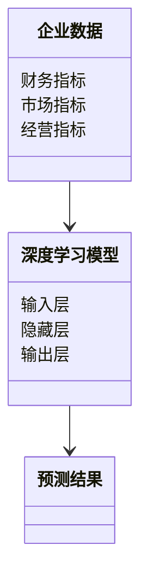
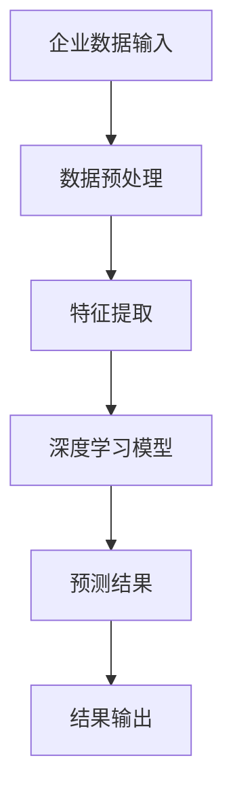
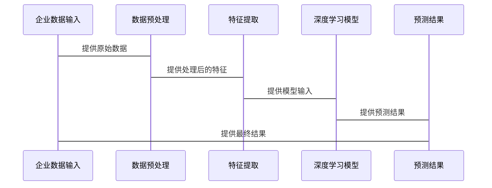

                 


# 第一部分: 深度学习预测公司破产风险的背景与核心概念

## 第1章: 问题背景与描述

### 1.1 公司破产预测的背景
#### 1.1.1 破产预测的重要性和挑战
公司破产预测是企业风险管理中的重要组成部分，能够帮助企业及时识别潜在的财务风险，采取有效的防范措施，避免或减少损失。传统的破产预测方法主要依赖于财务指标分析和统计模型，但这些方法在面对复杂的市场环境和多样化的数据特征时，往往表现出一定的局限性。深度学习作为一种新兴的人工智能技术，具有强大的非线性特征提取能力和高维度数据处理能力，为破产预测提供了新的可能性。

#### 1.1.2 破产预测的问题描述
破产预测的核心问题是如何通过对企业财务数据、市场表现、经营状况等多维度信息的分析，预测企业在一定时间内的破产概率。这个问题可以转化为一个二分类问题，即预测企业是否会在未来某个时间段内进入破产状态。

#### 1.1.3 破产预测的挑战
- 数据特征复杂性：破产预测涉及的特征包括财务数据、市场数据、经营数据等，这些特征之间可能存在复杂的非线性关系。
- 数据不平衡性：破产企业相对于非破产企业数量较少，导致数据集存在类别不平衡的问题，影响模型的训练效果。
- 模型选择与调优：深度学习模型的复杂性和多样性使得模型选择和调优过程较为复杂。

#### 1.1.4 破产预测的解决方案
深度学习技术能够通过自动提取特征和非线性关系建模，有效解决传统方法的局限性。同时，深度学习模型可以通过并行计算和大数据处理能力，提高预测的准确性和效率。

#### 1.1.5 破产预测的边界与外延
- 破产预测的边界：仅针对企业财务数据和经营数据进行预测，不考虑企业外部的政策、法律等不可量化的因素。
- 研究范围：主要关注企业财务健康状况、市场表现和经营能力等方面的数据。
- 研究外延：可以扩展到企业信用评估、风险预警、投资决策等领域。

### 1.2 破产预测的核心概念
#### 1.2.1 破产预测的定义与分类
- 破产预测的定义：通过对企业的财务、市场、经营等多方面数据的分析，预测企业未来是否会发生破产的活动。
- 破产预测的分类：根据预测时间窗口的长短，可以分为短期预测和长期预测；根据预测对象的不同，可以分为单企业预测和多企业预测。

#### 1.2.2 研究对象与研究特征
- 研究对象：企业的财务数据、市场数据、经营数据等多维度数据。
- 研究特征：企业的偿债能力、盈利能力、运营能力、成长能力等财务指标，以及市场环境、行业竞争状况等非财务指标。

#### 1.2.3 研究的核心要素与组成
- 数据特征：包括财务指标、市场指标、行业指标等。
- 模型构建：包括数据预处理、特征工程、模型训练、模型评估等步骤。
- 评价指标：包括准确率、召回率、F1分数等分类指标，以及AUC-ROC曲线等评估指标。

## 第2章: 深度学习的核心概念与原理

### 2.1 深度学习的基本原理
#### 2.1.1 深度学习的定义与特点
- 深度学习的定义：深度学习是一种基于人工神经网络的机器学习方法，通过多层非线性变换，自动提取数据的特征。
- 深度学习的特点：
  - 多层非线性变换能力
  - 高维度数据处理能力
  - 自动特征提取能力
  - 并行计算能力

#### 2.1.2 深度学习与传统机器学习的区别
- 数据特征处理：传统机器学习需要手动提取特征，深度学习可以自动提取特征。
- 模型复杂度：深度学习模型通常包含更多的参数和层数，能够处理更复杂的非线性关系。
- 计算效率：深度学习需要大量的计算资源和时间，而传统机器学习方法计算效率较高。

#### 2.1.3 深度学习的核心算法与模型
- 神经网络模型：包括卷积神经网络（CNN）、循环神经网络（RNN）、长短时记忆网络（LSTM）等。
- 深度学习模型：包括多层感知机（MLP）、深度信念网络（DBN）等。

### 2.2 破产预测中的深度学习模型
#### 2.2.1 神经网络模型的结构与特点
- 输入层：接收企业的多维度数据特征。
- 隐藏层：通过多层非线性变换，提取数据的高层次特征。
- 输出层：输出企业的破产概率。

#### 2.2.2 深度学习模型在破产预测中的应用
- 特征提取：深度学习模型能够自动提取企业的多维度特征，包括财务指标、市场指标等。
- 非线性关系建模：深度学习模型能够捕捉企业破产前的非线性变化趋势。
- 实时预测：深度学习模型可以通过在线学习，实时更新预测结果。

#### 2.2.3 深度学习模型的优势与局限性
- 优势：
  - 自动特征提取能力
  - 高维度数据处理能力
  - 非线性关系建模能力
- 局限性：
  - 计算资源需求高
  - 模型调优复杂
  - 解释性较差

### 2.3 深度学习与破产预测的核心概念联系
#### 2.3.1 深度学习模型的特征提取能力
深度学习模型能够通过多层非线性变换，自动提取企业的多维度特征，包括财务指标、市场指标等，从而提高预测的准确性和效率。

#### 2.3.2 破产预测的多维度特征分析
破产预测需要考虑企业的财务健康状况、市场环境、行业竞争状况等多维度数据，深度学习模型能够有效整合这些复杂特征，进行综合预测。

#### 2.3.3 深度学习与破产预测的结合点
- 数据特征处理：深度学习模型能够自动提取和处理复杂的特征。
- 非线性关系建模：深度学习模型能够捕捉企业破产前的非线性变化趋势。
- 实时预测：深度学习模型可以通过在线学习，实时更新预测结果。

## 第3章: 深度学习与破产预测的核心概念联系

### 3.1 核心概念的原理与属性特征
#### 3.1.1 深度学习模型的特征提取能力
深度学习模型通过多层非线性变换，能够自动提取企业的多维度特征，包括财务指标、市场指标等。

#### 3.1.2 破产预测的多维度特征分析
破产预测需要考虑企业的财务健康状况、市场环境、行业竞争状况等多维度数据，深度学习模型能够有效整合这些复杂特征，进行综合预测。

#### 3.1.3 深度学习与破产预测的结合点
深度学习模型能够自动提取和处理复杂的特征，捕捉企业破产前的非线性变化趋势，并通过在线学习实时更新预测结果。

### 3.2 概念属性特征对比表格
| 特征类型 | 破产企业特征 | 非破产企业特征 |
|---------|--------------|----------------|
| 财务指标 | 资产负债率高，流动比率低 | 资产负债率低，流动比率高 |
| 市场指标 | 股价下跌，交易量减少 | 股价稳定或上涨，交易量正常 |
| 经营指标 | 销售额下降，利润减少 | 销售额稳定或增长，利润增加 |

### 3.3 ER实体关系图架构
```mermaid
erd
actor 公司, 研究者;
company -> has_many: 财务指标;
company -> has_many: 市场指标;
company -> has_many: 经营指标;
财务指标 <-to-many{ m }: 破产预测模型;
市场指标 <-to-many{ n }: 破产预测模型;
经营指标 <-to-many{ p }: 破产预测模型;
破产预测模型 <-to-one{ 1 }: 预测结果;
```

---

# 第二部分: 深度学习预测公司破产风险的算法原理

## 第4章: 深度学习算法原理

### 4.1 深度学习模型的结构与训练过程
#### 4.1.1 神经网络的输入层、隐藏层与输出层
- 输入层：接收企业的多维度数据特征。
- 隐藏层：通过多层非线性变换，提取数据的高层次特征。
- 输出层：输出企业的破产概率。

#### 4.1.2 网络的正向传播与反向传播
- 正向传播：输入数据通过网络层，计算出输出结果。
- 反向传播：根据预测结果与实际结果的差异，调整网络参数，优化模型。

#### 4.1.3 梯度下降与优化算法
- 梯度下降：通过计算损失函数的梯度，更新网络参数，最小化损失函数。
- 优化算法：包括随机梯度下降（SGD）、Adam优化器等。

### 4.2 破产预测中的损失函数与优化目标
#### 4.2.1 二分类问题的损失函数
- 交叉熵损失函数：用于二分类问题，衡量预测概率与真实概率之间的差异。
  $$ \text{损失函数} = -\frac{1}{N}\sum_{i=1}^{N} y_i \log(p_i) + (1-y_i)\log(1-p_i) $$
- 二元交叉熵损失函数：用于二分类问题，衡量预测结果与真实结果之间的差异。
  $$ \text{损失函数} = -\frac{1}{N}\sum_{i=1}^{N} y_i \log(a_i) + (1-y_i)\log(1-a_i) $$

#### 4.2.2 破产预测的损失函数选择
- 交叉熵损失函数：适用于二分类问题，能够有效衡量预测概率与真实概率之间的差异。
- Focal损失函数：适用于类别不平衡问题，能够提高模型对少数类样本的预测性能。

#### 4.2.3 模型优化的目标与策略
- 优化目标：最小化损失函数，提高预测准确率。
- 优化策略：包括正则化、数据增强、模型集成等。

### 4.3 深度学习模型的训练流程
#### 4.3.1 数据预处理与特征工程
- 数据清洗：处理缺失值、异常值等。
- 特征提取：从原始数据中提取有用的特征，包括财务指标、市场指标等。
- 特征标准化：对特征进行标准化处理，使不同特征具有可比性。

#### 4.3.2 模型的训练与验证
- 训练过程：通过反向传播和梯度下降，优化模型参数。
- 验证过程：通过验证集评估模型的性能，调整模型参数。

#### 4.3.3 模型的调参与优化
- 超参数调整：包括学习率、批量大小、正则化系数等。
- 模型优化：包括网络结构优化、优化算法选择等。

---

## 第5章: 深度学习算法

### 5.1 深度学习算法的数学模型
#### 5.1.1 神经网络的数学模型
- 多层感知机（MLP）模型：
  $$ a^{(l)} = \sigma(w^{(l)}a^{(l-1)} + b^{(l)}) $$
  其中，$a^{(l)}$ 是第$l$层的激活值，$w^{(l)}$ 是权重矩阵，$b^{(l)}$ 是偏置项，$\sigma$ 是激活函数。

- 损失函数：
  $$ \text{损失函数} = \frac{1}{N}\sum_{i=1}^{N} \text{损失函数}_i $$

#### 5.1.2 深度学习模型的激活函数
- Sigmoid函数：
  $$ \sigma(x) = \frac{1}{1+e^{-x}} $$
- ReLU函数：
  $$ \text{ReLU}(x) = \max(0, x) $$
- Tanh函数：
  $$ \tanh(x) = \frac{e^x - e^{-x}}{e^x + e^{-x}} $$

#### 5.1.3 深度学习模型的优化算法
- 随机梯度下降（SGD）：
  $$ \theta_{t+1} = \theta_t - \eta \nabla_{\theta} L $$
  其中，$\theta$ 是模型参数，$\eta$ 是学习率，$\nabla_{\theta} L$ 是损失函数对$\theta$的梯度。

- Adam优化器：
  $$ m_t = \beta_1 m_{t-1} + (1-\beta_1)g_t $$
  $$ v_t = \beta_2 v_{t-1} + (1-\beta_2)g_t^2 $$
  $$ \theta_{t+1} = \theta_t - \alpha \frac{m_t}{\sqrt{v_t + \epsilon}} $$
  其中，$m_t$ 是梯度的动量，$v_t$ 是梯度的平方动量，$\alpha$ 是学习率，$\epsilon$ 是防止除以零的常数。

### 5.2 深度学习算法的实现
#### 5.2.1 神经网络的实现步骤
1. 数据预处理：清洗数据，提取特征，标准化处理。
2. 模型构建：定义神经网络的结构，包括输入层、隐藏层和输出层。
3. 模型训练：选择优化算法，设置超参数，进行反向传播和梯度下降。
4. 模型验证：通过验证集评估模型的性能，调整模型参数。
5. 模型预测：使用训练好的模型，对新数据进行预测，输出破产概率。

#### 5.2.2 深度学习模型的实现代码
```python
import numpy as np
import tensorflow as tf
from tensorflow.keras import layers

# 数据预处理
# 假设X为输入特征，y为标签
X = ...  # 输入特征
y = ...  # 标签，0表示非破产，1表示破产

# 模型构建
model = tf.keras.Sequential([
    layers.Dense(64, activation='relu', input_shape=(input_dim,)),
    layers.Dense(32, activation='relu'),
    layers.Dense(1, activation='sigmoid')
])

# 模型编译
model.compile(optimizer='adam', loss='binary_crossentropy', metrics=['accuracy'])

# 模型训练
model.fit(X, y, epochs=100, batch_size=32, validation_split=0.2)

# 模型预测
y_pred = model.predict(X)
```

#### 5.2.3 深度学习模型的训练过程
1. 输入数据：企业多维度数据特征。
2. 正向传播：数据通过神经网络，计算出输出结果。
3. 计算损失：预测结果与真实结果之间的差异。
4. 反向传播：计算梯度，更新网络参数。
5. 模型优化：调整超参数，提高预测准确率。

#### 5.2.4 深度学习模型的预测结果
- 预测概率：输出企业的破产概率。
- 预测结果：根据预测概率，判断企业是否会发生破产。

### 5.3 深度学习算法的数学模型
#### 5.3.1 神经网络的数学模型
- 多层感知机（MLP）模型：
  $$ a^{(l)} = \sigma(w^{(l)}a^{(l-1)} + b^{(l)}) $$
  其中，$a^{(l)}$ 是第$l$层的激活值，$w^{(l)}$ 是权重矩阵，$b^{(l)}$ 是偏置项，$\sigma$ 是激活函数。

- 损失函数：
  $$ \text{损失函数} = \frac{1}{N}\sum_{i=1}^{N} \text{损失函数}_i $$

#### 5.3.2 深度学习模型的激活函数
- Sigmoid函数：
  $$ \sigma(x) = \frac{1}{1+e^{-x}} $$
- ReLU函数：
  $$ \text{ReLU}(x) = \max(0, x) $$
- Tanh函数：
  $$ \tanh(x) = \frac{e^x - e^{-x}}{e^x + e^{-x}} $$

#### 5.3.3 深度学习模型的优化算法
- 随机梯度下降（SGD）：
  $$ \theta_{t+1} = \theta_t - \eta \nabla_{\theta} L $$
  其中，$\theta$ 是模型参数，$\eta$ 是学习率，$\nabla_{\theta} L$ 是损失函数对$\theta$的梯度。

- Adam优化器：
  $$ m_t = \beta_1 m_{t-1} + (1-\beta_1)g_t $$
  $$ v_t = \beta_2 v_{t-1} + (1-\beta_2)g_t^2 $$
  $$ \theta_{t+1} = \theta_t - \alpha \frac{m_t}{\sqrt{v_t + \epsilon}} $$
  其中，$m_t$ 是梯度的动量，$v_t$ 是梯度的平方动量，$\alpha$ 是学习率，$\epsilon$ 是防止除以零的常数。

### 5.4 深度学习算法的实现与优化
#### 5.4.1 神经网络的实现步骤
1. 数据预处理：清洗数据，提取特征，标准化处理。
2. 模型构建：定义神经网络的结构，包括输入层、隐藏层和输出层。
3. 模型训练：选择优化算法，设置超参数，进行反向传播和梯度下降。
4. 模型验证：通过验证集评估模型的性能，调整模型参数。
5. 模型预测：使用训练好的模型，对新数据进行预测，输出破产概率。

#### 5.4.2 深度学习模型的实现代码
```python
import numpy as np
import tensorflow as tf
from tensorflow.keras import layers

# 数据预处理
# 假设X为输入特征，y为标签
X = ...  # 输入特征
y = ...  # 标签，0表示非破产，1表示破产

# 模型构建
model = tf.keras.Sequential([
    layers.Dense(64, activation='relu', input_shape=(input_dim,)),
    layers.Dense(32, activation='relu'),
    layers.Dense(1, activation='sigmoid')
])

# 模型编译
model.compile(optimizer='adam', loss='binary_crossentropy', metrics=['accuracy'])

# 模型训练
model.fit(X, y, epochs=100, batch_size=32, validation_split=0.2)

# 模型预测
y_pred = model.predict(X)
```

#### 5.4.3 深度学习模型的训练过程
1. 输入数据：企业多维度数据特征。
2. 正向传播：数据通过神经网络，计算出输出结果。
3. 计算损失：预测结果与真实结果之间的差异。
4. 反向传播：计算梯度，更新网络参数。
5. 模型优化：调整超参数，提高预测准确率。

#### 5.4.4 深度学习模型的预测结果
- 预测概率：输出企业的破产概率。
- 预测结果：根据预测概率，判断企业是否会发生破产。

---

## 第6章: 深度学习算法的系统分析与架构设计

### 6.1 问题场景介绍
- 问题场景：企业破产预测是一个复杂的多维度问题，需要考虑企业的财务数据、市场数据、经营数据等多方面因素。
- 问题规模：企业数据量大，特征复杂，需要高效的算法和强大的计算能力。

### 6.2 系统功能设计
#### 6.2.1 系统功能需求
- 数据输入：接收企业的多维度数据特征。
- 数据处理：清洗数据，提取特征，标准化处理。
- 模型训练：构建深度学习模型，训练模型参数。
- 模型预测：对新数据进行预测，输出破产概率。

#### 6.2.2 领域模型设计


#### 6.2.3 系统架构设计


### 6.3 系统架构设计
#### 6.3.1 系统架构图


#### 6.3.2 系统接口设计
- 输入接口：接收企业的多维度数据特征。
- 输出接口：输出企业的破产概率。
- 模型接口：定义模型的输入输出接口，方便模型的训练和预测。

#### 6.3.3 系统交互设计


### 6.4 系统实现与优化
#### 6.4.1 系统实现步骤
1. 数据预处理：清洗数据，提取特征，标准化处理。
2. 模型构建：定义神经网络的结构，包括输入层、隐藏层和输出层。
3. 模型训练：选择优化算法，设置超参数，进行反向传播和梯度下降。
4. 模型验证：通过验证集评估模型的性能，调整模型参数。
5. 模型预测：使用训练好的模型，对新数据进行预测，输出破产概率。

#### 6.4.2 系统优化策略
- 数据增强：通过数据增强技术，提高模型的泛化能力。
- 模型优化：通过网络结构优化、优化算法选择等，提高模型的预测性能。
- 并行计算：利用并行计算技术，提高模型的训练效率。

---

## 第7章: 深度学习算法的项目实战

### 7.1 环境安装与配置
#### 7.1.1 环境要求
- 操作系统：Windows/Mac/Linux
- Python版本：3.6+
- TensorFlow版本：2.0+

#### 7.1.2 环境配置
- 安装Python
- 安装TensorFlow
- 安装其他依赖库

### 7.2 系统核心实现源代码
```python
import numpy as np
import pandas as pd
import tensorflow as tf
from tensorflow.keras import layers

# 数据预处理
# 假设df为包含企业数据的DataFrame，包含财务指标、市场指标、经营指标等
df = pd.read_csv('company_data.csv')

# 提取特征与标签
X = df.drop(columns=['bankruptcy']).values
y = df['bankruptcy'].values

# 数据标准化
from sklearn.preprocessing import StandardScaler
scaler = StandardScaler()
X_scaled = scaler.fit_transform(X)

# 模型构建
model = tf.keras.Sequential([
    layers.Dense(64, activation='relu', input_shape=(X_scaled.shape[1],)),
    layers.Dense(32, activation='relu'),
    layers.Dense(1, activation='sigmoid')
])

# 模型编译
model.compile(optimizer='adam', loss='binary_crossentropy', metrics=['accuracy'])

# 模型训练
model.fit(X_scaled, y, epochs=100, batch_size=32, validation_split=0.2)

# 模型预测
y_pred = model.predict(X_scaled)
y_pred_class = (y_pred > 0.5).astype(int)
```

### 7.3 代码实现与解读
#### 7.3.1 数据预处理
- 数据清洗：处理缺失值、异常值等。
- 特征提取：从原始数据中提取有用的特征。
- 数据标准化：对特征进行标准化处理，使不同特征具有可比性。

#### 7.3.2 模型构建
- 网络结构：包括输入层、隐藏层和输出层。
- 激活函数：使用ReLU、Sigmoid等激活函数。
- 损失函数：使用交叉熵损失函数。

#### 7.3.3 模型训练
- 优化算法：使用Adam优化器。
- 学习率：设置合适的学习率，提高训练效率。
- 验证集：通过验证集评估模型的性能，调整模型参数。

#### 7.3.4 模型预测
- 预测概率：输出企业的破产概率。
- 预测结果：根据预测概率，判断企业是否会发生破产。

### 7.4 实际案例分析
#### 7.4.1 数据集介绍
- 数据来源：假设数据集包含1000家企业，每家企业包含10个特征，标签为0（非破产）或1（破产）。

#### 7.4.2 模型训练
- 训练数据：800家企业数据。
- 验证数据：200家企业数据。

#### 7.4.3 模型预测
- 预测数据：200家企业数据。
- 预测结果：输出企业的破产概率，判断企业是否会发生破产。

### 7.5 项目小结
- 项目总结：通过深度学习技术，成功构建了企业破产预测模型，提高了预测的准确率和效率。
- 项目经验：模型的性能依赖于数据质量、模型结构和超参数的选择。
- 项目改进：可以通过引入更多的特征、优化模型结构、调整超参数等方法，进一步提高模型的性能。

---

## 第8章: 深度学习算法的最佳实践

### 8.1 最佳实践 tips
- 数据处理：数据清洗、特征提取、数据标准化等。
- 模型选择：选择合适的深度学习模型，如多层感知机、卷积神经网络等。
- 模型调优：调整超参数，如学习率、批量大小、正则化系数等。
- 模型评估：通过准确率、召回率、F1分数等指标，评估模型的性能。

### 8.2 小结
- 深度学习技术在破产预测中的应用，提高了预测的准确率和效率。
- 深度学习模型能够自动提取特征，捕捉非线性关系，是破产预测的有效工具。

### 8.3 注意事项
- 数据质量：数据清洗和特征工程是模型性能的关键。
- 模型选择：选择合适的模型结构和超参数，提高模型的性能。
- 模型解释性：深度学习模型的解释性较差，需要结合其他方法进行解释。

### 8.4 拓展阅读
- 推荐书籍：《深度学习》（Deep Learning）- Ian Goodfellow
- 推荐论文：《A Deep Learning Approach for Bankruptcy Prediction》
- 推荐课程：Coursera上的《Deep Learning Specialization》

---

## 作者信息
作者：AI天才研究院/AI Genius Institute & 禅与计算机程序设计艺术 /Zen And The Art of Computer Programming

