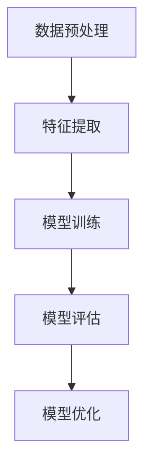
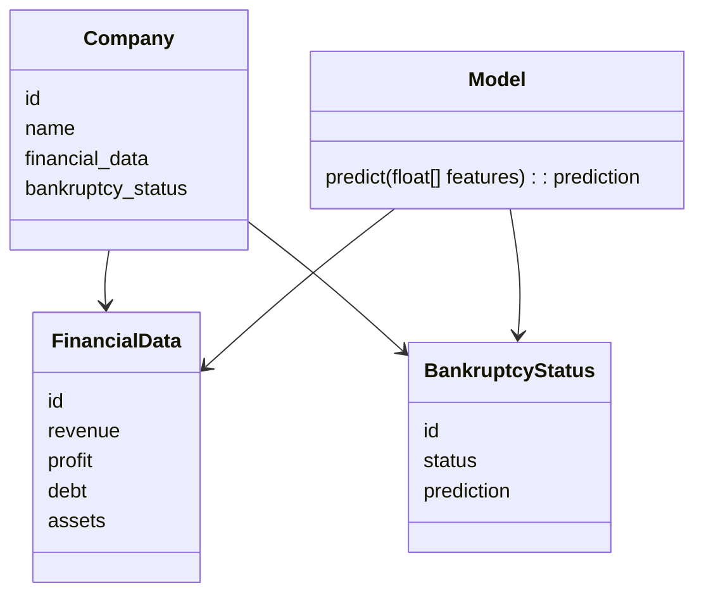

                 


# 深度学习预测公司破产风险概率

**关键词**：深度学习，破产预测，风险评估，神经网络，公司财务

**摘要**：本文系统地探讨了如何利用深度学习技术预测公司破产风险概率。通过分析深度学习模型的结构与原理，结合实际案例，展示了如何从公司财务数据中提取特征，并构建有效的预测模型。文章从背景、核心概念、算法原理、系统设计到项目实战，逐步展开，提供全面的技术指导。

---

## 第1章: 研究背景与问题描述

### 1.1 研究背景
#### 1.1.1 研究背景介绍
在全球经济波动加剧的背景下，公司破产风险预测显得尤为重要。企业可以通过预测潜在的财务危机，提前采取措施，避免或减少损失。深度学习作为一种强大的机器学习技术，能够从海量数据中提取复杂特征，为破产预测提供新的解决方案。

#### 1.1.2 研究意义与价值
- 提高破产预测的准确性，帮助企业做出更明智的财务决策。
- 通过早期预警，降低企业的经营风险。
- 为投资者提供更可靠的决策依据。

#### 1.1.3 研究现状与挑战
目前，传统的破产预测方法如Z-score模型存在一定的局限性，难以处理非线性关系和复杂特征。深度学习的引入，能够克服这些不足，但同时也面临数据获取难、模型解释性差等问题。

### 1.2 问题描述
#### 1.2.1 研究核心问题
如何利用深度学习技术，从公司财务数据中预测其破产风险概率？

#### 1.2.2 问题解决方法
通过构建深度学习模型，提取财务数据中的潜在特征，训练模型以预测破产风险。

#### 1.2.3 研究的边界与外延
- 数据范围：仅考虑财务数据，不涉及非财务因素。
- 时间范围：预测未来一年内的破产风险。
- 模型适用性：适用于中小型企业，大型企业可能需要更复杂的模型。

### 1.3 核心概念与联系
#### 1.3.1 核心概念
- 深度学习：一种通过多层非线性变换模拟数据特征的学习方法。
- 破产预测：通过分析公司财务状况，预测其是否会破产。
- 风险概率：模型输出的破产可能性数值。

#### 1.3.2 核心概念属性特征对比表
| 概念       | 属性             | 特征描述                               |
|------------|------------------|---------------------------------------|
| 深度学习    | 层次化结构        | 多层非线性变换，能够捕捉复杂特征     |
| 破产预测    | 输入数据         | 公司财务数据（收入、利润、负债等）   |
| 风险概率    | 输出范围         | 0（无风险）到1（破产）                |

#### 1.3.3 实体关系图
```mermaid
erDiagram
    company {
        id
        name
        financial_data
        bankruptcy_status
    }
    financial_data {
        id
        revenue
        profit
        debt
        assets
    }
    bankruptcy_status {
        id
        status
        prediction
    }
```

---

## 第2章: 深度学习算法原理

### 2.1 深度学习模型结构
#### 2.1.1 神经网络的基本结构
- 输入层：接收公司财务数据。
- 隐藏层：通过非线性变换提取特征。
- 输出层：预测破产概率。

#### 2.1.2 深度学习模型的选择
- 选择LSTM模型，因其适合时间序列数据的分析。

### 2.2 研究的数学模型与公式
#### 2.2.1 损失函数
$$ L = -\frac{1}{m}\sum_{i=1}^{m} [y_i \log(p_i) + (1-y_i)\log(1-p_i)] $$
其中，$y_i$为真实标签，$p_i$为预测概率。

#### 2.2.2 优化目标
$$ \theta = \theta - \eta \frac{\partial L}{\partial \theta} $$
其中，$\theta$为模型参数，$\eta$为学习率。

### 2.3 算法流程图


---

## 第3章: 系统分析与架构设计

### 3.1 系统功能设计
#### 3.1.1 数据获取模块
- 从数据库中获取公司财务数据。
- 数据清洗与预处理。

#### 3.1.2 模型训练模块
- 使用LSTM模型训练破产预测模型。
- 调参优化，提高模型性能。

#### 3.1.3 结果展示模块
- 可视化模型预测结果。
- 提供破产风险预警。

### 3.2 系统架构设计


---

## 第4章: 项目实战

### 4.1 环境安装
- 安装Python、TensorFlow、Keras等工具。

### 4.2 核心代码实现
```python
import numpy as np
import tensorflow as tf
from sklearn.preprocessing import MinMaxScaler

# 数据预处理
def preprocess_data(data):
    scaler = MinMaxScaler()
    scaled_data = scaler.fit_transform(data)
    return scaled_data

# LSTM模型构建
def build_model(input_shape):
    model = tf.keras.Sequential()
    model.add(tf.keras.layers.LSTM(64, return_sequences=True, input_shape=input_shape))
    model.add(tf.keras.layers.LSTM(32, return_sequences=False))
    model.add(tf.keras.layers.Dense(1, activation='sigmoid'))
    model.compile(loss='binary_crossentropy', optimizer='adam', metrics=['accuracy'])
    return model

# 训练模型
def train_model(model, X_train, y_train, epochs=100, batch_size=32):
    model.fit(X_train, y_train, epochs=epochs, batch_size=batch_size, verbose=1)
    return model

# 预测与评估
def evaluate_model(model, X_test, y_test):
    loss, accuracy = model.evaluate(X_test, y_test, verbose=0)
    print(f"Test loss: {loss}, accuracy: {accuracy}")
```

### 4.3 案例分析
- 使用实际公司财务数据进行训练与测试。
- 对比模型预测结果与实际破产情况，评估模型性能。

### 4.4 项目总结
- 模型性能评估。
- 可能的优化方向。

---

## 第5章: 最佳实践与小结

### 5.1 最佳实践
- 数据预处理：确保数据质量，合理处理缺失值。
- 模型选择：根据数据类型选择合适的模型结构。
- 超参数调优：通过网格搜索优化模型性能。

### 5.2 小结
本文详细介绍了深度学习在公司破产预测中的应用，从背景到实现，系统地展示了如何利用深度学习技术进行风险预测。

### 5.3 注意事项
- 数据隐私：确保数据处理符合相关法律法规。
- 模型解释性：破产预测模型的决策过程需要透明化。
- 模型更新：定期更新模型，以适应市场变化。

### 5.4 拓展阅读
- 《Deep Learning》
- 《Python深度学习》

---

**作者**：AI天才研究院（AI Genius Institute） & 禅与计算机程序设计艺术（Zen And The Art of Computer Programming）

