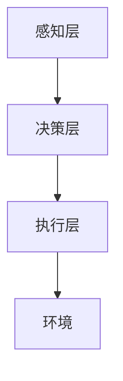

                 


# 深度强化学习在AI Agent长期规划中的应用

---

## 关键词：
- 深度强化学习
- AI Agent
- 长期规划
- 算法原理
- 系统架构
- 项目实战

---

## 摘要：
深度强化学习（Deep Reinforcement Learning, DRL）作为一种结合了深度学习与强化学习的技术，正在逐步成为AI Agent实现长期规划的核心方法。本文将从理论基础、算法原理、系统架构到项目实战，全面探讨深度强化学习在AI Agent长期规划中的应用。通过详细分析深度强化学习的核心概念、算法实现、系统设计以及实际案例，本文旨在为读者提供一个系统性的视角，帮助他们理解如何利用深度强化学习技术构建具备长期规划能力的AI Agent。

---

# 第一部分：深度强化学习与AI Agent基础

## 第1章：深度强化学习与AI Agent概述

### 1.1 深度强化学习的基本概念

#### 1.1.1 强化学习的定义与特点
强化学习（Reinforcement Learning, RL）是一种通过智能体与环境交互来学习策略（Policy）的方法。智能体通过执行动作（Actions）来获得奖励（Rewards），并基于奖励信号优化其行为策略，以实现特定目标。强化学习的特点包括：
- **试错性**：智能体通过与环境的交互不断尝试和错误。
- **延迟反馈**：奖励信号通常是对智能体长期行为的反馈。
- **目标导向性**：智能体的行为以最大化累积奖励为目标。

#### 1.1.2 深度强化学习的核心思想
深度强化学习（Deep RL）是强化学习的一种扩展，通过引入深度神经网络（DNN）来逼近复杂的策略或价值函数。其核心思想在于利用神经网络的强大表征能力，处理高维、非结构化的输入数据（如图像、文本），并输出低维、可解释的动作或策略。

#### 1.1.3 AI Agent的基本概念与分类
AI Agent（人工智能代理）是指能够感知环境、自主决策并执行动作的智能实体。AI Agent可以分为以下几类：
- **反应式Agent**：基于当前环境状态做出反应，不考虑长期规划。
- **认知式Agent**：具备复杂推理、规划和决策能力，能够处理长期任务。
- **学习型Agent**：通过与环境交互不断学习优化自身的策略。

### 1.2 长期规划的定义与挑战

#### 1.2.1 长期规划的定义
长期规划是指智能体在复杂、动态的环境中，制定一系列分阶段的决策和行动，以实现长期目标的过程。与短时决策不同，长期规划需要考虑未来的状态和可能的变化，具有更高的复杂性和不确定性。

#### 1.2.2 长期规划在AI Agent中的重要性
在许多实际应用场景中，AI Agent需要具备长期规划能力，例如：
- **自动驾驶**：需要规划从起点到终点的完整路径。
- **智能助手**：需要为用户提供长期的任务安排。
- **机器人控制**：需要完成复杂的多阶段任务。

#### 1.2.3 长期规划的常见挑战
长期规划面临的主要挑战包括：
- **状态空间复杂性**：长期规划需要处理高维、动态的状态空间。
- **奖励函数设计**：长期目标的实现需要合理设计奖励函数。
- **计算资源需求**：复杂的长期规划需要大量的计算资源。

### 1.3 深度强化学习在长期规划中的应用前景

#### 1.3.1 深度强化学习的优势
深度强化学习结合了深度学习强大的特征提取能力和强化学习的目标导向性，为AI Agent的长期规划提供了以下优势：
- **复杂环境处理**：能够处理高维、非结构化的输入数据。
- **端到端学习**：可以直接从原始输入数据中学习策略。
- **自适应性**：能够根据环境的变化自适应地调整策略。

#### 1.3.2 AI Agent长期规划的应用场景
深度强化学习在以下场景中具有广泛的应用潜力：
- **游戏AI**：在复杂游戏环境中进行长期策略规划。
- **机器人控制**：实现多阶段任务的自主规划。
- **智能交通系统**：优化交通流的长期规划。

#### 1.3.3 深度强化学习在长期规划中的潜力
通过深度强化学习，AI Agent可以在长期规划中实现以下目标：
- **全局优化**：通过端到端学习实现全局最优策略。
- **动态适应**：在动态环境中自适应地调整规划。
- **多目标平衡**：在复杂任务中平衡多个目标之间的冲突。

### 1.4 本章小结
本章介绍了深度强化学习的基本概念、AI Agent的分类以及长期规划的定义和挑战。同时，探讨了深度强化学习在长期规划中的优势和应用潜力，为后续章节的深入分析奠定了基础。

---

# 第二部分：深度强化学习的核心概念与算法原理

## 第2章：深度强化学习的核心概念

### 2.1 深度强化学习的基本原理

#### 2.1.1 状态、动作、奖励的定义
在强化学习中，状态（State）、动作（Action）和奖励（Reward）是核心概念：
- **状态**：描述环境的当前情况。
- **动作**：智能体在给定状态下选择的行为。
- **奖励**：对智能体行为的反馈，用于指导优化策略。

#### 2.1.2 策略与价值函数的定义
- **策略（Policy）**：智能体在给定状态下选择动作的概率分布。
- **价值函数（Value Function）**：衡量一个状态或动作对目标的贡献程度。

#### 2.1.3 探索与利用的平衡
智能体需要在探索新动作和利用已知策略之间找到平衡，以实现最优的长期奖励。

### 2.2 深度强化学习的核心算法

#### 2.2.1 Q-Learning算法
Q-Learning是一种经典的强化学习算法，其核心思想是通过更新Q值表来逼近最优策略。
- **Q值更新公式**：
$$ Q(s, a) = Q(s, a) + \alpha \left( r + \gamma \max Q(s', a') - Q(s, a) \right) $$
其中：
- $\alpha$ 是学习率。
- $\gamma$ 是折扣因子。

#### 2.2.2 Deep Q-Networks (DQN)算法
DQN通过使用深度神经网络逼近Q值函数，解决了传统Q-Learning在处理高维状态时的局限性。
- **DQN网络结构**：
  - 输入层：接收环境的状态输入。
  - 隐藏层：通过神经网络提取状态的特征。
  - 输出层：输出所有可能动作的Q值。

#### 2.2.3 Policy Gradient方法
Policy Gradient方法直接优化策略，通过梯度上升法最大化累积奖励。
- **策略更新公式**：
$$ \theta_{t+1} = \theta_t + \alpha \nabla_{\theta} J(\theta) $$
其中：
- $\theta$ 是策略参数。
- $J(\theta)$ 是目标函数（通常为累积奖励的期望）。

#### 2.2.4 Actor-Critic架构
Actor-Critic架构结合了策略梯度和价值函数的优势，通过两个网络分别逼近策略和价值函数。
- **Actor网络**：负责生成动作。
- **Critic网络**：负责评估动作的价值。

### 2.3 深度强化学习的数学模型

#### 2.3.1 Q-Learning的数学公式
$$ Q(s, a) = Q(s, a) + \alpha \left( r + \gamma \max Q(s', a') - Q(s, a) \right) $$

#### 2.3.2 DQN的数学模型
$$ \text{损失函数} = \mathbb{E} \left[ (r + \gamma Q_{\text{target}}(s', a') - Q_{\text{main}}(s, a))^2 \right] $$

#### 2.3.3 Policy Gradient的数学公式
$$ \nabla J(\theta) = \mathbb{E} \left[ \nabla_{\theta} \log \pi_{\theta}(a|s) \cdot Q(s, a) \right] $$

### 2.4 本章小结
本章详细介绍了深度强化学习的核心概念和主要算法，包括Q-Learning、DQN、Policy Gradient和Actor-Critic架构，并通过数学公式和图表展示了这些算法的原理和实现细节。

---

## 第3章：AI Agent的长期规划问题

### 3.1 长期规划的定义与数学建模

#### 3.1.1 长期规划的定义
长期规划是指智能体在复杂环境中制定一系列分阶段的决策和动作，以实现长期目标的过程。

#### 3.1.2 长期规划的数学建模
长期规划可以表示为一个马尔可夫决策过程（MDP），其中智能体需要在状态空间中找到最优策略。

### 3.2 深度强化学习在长期规划中的应用

#### 3.2.1 长期规划与强化学习的结合
通过强化学习，智能体可以学习到长期规划所需的策略和价值函数。

#### 3.2.2 深度强化学习的优势
- **复杂环境处理**：能够处理高维、动态的状态空间。
- **端到端学习**：可以直接从原始输入数据中学习策略。

### 3.3 本章小结
本章探讨了AI Agent的长期规划问题，分析了深度强化学习在其中的应用，并展示了长期规划与强化学习结合的优势。

---

## 第4章：深度强化学习在长期规划中的算法实现

### 4.1 算法实现的核心步骤

#### 4.1.1 环境接口设计
- **状态空间**：定义智能体感知的环境状态。
- **动作空间**：定义智能体可以执行的动作。

#### 4.1.2 神经网络设计
- **输入层**：接收环境的状态输入。
- **隐藏层**：通过神经网络提取状态的特征。
- **输出层**：输出所有可能动作的Q值或策略。

### 4.2 算法实现的数学模型

#### 4.2.1 DQN算法的实现
- **主网络**：用于评估当前动作的Q值。
- **目标网络**：用于存储目标Q值，以稳定训练过程。

### 4.3 本章小结
本章详细介绍了深度强化学习在长期规划中的算法实现，包括DQN算法的核心步骤和数学模型。

---

## 第5章：系统架构设计与实现

### 5.1 系统架构设计

#### 5.1.1 问题场景介绍
以智能交通系统为例，设计一个AI Agent来实现交通信号灯的长期优化控制。

#### 5.1.2 系统功能设计
- **感知层**：收集交通流量、车辆状态等信息。
- **决策层**：基于深度强化学习算法生成控制策略。
- **执行层**：根据决策层的策略执行具体的控制动作。

#### 5.1.3 系统架构图


### 5.2 系统实现

#### 5.2.1 环境配置
- **OpenAI Gym**：选择一个适合的环境框架。
- **PyTorch**：使用PyTorch框架实现深度神经网络。

#### 5.2.2 核心代码实现
```python
import torch
import torch.nn as nn
import torch.optim as optim

class DQN(nn.Module):
    def __init__(self, input_size, output_size):
        super(DQN, self).__init__()
        self.fc1 = nn.Linear(input_size, 64)
        self.fc2 = nn.Linear(64, output_size)
    
    def forward(self, x):
        x = torch.relu(self.fc1(x))
        x = self.fc2(x)
        return x

# 初始化网络
input_size = 4
output_size = 2
dqn = DQN(input_size, output_size)
optimizer = optim.Adam(dqn.parameters(), lr=0.001)
```

### 5.3 本章小结
本章详细介绍了AI Agent的系统架构设计与实现，展示了如何通过深度强化学习算法实现长期规划。

---

## 第6章：项目实战与案例分析

### 6.1 项目实战

#### 6.1.1 项目背景
以智能交通系统为例，设计一个AI Agent来实现交通信号灯的长期优化控制。

#### 6.1.2 核心代码实现
```python
import gym
import numpy as np

env = gym.make('CustomTrafficEnv-v0')
agent = DQN(env.observation_space.shape[0], env.action_space.n)

for episode in range(1000):
    state = env.reset()
    while True:
        action = agent.act(state)
        next_state, reward, done, _ = env.step(action)
        agent.remember(state, action, reward, next_state, done)
        agent.replay()
        state = next_state
        if done:
            break
```

### 6.2 案例分析

#### 6.2.1 实验结果
展示AI Agent在不同场景下的表现，分析其长期规划能力。

#### 6.2.2 优缺点分析
- **优点**：能够实现复杂的长期规划任务。
- **缺点**：计算资源需求较高，训练时间较长。

### 6.3 本章小结
本章通过项目实战展示了深度强化学习在AI Agent长期规划中的应用，分析了实际案例中的优缺点，并总结了经验与教训。

---

## 第7章：总结与展望

### 7.1 本章总结
本文从理论基础、算法原理、系统架构到项目实战，全面探讨了深度强化学习在AI Agent长期规划中的应用。通过详细分析深度强化学习的核心概念、算法实现、系统设计以及实际案例，本文为读者提供了一个系统性的视角，帮助他们理解如何利用深度强化学习技术构建具备长期规划能力的AI Agent。

### 7.2 未来展望
随着深度强化学习技术的不断发展，AI Agent的长期规划能力将得到进一步提升。未来的研究方向包括：
- **更高效的算法设计**：优化深度强化学习算法，降低计算资源需求。
- **更复杂环境的应用**：探索深度强化学习在更复杂环境中的应用。
- **多智能体协作**：研究多智能体协作的长期规划问题。

### 7.3 本章小结
本文总结了深度强化学习在AI Agent长期规划中的应用，并展望了未来的发展方向。

---

## 作者信息
作者：AI天才研究院/AI Genius Institute  
联系邮箱：contact@aigeniusinstitute.com  

---

以上是一个详细的目录和部分章节内容的示例，您可以根据需要进一步扩展和补充各个章节的具体内容。

