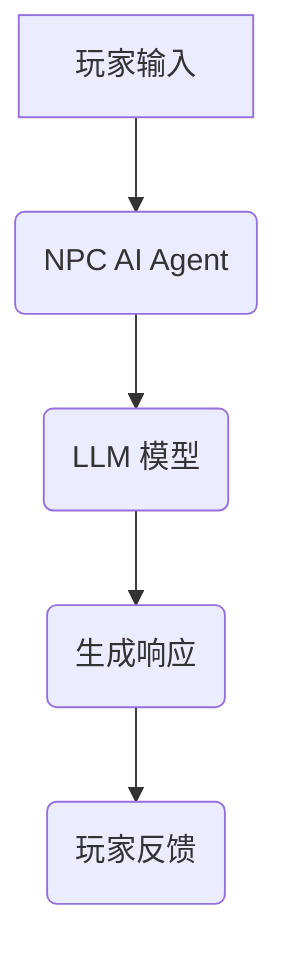
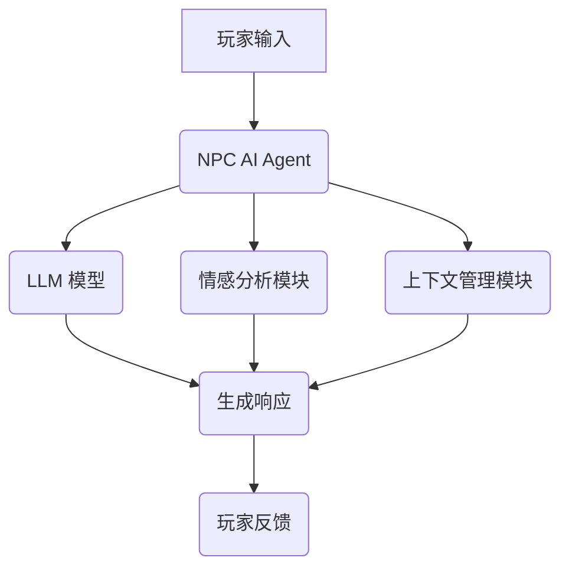
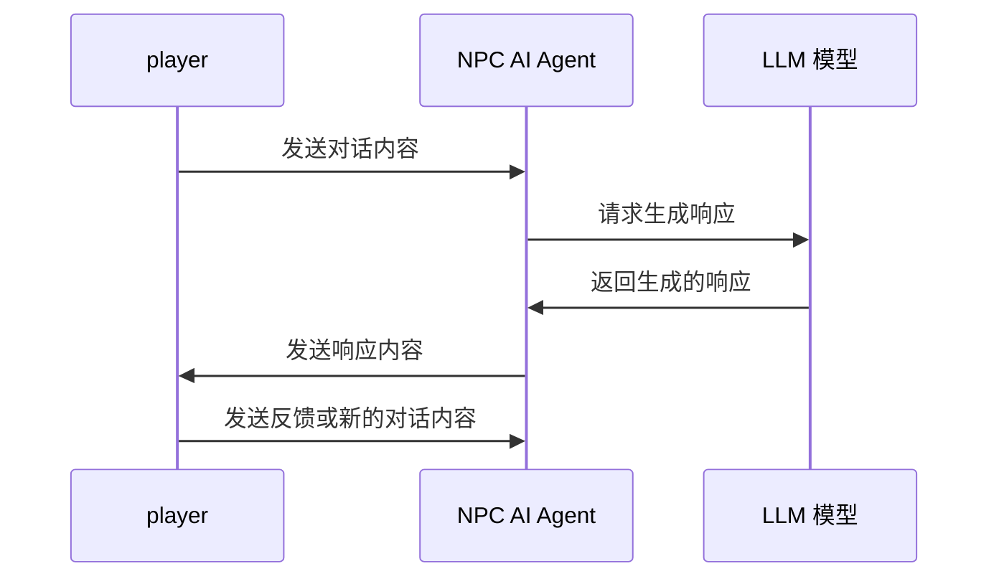

                 


# 游戏 NPC AI Agent：利用 LLM 创造更真实的游戏角色

> **关键词**: 大语言模型, NPC AI, 游戏角色, 智能交互, 人工智能  
> **摘要**: 本文探讨了如何利用大语言模型（LLM）来提升游戏中的非玩家角色（NPC）的智能性和交互性。通过分析LLM的工作原理及其在游戏开发中的应用潜力，本文详细阐述了如何设计和实现一个基于LLM的NPC AI Agent，以创造更真实的游戏体验。

---

## 第1章: 游戏 NPC AI Agent 的背景与需求

### 1.1 游戏行业的发展与 NPC 的重要性

#### 1.1.1 游戏行业的现状与发展趋势
游戏行业近年来迅速发展，从简单的2D游戏到复杂的3D游戏，从单机游戏到多人在线游戏，游戏的复杂性和互动性不断提高。玩家对游戏体验的需求也在不断增长，特别是在角色互动方面。

#### 1.1.2 NPC 在游戏中的角色与作用
非玩家角色（NPC）在游戏中扮演着重要角色，它们不仅是游戏环境的一部分，还承担着引导玩家、推动剧情发展的重要任务。传统的NPC通常基于预设的脚本进行简单的交互，但这种方式难以满足玩家对更智能、更动态交互的需求。

#### 1.1.3 玩家对 NPC 智能化的需求
随着玩家对游戏体验要求的提高，传统的NPC交互方式已显得单一和僵化。玩家希望NPC能够具备更自然的对话能力、更智能的决策能力以及更个性化的互动体验。

### 1.2 大语言模型（LLM）的崛起与应用潜力
#### 1.2.1 大语言模型的基本概念
大语言模型（LLM）是指基于大量数据训练的深度学习模型，能够理解和生成自然语言文本。这些模型通常采用Transformer架构，具有强大的上下文理解和生成能力。

#### 1.2.2 LLM 在游戏开发中的应用前景
LLM在自然语言处理领域的成功应用，使其成为游戏开发中的重要工具。通过LLM，游戏开发者可以实现更智能的NPC对话生成、多轮交互以及情感分析等功能。

#### 1.2.3 利用 LLM 提升 NPC 智能水平的可能性
LLM的强大能力为NPC的智能化提供了可能性。通过将LLM集成到NPC AI Agent中，开发者可以实现更自然的对话交互，动态响应玩家的行为，并根据上下文调整NPC的行为模式。

### 1.3 游戏 NPC AI Agent 的核心目标与价值
#### 1.3.1 提升 NPC 的交互性与智能性
通过LLM，NPC能够进行更复杂的对话，理解玩家的情感和意图，从而提供更个性化的交互体验。

#### 1.3.2 增强玩家的游戏体验
智能化的NPC能够为玩家提供更丰富、更有趣的游戏互动，增强玩家的沉浸感和满意度。

#### 1.3.3 降低游戏开发成本与复杂度
利用LLM的通用性和可扩展性，开发者可以减少手动编写NPC对话和行为脚本的工作量，降低开发成本和复杂度。

---

## 第2章: 游戏 NPC AI Agent 的核心概念

### 2.1 NPC AI Agent 的定义与属性

#### 2.1.1 NPC AI Agent 的定义
NPC AI Agent是一种基于人工智能的代理，能够通过自然语言处理技术与玩家进行互动，并根据玩家的行为和反馈动态调整其行为和对话内容。

#### 2.1.2 核心属性与特征对比表
以下是传统NPC与AI Agent NPC的核心属性对比：

```markdown
| 属性 | 传统 NPC | AI Agent NPC |
|------|---------|--------------|
| 行为模式 | 预设脚本 | 动态生成 |
| 交互能力 | 单向 | 双向互动 |
| 学习能力 | 无 | 有 |
```

### 2.2 NPC AI Agent 的工作原理

#### 2.2.1 基于 LLM 的对话生成机制
NPC AI Agent的核心是LLM，它通过分析玩家的输入，生成合适的响应。LLM能够理解上下文，因此能够进行多轮对话，并根据玩家的情感和意图调整对话内容。

#### 2.2.2 多轮对话的上下文管理
为了实现自然的对话，NPC AI Agent需要管理对话的上下文。这包括记录玩家的过去对话内容、情感状态以及当前的对话主题。

#### 2.2.3 情感分析与语境理解
通过情感分析技术，NPC AI Agent可以理解玩家的情感状态，并根据情感调整对话的语气和内容。例如，如果玩家表现出愤怒，NPC可能会更加耐心和友好。

### 2.3 NPC AI Agent 的系统架构



---

## 第3章: 大语言模型（LLM）的基本原理

### 3.1 LLM 的基本架构

#### 3.1.1 Transformer 架构
LLM通常基于Transformer架构，由编码器和解码器组成。编码器负责将输入文本转换为向量表示，解码器则根据这些向量生成输出文本。

#### 3.1.2 注意力机制
注意力机制是Transformer架构的核心，它允许模型在生成每个词时关注输入文本中最重要的部分。注意力机制的数学公式如下：

$$
\text{Attention}(Q, K, V) = \text{softmax}\left(\frac{QK^T}{\sqrt{d_k}}\right)V
$$

其中，$Q$、$K$和$V$分别是查询、键和值向量。

---

## 第4章: 游戏 NPC AI Agent 的系统设计与实现

### 4.1 系统功能设计

#### 4.1.1 对话生成模块
对话生成模块是NPC AI Agent的核心，负责根据玩家的输入生成合适的响应。该模块基于LLM模型，支持多轮对话。

#### 4.1.2 情感分析模块
情感分析模块用于分析玩家的情感状态，例如快乐、愤怒、悲伤等。根据情感状态，系统会调整对话的语气和内容。

#### 4.1.3 上下文管理模块
上下文管理模块负责记录玩家的对话历史和当前对话的主题，确保NPC的响应与上下文一致。

### 4.2 系统架构设计



### 4.3 系统接口设计

#### 4.3.1 输入接口
玩家通过游戏界面输入对话内容，例如文本或语音。

#### 4.3.2 输出接口
NPC AI Agent生成响应后，通过游戏引擎将响应返回给玩家，例如文本、语音或动作。

### 4.4 系统交互流程



---

## 第5章: 项目实战：基于 LLM 的 NPC AI Agent 实现

### 5.1 环境搭建

#### 5.1.1 安装 Python 环境
```bash
python -m pip install --upgrade pip
pip install torch transformers
```

#### 5.1.2 安装 LLM 模型
```bash
pip install llama-cpp-python
```

### 5.2 核心实现代码

#### 5.2.1 对话生成模块
```python
from transformers import LlamaCpp

llm = LlamaCpp(
    model_path="llama-2-70b",
    temperature=0.7,
    max_tokens=2048,
    n_ctx=2048
)

def generate_response(prompt):
    response = llm(
        prompt=prompt,
        max_tokens=100,
        n=1,
        stop=None,
        temperature=0.7,
    )
    return response.choices[0].message.content
```

#### 5.2.2 情感分析模块
```python
from textblob import TextBlob

def analyze_sentiment(text):
    blob = TextBlob(text)
    return blob.sentiment.polarity
```

### 5.3 测试与优化

#### 5.3.1 测试对话生成
```python
prompt = "你今天过得怎么样？"
response = generate_response(prompt)
print(response)
```

#### 5.3.2 测试情感分析
```python
text = "我感到很生气。"
sentiment = analyze_sentiment(text)
print(sentiment)  # 输出介于-1和1之间的值
```

---

## 第6章: 总结与展望

### 6.1 本章总结
本文详细探讨了如何利用大语言模型（LLM）来提升游戏中的NPC AI Agent的智能性和交互性。通过分析LLM的工作原理、系统架构设计以及实际项目实现，本文展示了如何利用LLM创造更真实的游戏角色。

### 6.2 未来展望
随着LLM技术的不断进步，NPC AI Agent的能力将更加智能化。未来，可以通过多模态交互、增强学习等技术进一步提升NPC的智能水平，为玩家带来更丰富、更真实的游戏体验。

---

## 作者：AI天才研究院（AI Genius Institute） & 禅与计算机程序设计艺术（Zen And The Art of Computer Programming）

---

以上是《游戏 NPC AI Agent：利用 LLM 创造更真实的游戏角色》的技术博客文章的完整目录大纲和部分具体内容。希望这篇文章能够为游戏开发者和技术爱好者提供有价值的参考和启发。

