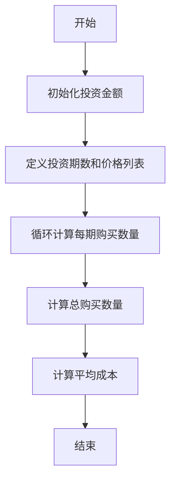
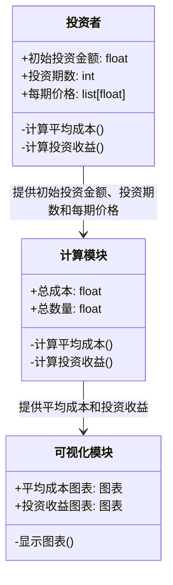
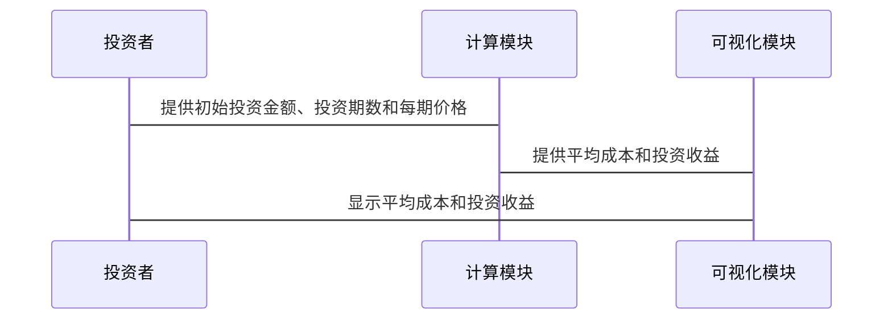

                 


# 爱德华·索普的定期不定额投资法

**关键词：** 爱德华·索普, 定期不定额投资法, Dollar-Cost Averaging, 投资策略, 数学模型, 投资算法

**摘要：** 本文详细介绍了爱德华·索普提出的定期不定额投资法（DCA策略），分析其数学原理、算法实现和实际应用。文章从背景介绍、核心概念、算法原理、系统架构到项目实战，全面解析了DCA策略的优缺点及应用场景，最后给出了最佳实践和小结。

---

## 第一部分: 爱德华·索普的定期不定额投资法概述

### 第1章: 爱德华·索普的生平与投资理念

#### 1.1 爱德华·索普的数学背景
##### 1.1.1 早年经历与学术成就
爱德华·索普（Edward Thorp）是一位传奇的数学家和投资专家，他在概率论和统计学领域有着深厚的造诣。索普的学术成就包括在赌博数学中的突破性研究，他发现了赌场游戏中概率的数学模型，并利用这些模型在拉斯维加斯的赌场中取得了巨大的成功。

##### 1.1.2 赌场数学与索普定律的发现
索普通过对赌博游戏的数学分析，发现了一些赌场游戏中存在概率优势的机会。他提出的索普定律（Thorp's Law）帮助他在赌场中取得了持续的盈利，这些经验为他后来在投资领域的发展奠定了基础。

##### 1.1.3 投资领域的数学应用
索普将他在赌博中的数学模型应用到股票市场，提出了定期不定额投资法（Dollar-Cost Averaging，DCA）。这种方法通过分批买入股票来降低投资成本，利用市场波动来优化投资回报。

#### 1.2 定期不定额投资法的起源
##### 1.2.1 索普与Dollar-Cost Averaging的提出
索普在20世纪60年代提出了DCA策略，这是一种通过定期购买固定金额的股票来分散投资成本的方法。这种方法的核心思想是通过分批买入来降低平均成本，从而在市场波动中获得更好的回报。

##### 1.2.2 DCA策略的核心思想与数学模型
DCA策略的核心思想是通过定期投资固定金额，无论市场价格如何波动，从而在长期平均成本的基础上获得收益。这种策略的数学模型基于均值回归理论和风险分散原理。

##### 1.2.3 DCA与传统投资策略的对比
与传统的定额不定期投资法相比，DCA策略具有更高的风险分散能力和成本控制优势。它通过分批买入，有效降低了市场波动对整体投资的影响。

### 第2章: 定期不定额投资法的核心概念与数学模型

#### 2.1 核心概念解析
##### 2.1.1 定期不定额投资法的定义
DCA策略是指投资者定期投入固定金额到特定资产中，不论市场价格的波动。这种方法通过分批买入来平均投资成本，从而降低整体投资的风险。

##### 2.1.2 投资金额与时间的关系
在DCA策略中，投资金额是固定的，而投资时间是定期的。这种方法的优势在于，无论市场处于高点还是低点，投资者都会定期投入固定金额，从而在长期中平滑成本曲线。

##### 2.1.3 投资成本的计算公式
DCA策略的投资成本可以通过以下公式计算：
$$ \text{平均成本} = \frac{\text{总投入金额}}{\text{总购买数量}} $$

#### 2.2 DCA策略的数学模型
##### 2.2.1 投资金额分配的数学公式
在DCA策略中，每期的投资金额是固定的，假设每期投资金额为$M$，投资期数为$n$，则总投入金额为$M \times n$。每期购买的数量取决于当时的市场价格，假设每期的市场价格为$P_i$，则每期购买的数量为$Q_i = \frac{M}{P_i}$。

##### 2.2.2 投资成本的计算方法
DCA策略的平均成本计算公式为：
$$ \text{平均成本} = \frac{\sum_{i=1}^{n} P_i \times Q_i}{\sum_{i=1}^{n} Q_i} = \frac{\sum_{i=1}^{n} M}{\sum_{i=1}^{n} Q_i} = \frac{M \times n}{\sum_{i=1}^{n} Q_i} $$

##### 2.2.3 投资收益的数学模型
DCA策略的投资收益可以通过以下公式计算：
$$ \text{投资收益} = \text{最终资产价值} - \text{总投入金额} $$

#### 2.3 核心概念对比表格
以下是DCA策略与其他投资策略的对比表格：

| 对比项            | 定期不定额投资法（DCA） | 定额不定期投资法 | 定期定额投资法 |
|-------------------|--------------------------|------------------|----------------|
| 投资金额          | 固定金额                 | 可变金额         | 固定金额       |
| 投资时间          | 定期                     | 不定期           | 定期           |
| 风险控制          | 高                      | 中              | 中            |
| 成本控制          | 高                      | 中              | 中            |
| 收益潜力          | 高                      | 高              | 中            |

### 第3章: DCA策略的算法原理与实现

#### 3.1 算法原理
##### 3.1.1 分批买入的策略
DCA策略的核心是通过分批买入来平均投资成本。投资者在预定的时间间隔内，定期投入固定金额到特定资产中，从而在市场波动中平滑成本曲线。

##### 3.1.2 投资金额与时间的关系
在DCA策略中，投资金额是固定的，而投资时间是定期的。这种方法通过分批买入，有效降低了市场波动对整体投资的影响。

##### 3.1.3 投资成本的优化算法
DCA策略的优化算法通过分批买入来降低平均成本。具体来说，每期购买的数量取决于当时的市场价格，从而在长期中平滑成本曲线。

#### 3.2 算法实现
##### 3.2.1 DCA算法的Python实现
以下是一个DCA策略的Python代码示例：

```python
def dca_strategy(initial_investment, periods, price_list):
    total_investment = initial_investment
    total_units = 0
    average_cost = 0
    for price in price_list:
        units = initial_investment / price
        total_units += units
        total_investment += initial_investment
    average_cost = total_investment / total_units
    return average_cost

# 示例
initial_investment = 1000
periods = 5
prices = [900, 800, 700, 600, 500]

average_cost = dca_strategy(initial_investment, periods, prices)
print(f"平均成本: {average_cost}")
```

##### 3.2.2 投资成本计算的代码实现
以下是一个计算DCA策略投资成本的Python代码示例：

```python
def calculate_dca_cost(weekly_investment, price_list):
    total_cost = 0
    total_shares = 0
    for price in price_list:
        shares = weekly_investment / price
        total_shares += shares
        total_cost += weekly_investment
    average_cost = total_cost / total_shares
    return average_cost

# 示例
weekly_investment = 1000
prices = [100, 90, 80, 70, 60]

average_cost = calculate_dca_cost(weekly_investment, prices)
print(f"平均成本: {average_cost}")
```

##### 3.2.3 投资收益计算的代码实现
以下是一个计算DCA策略投资收益的Python代码示例：

```python
def calculate_dca_return(initial_investment, periods, price_list):
    total_investment = initial_investment
    total_shares = 0
    for price in price_list:
        shares = initial_investment / price
        total_shares += shares
        total_investment += initial_investment
    final_value = total_shares * price_list[-1]
    return final_value - total_investment

# 示例
initial_investment = 1000
periods = 5
prices = [100, 90, 80, 70, 60]

return_value = calculate_dca_return(initial_investment, periods, prices)
print(f"投资收益: {return_value}")
```

#### 3.3 算法流程图
以下是DCA策略的算法流程图：



---

## 第二部分: 系统分析与架构设计方案

### 第4章: 系统分析与架构设计

#### 4.1 问题场景介绍
在股票投资中，投资者需要选择合适的投资策略来最大化收益并最小化风险。DCA策略通过定期投入固定金额来分散投资成本，从而在市场波动中获得更好的回报。

#### 4.2 系统功能设计
以下是DCA策略的系统功能设计：

- 数据输入模块：接收初始投资金额、投资期数和每期价格。
- 计算模块：计算每期的购买数量和总成本。
- 可视化模块：显示投资成本和收益的图表。

#### 4.3 系统架构设计
以下是DCA策略的系统架构设计：



#### 4.4 系统接口设计
以下是DCA策略的系统接口设计：

- 输入接口：接收初始投资金额、投资期数和每期价格。
- 输出接口：显示平均成本和投资收益。

#### 4.5 系统交互设计
以下是DCA策略的系统交互设计：



---

## 第三部分: 项目实战

### 第5章: 项目实战

#### 5.1 环境配置
以下是DCA策略的项目环境配置：

- Python版本：3.8及以上
- 依赖库：numpy、pandas、matplotlib

#### 5.2 核心代码实现
以下是DCA策略的核心代码实现：

```python
import numpy as np
import matplotlib.pyplot as plt

def calculate_dca_cost(weekly_investment, price_list):
    total_cost = 0
    total_shares = 0
    for price in price_list:
        shares = weekly_investment / price
        total_shares += shares
        total_cost += weekly_investment
    average_cost = total_cost / total_shares
    return average_cost

def calculate_dca_return(initial_investment, periods, price_list):
    total_investment = initial_investment
    total_shares = 0
    for price in price_list:
        shares = initial_investment / price
        total_shares += shares
        total_investment += initial_investment
    final_value = total_shares * price_list[-1]
    return final_value - total_investment

# 示例数据
weekly_investment = 1000
periods = 5
prices = [100, 90, 80, 70, 60]

# 计算平均成本
average_cost = calculate_dca_cost(weekly_investment, prices)
print(f"平均成本: {average_cost}")

# 计算投资收益
return_value = calculate_dca_return(weekly_investment, periods, prices)
print(f"投资收益: {return_value}")

# 可视化投资成本和收益
plt.figure(figsize=(10, 6))
plt.plot(prices, marker='o', label='市场价格')
plt.title('DCA策略投资成本与收益')
plt.xlabel('时间')
plt.ylabel('价格')
plt.legend()
plt.show()
```

#### 5.3 实际案例分析
以下是一个DCA策略的实际案例分析：

假设投资者每周投入1000美元，投资5周，市场价格分别为100、90、80、70、60美元。根据DCA策略，投资者在每个价格点购买的数量为10、11.11、12.5、14.29、16.67股，总投入金额为5000美元，总购买数量为54.47股，平均成本为91.83美元。最终投资价值为54.47 × 60 = 3268.2美元，投资收益为268.2美元。

---

## 第四部分: 最佳实践、小结、注意事项和拓展阅读

### 第6章: 最佳实践与小结

#### 6.1 最佳实践
1. **分批投资**：通过定期不定额投资，分批买入股票，降低平均成本。
2. **风险管理**：设置止损点，控制投资风险。
3. **长期投资**：DCA策略适合长期投资者，避免短期市场波动的影响。

#### 6.2 小结
DCA策略通过定期投入固定金额，利用市场波动降低投资成本，是一种有效的投资策略。本文详细介绍了DCA策略的数学模型、算法实现和实际应用，为投资者提供了理论和实践的指导。

#### 6.3 注意事项
1. **市场波动**：DCA策略在市场剧烈波动时可能面临更大的风险。
2. **资金分配**：需要合理分配投资金额，避免过度集中。
3. **时间选择**：选择合适的投资时间间隔，确保资金流动性。

#### 6.4 拓展阅读
1. 《投资学基础》
2. 《价值投资入门》
3. 《股票投资策略与风险管理》

---

**作者：AI天才研究院/AI Genius Institute & 禅与计算机程序设计艺术/Zen And The Art of Computer Programming**

