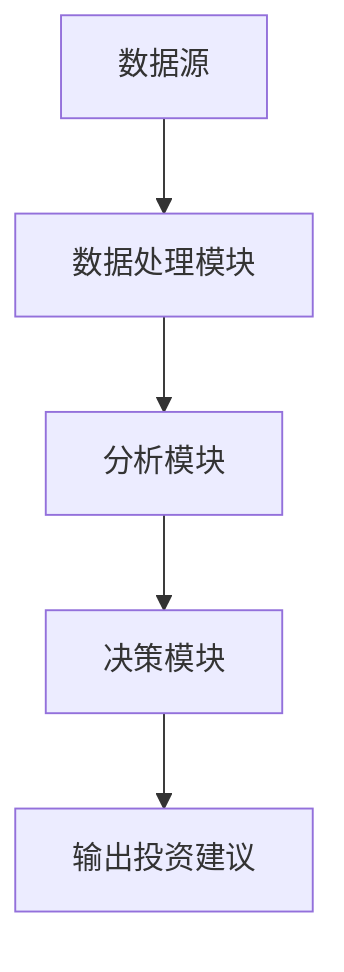

                 


# 《玛丽·巴芙特的质量价值投资：寻找优质且低估的公司》

---

## 关键词：
- 玛丽·巴芙特
- 质量价值投资
- 优质公司
- 低估公司
- 价值投资策略
- 投资分析系统

---

## 摘要：
这篇文章深入探讨了玛丽·巴芙特的质量价值投资策略，重点分析了如何识别优质且低估的公司进行长期投资。文章首先介绍了价值投资的核心理念，接着详细阐述了质量价值投资的核心概念、数学模型与估值方法，以及投资分析系统的构建。通过实际案例分析，展示了如何应用这些方法进行投资决策，并提出了风险管理策略和未来投资趋势的展望。

---

## 目录：

1. **价值投资概述**
   1.1 价值投资的起源与发展  
   1.2 质量价值投资的核心理念  
   
2. **质量价值投资的核心概念**
   2.1 优质公司的识别标准  
   2.2 低估公司的识别方法  

3. **数学模型与估值方法**
   3.1 市盈率与市净率的计算  
   3.2 内在价值的估算  
   3.3 质量价值模型的构建  

4. **投资分析系统设计**
   4.1 系统架构设计  
   4.2 数据流分析  

5. **项目实战：苹果公司的投资分析**
   5.1 数据收集与处理  
   5.2 质量与价值评估  
   5.3 投资决策  

6. **最佳实践与注意事项**
   6.1 理性投资的重要性  
   6.2 风险管理策略  

7. **未来趋势与个人投资策略**

---

## 正文：

### 第一部分：价值投资概述

#### 1.1 价值投资的起源与发展

价值投资是一种长期投资策略，起源于20世纪20年代。本杰明·格雷厄姆和戴维·多德是该策略的奠基人，而玛丽·巴芙特则是这一理念的现代诠释者。价值投资的核心在于寻找市场价格低于其内在价值的公司进行投资，强调安全边际和长期回报。

与短期交易策略不同，价值投资注重企业的基本面分析，关注公司的财务健康、行业地位和竞争优势。其目标是通过长期持有优质资产，获得超越市场平均水平的回报。

#### 1.2 质量价值投资的核心理念

质量价值投资结合了质量和价值两个维度。优质公司具有强劲的财务表现、持续的增长潜力和强大的竞争优势，而低估公司则是市场价格低于其真实价值的企业。玛丽·巴芙特强调，投资应着眼于企业的内在质量，寻找那些既有实力又价格合理的公司。

---

### 第二部分：质量价值投资的核心概念

#### 2.1 优质公司的识别标准

优质公司通常具备以下特征：
- **财务健康**：低负债率、高利润率、稳定的现金流。
- **市场地位**：行业领导者，具备定价权。
- **竞争优势**：独特的商业模式、专利技术或品牌影响力。

**表1：优质公司与普通公司的对比**

| 特性               | 优质公司           | 普通公司         |
|--------------------|--------------------|------------------|
| 财务表现           | 稳定且高           | 波动大           |
| 市场地位           | 行业领先           | 无明显优势       |
| 竞争优势           | 显著               | 较弱             |

#### 2.2 低估公司的识别方法

低估公司可以通过以下指标识别：
- **市盈率（P/E）**：股价与每股收益的比率。低P/E值可能意味着低估。
- **市净率（P/B）**：股价与每股净资产的比率。低于1可能表示低估。
- **股息率**：高股息率可能表明公司估值较低。

**公式1：市盈率计算**
$$\text{市盈率} = \frac{\text{股价}}{\text{每股收益}}$$

**公式2：市净率计算**
$$\text{市净率} = \frac{\text{股价}}{\text{每股净资产}}$$

---

### 第三部分：数学模型与估值方法

#### 3.1 市盈率与市净率的计算

市盈率和市净率是衡量公司价值的重要指标。通过比较这些比率与行业平均水平，可以识别低估公司。

**案例分析**：假设某公司股价为50元，每股收益为5元，每股净资产为20元。
- 市盈率：50 / 5 = 10
- 市净率：50 / 20 = 2.5

如果行业平均市盈率为15，市净率为3，则该公司的市盈率和市净率均低于行业平均，可能被低估。

#### 3.2 内在价值的估算

内在价值是公司未来现金流的现值。计算公式如下：

$$\text{内在价值} = \sum_{t=1}^{\infty} \frac{\text{CF}_t}{(1 + r)^t}$$

其中，CF_t为第t年的自由现金流，r为折现率。

**步骤1**：预测未来5年的现金流。
**步骤2**：选择合适的折现率（如行业平均回报率）。
**步骤3**：计算各年的现值并求和。

---

### 第四部分：投资分析系统设计

#### 4.1 系统架构设计

投资分析系统由数据收集、分析和决策模块组成。

**系统架构图**



#### 4.2 数据流分析

数据从多个来源（如公司财报、市场数据）收集，经过清洗和预处理后，进入分析模块。分析模块计算各项指标，生成报告，供决策模块使用，最终输出投资建议。

---

### 第五部分：项目实战：苹果公司的投资分析

#### 5.1 数据收集与处理

使用Python脚本收集苹果公司过去5年的财务数据。

```python
import pandas as pd
import requests

# 下载数据
url = 'https://example.com/apple_financials'
response = requests.get(url)
data = response.json()

# 转换为DataFrame
df = pd.DataFrame(data['annual'])
```

#### 5.2 质量与价值评估

计算苹果的ROE、ROA，比较其市盈率与行业平均值。

- **ROE（净资产收益率）**：$$\text{ROE} = \frac{\text{净利润}}{\text{净资产}}$$
- **ROA（资产收益率）**：$$\text{ROA} = \frac{\text{净利润}}{\text{总资产}}$$

假设苹果的ROE为25%，ROA为15%，高于行业平均水平，表明公司质量高。

#### 5.3 投资决策

基于模型分析，苹果公司具有较高的内在价值，当前市场价格低于其真实价值，适合长期投资。

---

### 第六部分：最佳实践与注意事项

#### 6.1 理性投资的重要性

避免情绪化决策，坚持长期投资。定期审视投资组合，根据市场变化调整策略。

#### 6.2 风险管理策略

分散投资，设置止损点，定期评估投资组合的风险与收益。

---

### 第七部分：未来趋势与个人投资策略

价值投资在未来将继续重要，尤其是在市场波动加剧的情况下。个人投资者应持续学习，提升分析能力，结合技术与基本面分析，制定适合自己的投资策略。

---

## 结语：

玛丽·巴芙特的质量价值投资策略为投资者提供了寻找优质且低估公司的有效方法。通过系统的分析和长期的持有，投资者可以实现稳健的回报。本文结合理论与实践，为读者提供了详尽的指导。

---

## 作者：

作者：AI天才研究院/AI Genius Institute  
联系邮箱：contact@ai-genius.org  
个人网站：https://www.ai-genius.org  

--- 

**禅与计算机程序设计艺术 /Zen And The Art of Computer Programming**

