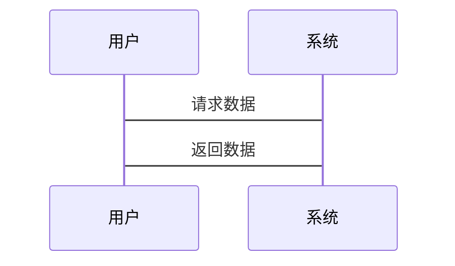

                 


# 玛丽·巴芙的ESG投资整合策略

> 关键词：ESG投资、可持续发展、环境社会治理、投资策略、风险管理

> 摘要：本文深入探讨了ESG投资整合策略，从背景、核心概念到算法原理、系统架构，再到项目实战，全面解析玛丽·巴芙的ESG投资方法。通过详细分析环境、社会和治理三要素，结合因子分析法和机器学习模型，构建ESG评分系统，并设计完整的系统架构，提供实际案例和代码实现，帮助读者掌握ESG投资整合策略的实施方法。

---

# 第一部分：ESG投资整合策略的背景与核心概念

## 第1章：ESG投资的基本概念

### 1.1 ESG投资的定义与背景

ESG投资是一种将环境、社会和治理因素纳入投资决策的投资策略，旨在实现长期可持续的回报。随着全球对可持续发展的关注增加，ESG投资逐渐成为主流。

#### 1.1.1 什么是ESG投资

ESG投资通过评估企业在环境、社会和治理方面的表现，筛选出符合可持续发展标准的企业进行投资。这种方法不仅关注企业的财务表现，还关注其社会责任和风险管理能力。

#### 1.1.2 ESG投资的起源与发展

ESG投资起源于20世纪90年代，最初是作为一种社会责任投资方式。随着全球气候变化和企业治理问题的加剧，ESG投资逐渐被更多投资者认可，并成为全球投资趋势。

#### 1.1.3 ESG投资与可持续发展的关系

ESG投资与可持续发展密切相关，通过关注企业的环境影响、社会责任和治理结构，ESG投资帮助推动企业向更可持续的方向发展，实现经济、社会和环境的平衡。

### 1.2 ESG投资的核心要素

ESG投资的核心要素包括环境、社会和治理三个维度。

#### 1.2.1 环境（E）要素

环境要素关注企业在资源利用、碳排放、污染控制等方面的表现。玛丽·巴芙的策略强调选择在环境保护方面表现优异的企业，以减少投资的环境风险。

#### 1.2.2 社会（S）要素

社会要素关注企业在员工权益、社区参与、产品安全等方面的表现。玛丽·巴芙的策略倾向于支持积极履行社会责任的企业，以降低社会风险。

#### 1.2.3 治理（G）要素

治理要素关注企业的公司治理结构、董事会构成、透明度等方面。玛丽·巴芙的策略强调选择治理结构完善、透明度高的企业，以降低治理风险。

## 第2章：ESG投资的重要性与价值

### 2.1 ESG投资对企业的价值

#### 2.1.1 提升企业社会责任形象

通过ESG投资，企业可以提升自身的社会责任形象，吸引更多关注可持续发展的投资者，增强品牌影响力。

#### 2.1.2 优化企业风险管理

ESG投资帮助企业在环境、社会和治理方面识别和管理风险，提升企业的整体风险管理能力。

#### 2.1.3 提高企业长期竞争力

ESG投资关注企业的长期发展，帮助企业在可持续发展方面建立竞争优势，提高长期竞争力。

### 2.2 ESG投资对投资者的价值

#### 2.2.1 实现可持续投资回报

通过ESG投资，投资者可以在获得财务回报的同时，支持可持续发展目标，实现经济效益与社会效益的统一。

#### 2.2.2 符合全球投资趋势

随着全球对可持续发展的关注增加，ESG投资逐渐成为主流趋势，投资者通过ESG投资可以抓住市场机遇，获取超额收益。

#### 2.2.3 优化投资组合风险收益比

ESG投资通过多维度的风险评估，优化投资组合的风险收益比，降低投资组合的整体风险，提高收益稳定性。

## 第3章：ESG投资与传统投资的区别

### 3.1 投资目标的不同

#### 3.1.1 传统投资与ESG投资的目标差异

传统投资主要关注企业的财务表现和短期收益，而ESG投资则关注企业的可持续发展能力，注重长期价值创造。

#### 3.1.2 ESG投资的长期视角

ESG投资强调长期视角，关注企业在环境、社会和治理方面的表现，注重企业的长期竞争力和可持续发展能力。

### 3.2 投资策略的不同

#### 3.2.1 传统投资的短期收益导向

传统投资策略倾向于追求短期收益，可能忽视企业的社会责任和长期风险管理。

#### 3.2.2 ESG投资的综合考量

ESG投资策略综合考虑企业的财务表现、环境影响、社会责任和治理结构，注重多维度的风险评估和价值创造。

### 3.3 风险管理的不同

#### 3.3.1 传统投资的风险评估方法

传统投资的风险评估主要关注市场风险、流动性风险和信用风险，忽视环境、社会和治理风险。

#### 3.3.2 ESG投资的多维度风险控制

ESG投资的风险管理方法更加全面，考虑环境、社会和治理等多个维度的风险，通过多维度评估降低投资组合的整体风险。

---

# 第二部分：ESG投资的核心概念与联系

## 第4章：ESG投资的核心概念与联系

### 4.1 ESG投资的核心概念

ESG投资的核心概念包括环境、社会和治理三个维度，每个维度都有其独特的属性和影响因素。

#### 4.1.1 环境（E）要素的属性

环境要素的属性包括碳排放、资源利用效率、环境保护措施等，玛丽·巴芙的策略强调选择在这些方面表现优异的企业。

#### 4.1.2 社会（S）要素的属性

社会要素的属性包括员工权益、社区参与、产品安全等，玛丽·巴芙的策略倾向于支持积极履行社会责任的企业。

#### 4.1.3 治理（G）要素的属性

治理要素的属性包括公司治理结构、董事会构成、透明度等，玛丽·巴芙的策略强调选择治理结构完善、透明度高的企业。

### 4.2 ESG投资的核心要素之间的联系

通过Mermaid流程图展示ESG投资的核心要素之间的关系：

```mermaid
graph TD
    A[环境 (E)] --> B[社会 (S)]
    B --> C[治理 (G)]
    C --> D[企业绩效]
    D --> E[投资决策]
    E --> F[可持续发展]
```

环境、社会和治理三个维度相互关联，共同影响企业的绩效和投资决策，最终推动企业的可持续发展。

### 4.3 ESG投资的核心要素对比分析

通过表格对比环境、社会和治理三个维度的关键指标和影响因素：

| 维度 | 关键指标 | 影响因素 |
|------|----------|----------|
| 环境 (E) | 碳排放、资源利用效率 | 污染控制、能源使用 |
| 社会 (S) | 员工权益、社区参与 | 产品安全、社会责任 |
| 治理 (G) | 董事会构成、透明度 | 公司治理、风险管理 |

---

## 第5章：ESG投资的核心要素的数学模型

### 5.1 ESG评分模型

ESG评分模型通过综合评估企业在环境、社会和治理三个维度的表现，计算出企业的ESG评分。

#### 5.1.1 因子分析法

因子分析法是一种常用的统计方法，用于提取影响ESG评分的关键因素。

步骤如下：

1. 收集企业在环境、社会和治理方面的数据。
2. 对数据进行标准化处理。
3. 进行因子分析，提取主要因子。
4. 根据因子得分计算ESG评分。

#### 5.1.2 机器学习模型

机器学习模型可以通过历史数据训练，预测企业的ESG评分。

代码示例：

```python
import pandas as pd
from sklearn.linear_model import LinearRegression

# 数据预处理
data = pd.read_csv('esg_data.csv')
X = data[['环境因素', '社会因素', '治理因素']]
y = data['ESG评分']

# 训练模型
model = LinearRegression()
model.fit(X, y)

# 预测评分
new_data = pd.DataFrame({'环境因素': [0.8], '社会因素': [0.7], '治理因素': [0.9]})
predicted_score = model.predict(new_data)
print(predicted_score)
```

### 5.2 ESG评分的数学模型

ESG评分的数学模型可以表示为：

$$ ESG评分 = \alpha \times E + \beta \times S + \gamma \times G $$

其中，$\alpha$、$\beta$ 和 $\gamma$ 是各维度的权重系数，$E$、$S$ 和 $G$ 是环境、社会和治理维度的得分。

---

## 第6章：ESG投资策略的系统架构

### 6.1 系统功能设计

系统功能设计包括数据采集、ESG评分计算和投资组合优化三个模块。

#### 6.1.1 数据采集模块

数据采集模块负责收集企业在环境、社会和治理方面的数据。

代码示例：

```python
import requests
import json

url = 'https://example.com/esg_data'
response = requests.get(url)
data = json.loads(response.text)
print(data)
```

#### 6.1.2 ESG评分计算模块

ESG评分计算模块基于收集的数据，计算企业的ESG评分。

代码示例：

```python
def calculate_esg_score(environment, society, governance):
    return environment * 0.4 + society * 0.3 + governance * 0.3

score = calculate_esg_score(0.8, 0.7, 0.9)
print(score)
```

#### 6.1.3 投资组合优化模块

投资组合优化模块根据ESG评分，优化投资组合。

代码示例：

```python
import numpy as np

returns = np.array([0.1, 0.15, 0.08, 0.12])
weights = np.array([0.3, 0.2, 0.25, 0.25])

expected_return = np.sum(returns * weights)
print(expected_return)
```

### 6.2 系统架构设计

系统架构设计包括前端、后端和数据层三部分。

#### 6.2.1 前端架构

前端负责用户界面的展示和交互。

#### 6.2.2 后端架构

后端负责业务逻辑的处理和数据的处理。

#### 6.2.3 数据层架构

数据层负责数据的存储和管理。

### 6.3 系统接口设计

系统接口设计包括数据接口和API接口。

#### 6.3.1 数据接口

数据接口用于数据的导入和导出。

#### 6.3.2 API接口

API接口用于系统之间的数据交互。

### 6.4 系统交互流程图

通过Mermaid序列图展示系统交互流程：



---

## 第7章：项目实战

### 7.1 环境安装与工具准备

环境安装包括安装Python、Jupyter Notebook和相关库。

代码示例：

```bash
pip install numpy pandas scikit-learn
```

### 7.2 系统核心实现源代码

系统核心实现源代码包括数据预处理、ESG评分计算和投资组合优化。

代码示例：

```python
import pandas as pd
from sklearn.linear_model import LinearRegression

data = pd.read_csv('esg_data.csv')
X = data[['环境因素', '社会因素', '治理因素']]
y = data['ESG评分']

model = LinearRegression()
model.fit(X, y)

new_data = pd.DataFrame({'环境因素': [0.8], '社会因素': [0.7], '治理因素': [0.9]})
predicted_score = model.predict(new_data)
print(predicted_score)
```

### 7.3 代码应用解读与分析

代码应用解读与分析包括数据预处理、模型训练和预测分析。

### 7.4 实际案例分析

实际案例分析包括案例选择、数据收集和结果分析。

### 7.5 项目小结

项目小结包括项目总结、经验教训和改进建议。

---

## 第8章：总结与展望

### 8.1 最佳实践 tips

最佳实践 tips包括数据质量、模型调优和持续学习。

### 8.2 小结

小结包括项目总结、收获和感悟。

### 8.3 注意事项

注意事项包括数据来源、模型局限性和持续关注。

### 8.4 拓展阅读

拓展阅读推荐相关书籍和工具。

---

作者：AI天才研究院/AI Genius Institute & 禅与计算机程序设计艺术/Zen And The Art of Computer Programming

