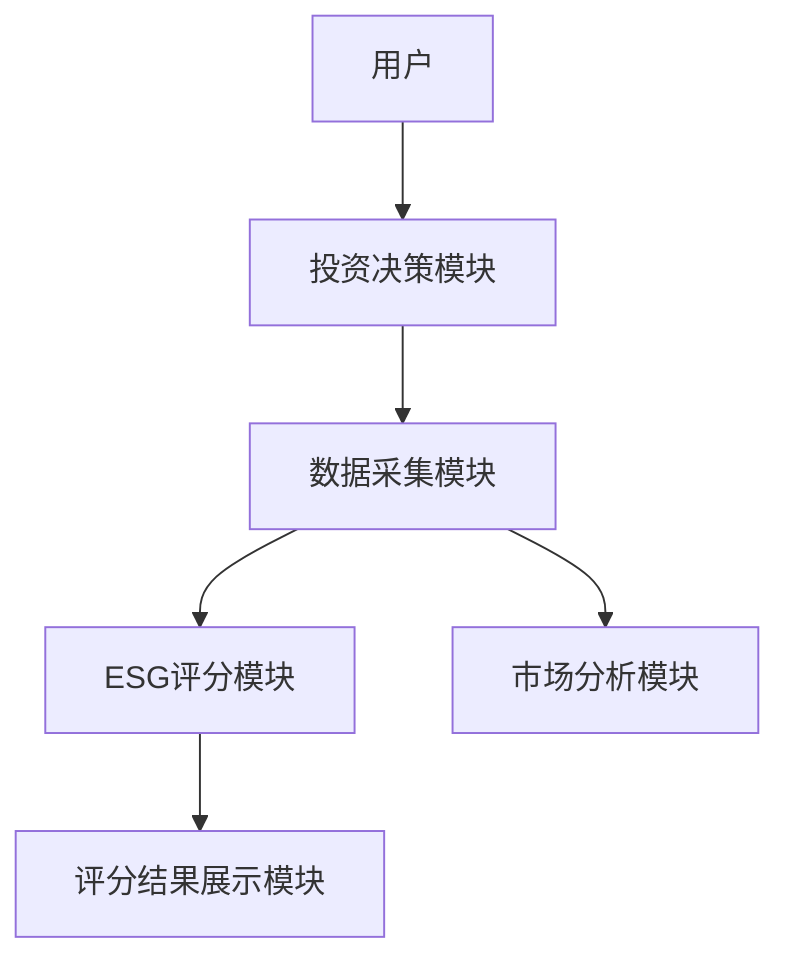

                 


# 《玛丽·巴芙的可持续发展投资策略》

> **关键词**：可持续发展投资、ESG、绿色金融、玛丽·巴芙、投资策略、数学模型  
> **摘要**：本文深入分析了可持续发展投资的核心理念与实践策略，重点探讨了玛丽·巴芙的投资方法，包括ESG评分体系、投资组合优化模型以及系统架构设计。通过具体案例分析，展示了如何将ESG因素融入投资决策，并提出了可持续发展投资的未来展望与最佳实践。

---

## 第1章: 可持续发展投资的背景与现状

### 1.1 可持续发展投资的背景

#### 1.1.1 全球经济与环境问题的加剧
随着全球经济的快速发展，环境问题日益严重，气候变化、资源枯竭和社会不平等等问题对企业和社会造成巨大压力。投资者开始关注企业的可持续性，而非仅仅追求短期收益。

#### 1.1.2 可持续发展投资的兴起
可持续发展投资（Sustainable Investment）是一种关注环境（Environmental）、社会（Social）和公司治理（Governance）因素的投资策略。玛丽·巴芙作为该领域的代表人物，提出了将ESG（Environmental, Social, Governance）因素融入投资决策的理念。

#### 1.1.3 玛丽·巴芙投资理念的核心思想
玛丽·巴芙认为，企业只有在实现环境友好、社会责任和良好治理的前提下，才能实现长期稳定发展。她的投资策略强调通过ESG评分筛选优质企业，规避风险较高的投资标的。

---

### 1.2 可持续发展投资的现状与趋势

#### 1.2.1 全球可持续投资市场的规模
近年来，全球可持续投资规模迅速增长，2023年全球ESG投资规模已超过30万亿美元。美国、欧洲和亚洲市场在ESG投资方面各有特点，但共同趋势是将ESG因素纳入投资决策的核心考量。

#### 1.2.2 美国、欧洲与亚洲市场的对比
- **美国市场**：以机构投资者为主导，注重企业治理和透明度。
- **欧洲市场**：政策支持力度大，尤其关注气候变化和环境问题。
- **亚洲市场**：增长潜力大，但ESG投资仍处于起步阶段。

#### 1.2.3 可持续发展投资的未来发展趋势
随着技术进步和政策支持，可持续发展投资将更加注重量化评估和数据驱动决策。未来，ESG投资将从“非财务因素”逐步向“核心财务指标”转变。

---

## 第2章: 可持续发展投资的核心概念

### 2.1 ESG投资框架

#### 2.1.1 ESG的定义与内涵
- **环境（Environmental）**：关注企业在资源使用、碳排放、污染等方面的管理。
- **社会（Social）**：关注企业在员工权益、社区参与、产品责任等方面的表现。
- **治理（Governance）**：关注企业董事会结构、高管薪酬、内部控制等治理因素。

#### 2.1.2 ESG评分标准与方法
- **数据来源**：企业年报、社会责任报告、第三方评级机构数据。
- **评分方法**：基于权重的加权评分法，权重根据行业特点动态调整。

#### 2.1.3 ESG投资的优缺点对比

| 优点                     | 缺点                     |
|--------------------------|--------------------------|
| 长期价值导向             | 数据不透明，难以量化     |
| 风险规避能力较强         | 成本较高                 |
| 符合社会可持续发展目标     | 市场流动性有限           |

---

### 2.2 绿色金融与可持续发展投资的关系

#### 2.2.1 绿色金融的定义与范围
绿色金融是指为支持环境改善、应对气候变化和资源节约高效利用的经济活动提供的金融服务。它包括绿色债券、绿色基金等。

#### 2.2.2 绿色金融与ESG投资的联系
绿色金融是ESG投资的重要组成部分，两者均强调环境因素，但在侧重点上有差异。绿色金融更偏向于资金的用途，而ESG投资更注重企业的整体表现。

#### 2.2.3 绿色金融的全球发展趋势
全球主要经济体纷纷推出绿色金融政策，例如欧盟的“绿色新政”和中国的“碳中和”目标。

---

## 第3章: 可持续发展投资的数学模型与分析

### 3.1 ESG评分的数学模型

#### 3.1.1 ESG评分的指标权重分配
假设企业有 $n$ 个ESG指标，权重分别为 $w_1, w_2, \dots, w_n$，其中 $\sum_{i=1}^{n} w_i = 1$。

$$
ESG\_score = \sum_{i=1}^{n} w_i \cdot score_i
$$

其中，$score_i$ 是第 $i$ 个指标的评分，取值范围为 $[0, 1]$。

#### 3.1.2 ESG评分计算的示例
假设某企业有三个指标，权重分别为 $0.4$, $0.3$, $0.3$，评分分别为 $0.8$, $0.6$, $0.7$。

$$
ESG\_score = 0.4 \times 0.8 + 0.3 \times 0.6 + 0.3 \times 0.7 = 0.32 + 0.18 + 0.21 = 0.71
$$

---

### 3.2 投资组合优化模型

#### 3.2.1 Markowitz有效前沿理论
Markowitz有效前沿理论是现代投资组合理论的核心，用于在给定风险下寻找收益最大的投资组合。

#### 3.2.2 可持续发展投资组合优化的数学公式

目标函数：
$$
Maximize \quad \mu - \lambda \cdot ESG\_score
$$

约束条件：
$$
\sum_{i=1}^{n} w_i = 1
$$
$$
w_i \geq 0, \quad \forall i
$$

其中，$\mu$ 是投资组合的预期收益，$\lambda$ 是惩罚系数，用于平衡收益与ESG评分之间的关系。

---

## 第4章: 可持续发展投资的系统架构与实现

### 4.1 投资决策支持系统的架构设计



---

### 4.2 系统功能设计

#### 4.2.1 数据采集与处理
- 数据来源：企业年报、社会责任报告、新闻媒体等。
- 数据清洗：去除缺失值、异常值，确保数据质量。

#### 4.2.2 ESG评分计算
- 输入：企业ESG相关数据。
- 输出：企业ESG评分。

#### 4.2.3 投资组合优化
- 输入：企业ESG评分、历史收益数据。
- 输出：最优投资组合配置建议。

---

## 第5章: 可持续发展投资的项目实战

### 5.1 项目背景与目标

#### 5.1.1 项目背景
以新能源行业为例，分析ESG评分对企业投资价值的影响。

#### 5.1.2 项目目标
构建一个基于ESG评分的新能源企业投资评分系统，筛选出具有可持续发展潜力的企业。

---

### 5.2 项目核心实现

#### 5.2.1 数据采集与清洗
使用Python的pandas库进行数据清洗：

```python
import pandas as pd

# 读取数据
data = pd.read_csv('esg_data.csv')

# 删除缺失值
data.dropna(inplace=True)

# 去除异常值
data = data[abs(data['carbon_emission'] - data['carbon_emission'].mean()) < 2 * data['carbon_emission'].std()]
```

---

#### 5.2.2 ESG评分计算
基于权重的评分计算：

```python
# 定义权重
weights = {'Environment': 0.4, 'Social': 0.3, 'Governance': 0.3}

# 计算ESG评分
esg_score = sum(weights[key] * data[key] for key in ['Environment', 'Social', 'Governance'])
```

---

## 第6章: 可持续发展投资的最佳实践与小结

### 6.1 最佳实践

#### 6.1.1 小结
可持续发展投资是一种兼顾经济效益与社会责任的投资方式。通过ESG评分和投资组合优化模型，投资者可以更好地平衡风险与收益。

#### 6.1.2 注意事项
- 数据来源要可靠。
- 模型要结合实际业务需求。
- 定期更新ESG评分，以反映企业最新表现。

#### 6.1.3 拓展阅读
- 阅读《ESG投资手册》深入理解ESG评分方法。
- 关注全球ESG投资动态，学习先进经验。

---

## 作者

**作者：AI天才研究院/AI Genius Institute & 禅与计算机程序设计艺术 /Zen And The Art of Computer Programming**

---

通过以上内容，我们系统地介绍了玛丽·巴芙的可持续发展投资策略，从理论到实践，从模型到系统，为投资者提供了全面的指导和参考。

