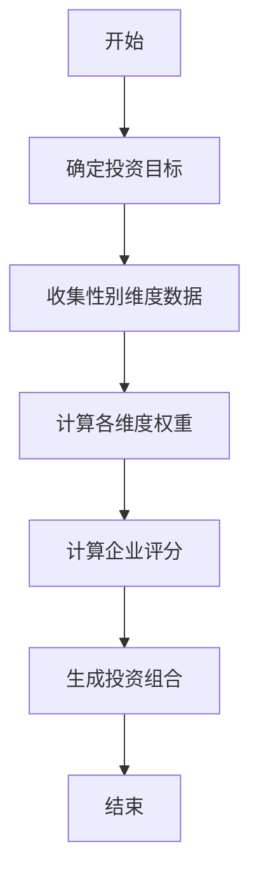

                 


# 《玛丽·巴芙的性别多元化投资策略》

## 关键词：性别多元化、投资策略、玛丽·巴芙、层次分析法、投资模型

## 摘要：本文系统地探讨了性别多元化在投资策略中的应用，通过分析玛丽·巴芙的性别多元化投资理念，结合层次分析法和数学模型，提出了一套基于性别维度的投资评估体系，旨在为投资者提供新的视角和方法。

---

# 第一部分：性别多元化投资的背景与核心概念

## 第1章：性别多元化投资的背景与定义

### 1.1 性别多元化投资的背景
#### 1.1.1 投资领域的性别失衡现状
- 传统投资领域中，男性主导的现象普遍。
- 女性在投资决策中的参与度低，但研究表明女性投资者的长期回报率较高。

#### 1.1.2 全球性别平等趋势与投资行业的关联
- 全球范围内性别平等意识的提升。
- 投资行业对性别多元化的需求增加。

#### 1.1.3 玛丽·巴芙的性别多元化投资理念
- 玛丽·巴芙作为性别多元化投资的倡导者，提出将性别因素纳入投资决策。

### 1.2 性别多元化投资的定义与核心要素
#### 1.2.1 性别多元化投资的定义
- 将性别因素作为投资决策的重要考量。

#### 1.2.2 投资策略中的性别维度
- 基于性别维度的企业评估模型。

#### 1.2.3 性别多元化投资的目标与边界
- 通过性别维度优化投资组合。

### 1.3 性别多元化投资的重要性
#### 1.3.1 促进性别平等的社会意义
- 推动社会性别平等。

#### 1.3.2 提高投资回报的潜在优势
- 女性领导企业的长期表现优于男性领导企业。

#### 1.3.3 企业的可持续发展与性别多元化
- 性别多元化是企业可持续发展的关键因素。

## 第2章：性别多元化投资的核心概念与联系

### 2.1 性别多元化投资的核心概念
#### 2.1.1 性别多元化投资的理论基础
- 基于性别平等的经济学理论。

#### 2.1.2 投资决策中的性别因素分析
- 性别因素对投资风险和收益的影响。

#### 2.1.3 性别多元化与企业绩效的关系
- 性别多元化与企业绩效呈正相关。

### 2.2 性别多元化投资的核心要素对比
#### 2.2.1 性别维度与传统投资维度的对比
- 传统投资维度：财务指标、市场地位。
- 性别维度：领导层性别、员工性别比例。

#### 2.2.2 性别多元化与行业选择的关联
- 不同行业性别多元化对投资回报的影响。

#### 2.2.3 性别多元化与风险评估的结合
- 性别因素对风险评估的影响。

### 2.3 性别多元化投资的ER实体关系图
```mermaid
erDiagram
    投资者 [ 性别, 投资目标, 风险偏好 ] --> 投资决策
    企业 [ 性别构, 财务状况, 市场地位 ] --> 投资评估
    投资决策 --> 投资组合
```

---

# 第二部分：性别多元化投资的算法与数学模型

## 第3章：性别多元化投资的评估模型

### 3.1 层次分析法（AHP）的应用
- AHP用于评估性别多元化投资的可行性。

### 3.2 性别维度的权重计算
- 使用AHP计算性别维度的权重。

### 3.3 投资组合的评估公式
- 总体评分公式：
$$ S = \sum_{i=1}^{n} w_i \cdot s_i $$
其中，$w_i$为第i个维度的权重，$s_i$为评分。

### 3.4 投资决策算法流程图


---

# 第三部分：性别多元化投资的系统分析与架构设计

## 第4章：性别多元化投资系统分析

### 4.1 问题场景介绍
- 系统设计背景与目标。

### 4.2 系统功能设计
- 前端功能：用户输入性别维度数据。
- 后端功能：计算企业评分。

### 4.3 系统架构设计


---

# 第四部分：性别多元化投资的项目实战

## 第5章：性别多元化投资项目的实施

### 5.1 环境安装
- 安装Python和相关库。

### 5.2 核心代码实现
```python
import numpy as np

# 定义层次分析法计算权重
def calculate_weights(matrix):
    # 计算权重向量
    eigenvalues, eigenvectors = np.linalg.eig(matrix.T @ matrix)
    weights = eigenvectors[:, 0] / np.sum(eigenvectors[:, 0])
    return weights

# 示例数据矩阵
matrix = np.array([
    [1, 3, 2],
    [2, 1, 4],
    [3, 2, 1]
])

weights = calculate_weights(matrix)
print(weights)
```

### 5.3 案例分析与结果解读
- 案例分析：假设一家公司的性别构成为50%女性，计算其投资评分。

---

# 第五部分：性别多元化投资的最佳实践

## 第6章：性别多元化投资的最佳实践

### 6.1 小结
- 本章总结了性别多元化投资的核心要点。

### 6.2 注意事项
- 数据收集的准确性，模型的适用性。

### 6.3 未来趋势
- 性别多元化投资的未来发展。

### 6.4 拓展阅读
- 推荐相关书籍和论文。

---

# 作者：AI天才研究院/AI Genius Institute & 禅与计算机程序设计艺术 /Zen And The Art of Computer Programming

