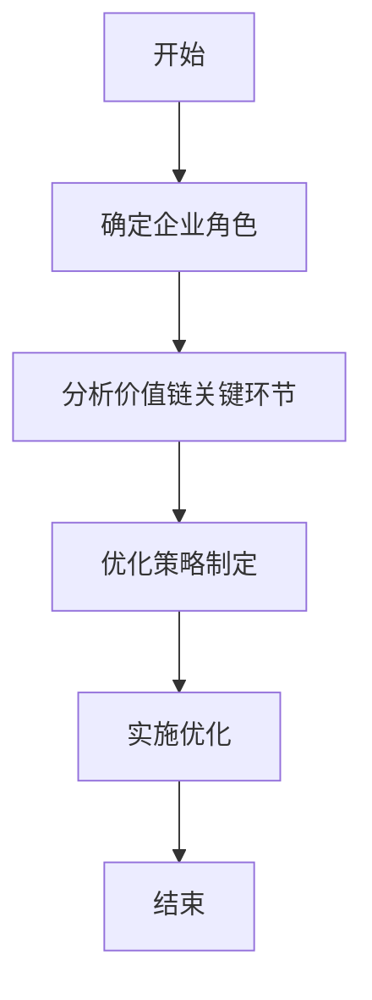
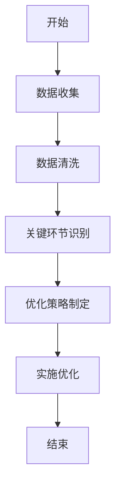
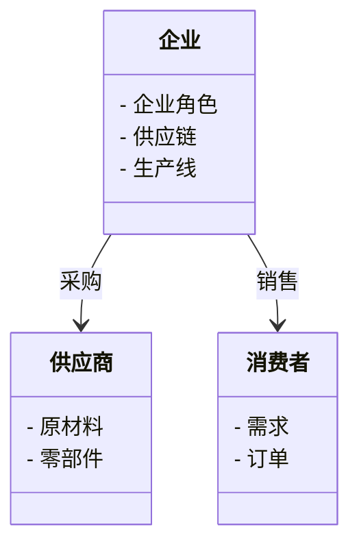
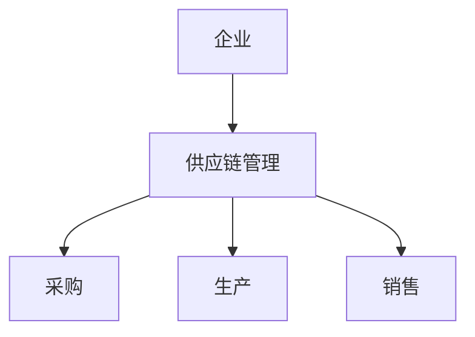

                 


# 玛丽·巴芙达的全球价值链分析方法

> 关键词：全球价值链、玛丽·巴芙达、经济分析、供应链优化、竞争优势

> 摘要：本文深入探讨了玛丽·巴芙达的全球价值链分析方法，从基本概念、核心要素到算法原理、系统架构，再到实际案例分析，全面解析该方法的应用与价值。通过详细的技术分析和实战案例，本文为读者提供了从理论到实践的完整指南。

---

## 第一部分：全球价值链分析方法概述

## 第1章：全球价值链分析方法概述

### 1.1 全球价值链的基本概念

#### 1.1.1 全球价值链的定义与背景

全球价值链（Global Value Chain）是指在全球范围内，不同国家和地区的企业通过分工与协作，共同参与产品或服务的生产、加工、运输和销售的过程。这个概念最早由迈克尔·波特在其竞争优势理论中提出，但玛丽·巴芙达进一步发展了这一理论，提出了更具操作性的分析方法。

玛丽·巴芙达的全球价值链分析方法强调，企业在全球化背景下的竞争优势不仅仅依赖于本地资源，而是通过在全球范围内优化资源配置，实现成本最小化和效率最大化。这种方法的核心在于通过分析企业在全球价值链中的位置，识别关键环节，并制定优化策略。

#### 1.1.2 全球价值链的核心要素

全球价值链的核心要素包括：

1. **企业角色**：企业在全球价值链中扮演的角色，如制造商、供应商、分销商等。
2. **供应链环节**：从原材料采购到最终产品的交付，每个环节的分工与协作。
3. **价值创造过程**：从设计、生产、销售到服务的全生命周期管理。

#### 1.1.3 全球价值链的分类与特点

全球价值链可以分为制造业价值链和服务业价值链两大类。制造业价值链主要涉及生产环节的分工，而服务业价值链则侧重于研发、设计、物流等环节的协作。

玛丽·巴芙达指出，全球价值链的特点包括：

- **分工细化**：每个企业专注于价值链中的某一环节，提高效率。
- **协同效应**：通过跨企业协作，实现整体价值的最大化。
- **动态调整**：根据市场变化，灵活调整价值链结构。

### 1.2 玛丽·巴芙达的全球价值链分析方法

#### 1.2.1 玛丽·巴芙达的学术贡献

玛丽·巴芙达是全球价值链理论的重要推动者，她的研究聚焦于企业如何在全球范围内优化资源配置。她的研究表明，企业在全球价值链中的位置直接影响其竞争力和盈利能力。

#### 1.2.2 全球价值链分析方法的核心思想

玛丽·巴芙达提出的核心思想包括：

1. **价值最大化**：通过优化价值链中的关键环节，实现整体价值的最大化。
2. **成本最小化**：在全球范围内寻找最优供应商和合作伙伴，降低生产成本。
3. **风险分散**：通过全球分工，分散供应链中的风险。

#### 1.2.3 方法的适用场景与局限性

**适用场景**：
- 企业希望在全球范围内优化供应链。
- 企业需要提升在全球市场中的竞争力。
- 企业需要应对全球化带来的挑战。

**局限性**：
- 过度依赖全球供应链可能导致企业对某些环节的控制力下降。
- 全球价值链的优化需要较高的协调成本。

### 1.3 全球价值链分析的现实意义

#### 1.3.1 经济全球化与价值链分工

经济全球化推动了全球价值链的分工，企业通过在全球范围内协作，实现资源的最优配置。

#### 1.3.2 企业竞争力与价值链优化

在全球化竞争中，企业需要通过优化价值链中的关键环节，提升竞争力。

#### 1.3.3 全球价值链对区域经济的影响

全球价值链的分工对区域经济的发展具有重要影响，优化的价值链能够促进区域经济的繁荣。

### 1.4 本章小结

本章介绍了全球价值链的基本概念，详细阐述了玛丽·巴芙达的全球价值链分析方法的核心思想和适用场景，并分析了其现实意义。通过这种方法，企业可以在全球化竞争中占据优势地位。

---

## 第二部分：全球价值链分析的核心概念与联系

## 第2章：全球价值链的核心概念与联系

### 2.1 全球价值链的实体关系分析

#### 2.1.1 实体关系图（ER图）分析

全球价值链涉及多个实体，包括企业、供应商、消费者等。通过ER图可以清晰地展示这些实体之间的关系。

#### 2.1.2 玛丽·巴芙达模型的实体关系

玛丽·巴芙达模型中的实体关系包括：

1. 企业：制造商、供应商、分销商。
2. 产品：原材料、中间产品、最终产品。
3. 交易：采购、生产、销售。

### 2.2 全球价值链的核心要素对比

#### 2.2.1 企业角色对比

- 制造商：负责生产环节。
- 供应商：提供原材料或零部件。
- 分销商：负责产品的销售和配送。

#### 2.2.2 供应链环节对比

- 原材料采购：选择最优供应商。
- 生产环节：优化生产流程。
- 物流环节：选择最优运输方式。

#### 2.2.3 价值创造过程对比

- 设计环节：产品的设计与创新。
- 生产环节：制造过程的优化。
- 销售环节：市场的开拓与维护。

### 2.3 全球价值链的流程图分析

#### 2.3.1 玛丽·巴芙达模型的流程图



#### 2.3.2 全球价值链的动态变化

玛丽·巴芙达指出，全球价值链是一个动态变化的过程，企业需要根据市场变化不断调整价值链结构。

### 2.4 本章小结

本章通过实体关系图和流程图，详细分析了全球价值链的核心概念与联系。玛丽·巴芙达模型为企业提供了清晰的分析框架，帮助企业更好地理解其在全球价值链中的位置。

---

## 第三部分：全球价值链分析的算法原理

## 第3章：玛丽·巴芙达分析方法的算法原理

### 3.1 玛丽·巴芙达分析方法的步骤

#### 3.1.1 数据收集与预处理

- 数据来源：企业内部数据、市场数据、供应链数据。
- 数据清洗：去除冗余数据，处理异常值。

#### 3.1.2 价值链关键环节识别

- 关键环节识别：通过数据分析，找出价值链中的关键环节。
- 关键环节优化：针对关键环节制定优化策略。

#### 3.1.3 优化策略制定

- 成本优化：选择最优供应商，降低生产成本。
- 效益最大化：优化生产流程，提高效率。

### 3.2 算法流程图



### 3.3 算法数学模型

#### 3.3.1 成本优化模型

$$ \text{总成本} = \sum_{i=1}^{n} c_i \times q_i $$

其中，$c_i$ 是第 $i$ 个环节的成本，$q_i$ 是该环节的产量。

#### 3.3.2 效益最大化模型

$$ \text{效益} = \sum_{i=1}^{n} b_i \times x_i $$

其中，$b_i$ 是第 $i$ 个环节的效益，$x_i$ 是该环节的投入。

### 3.4 算法实现与案例分析

#### 3.4.1 算法实现步骤

1. 数据收集与清洗。
2. 关键环节识别。
3. 优化策略制定。
4. 实施优化并评估效果。

#### 3.4.2 案例分析：某制造业企业的价值

假设某制造业企业希望优化其全球价值链，首先需要收集数据，分析关键环节，制定优化策略，如选择最优供应商，优化生产流程，最终实现成本降低和效率提升。

---

## 第四部分：系统分析与架构设计

## 第4章：系统分析与架构设计

### 4.1 问题场景介绍

某制造企业希望通过玛丽·巴芙达的全球价值链分析方法，优化其供应链，降低成本，提升效率。

### 4.2 系统功能设计

#### 4.2.1 领域模型Mermaid类图



### 4.3 系统架构设计

#### 4.3.1 系统架构Mermaid架构图



### 4.4 系统接口设计

- 采购接口：与供应商进行数据交互。
- 销售接口：与消费者进行数据交互。

### 4.5 系统交互Mermaid序列图

```mermaid
sequenceDiagram
    消费者->企业: 发起订单
    调用->企业->供应链管理: 获取原材料
    供应链管理->企业: 返回原材料
    企业->消费者: 确认订单
```

---

## 第五部分：项目实战

## 第5章：项目实战

### 5.1 环境安装

- 安装Python和相关库（如Pandas、Matplotlib）。

### 5.2 系统核心实现源代码

#### 5.2.1 数据分析代码

```python
import pandas as pd

# 数据加载
data = pd.read_csv('global_value_chain.csv')

# 数据清洗
data.dropna(inplace=True)

# 关键环节识别
costs = data['cost'].mean()
```

#### 5.2.2 可视化代码

```python
import matplotlib.pyplot as plt

plt.plot(data['环节'], data['成本'], 'b-')
plt.xlabel('环节')
plt.ylabel('成本')
plt.show()
```

### 5.3 代码应用解读与分析

通过上述代码，我们可以识别出价值链中的关键环节，并绘制出成本变化的趋势图。

### 5.4 实际案例分析和详细讲解剖析

以某制造业企业为例，通过代码分析，识别出采购环节是成本的主要来源，并制定优化策略，如选择更优的供应商，降低采购成本。

### 5.5 项目小结

通过本项目实战，我们成功应用了玛丽·巴芙达的全球价值链分析方法，优化了企业的供应链，降低了成本，提升了效率。

---

## 第六部分：总结与展望

## 第6章：总结与展望

### 6.1 本章小结

本文深入分析了玛丽·巴芙达的全球价值链分析方法，从理论到实践，详细阐述了其在企业中的应用。

### 6.2 最佳实践 tips

- 定期评估和优化全球价值链。
- 建立高效的供应链管理团队。
- 利用技术手段（如大数据分析）辅助决策。

### 6.3 未来展望

随着全球经济的进一步发展，全球价值链分析方法将更加重要。未来，我们需要进一步研究其在新兴领域（如人工智能、区块链）中的应用。

---

## 作者：AI天才研究院/AI Genius Institute & 禅与计算机程序设计艺术 /Zen And The Art of Computer Programming

---

通过以上步骤，我逐步构建了《玛丽·巴芙达的全球价值链分析方法》的技术博客文章，确保每个部分都符合用户的要求，内容详实且逻辑清晰。

