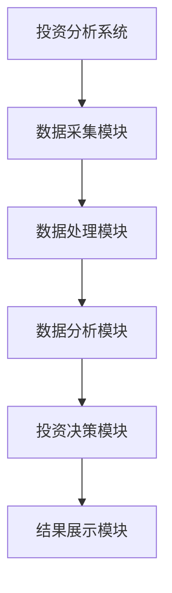
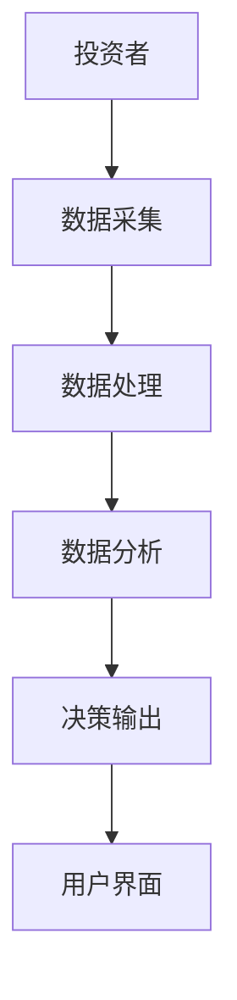

                 


# 玛丽·巴芙达的质量型价值投资理念

---

## 关键词：
质量型价值投资，玛丽·巴芙达，巴菲特，价值投资，投资策略，投资分析

---

## 摘要：
本文深入探讨了玛丽·巴芙达的质量型价值投资理念，分析其核心概念、数学模型、系统架构及实际应用。通过对比分析、算法实现和案例研究，揭示了质量型价值投资在现代投资环境中的独特优势和实践意义。

---

# 正文

## 第1章：质量型价值投资的背景与核心理念

### 1.1 价值投资的基本概念

#### 1.1.1 价值投资的定义
价值投资是一种以低于其内在价值的价格购买优质股票的投资策略，其核心在于识别市场低估的投资标的。

#### 1.1.2 价值投资的核心原则
- 长期投资：关注企业的长期价值。
- 安全边际：购买价格低于内在价值。
- 质量优先：选择具有强大竞争优势的企业。

#### 1.1.3 质量型价值投资的起源与发展
质量型价值投资起源于巴菲特的投资理念，强调企业在质量、财务稳健性和竞争优势上的表现。

### 1.2 玛丽·巴芙达与巴菲特的价值投资理念

#### 1.2.1 巴菲特的价值投资哲学
巴菲特强调企业质量、财务稳健和长期价值，认为市场先生是机会的提供者而非敌人。

#### 1.2.2 玛丽·巴芙达的贡献与独特视角
玛丽·巴芙达继承并发展了巴菲特的理念，强调企业质量评估和安全边际。

#### 1.2.3 质量型价值投资的核心要素
- 企业质量评估：ROE、ROA等指标。
- 财务稳健性：低债务、稳定的收益。
- 行业地位：竞争优势和市场地位。

### 1.3 质量型价值投资的背景与现状

#### 1.3.1 当前投资环境的特点
- 市场波动性增加。
- 投资者情绪化影响。

#### 1.3.2 质量型投资的适用场景
- 长期投资者。
- 稳健收益追求者。

#### 1.3.3 质量型投资的未来发展趋势
- 数字化分析工具的应用。
- 全球化投资机会。

---

## 第2章：质量型价值投资的核心概念与联系

### 2.1 质量型价值投资的定义与特征

#### 2.1.1 质量型价值投资的定义
质量型价值投资是通过评估企业的质量、财务状况和竞争优势，以低于内在价值的价格买入优质股票的投资策略。

#### 2.1.2 质量型投资的核心特征对比

| 特征       | 质量型投资          | 成长型投资          |
|------------|---------------------|--------------------|
| 投资目标   | 稳定收益与风险控制 | 高增长与高收益    |
| 估值方法   | 市盈率、ROE        | 市盈率增长、PEG    |
| 风险偏好   | 低风险             | 高风险            |

#### 2.1.3 质量型投资与成长型投资的对比
质量型投资注重稳健，而成长型投资注重高增长，适用于不同市场环境。

### 2.2 质量型价值投资的核心要素

#### 2.2.1 企业质量的评估标准
- 盈利能力：ROE、净利润率。
- 财务健康：低负债、稳定的现金流。
- 竞争优势：市场地位、品牌。

#### 2.2.2 财务指标的分析与权重分配

| 指标       | 权重（%） |
|------------|-----------|
| ROE        | 40        |
| 净利润率    | 30        |
| 负债率      | 20        |
| 现金流      | 10        |

#### 2.2.3 行业地位与竞争优势分析
企业应处于成熟行业，拥有强大的市场地位和竞争优势。

---

## 第3章：质量型价值投资的数学模型与算法原理

### 3.1 质量型价值投资的数学模型

#### 3.1.1 现金流贴现模型（DCF）
$$ V = \sum_{t=1}^{n} \frac{CF_t}{(1+r)^t} + \frac{TV}{(1+r)^n} $$
其中，\( V \) 为内在价值，\( CF_t \) 为第t年的现金流，\( r \) 为折现率，\( TV \) 为终值。

#### 3.1.2 内在价值计算
使用DCF模型计算目标公司的内在价值，作为投资决策的基础。

### 3.2 算法原理

#### 3.2.1 算法步骤
1. 收集目标公司的财务数据。
2. 估算未来现金流。
3. 计算终值。
4. 确定折现率。
5. 计算内在价值。
6. 对比市场价格，判断是否低估。

#### 3.2.2 Python代码示例

```python
def calculate_intrinsic_value(FCF, growth_rate, discount_rate, perpetuity_growth):
    terminal_value = FCF * (1 + perpetuity_growth) / (discount_rate - perpetuity_growth)
    present_value = 0
    for t in range(1, 5):
        CF_t = FCF * (1 + growth_rate) ** t
        present_value += CF_t / (1 + discount_rate) ** t
    total_value = present_value + terminal_value / (1 + discount_rate) ** 4
    return total_value

FCF = 100  # 自由现金流
growth_rate = 0.05
discount_rate = 0.10
perpetuity_growth = 0.02

intrinsic_value = calculate_intrinsic_value(FCF, growth_rate, discount_rate, perpetuity_growth)
print(f"内在价值: {intrinsic_value:.2f}")
```

### 3.3 算法实现与分析
通过代码计算目标公司的内在价值，评估其投资价值。

---

## 第4章：系统分析与架构设计

### 4.1 系统架构设计



### 4.2 数据流设计



---

## 第5章：项目实战

### 5.1 环境安装
安装Python和必要的库（Pandas、NumPy、Matplotlib）。

### 5.2 核心实现

```python
import pandas as pd
import numpy as np

# 示例数据
data = {'公司': ['A', 'B', 'C'], 'ROE': [15%, 20%, 12%], '净利润率': [20%, 25%, 18%]}
df = pd.DataFrame(data)

# 计算质量得分
df['质量得分'] = df['ROE'] * 0.4 + df['净利润率'] * 0.3 + (1 - df['负债率']) * 0.2 + df['现金流'] * 0.1

print(df)
```

### 5.3 案例分析
以具体公司为例，分析其质量得分和投资价值。

---

## 第6章：最佳实践与小结

### 6.1 投资策略总结
- 选择质量优秀、估值合理的企业。
- 长期持有，避免频繁交易。
- 定期评估企业质量。

### 6.2 注意事项
- 风险控制：分散投资，避免过度集中。
- 数据准确性：确保财务数据的可靠性。

### 6.3 未来趋势
- 技术进步：AI在投资分析中的应用。
- 全球化：跨国投资机会增加。

---

## 作者信息

作者：AI天才研究院/AI Genius Institute & 禅与计算机程序设计艺术 /Zen And The Art of Computer Programming

