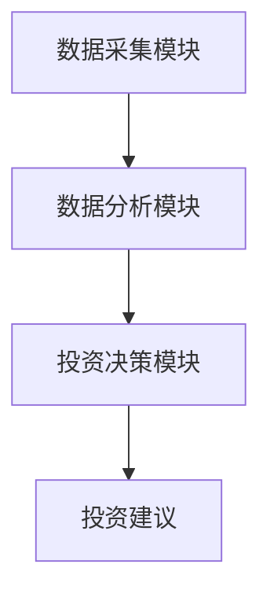
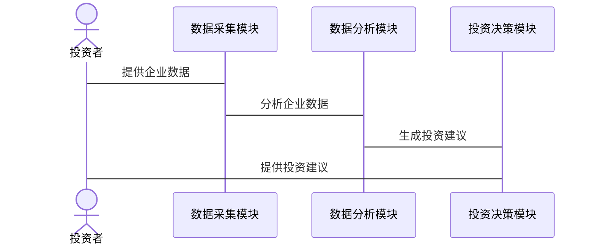

                 

# 玛丽·巴芙达的质量投资：寻找优质企业

---

## 关键词：
质量投资、优质企业、巴菲特、玛丽·巴芙达、投资策略、企业分析

---

## 摘要：
《玛丽·巴芙达的质量投资：寻找优质企业》一书深入探讨了质量投资的核心理念、方法和实际应用。通过对优质企业的筛选标准、财务指标分析、行业地位评估以及竞争优势的系统研究，结合实际案例和系统架构设计，全面阐述了如何通过质量投资实现长期稳健的投资回报。本文以技术博客的形式，采用逻辑清晰、结构紧凑的专业语言，引导读者逐步掌握质量投资的精髓。

---

## 目录：

1. [引言](#引言)
2. [质量投资的核心理念](#质量投资的核心理念)
3. [寻找优质企业的标准与方法](#寻找优质企业的标准与方法)
4. [系统分析与架构设计方案](#系统分析与架构设计方案)
5. [项目实战与案例分析](#项目实战与案例分析)

---

## 1. 引言

### 1.1 质量投资的背景与意义
质量投资是一种以企业质量为核心的投资策略，旨在通过选择具备持续竞争优势和稳健财务表现的企业，实现长期的投资回报。玛丽·巴芙达作为巴菲特的妹妹，继承并发展了巴菲特的价值投资理念，提出了质量投资的概念，强调企业质量是投资成功的关键。

### 1.2 玛丽·巴芙达的投资理念
玛丽·巴芙达认为，投资的本质是选择优质企业，而非单纯追求市场的短期波动。她主张通过深入分析企业的财务状况、行业地位和竞争优势，选择那些能够在长期持续增长的企业进行投资。

### 1.3 质量投资的核心思想
质量投资的核心思想在于，企业质量是投资成功的基石。通过筛选具备强大竞争优势、稳健财务表现和良好管理能力的企业，投资者能够在市场波动中保持稳健的收益。

---

## 2. 质量投资的核心理念

### 2.1 质量投资的定义与特点
质量投资是一种以企业质量为核心的投资策略，其特点包括：
- 长期导向：注重企业的长期增长潜力。
- 低风险：选择财务稳健、竞争优势明显的企业。
- 高收益：通过长期持有优质企业实现超额收益。

### 2.2 质量投资与价值投资的区别
- 价值投资：寻找被市场低估的企业，注重价格与价值的匹配。
- 质量投资：注重企业的质量和竞争力，而非单纯的价格。

### 2.3 质量投资的核心要素
质量投资的核心要素包括：
- 财务健康状况：企业的盈利能力、资产负债情况、现金流等。
- 行业地位：企业在行业中的竞争优势和市场占有率。
- 管理能力：企业高管的管理能力和战略决策能力。

---

## 3. 寻找优质企业的标准与方法

### 3.1 财务指标分析
#### 3.1.1 净利润与毛利率
净利润是企业盈利能力的核心指标，毛利率则反映了企业的成本控制能力。

#### 3.1.2 资产负债率与流动比率
资产负债率衡量企业的财务杠杆风险，流动比率反映企业的短期偿债能力。

#### 3.1.3 现金流分析
现金流是企业财务健康的重要指标，自由现金流是企业持续投资的核心来源。

### 3.2 行业地位分析
#### 3.2.1 市场占有率
市场占有率是衡量企业行业地位的重要指标，高市场占有率意味着更强的定价权和竞争优势。

#### 3.2.2 行业周期与发展趋势
行业周期和趋势决定了企业的未来发展潜力，选择处于上升周期的行业更具投资价值。

#### 3.2.3 产业链地位
企业在产业链中的位置决定了其议价能力和风险敞口，上游企业通常具有更强的成本控制能力。

### 3.3 竞争优势分析
#### 3.3.1 技术优势
技术优势是企业核心竞争力的重要来源，具备独特技术的企业更具市场竞争力。

#### 3.3.2 品牌影响力
强大的品牌影响力能够提升企业的市场地位和客户忠诚度。

#### 3.3.3 成本优势
成本优势是企业盈利能力的重要保障，具备成本优势的企业能够在价格竞争中占据优势。

---

## 4. 系统分析与架构设计方案

### 4.1 系统功能设计
- 数据采集模块：收集企业的财务数据、行业信息和市场数据。
- 数据分析模块：对企业的财务状况、行业地位和竞争优势进行综合评估。
- 投资决策模块：根据分析结果生成投资建议和投资组合。

### 4.2 系统架构设计

### 4.3 数据流设计

---

## 5. 项目实战与案例分析

### 5.1 案例分析：苹果公司
#### 5.1.1 财务状况
- 苹果公司具备强劲的盈利能力，毛利率和净利润率均处于行业领先水平。
- 公司现金流充裕，具备强大的自我造血能力。

#### 5.1.2 行业地位
- 苹果是全球最大的科技公司之一，市场占有率高，品牌影响力强。
- 在智能手机、计算机等领域的竞争优势明显。

#### 5.1.3 竞争优势
- 苹果具备强大的研发能力和技术创新能力，持续推出革命性产品。
- 公司具备高效的供应链管理和成本控制能力。

### 5.2 案例分析：微软公司
#### 5.2.1 财务状况
- 微软公司财务状况稳健，具备强大的现金流和盈利能力。
- 公司资产负债率低，财务风险小。

#### 5.2.2 行业地位
- 微软是全球领先的软件公司，市场占有率高，品牌影响力强。
- 在云计算、人工智能等领域的竞争优势明显。

#### 5.2.3 竞争优势
- 微软具备强大的技术实力和研发能力，持续推动技术创新。
- 公司具备优秀的管理团队和全球化布局。

---

## 结语

质量投资是一种以企业质量为核心的投资策略，通过选择具备强大竞争优势和稳健财务表现的企业，实现长期的投资回报。玛丽·巴芙达的质量投资理念为投资者提供了重要的指导，帮助他们在复杂的市场环境中找到优质企业，实现稳健的投资收益。

---

## 作者：AI天才研究院/AI Genius Institute & 禅与计算机程序设计艺术 /Zen And The Art of Computer Programming

