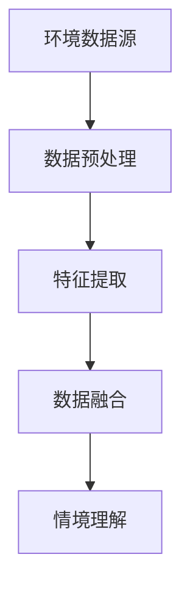
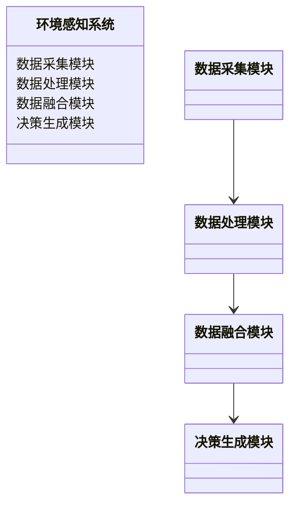

                 


# 环境感知AI Agent：增强LLM的实时情境适应性

> 关键词：环境感知、AI Agent、大语言模型、实时情境适应性、多模态数据

> 摘要：本文详细探讨了环境感知AI Agent的概念、技术原理及其在增强大语言模型（LLM）实时情境适应性中的应用。通过系统架构设计、算法实现和项目实战，展示了如何通过多模态数据处理和实时反馈机制，提升AI Agent在动态环境中的适应能力。

---

# 第一部分：环境感知AI Agent概述

## 第1章：环境感知AI Agent的基本概念

### 1.1 AI Agent的基本概念

AI Agent（人工智能代理）是指能够感知环境、做出决策并采取行动的智能实体。它可以自主执行任务，适应不同的环境条件。

- **定义**：AI Agent是一种能够通过感知环境信息、推理并采取行动以实现目标的智能系统。
- **分类**：基于智能水平，AI Agent可分为反应式和认知式两类。反应式Agent仅响应当前环境输入，而认知式Agent具备复杂推理和规划能力。

### 1.2 环境感知的核心含义

环境感知是指AI Agent通过传感器或数据源获取环境信息，并理解这些信息以做出适应性反应的过程。

- **数据来源**：环境感知数据可以来自视觉、听觉、触觉等多种传感器，以及结构化数据源。
- **处理流程**：数据采集 → 特征提取 → 数据融合 → 情境理解。

### 1.3 环境感知AI Agent与传统AI Agent的区别

| 特性               | 传统AI Agent                     | 环境感知AI Agent                 |
|--------------------|----------------------------------|----------------------------------|
| 感知能力           | 依赖预设规则和数据集            | 具备实时感知和动态调整能力        |
| 适应性             | 较低，适应新环境能力有限          | 高，能够实时调整策略              |
| 应用场景           | 适用于静态任务，如数据分析        | 适用于动态任务，如自动驾驶、机器人控制 |

---

## 第2章：LLM与环境感知的结合

### 2.1 LLM的基本原理

大语言模型（LLM）通过深度学习技术处理和生成自然语言文本，具备强大的语义理解和生成能力。

- **模型结构**：基于Transformer架构，通过自注意力机制捕捉文本中的长程依赖关系。
- **训练目标**：最小化预测词与实际词的交叉熵损失，学习语言的分布特性。

### 2.2 环境感知与LLM的结合方式

环境感知数据为LLM提供上下文信息，增强其生成结果的准确性。

- **数据增强**：将环境数据作为上下文输入，丰富模型的语义理解能力。
- **实时反馈**：通过环境反馈调整LLM的输出，实现动态适应。

### 2.3 LLM在环境感知中的应用

- **自然语言交互**：提升人机对话的自然性和适应性。
- **动态信息处理**：实时更新模型知识库，适应环境变化。

---

## 第3章：环境感知AI Agent的核心技术

### 3.1 多模态数据处理技术

多模态数据处理是环境感知的关键，涉及多种数据类型的融合。

- **数据流图**：展示从数据采集到融合的过程，如下图所示：



---

# 第二部分：环境感知AI Agent的核心概念与联系

## 第4章：环境感知技术的原理与实现

### 4.1 环境感知技术的原理

环境感知技术通过多传感器融合，构建环境模型，实现对环境的全面理解。

- **数据采集与处理**：传感器数据预处理，消除噪声，提取特征。
- **数据融合**：结合来自不同传感器的信息，提升感知准确性。

---

# 第三部分：算法原理

## 第5章：模型训练与推理

### 5.1 模型训练流程

模型训练是环境感知AI Agent的核心，涉及数据准备、模型构建和训练优化。

- **数据准备**：清洗、标注环境数据，构建训练集和验证集。
- **模型构建**：定义网络结构，选择优化器和损失函数。
- **训练优化**：通过反向传播优化模型参数，提升感知精度。

### 5.2 推理过程

模型推理是环境感知的最终目标，实现对实时环境数据的处理和响应。

- **输入处理**：接收实时环境数据，进行特征提取。
- **决策生成**：基于模型推理结果，生成适应性行动策略。

---

# 第四部分：系统架构设计

## 第6章：系统架构设计

### 6.1 系统功能设计

系统功能模块包括数据采集、处理、融合和决策生成。

- **功能模块图**：



---

## 第7章：项目实战

### 7.1 环境搭建

- **工具安装**：安装Python、深度学习框架（如TensorFlow、PyTorch）。
- **数据集准备**：收集多模态环境数据，构建训练集和验证集。

### 7.2 代码实现

以下是一个简单的环境感知模型实现代码示例：

```python
import numpy as np
import tensorflow as tf

# 数据预处理
def preprocess_data(data):
    # 假设data为多模态数据
    # 这里进行特征提取和标准化处理
    features = data['features']
    labels = data['labels']
    return features, labels

# 模型定义
model = tf.keras.Sequential([
    tf.keras.layers.Dense(64, activation='relu'),
    tf.keras.layers.Dense(1, activation='sigmoid')
])

# 编译模型
model.compile(optimizer='adam', loss='binary_crossentropy', metrics=['accuracy'])

# 训练模型
features, labels = preprocess_data(data)
model.fit(features, labels, epochs=10, batch_size=32)
```

### 7.3 案例分析

通过具体案例分析，展示环境感知AI Agent在实际场景中的应用效果。

### 7.4 项目总结

总结项目实施过程中的经验教训，提出改进建议。

---

# 第五部分：小结与展望

## 第8章：总结

- **核心内容回顾**：环境感知AI Agent的概念、技术原理及其应用。
- **技术优势**：提升LLM的实时适应性，增强AI Agent的环境适应能力。

## 第9章：未来展望

- **研究方向**：探索更高效的数据处理方法，提升模型的实时性和准确性。
- **应用扩展**：将环境感知AI Agent技术应用于更多领域，如智能交通、医疗健康等。

---

# 作者

作者：AI天才研究院 & 禅与计算机程序设计艺术

---

这篇文章系统地介绍了环境感知AI Agent的概念、技术原理及其应用，结合了理论分析和实际案例，为读者提供了全面的视角。通过详细的代码示例和图表展示，帮助读者更好地理解和实现相关技术。

