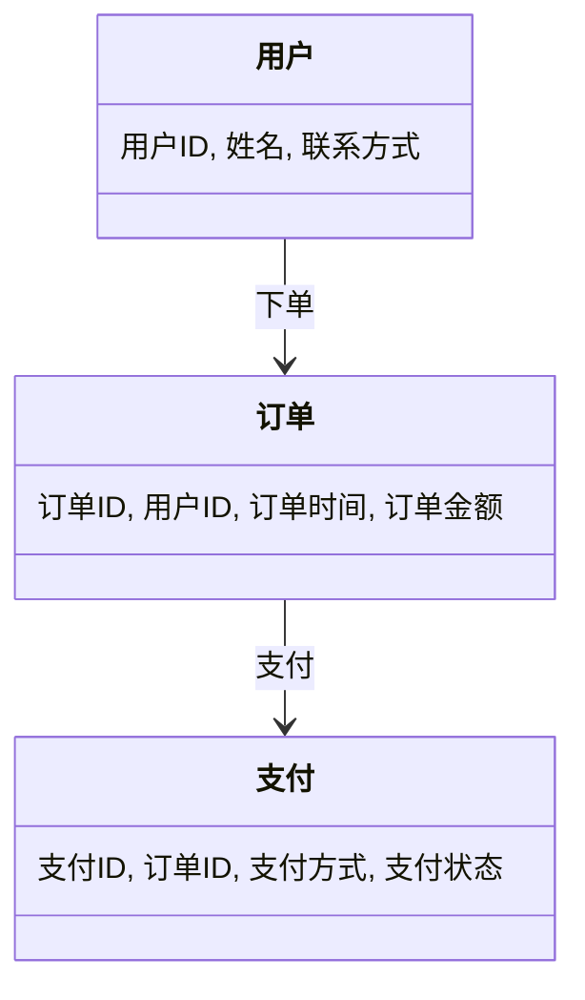
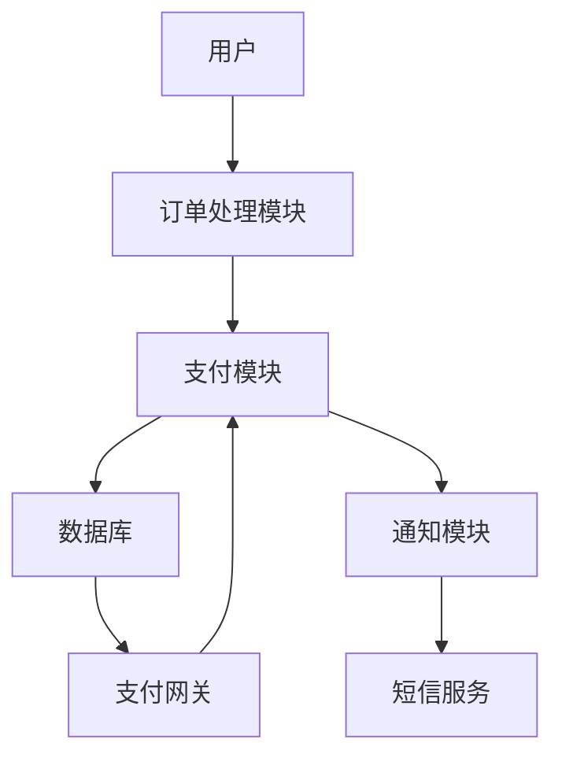
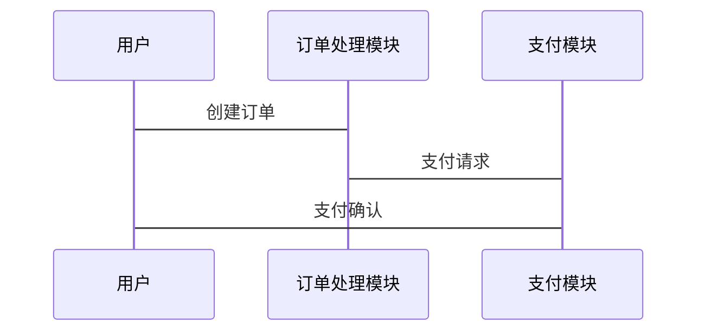

                 


# 理解业务模式：巴菲特选股的第一步

## 关键词：巴菲特选股、业务模式、企业价值、竞争优势、财务分析

## 摘要：  
巴菲特选股的第一步是理解业务模式，即企业如何创造价值和获取利润。本文将从基础概念出发，详细分析业务模式的核心要素，包括行业分析、竞争优势、财务指标等，并结合实际案例，展示如何通过业务模式评估企业价值。文章还将探讨业务模式的系统分析方法，帮助读者掌握巴菲特选股的精髓。

---

# 第一部分：理解业务模式的核心概念

## 第1章：业务模式的基本概念

### 1.1 业务模式的定义与构成要素

#### 1.1.1 业务模式的定义  
业务模式（Business Model）是企业如何创造价值、传递价值和获取价值的逻辑结构。它描述了企业如何通过产品或服务满足客户需求，并从中获得收入和利润。

#### 1.1.2 业务模式的构成要素  
以下是业务模式的核心构成要素：  

| 要素       | 描述                                                                 |
|------------|----------------------------------------------------------------------|
| 客户       | 企业的目标客户群体                                                   |
| 价值主张   | 企业为客户提供的核心价值                                           |
| 资源与能力 | 企业拥有的核心资源和能力                                             |
| 收入来源   | 企业的主要收入来源                                                 |
| 关键活动   | 企业实现价值的核心活动                                             |
| 关键资源   | 企业运营所需的关键资源                                             |
| 关键能力   | 企业的核心竞争优势                                                 |
| 关键伙伴   | 企业依赖的战略合作伙伴                                             |
| 成本结构   | 企业的成本构成                                                     |
| 收益流     | 企业的收入来源和金额                                               |

#### 1.1.3 业务模式的核心属性特征对比表格  
以下是不同业务模式的核心属性对比：  

| 特性       | 产品模式       | 服务模式       | 平台模式       |
|------------|----------------|----------------|----------------|
| 收入来源   | 产品销售       | 服务收费       | 平台佣金       |
| 成本结构   | 制造成本       | 服务成本       | 平台运营成本   |
| 价值主张   | 提供高质量产品   | 提供专业服务     | 提供连接平台     |
| 竞争优势   | 产品创新       | 服务质量       | 网络效应       |

---

### 1.2 业务模式与企业价值的关系

#### 1.2.1 业务模式对企业价值的影响  
业务模式决定了企业的收入来源、成本结构和竞争优势，进而影响企业的盈利能力和发展潜力。一个优秀的业务模式能够持续创造价值，为企业带来长期增长。

#### 1.2.2 业务模式与企业竞争优势的关系  
企业的竞争优势来源于其业务模式的独特性。例如，亚马逊通过其高效的物流体系和强大的技术平台，形成了强大的竞争优势。

#### 1.2.3 业务模式的边界与外延  
业务模式的边界在于企业的核心业务活动，而外延则包括与企业相关的生态系统和合作伙伴。

---

### 1.3 巴菲特选股的核心理念

#### 1.3.1 巴菲特投资哲学概述  
巴菲特的投资哲学强调长期价值，而非短期市场波动。他认为，投资的本质是寻找那些具有持续竞争优势的企业。

#### 1.3.2 巴菲特选股的三步曲  
1. **第一步**：理解企业的业务模式和竞争优势。  
2. **第二步**：评估企业的财务健康状况。  
3. **第三步**：判断企业的长期发展潜力。  

#### 1.3.3 业务模式在巴菲特选股中的重要性  
巴菲特认为，业务模式是企业价值的核心驱动力。一个清晰且可持续的业务模式能够确保企业在竞争中占据优势地位。

---

### 1.4 本章小结  
本章介绍了业务模式的基本概念、构成要素以及与企业价值的关系，并详细阐述了巴菲特选股的核心理念。理解业务模式是巴菲特选股的第一步，也是投资者分析企业价值的关键起点。

---

# 第二部分：业务模式的核心要素分析

## 第2章：行业分析与市场定位

### 2.1 行业分析的基本方法

#### 2.1.1 行业生命周期分析  
行业生命周期包括导入期、成长期、成熟期和衰退期。企业需要根据所处行业的生命周期阶段调整其业务模式。

#### 2.1.2 行业竞争结构分析  
根据迈克尔·波特的五力模型，行业竞争结构包括新进入者的威胁、现有竞争者之间的竞争程度、替代品的威胁、供应商的议价能力和买家的议价能力。

#### 2.1.3 行业趋势分析  
行业趋势分析包括技术进步、市场需求变化、政策法规变化等因素。

---

### 2.2 市场定位与竞争优势

#### 2.2.1 市场定位的核心要素  
市场定位包括目标客户的选择、价值主张的明确以及竞争对手的分析。

#### 2.2.2 竞争优势的来源  
竞争优势来源于企业的核心资源、技术能力、品牌影响力等因素。

#### 2.2.3 行业壁垒与护城河  
行业壁垒是指进入该行业的障碍，护城河是指企业竞争优势的持久性。

---

### 2.3 业务模式的行业适用性

#### 2.3.1 不同行业的业务模式特点  
不同行业的业务模式具有显著差异。例如，制造行业注重生产效率，而互联网行业注重用户粘性。

#### 2.3.2 业务模式与行业周期的关系  
业务模式需要根据行业周期调整。例如，在行业衰退期，企业需要寻找新的收入来源。

#### 2.3.3 业务模式的可扩展性分析  
业务模式的可扩展性决定了企业能否在更大范围内实现增长。

---

### 2.4 本章小结  
本章分析了行业分析与市场定位对业务模式的影响，强调了行业特点、竞争结构以及市场定位对企业业务模式的重要性。

---

# 第三部分：业务模式的数学模型与评估方法

## 第3章：业务模式的评估指标

### 3.1 业务模式的关键绩效指标（KPI）

#### 3.1.1 收入与利润指标  
- 营业收入增长率  
- 净利润率  

#### 3.1.2 成本与效率指标  
- 单位成本  
- 资产周转率  

#### 3.1.3 市场占有率与客户满意度  
- 市场占有率  
- 客户满意度评分  

---

### 3.2 业务模式的财务健康度分析

#### 3.2.1 资产负债表分析  
- 资产负债率  
- 流动比率  

#### 3.2.2 利润表分析  
- 营业收入增长率  
- 净利润  

#### 3.2.3 现金流量表分析  
- 经营活动现金流  
- 投资活动现金流  

---

### 3.3 业务模式的风险评估

#### 3.3.1 市场风险  
- 市场需求变化  
- 替代品威胁  

#### 3.3.2 运营风险  
- 供应链稳定性  
- 成本控制能力  

#### 3.3.3 财务风险  
- 债务负担  
- 利率变动影响  

---

### 3.4 本章小结  
本章通过KPI和财务指标，全面评估业务模式的健康状况和潜在风险。

---

# 第四部分：业务模式的系统分析与架构设计

## 第4章：业务模式的系统分析

### 4.1 业务模式的系统分析方法

#### 4.1.1 领域模型构建  
领域模型是对业务模式的抽象描述，包括核心实体及其关系。以下是领域模型的Mermaid图：



---

### 4.2 业务模式的系统架构图

以下是系统架构的Mermaid图：



---

### 4.3 业务模式的系统实现

#### 4.3.1 系统接口设计  
以下是系统接口的Mermaid序列图：



---

### 4.4 本章小结  
本章通过系统分析和架构设计，展示了业务模式在技术实现中的具体应用。

---

# 第五部分：业务模式的项目实战

## 第5章：业务模式分析的实战案例

### 5.1 项目背景与目标

#### 5.1.1 项目介绍  
以某电商平台为例，分析其业务模式。

#### 5.1.2 项目目标  
评估该电商平台的业务模式，判断其竞争优势和潜在风险。

---

### 5.2 系统实现

#### 5.2.1 环境安装  
需要安装以下工具：  
- Python 3.8+  
- Django 框架  
- MySQL 数据库  

#### 5.2.2 核心实现代码  
以下是电商平台的订单处理模块代码：

```python
from django.shortcuts import render, redirect
from django.urls import reverse
from .models import Order, Payment

def order_list(request):
    orders = Order.objects.all()
    return render(request, 'order_list.html', {'orders': orders})

def order_detail(request, order_id):
    order = Order.objects.get(id=order_id)
    return render(request, 'order_detail.html', {'order': order})

def order_confirm(request, order_id):
    order = Order.objects.get(id=order_id)
    # 处理支付请求
    payment = Payment.objects.create(order=order, status='pending')
    return redirect('payment_status', payment_id=payment.id)
```

---

### 5.3 实际案例分析

#### 5.3.1 案例分析  
以亚马逊为例，分析其业务模式。亚马逊通过Prime会员、云计算服务（AWS）和第三方卖家平台，形成了多维的收入来源。

#### 5.3.2 业务模式的优劣势分析  
- **优势**：强大的技术平台、全球物流网络、多元化的收入来源。  
- **劣势**：研发投入高、竞争激烈。

---

### 5.4 本章小结  
本章通过实战案例，展示了如何将业务模式分析应用于实际投资决策。

---

# 作者：AI天才研究院/AI Genius Institute & 禅与计算机程序设计艺术 /Zen And The Art of Computer Programming

