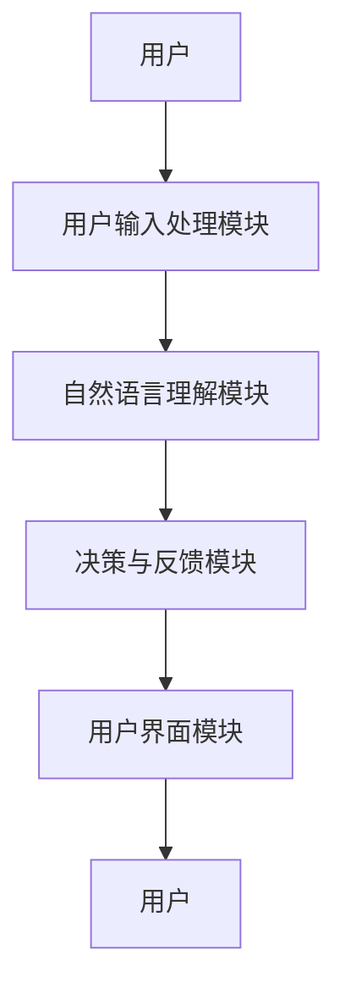

                 


# 用户体验研究：提升AI Agent的易用性

> 关键词：用户体验研究，AI Agent，易用性，交互设计，系统架构

> 摘要：本文将深入探讨用户体验研究在提升AI Agent易用性中的作用，通过系统化的分析和实践，提出优化AI Agent交互设计和架构设计的具体方法，帮助开发者更好地设计出符合用户需求的AI Agent系统。

---

## 第一部分：用户体验研究基础

### 第1章：用户体验研究概述

#### 1.1 用户体验的核心概念

##### 1.1.1 用户体验的定义与背景
用户体验（User Experience, UX）是指用户在与产品或服务交互过程中所感受到的情感、态度和体验。AI Agent作为一种智能交互系统，其用户体验直接关系到用户满意度和产品的市场竞争力。随着人工智能技术的快速发展，AI Agent已广泛应用于客服、教育、医疗等领域，其易用性成为用户接受和使用的重要决定因素。

##### 1.1.2 用户体验研究的重要性
用户体验研究是通过用户调研、数据分析和交互设计等方法，优化产品或服务的使用流程，提升用户满意度和使用效率。对于AI Agent而言，用户体验研究不仅关乎功能实现，还包括用户情感体验和交互效率的优化。

##### 1.1.3 用户体验的构成要素
用户体验包括功能、界面、交互、情感等多个维度。在AI Agent的设计中，功能完整性、界面友好性、交互流畅性和情感共鸣性是提升用户体验的核心要素。

#### 1.2 AI Agent的基本概念

##### 1.2.1 AI Agent的定义与分类
AI Agent是一种能够理解用户需求、执行任务并提供反馈的智能系统。根据功能和应用场景的不同，AI Agent可以分为任务型、服务型和娱乐型三类。

##### 1.2.2 AI Agent的核心功能
AI Agent的核心功能包括用户意图识别、信息处理、任务执行和反馈交互。这些功能共同构成了AI Agent与用户交互的基础框架。

##### 1.2.3 AI Agent与传统软件的区别
与传统软件相比，AI Agent具有更强的自主性、适应性和学习能力。它能够通过机器学习算法不断优化自身的交互策略和功能实现。

---

### 第2章：用户体验研究的方法论

#### 2.1 用户调研方法

##### 2.1.1 用户访谈与问卷设计
用户访谈是了解用户需求和痛点的重要方法。通过设计针对性的访谈提纲，可以获取用户对AI Agent的使用习惯和期望。问卷设计则需要结合目标用户的特征，设计科学有效的调查表。

##### 2.1.2 用户观察与行为分析
通过观察用户的实际操作行为，可以发现用户在使用AI Agent过程中遇到的问题和障碍。行为分析可以帮助设计者更好地理解用户需求和痛点。

##### 2.1.3 用户画像的构建
用户画像是基于用户调研数据构建的用户典型特征模型。通过用户画像，可以更精准地设计AI Agent的功能和交互流程。

#### 2.2 用户体验指标体系

##### 2.2.1 易用性指标
易用性指标包括用户完成任务的时间、错误率、任务成功率等。这些指标可以帮助评估AI Agent的交互设计是否符合用户习惯。

##### 2.2.2 效率与效果指标
效率指标包括用户操作的响应时间、系统资源消耗等；效果指标包括用户满意度、任务完成度等。这些指标共同构成了评估AI Agent性能的重要维度。

##### 2.2.3 用户满意度模型
用户满意度模型是通过数学公式量化用户对AI Agent的满意度。模型通常包括功能实现、交互体验、系统性能等多个维度的权重。

---

### 第3章：AI Agent的交互设计

#### 3.1 自然语言处理与用户交互

##### 3.1.1 NLP在AI Agent中的应用
自然语言处理（NLP）是AI Agent实现用户意图识别的核心技术。通过NLP算法，AI Agent可以理解用户的输入内容并生成相应的反馈。

##### 3.1.2 对话系统的实现原理
对话系统的实现依赖于意图识别、实体识别和生成式语言模型。通过深度学习算法，AI Agent可以实现与用户的自然对话交互。

##### 3.1.3 用户意图识别与反馈机制
用户意图识别是通过分析用户的输入内容，判断用户的意图并生成相应的反馈。反馈机制需要考虑用户的上下文和情感状态，确保交互的流畅性和用户满意度。

#### 3.2 用户界面设计

##### 3.2.1 UI设计的原则与规范
UI设计需要遵循一致性、简洁性和可用性原则。通过合理的界面布局和操作流程设计，可以提升用户的使用体验。

##### 3.2.2 AI Agent的可视化交互
可视化交互是通过图形界面直观展示AI Agent的运行状态和操作结果。可视化设计需要结合用户需求和操作习惯，确保界面的友好性和易用性。

##### 3.2.3 响应时间与用户感知
响应时间是影响用户体验的重要因素。通过优化系统性能和网络传输效率，可以缩短AI Agent的响应时间，提升用户的使用体验。

---

### 第4章：用户体验研究的数学模型

#### 4.1 用户满意度模型

##### 4.1.1 模型的构建与应用
用户满意度模型可以通过线性回归等统计方法构建。模型需要结合用户调研数据，选择合适的自变量和因变量，建立数学关系式。

##### 4.1.2 模型的参数解释
模型的参数需要根据实际数据进行解释。例如，用户对AI Agent的响应时间越短，用户满意度越高，这可以通过模型的系数和显著性检验进行验证。

##### 4.1.3 案例分析
通过实际案例分析，可以验证模型的有效性和适用性。例如，可以分析不同用户的使用习惯和满意度之间的关系，优化AI Agent的设计。

#### 4.2 交互效率的计算公式

##### 4.2.1 交互时间的计算
交互时间可以通过记录用户完成任务的时间进行计算。公式为：
$$交互时间 = \sum_{i=1}^{n} t_i$$
其中，$t_i$是用户完成每个任务的时间。

##### 4.2.2 交互复杂度的度量
交互复杂度可以通过任务完成的步骤数和用户错误率进行度量。公式为：
$$交互复杂度 = \frac{\text{错误率}}{\text{任务完成率}}$$

##### 4.2.3 优化策略
通过优化交互流程和系统性能，可以降低交互复杂度，提升用户的使用效率和满意度。

---

### 第5章：AI Agent的系统架构设计

#### 5.1 系统功能模块划分

##### 5.1.1 用户输入处理模块
用户输入处理模块负责接收用户的输入内容，并将其传递给自然语言理解模块。

##### 5.1.2 自然语言理解模块
自然语言理解模块通过NLP算法解析用户的意图，并生成相应的处理指令。

##### 5.1.3 决策与反馈模块
决策与反馈模块根据用户的意图和系统状态，生成反馈信息并传递给用户界面模块。

#### 5.2 系统架构图

##### 5.2.1 系统架构的Mermaid图


##### 5.2.2 模块之间的关系说明
用户通过用户界面模块与AI Agent交互，输入内容经过用户输入处理模块传递给自然语言理解模块，解析用户的意图后传递给决策与反馈模块，生成反馈信息并通过用户界面模块传递给用户。

##### 5.2.3 系统扩展性分析
系统架构设计需要考虑扩展性，例如增加新的功能模块或优化现有模块的性能。通过模块化设计，可以提升系统的可维护性和扩展性。

---

### 第6章：项目实战与案例分析

#### 6.1 项目环境搭建

##### 6.1.1 开发工具安装
需要安装Python、TensorFlow、Keras等开发工具和框架。

##### 6.1.2 数据集准备
需要准备用户输入数据和标注数据，用于训练自然语言理解模型。

##### 6.1.3 环境配置与测试
配置开发环境并进行初步测试，确保系统能够正常运行。

#### 6.2 核心代码实现

##### 6.2.1 用户输入处理代码
```python
def process_user_input(user_input):
    # 处理用户输入
    return processed_input
```

##### 6.2.2 自然语言理解算法
```python
class NLUModel:
    def __init__(self):
        # 初始化模型
        pass
    
    def predict_intent(self, input_text):
        # 预测意图
        return intent
```

##### 6.2.3 系统交互逻辑实现
```python
def handle_interaction():
    while True:
        user_input = get_user_input()
        processed_input = process_user_input(user_input)
        intent = nlu_model.predict_intent(processed_input)
        generate_response(intent)
```

#### 6.3 案例分析与优化

##### 6.3.1 案例背景与需求分析
通过实际案例分析，可以发现用户在使用AI Agent过程中存在的问题和痛点，例如响应时间过长、意图识别错误率高等。

##### 6.3.2 优化策略
根据分析结果，提出优化策略，例如优化NLP算法、提升系统性能等。

##### 6.3.3 项目小结
通过项目实战，可以验证理论的有效性和可行性，同时积累实际经验，为后续优化提供参考。

---

## 第七章：最佳实践与总结

### 7.1 最佳实践 Tips

#### 7.1.1 用户调研的重要性
通过深入的用户调研，可以更好地理解用户需求和痛点，为AI Agent的设计提供科学依据。

#### 7.1.2 交互设计的核心性
交互设计是提升AI Agent易用性的关键环节，需要结合用户体验研究和系统架构设计，优化交互流程和用户界面。

#### 7.1.3 系统优化的持续性
系统优化是一个持续的过程，需要根据用户反馈和系统运行数据，不断优化系统性能和用户体验。

### 7.2 小结

通过本文的系统分析和实践，可以得出结论：用户体验研究是提升AI Agent易用性的核心方法。通过深入理解用户需求，优化交互设计和系统架构，可以显著提升AI Agent的使用效率和用户满意度。

### 7.3 注意事项

#### 7.3.1 数据隐私保护
在用户调研和数据采集过程中，需要注意数据隐私保护，遵守相关法律法规。

#### 7.3.2 系统稳定性保障
AI Agent的稳定性是用户体验的重要保障，需要通过冗余设计和容错机制，确保系统的稳定运行。

#### 7.3.3 用户反馈的及时性
及时收集和处理用户反馈，是优化AI Agent设计的重要手段，需要建立完善的反馈机制和处理流程。

### 7.4 拓展阅读

#### 7.4.1 用户体验研究的前沿技术
建议读者进一步阅读用户体验研究的前沿技术，例如情感计算、增强现实等，了解AI Agent设计的最新动态。

#### 7.4.2 AI Agent的行业应用
建议读者关注AI Agent在不同行业的应用，例如智能客服、智能教育等，了解不同场景下的设计需求和优化策略。

---

## 作者：AI天才研究院/AI Genius Institute & 禅与计算机程序设计艺术 /Zen And The Art of Computer Programming

---

本文通过系统化的分析和实践，深入探讨了用户体验研究在提升AI Agent易用性中的作用，提出了优化AI Agent交互设计和架构设计的具体方法。希望本文能够为开发者和研究人员提供有价值的参考和启示。

