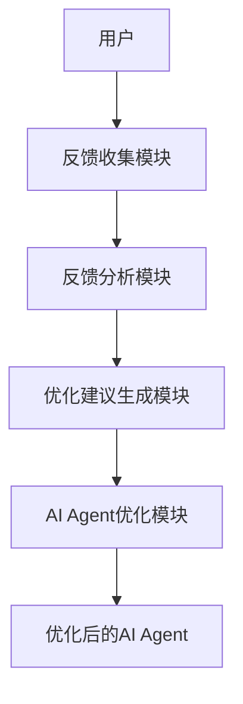
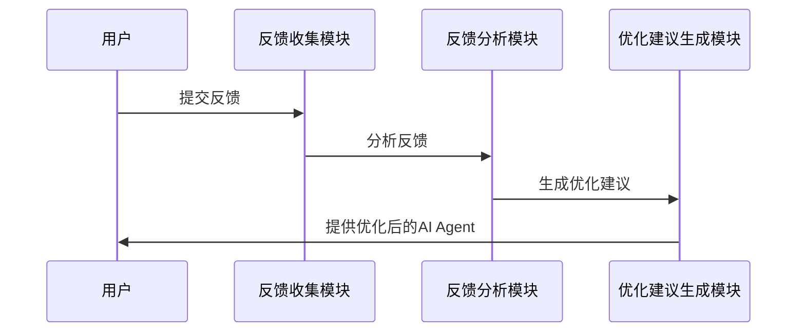

                 


# 用户反馈分析：从用户视角优化AI Agent

> 关键词：用户反馈分析、AI Agent优化、用户视角、自然语言处理、情感分析、需求提取、系统架构设计

> 摘要：本文从用户视角出发，详细探讨了如何通过用户反馈分析来优化AI Agent。文章首先介绍了用户反馈分析的背景与重要性，然后深入分析了用户反馈的特征与分类，接着讨论了从用户反馈中提取需求的方法，随后详细讲解了用户反馈分析的算法与模型，最后结合实际案例展示了如何将用户反馈应用于AI Agent的优化。本文旨在为AI Agent的优化提供理论支持与实践指导。

---

## 第1章: 用户反馈分析的背景与重要性

### 1.1 用户反馈分析的定义与作用
#### 1.1.1 用户反馈的定义
用户反馈是指用户在使用AI Agent过程中提供的各种意见、建议、评价和问题报告。这些反馈可以是显性的（如评分、评论）或隐性的（如使用行为数据）。

#### 1.1.2 用户反馈在AI Agent优化中的作用
用户反馈是AI Agent改进的核心依据，能够帮助开发者发现系统缺陷、优化用户体验、提升系统性能。

#### 1.1.3 用户反馈分析的背景与现状
随着AI Agent在各领域的广泛应用，用户反馈分析的重要性日益凸显。然而，如何高效地收集、处理和利用用户反馈仍是一个挑战。

### 1.2 AI Agent的发展与挑战
#### 1.2.1 AI Agent的定义与特点
AI Agent是一种能够自主感知环境、执行任务并做出决策的智能体。它具有自主性、反应性、目标导向性和社会性等特征。

#### 1.2.2 当前AI Agent的主要应用场景
AI Agent广泛应用于智能客服、智能家居、自动驾驶、金融投资等领域。

#### 1.2.3 AI Agent在实际应用中的挑战
AI Agent面临的主要挑战包括理解用户需求的不确定性、处理复杂场景的能力不足以及用户信任的建立。

### 1.3 用户视角优化AI Agent的核心价值
#### 1.3.1 用户视角在AI Agent优化中的重要性
从用户视角出发，能够更准确地理解用户需求，提升用户体验，从而提高AI Agent的满意度和使用效率。

#### 1.3.2 用户反馈在AI Agent改进中的具体应用
用户反馈可以用于优化对话系统、改进知识库、提升个性化推荐能力等。

#### 1.3.3 用户反馈分析的边界与外延
用户反馈分析的边界包括数据收集范围、反馈处理的深度，外延则涉及用户行为分析、情感计算等。

### 1.4 本章小结
#### 1.4.1 核心概念总结
用户反馈是优化AI Agent的重要依据，AI Agent的发展离不开用户视角的优化。

#### 1.4.2 下文展开提示
接下来将详细分析用户反馈的特征与分类，以及如何从用户反馈中提取需求。

---

## 第2章: 用户反馈的特征与分类

### 2.1 用户反馈的主要特征
#### 2.1.1 用户反馈的主观性
用户反馈往往是主观的，受到用户个人偏好和情感影响。

#### 2.1.2 用户反馈的情感倾向
用户反馈通常带有情感色彩，可以通过情感分析技术进行分类。

#### 2.1.3 用户反馈的具体场景
用户反馈往往与特定场景相关，需要结合上下文进行分析。

### 2.2 用户反馈的分类与对比
#### 2.2.1 正向反馈与负向反馈
正向反馈表示用户满意，负向反馈表示用户不满。

#### 2.2.2 显性反馈与隐性反馈
显性反馈是用户主动提供的评价，隐性反馈是通过用户行为间接反映的。

#### 2.2.3 结构化反馈与非结构化反馈
结构化反馈是标准化的数据，非结构化反馈是自由文本或语音。

### 2.3 用户反馈的预处理方法
#### 2.3.1 数据清洗与标准化
去除噪声数据，统一数据格式。

#### 2.3.2 反馈分类与标签化
将反馈分类为不同的类别，并打上标签。

#### 2.3.3 反馈数据的特征提取
提取文本、情感、场景等特征。

### 2.4 本章小结
#### 2.4.1 核心概念总结
用户反馈具有主观性、情感倾向和场景依赖性，可以通过分类和预处理进行分析。

#### 2.4.2 下文展开提示
接下来将探讨如何从用户反馈中提取需求。

---

## 第3章: 用户需求的提取与分析

### 3.1 用户反馈中的需求识别
#### 3.1.1 需求识别的基本方法
通过关键词提取、主题建模等方法识别用户需求。

#### 3.1.2 基于NLP的需求识别技术
使用自然语言处理技术（如BERT）进行需求识别。

#### 3.1.3 需求识别的挑战与解决方案
包括歧义性问题、数据稀疏性等挑战。

### 3.2 用户反馈的情感分析
#### 3.2.1 情感分析的基本原理
通过分析文本的情感倾向判断用户满意度。

#### 3.2.2 基于深度学习的情感分析模型
如LSTM、Transformer等模型。

#### 3.2.3 情感分析在用户反馈中的应用
用于分类用户反馈的情感极性。

### 3.3 用户反馈的优先级排序
#### 3.3.1 反馈优先级的评估标准
如影响范围、用户数量、反馈强度等。

#### 3.3.2 基于权重的反馈排序方法
通过加权评分确定反馈的优先级。

#### 3.3.3 反馈优先级的动态调整
根据实时数据动态更新反馈优先级。

### 3.4 本章小结
#### 3.4.1 核心概念总结
用户需求提取需要结合NLP技术，情感分析是重要的反馈处理方法。

#### 3.4.2 下文展开提示
接下来将探讨用户反馈分析的算法与模型。

---

## 第4章: 用户反馈分析的算法与模型

### 4.1 情感分析算法
#### 4.1.1 情感分析的基本流程
文本预处理、特征提取、模型训练、结果输出。

#### 4.1.2 基于深度学习的情感分析模型
如BERT、GPT等。

#### 4.1.3 情感分析的数学模型
使用逻辑回归、SVM等模型进行情感分类。

### 4.2 主题建模
#### 4.2.1 主题建模的基本原理
通过主题建模技术（如LDA）提取用户反馈的主题。

#### 4.2.2 主题建模的应用场景
用于分类用户反馈的主题。

#### 4.2.3 主题建模的实现步骤
数据预处理、模型训练、主题提取。

### 4.3 本章小结
#### 4.4.1 核心概念总结
情感分析和主题建模是用户反馈分析的重要算法。

#### 4.4.2 下文展开提示
接下来将探讨如何将用户反馈应用于AI Agent的优化。

---

## 第5章: 用户反馈在AI Agent优化中的应用

### 5.1 对话优化
#### 5.1.1 对话优化的目标
提升对话系统的准确性和流畅性。

#### 5.1.2 对话优化的方法
基于反馈调整对话策略。

### 5.2 知识库增强
#### 5.2.1 知识库增强的必要性
通过反馈补充或修正知识库内容。

#### 5.2.2 知识库增强的方法
基于反馈进行知识推理和更新。

### 5.3 个性化推荐
#### 5.3.1 个性化推荐的目标
提升推荐的精准度和用户满意度。

#### 5.3.2 个性化推荐的方法
基于反馈调整推荐策略。

### 5.4 本章小结
#### 5.4.1 核心概念总结
用户反馈可以用于优化AI Agent的对话能力、知识库和推荐系统。

#### 5.4.2 下文展开提示
接下来将探讨系统架构设计。

---

## 第6章: 系统架构设计

### 6.1 系统设计
#### 6.1.1 系统目标
实现用户反馈分析与AI Agent优化的闭环。

#### 6.1.2 系统功能设计
包括反馈收集、分析、优化建议生成等模块。

### 6.2 系统架构图


### 6.3 接口设计
#### 6.3.1 API接口定义
如HTTP接口、WebSocket接口。

#### 6.3.2 接口实现
基于RESTful API的设计。

### 6.4 交互流程
#### 6.4.1 交互序列图


### 6.5 本章小结
#### 6.5.1 核心概念总结
系统架构设计是实现用户反馈分析与AI Agent优化的关键。

#### 6.5.2 下文展开提示
接下来将通过实际案例展示用户反馈分析的应用。

---

## 第7章: 项目实战

### 7.1 项目介绍
#### 7.1.1 项目目标
优化一个智能客服AI Agent。

#### 7.1.2 项目背景
分析用户对智能客服的反馈，提升用户体验。

### 7.2 系统实现
#### 7.2.1 环境安装
安装Python、TensorFlow、NLTK等工具。

#### 7.2.2 核心代码实现
```python
import numpy as np
from sklearn.feature_extraction.text import TfidfVectorizer
from sklearn.linear_model import LogisticRegression

# 示例代码：基于TF-IDF的文本分类
vectorizer = TfidfVectorizer()
X = vectorizer.fit_transform(feedbacks)
model = LogisticRegression()
model.fit(X, labels)
```

### 7.3 案例分析
#### 7.3.1 数据收集
收集用户对智能客服的反馈数据。

#### 7.3.2 数据分析
分析反馈数据，提取主要问题和改进方向。

#### 7.3.3 系统优化
根据反馈优化AI Agent的对话策略和知识库。

### 7.4 本章小结
#### 7.4.1 核心概念总结
通过项目实战可以验证用户反馈分析的有效性。

#### 7.4.2 下文展开提示
最后将总结全文并展望未来的研究方向。

---

## 第8章: 总结与展望

### 8.1 全文总结
#### 8.1.1 核心观点总结
用户反馈分析是优化AI Agent的重要手段。

#### 8.1.2 重要方法总结
包括用户反馈的分类、需求提取、算法模型的应用等。

### 8.2 未来展望
#### 8.2.1 研究方向
如多模态反馈分析、实时反馈处理等。

#### 8.2.2 技术发展趋势
结合AI、大数据和云计算等技术。

### 8.3 本章小结
#### 8.3.1 核心观点重申
用户反馈分析在AI Agent优化中的重要性。

#### 8.3.2 未来研究建议
建议关注多模态反馈分析和实时优化技术。

---

## 附录

### 附录A: 数据集
#### 附录A.1 数据集介绍
如IMDB情感分析数据集。

#### 附录A.2 数据集获取方式
通过公开数据集平台下载。

### 附录B: 工具与库
#### 附录B.1 常用工具
如NLTK、spaCy、TensorFlow等。

#### 附录B.2 工具安装与使用
提供安装命令和使用示例。

### 附录C: 参考文献
#### 附录C.1 中文参考文献
列出相关中文文献。

#### 附录C.2 英文参考文献
列出相关英文文献。

---

## 作者：AI天才研究院/AI Genius Institute & 禅与计算机程序设计艺术 /Zen And The Art of Computer Programming

---

以上是文章的完整目录大纲和部分章节内容示例，您可以根据需要进一步扩展和补充每一部分的具体内容。

