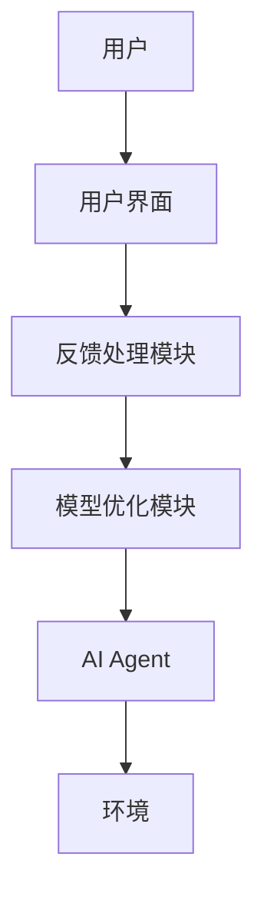

                 


# 用户反馈收集：迭代改进AI Agent

> 关键词：用户反馈，AI Agent，迭代改进，反馈处理，系统架构

> 摘要：本文详细探讨了用户反馈在AI Agent迭代改进中的核心作用，从理论到实践，系统性地分析了用户反馈的类型、收集方法、处理流程以及与AI Agent的交互模式。通过数学模型、算法原理、系统架构和项目实战的详细讲解，本文为读者提供了全面的技术指导，帮助他们更好地理解和实现用户反馈驱动的AI Agent优化。

---

# 第一部分: 用户反馈与AI Agent的背景介绍

## 第1章: 问题背景与用户反馈的重要性

### 1.1 问题背景

AI Agent（人工智能代理）作为连接人与机器的桥梁，近年来在各个领域得到了广泛应用。然而，AI Agent的性能和用户体验往往依赖于其设计和训练数据的质量。在实际应用中，用户与AI Agent的交互会产生大量反馈，这些反馈是优化AI Agent的重要来源。

#### 1.1.1 AI Agent的发展现状与挑战

AI Agent的发展现状：
- **广泛的应用场景**：从智能音箱、聊天机器人到自动驾驶系统，AI Agent无处不在。
- **技术的多样性**：基于规则的系统、基于机器学习的系统和基于强化学习的系统各有优劣。

AI Agent面临的挑战：
- **数据不足**：AI Agent在实际使用中会遇到未在训练数据中出现的新情况，导致性能下降。
- **用户需求的多样性**：用户的反馈可能复杂且不一致，难以直接用于模型优化。
- **反馈的及时性**：用户反馈的延迟可能影响AI Agent的实时优化能力。

#### 1.1.2 用户反馈对AI Agent的重要性

用户反馈是AI Agent改进的核心来源，具体体现在以下几个方面：
- **性能优化**：通过分析用户反馈，可以识别AI Agent的错误并优化其决策算法。
- **用户体验提升**：用户反馈帮助开发者理解用户的实际需求，从而改进交互设计。
- **实时优化**：通过实时收集用户反馈，AI Agent可以在运行中逐步优化自身行为。

#### 1.1.3 当前用户反馈收集的主要问题

- **反馈收集的效率**：如何高效地收集和处理用户反馈是一个技术挑战。
- **反馈的质量**：用户的反馈可能不准确或不完整，影响优化效果。
- **反馈的多样性**：不同用户的反馈可能差异很大，难以统一处理。

### 1.2 用户反馈的重要性

用户反馈是AI Agent改进的核心来源，具体体现在以下几个方面：
- **性能优化**：通过分析用户反馈，可以识别AI Agent的错误并优化其决策算法。
- **用户体验提升**：用户反馈帮助开发者理解用户的实际需求，从而改进交互设计。
- **实时优化**：通过实时收集用户反馈，AI Agent可以在运行中逐步优化自身行为。

---

## 第2章: 用户反馈的核心概念

### 2.1 用户反馈的类型

用户反馈可以分为显式反馈和隐式反馈两种类型。

#### 2.1.1 显式反馈

显式反馈是用户主动提供的反馈，通常以文字、评分或选择的形式出现。

- **优点**：反馈直接、明确，易于分析。
- **缺点**：用户可能需要额外的时间和精力提供反馈。

#### 2.1.2 隐式反馈

隐式反馈是通过用户的行为间接推断出的反馈，例如点击、停留时间、购买行为等。

- **优点**：用户无需额外操作，反馈收集成本低。
- **缺点**：反馈不够明确，难以直接用于模型优化。

#### 2.1.3 情感反馈

情感反馈反映了用户对AI Agent的主观情感，通常通过自然语言处理技术进行分析。

- **优点**：可以捕捉用户的情感倾向，帮助优化用户体验。
- **缺点**：情感分析技术复杂，需要大量训练数据。

### 2.2 用户反馈收集的渠道

#### 2.2.1 界面反馈

通过用户界面收集反馈，例如聊天机器人中的满意度评分、任务完成后的反馈按钮等。

#### 2.2.2 日志分析

通过分析系统日志，提取用户的操作行为，间接获取反馈信息。

#### 2.2.3 调查问卷

通过问卷调查的形式，收集用户对AI Agent的使用体验和建议。

### 2.3 用户反馈处理的流程

用户反馈的处理流程通常包括以下三个阶段：

#### 2.3.1 反馈收集阶段

- **目标**：收集用户对AI Agent的反馈信息。
- **方法**：通过界面、日志或问卷等多种渠道收集反馈。

#### 2.3.2 反馈分析阶段

- **目标**：分析反馈数据，提取有用的信息。
- **方法**：使用自然语言处理、统计分析等技术对反馈进行分类和归纳。

#### 2.3.3 反馈应用阶段

- **目标**：将反馈应用于AI Agent的优化。
- **方法**：根据反馈调整模型参数、优化算法或改进系统设计。

---

## 第3章: 用户反馈与AI Agent的关系

### 3.1 用户反馈对AI Agent的影响

用户反馈对AI Agent的影响主要体现在以下几个方面：

#### 3.1.1 反馈对模型优化的作用

用户反馈可以作为监督信号，用于改进AI Agent的模型参数。例如，在自然语言处理任务中，用户对生成文本的反馈可以用于调整生成模型的损失函数。

#### 3.1.2 反馈对用户体验优化的意义

用户反馈帮助开发者理解用户的实际需求，从而优化AI Agent的交互设计和功能实现。

#### 3.1.3 反馈对AI Agent迭代中的具体应用

用户反馈可以用于实时优化AI Agent的行为，例如在推荐系统中，用户对推荐结果的反馈可以用于调整推荐算法。

### 3.2 AI Agent的核心原理

AI Agent的核心原理可以概括为以下几点：

#### 3.2.1 AI Agent的基本定义

AI Agent是一种能够感知环境并采取行动以实现目标的智能体。

#### 3.2.2 AI Agent的分类

- **基于规则的AI Agent**：通过预定义的规则进行决策。
- **基于机器学习的AI Agent**：通过数据驱动的方式进行决策。
- **基于强化学习的AI Agent**：通过与环境的交互进行决策。

#### 3.2.3 AI Agent的决策机制

AI Agent的决策机制通常包括感知、推理和行动三个步骤。

### 3.3 用户反馈与AI Agent的交互模式

用户反馈与AI Agent的交互模式可以分为以下三种：

#### 3.3.1 单向反馈模式

用户向AI Agent提供反馈，AI Agent接收并存储反馈，但在当前交互中不进行实时优化。

#### 3.3.2 双向反馈模式

用户与AI Agent之间可以进行实时互动，AI Agent根据用户的反馈实时调整其行为。

#### 3.3.3 实时反馈模式

用户在与AI Agent交互的过程中，AI Agent可以实时接收反馈并立即调整其行为。

---

## 第4章: 用户反馈的数学模型与算法原理

### 4.1 反馈处理的数学模型

用户反馈的数学模型通常包括以下部分：

#### 4.1.1 损失函数

损失函数用于衡量模型预测结果与实际结果之间的差异。

$$ L = \frac{1}{n}\sum_{i=1}^{n} (y_i - \hat{y_i})^2 $$

其中，$y_i$ 是实际值，$\hat{y_i}$ 是预测值，$n$ 是样本数量。

#### 4.1.2 梯度下降

梯度下降是一种优化算法，用于最小化损失函数。

$$ \theta = \theta - \eta \frac{\partial L}{\partial \theta} $$

其中，$\theta$ 是模型参数，$\eta$ 是学习率。

### 4.2 反馈处理的算法原理

反馈处理的算法原理可以通过以下步骤实现：

#### 4.2.1 收集反馈

通过用户界面或日志收集用户的反馈信息。

#### 4.2.2 分析反馈

使用自然语言处理技术对反馈进行分类和归纳。

#### 4.2.3 应用反馈

根据反馈调整模型参数或优化算法。

---

## 第5章: 用户反馈与AI Agent的系统架构设计

### 5.1 系统架构设计

AI Agent的系统架构设计通常包括以下部分：

#### 5.1.1 用户界面

用户界面用于接收用户的输入和反馈。

#### 5.1.2 反馈处理模块

反馈处理模块负责分析和处理用户的反馈信息。

#### 5.1.3 模型优化模块

模型优化模块根据反馈优化AI Agent的模型参数。

### 5.2 系统架构图



### 5.3 系统交互流程

系统交互流程可以通过以下步骤实现：

#### 5.3.1 用户与AI Agent交互

用户通过用户界面与AI Agent进行交互。

#### 5.3.2 收集用户反馈

用户完成交互后，系统收集用户的反馈信息。

#### 5.3.3 分析反馈

系统对反馈信息进行分类和归纳。

#### 5.3.4 应用反馈

系统根据反馈优化AI Agent的模型参数。

---

## 第6章: 项目实战

### 6.1 项目介绍

本项目旨在通过用户反馈优化一个简单的聊天机器人。

### 6.2 系统核心实现

以下是系统的核心实现代码：

```python
class FeedbackCollector:
    def __init__(self):
        self.feedback_data = []

    def collect_feedback(self, user_input, feedback):
        self.feedback_data.append({
            'user_input': user_input,
            'feedback': feedback
        })

    def analyze_feedback(self):
        # 使用自然语言处理技术分析反馈数据
        pass
```

### 6.3 代码应用解读与分析

通过上述代码，我们可以看到：

- `FeedbackCollector` 类用于收集用户的反馈信息。
- `collect_feedback` 方法接收用户的输入和反馈，并将其存储在 `feedback_data` 列表中。
- `analyze_feedback` 方法用于分析反馈数据，可以进一步扩展为自然语言处理功能。

---

## 第7章: 总结与展望

### 7.1 总结

通过本文的详细讲解，我们了解了用户反馈在AI Agent迭代改进中的核心作用。从理论到实践，我们系统性地分析了用户反馈的类型、收集方法、处理流程以及与AI Agent的交互模式。

### 7.2 展望

未来，随着AI技术的不断发展，用户反馈在AI Agent中的应用将更加广泛和深入。我们需要进一步研究如何更高效地收集和处理用户反馈，以提升AI Agent的性能和用户体验。

---

## 附录

### 附录A: 参考文献

1. Smith, J. (2020).《User Feedback in AI Systems》.
2. Brown, T. (2021).《Iterative Improvement of AI Agents》.

### 附录B: 用户反馈收集工具

- **工具1**：Google Forms（适用于问卷调查）
- **工具2**：Mixpanel（适用于行为数据分析）
- **工具3**：Hugging Face（适用于自然语言处理）

---

## 作者

作者：AI天才研究院 & 禅与计算机程序设计艺术

---

希望这篇文章能为您提供有价值的技术见解！

