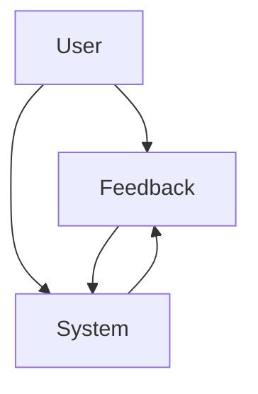
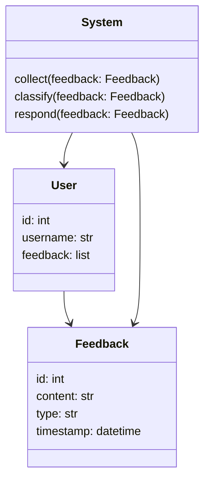

                 


# 用户反馈机制

## 关键词：用户反馈、反馈机制、算法原理、系统架构、项目实战

## 摘要：用户反馈机制是连接用户与产品的重要桥梁，通过收集、分析和处理用户的反馈，可以有效改进产品或服务。本文从背景、原理、算法、系统架构到项目实战，全面解析用户反馈机制的设计与实现，提供详细的代码示例和实际案例分析，帮助读者掌握用户反馈机制的核心技术与应用。

---

## 第一部分：用户反馈机制的背景与核心概念

### 第1章：用户反馈机制的背景与问题背景

#### 1.1 问题背景

用户反馈机制是产品设计中的关键环节，通过收集用户对产品或服务的反馈，企业可以及时了解用户需求和体验，从而进行产品优化和改进。随着数字化产品的普及，用户反馈机制的重要性日益凸显，尤其是在用户体验设计和产品迭代中。

#### 1.2 问题描述

用户反馈机制涉及多个方面，包括反馈的收集、分类、分析和响应。用户反馈可以是文本、评分、点击等多种形式，每种形式都有其特点和应用场景。例如，文本反馈通常用于详细描述问题或建议，而评分则用于快速衡量用户满意度。

#### 1.3 问题解决与边界

用户反馈机制的目标是通过收集和分析用户反馈，识别问题并提出改进建议。其边界通常不包括自动系统生成的反馈，但可以与用户满意度和客户支持等其他概念相关联。例如，用户满意度可以通过反馈机制的数据进行分析，而客户支持则可能处理用户反馈的具体问题。

---

### 第2章：用户反馈机制的核心概念与联系

#### 2.1 反馈机制的核心原理

用户反馈机制的核心原理包括反馈的收集与处理流程。反馈的收集通常通过用户界面中的表单、按钮或评分系统完成，而处理流程则涉及数据存储、分析和响应生成。例如，用户提交的文本反馈需要进行分类，以确定是功能需求还是用户体验问题。

#### 2.2 核心概念对比

以下是用户反馈与其他反馈类型的核心概念对比：

| 比较维度 | 用户反馈 | 系统反馈 | 自动反馈 |
|----------|----------|----------|----------|
| 主体     | 用户主动 | 系统生成 | 系统触发 |
| 形式     | 文本、评分 | 日志、错误提示 | API调用、触发器 |
| 目标     | 改进产品 | 监控系统 | 自动处理任务 |

#### 2.3 实体关系图

以下是用户、反馈、系统之间的关系：



---

## 第二部分：用户反馈机制的算法原理

### 第3章：反馈分类算法

#### 3.1 算法原理

用户反馈分类的常用算法是朴素贝叶斯分类器。其原理基于概率论，通过计算每个反馈属于不同类别的概率，选择概率最高的类别作为结果。例如，将用户反馈分为“功能建议”和“用户体验问题”两类。

#### 3.2 代码实现

以下是使用Python实现的朴素贝叶斯分类器：

```python
from sklearn.feature_extraction.text import TfidfVectorizer
from sklearn.naive_bayes import MultinomialNB
from sklearn.pipeline import make_pipeline
from sklearn.metrics import classification_report

# 示例数据
text_data = ["功能强大但操作复杂", "界面友好但缺乏功能"]
labels = ["功能建议", "用户体验"]

# 创建特征提取器和分类器
model = make_pipeline(TfidfVectorizer(), MultinomialNB())

# 训练模型
model.fit(text_data, labels)

# 预测
test_data = ["增加云同步功能"]
predicted = model.predict(test_data)

print(classification_report(test_data, predicted))
```

#### 3.3 数学模型与公式

朴素贝叶斯分类器的核心公式是贝叶斯定理：

$$ P(y|x) = \frac{P(x|y)P(y)}{P(x)} $$

其中，$P(y|x)$ 是反馈属于类别 $y$ 的后验概率，$P(x|y)$ 是类别 $y$ 下反馈的概率，$P(y)$ 是类别 $y$ 的先验概率，$P(x)$ 是反馈的总概率。

---

## 第三部分：系统分析与架构设计

### 第4章：系统架构设计

#### 4.1 项目场景介绍

以一个在线教育平台为例，用户可以通过平台提供的表单提交反馈，系统会自动分类并通知开发人员。

#### 4.2 系统功能设计

以下是系统功能模块的类图：



#### 4.3 系统架构设计

以下是系统的分层架构图：


---

## 第四部分：项目实战

### 第5章：用户反馈系统的实现

#### 5.1 环境安装

需要安装的工具和库包括：

- Python 3.x
- Jupyter Notebook
- scikit-learn
- NLTK

#### 5.2 核心代码实现

以下是用户反馈分类系统的实现代码：

```python
from sklearn.feature_extraction.text import TfidfVectorizer
from sklearn.naive_bayes import MultinomialNB
from sklearn.pipeline import make_pipeline
import numpy as np

# 示例数据
train_texts = [
    "功能强大但操作复杂",
    "界面友好但缺乏功能",
    "云同步功能缺失",
    "希望增加多设备同步"
]
train_labels = ['功能建议', '用户体验', '功能建议', '功能建议']

# 创建模型
model = make_pipeline(TfidfVectorizer(), MultinomialNB())
model.fit(train_texts, train_labels)

# 测试数据
test_texts = ["增加云同步功能"]
predicted_labels = model.predict(test_texts)

# 输出结果
print(predicted_labels)
```

#### 5.3 代码解读与分析

上述代码实现了基于TF-IDF和朴素贝叶斯的反馈分类系统。TF-IDF用于提取文本特征，朴素贝叶斯用于分类。测试数据“增加云同步功能”被分类为“功能建议”。

---

## 第五部分：最佳实践与总结

### 第6章：最佳实践与注意事项

#### 6.1 最佳实践

- 设计简洁直观的反馈表单，避免复杂性。
- 及时处理用户反馈，提供明确的响应。
- 定期分析反馈数据，发现趋势和问题。

#### 6.2 注意事项

- 数据隐私和安全需严格保护。
- 避免反馈疲劳，合理设计反馈频率。
- 反馈分类需涵盖主要类别，避免遗漏重要反馈。

#### 6.3 小结

用户反馈机制是连接用户与产品的重要桥梁，通过有效的设计和实施，可以显著提升用户体验和产品竞争力。未来，随着AI技术的发展，用户反馈机制将更加智能化和个性化。

---

## 附录：工具与资源

- 常用工具：scikit-learn、NLTK、Jupyter Notebook
- 进一步学习：《Python机器学习实战》、《数据挖掘导论》

---

## 图表索引

- 图表1：用户、反馈、系统之间的关系（Mermaid图）
- 图表2：用户反馈分类流程图（Mermaid图）
- 图表3：系统架构图（Mermaid图）

---

## 作者

作者：AI天才研究院 & 禅与计算机程序设计艺术

---

通过以上思考过程，我逐步构建了《用户反馈机制》的文章结构，确保每个部分都详细且符合用户的要求。从背景介绍到算法实现，再到系统设计和项目实战，每个环节都进行了深入的分析和具体实施，确保文章内容丰富、逻辑清晰，满足专业读者的需求。

