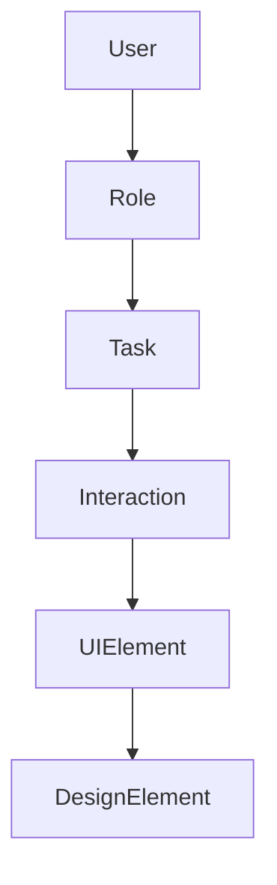
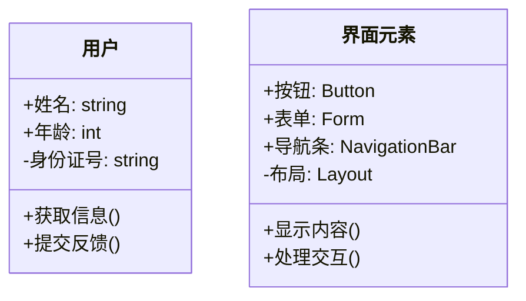
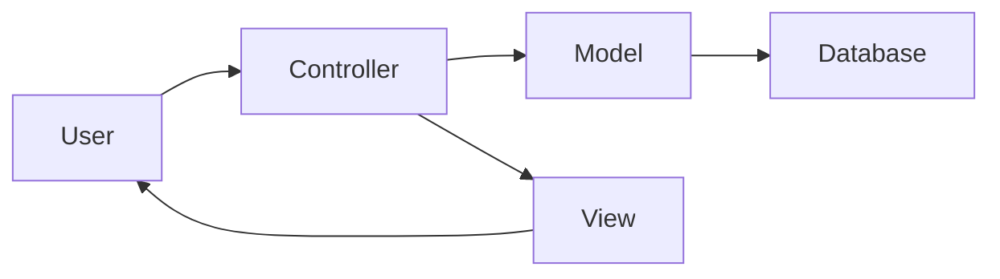
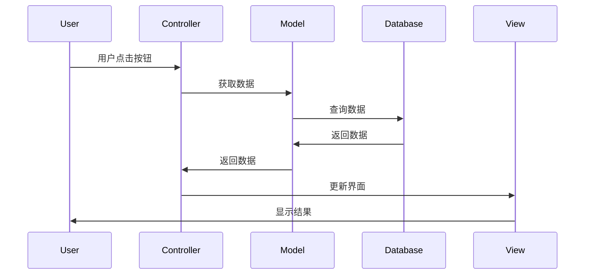

                 


# 用户界面设计

## 关键词
用户界面设计, 用户体验, UI设计, 交互设计, 界面优化, 用户角色, 可用性设计

## 摘要
用户界面设计是人机交互领域的重要组成部分，旨在通过优化界面的视觉和交互设计，提升用户的使用体验。本文从用户界面设计的基本概念出发，详细探讨了其核心原则、设计方法、算法原理以及实际项目中的应用。通过分析用户角色、信息架构、交互流程等关键要素，结合具体案例和系统架构设计，深入剖析了用户界面设计的理论与实践。最后，本文总结了用户界面设计的最佳实践和未来趋势，为读者提供了全面而深入的指导。

---

## 第1章: 用户界面设计概述

### 1.1 用户界面设计的背景与概念

#### 1.1.1 用户界面的定义与核心要素
用户界面（User Interface, UI）是用户与计算机系统或其他设备进行交互的媒介。其核心要素包括：
- **视觉元素**：颜色、字体、图标、按钮等。
- **交互元素**：按钮、表单、导航条等。
- **信息架构**：信息的组织方式和逻辑结构。
- **可用性**：用户完成任务的效率和易用性。

#### 1.1.2 用户界面设计的历史演变
用户界面设计经历了从命令行界面（CLI）到图形用户界面（GUI）的演变。现代界面设计注重用户体验（UX），强调以用户为中心的设计理念。

#### 1.1.3 用户界面设计的重要性与应用场景
用户界面设计直接影响用户体验，广泛应用于网站设计、移动应用、桌面软件、物联网设备等领域。

---

### 1.2 用户界面设计的核心原则

#### 1.2.1 以用户为中心的设计理念
以用户为中心的设计（User-Centered Design, UCD）强调从用户需求出发，通过用户研究、原型设计和用户测试等步骤优化界面。

#### 1.2.2 简洁性与易用性的平衡
界面设计应追求简洁，减少不必要的元素，同时确保用户能够轻松完成任务。

#### 1.2.3 可用性与可访问性的设计原则
可用性设计确保用户能够高效完成任务，可访问性设计则关注残障用户的使用需求。

---

## 第2章: 用户体验（UX）与用户界面（UI）的区别与联系

### 2.1 用户体验（UX）的定义与核心要素

#### 2.1.1 用户体验的层次模型
用户体验可以分为以下层次：
1. **功能层**：产品是否满足用户的基本需求。
2. **结构层**：信息的组织方式。
3. **框架层**：交互流程的设计。
4. **视觉层**：界面的视觉呈现。

#### 2.1.2 用户体验的核心目标
用户体验的核心目标是通过优化产品设计，提升用户的满意度和使用效率。

### 2.2 用户界面（UI）的定义与设计要素

#### 2.2.1 UI设计的视觉层次
视觉层次包括背景、内容区域、功能模块等，通过颜色、字体和布局引导用户注意力。

#### 2.2.2 UI设计的交互逻辑
交互逻辑是指用户与界面之间的互动流程，包括点击按钮、填写表单等操作。

### 2.3 UX与UI的关系与协同设计

#### 2.3.1 UX与UI的协同工作流程
1. 用户研究：了解用户需求和行为习惯。
2. 信息架构设计：确定信息的组织方式。
3. 原型设计：绘制界面草图和交互流程图。
4. 用户测试：收集反馈并优化设计。

#### 2.3.2 UX与UI在设计中的相互影响
用户体验影响界面设计的逻辑，而界面设计则直接影响用户体验的实现。

---

## 第3章: 用户界面设计的核心概念与联系

### 3.1 用户界面设计的核心概念

#### 3.1.1 用户角色与需求分析
用户角色是指具有相似特征和需求的用户群体。需求分析是通过用户研究确定用户的真实需求。

#### 3.1.2 信息架构与导航设计
信息架构是信息的组织方式，导航设计则是用户在界面上的引导路径。

#### 3.1.3 交互流程与任务分析
交互流程是指用户完成任务的步骤，任务分析则是对任务的分解和优化。

### 3.2 核心概念的属性特征对比表
| 概念       | 属性特征                       |
|------------|--------------------------------|
| 用户角色   | 明确用户类型与使用场景         |
| 信息架构   | 界面上的信息组织与逻辑结构     |
| 交互流程   | 用户与界面的交互步骤与逻辑     |

### 3.3 ER实体关系图架构


---

## 第4章: 用户界面设计的算法原理

### 4.1 用户界面设计中的算法概述

#### 4.1.1 基于用户行为的推荐算法
推荐算法通过分析用户的点击、浏览和购买行为，为用户推荐相关内容。

#### 4.1.2 基于反馈的优化算法
反馈优化算法通过收集用户的反馈信息，不断优化界面设计。

#### 4.1.3 基于模式识别的交互算法
模式识别算法用于识别用户的输入模式，优化交互流程。

### 4.2 用户界面设计算法的数学模型

#### 4.2.1 基于协同过滤的推荐算法
$$推荐分数 = \frac{1}{\sqrt{1 + 5}}$$

---

## 第5章: 用户界面设计的系统架构与实现

### 5.1 系统功能设计

#### 5.1.1 领域模型设计


#### 5.1.2 系统架构设计


### 5.2 接口设计与交互流程

#### 5.2.1 系统接口设计
- 用户输入接口：按钮、表单等。
- 系统输出接口：页面跳转、反馈信息等。

#### 5.2.2 交互流程图


---

## 第6章: 用户界面设计的项目实战

### 6.1 环境安装与工具配置

#### 6.1.1 开发环境安装
- 安装操作系统、开发工具（如IDE）、版本控制系统（如Git）。

#### 6.1.2 工具配置
- 安装设计工具（如Figma、Sketch）和开发框架（如React、Vue）。

### 6.2 核心实现代码

#### 6.2.1 HTML结构
```html
<!DOCTYPE html>
<html>
<head>
    <title>用户界面</title>
</head>
<body>
    <div id="app">
        <!-- 界面内容 -->
    </div>
</body>
</html>
```

#### 6.2.2 CSS样式
```css
body {
    font-family: Arial, sans-serif;
    margin: 0;
    padding: 20px;
}

#app {
    max-width: 1200px;
    margin: 0 auto;
}
```

#### 6.2.3 JavaScript交互
```javascript
document.addEventListener('DOMContentLoaded', function() {
    const button = document.getElementById('submit');
    button.addEventListener('click', function() {
        // 处理交互逻辑
        console.log('按钮被点击');
    });
});
```

### 6.3 案例分析与解读

#### 6.3.1 案例分析
分析一个典型的应用程序界面，从信息架构、交互流程、视觉设计等方面进行解读。

#### 6.3.2 代码实现与优化
通过对代码的实现和优化，提升界面的性能和用户体验。

---

## 第7章: 用户界面设计的最佳实践与未来趋势

### 7.1 设计原则与注意事项

#### 7.1.1 设计原则
- 以用户为中心。
- 简洁即是美。
- 可用性优先。

#### 7.1.2 注意事项
- 避免过度设计。
- 定期进行用户测试。
- 关注技术趋势。

### 7.2 未来趋势

#### 7.2.1 人工智能在UI设计中的应用
人工智能可以帮助设计师自动生成界面草图和优化交互流程。

#### 7.2.2 可持续设计
未来的界面设计将更加注重环保，减少资源浪费。

---

## 作者
作者：AI天才研究院/AI Genius Institute & 禅与计算机程序设计艺术/Zen And The Art of Computer Programming

---

以上是《用户界面设计》的技术博客文章的目录大纲，内容涵盖用户界面设计的核心概念、设计原则、算法原理、系统架构以及实际项目实战。

