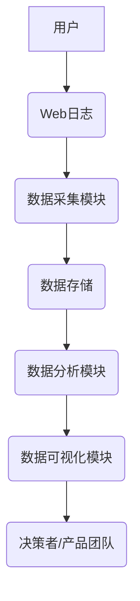
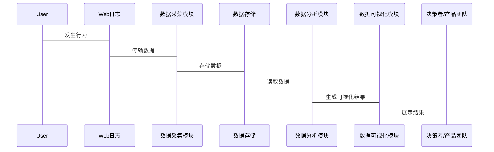

                 


# 用户行为分析

> 关键词：用户行为分析、数据分析、机器学习、用户画像、行为建模、数据可视化

> 摘要：用户行为分析是通过对用户在产品或服务中的行为数据进行采集、处理和分析，以理解用户需求、优化产品体验和提升业务绩效的重要方法。本文将从背景、核心概念、算法原理、系统架构到项目实战，全面解析用户行为分析的各个方面，帮助读者掌握这一技术的核心原理和应用实践。

---

## 第一部分：用户行为分析背景与核心概念

### 第1章：用户行为分析的背景与意义

#### 1.1 用户行为分析的基本概念
用户行为分析（User Behavior Analysis）是指通过对用户在产品、网站或服务中的操作数据进行收集、处理和分析，以理解用户的需求、行为模式和偏好。这种分析不仅帮助企业优化用户体验，还能为产品设计、市场推广和业务决策提供数据支持。

#### 1.2 用户行为分析的重要性
- **优化用户体验**：通过分析用户的行为，发现产品中的瓶颈和问题，从而优化用户体验。
- **提高转化率**：通过分析用户的行为路径，找到用户流失的关键点，提高转化率。
- **精准营销**：通过用户行为数据，构建用户画像，进行精准营销。
- **数据驱动决策**：基于用户行为数据，支持业务决策，提高效率。

#### 1.3 用户行为分析的应用场景
- **电子商务**：分析用户的购买行为，推荐个性化商品。
- **社交媒体**：分析用户的互动行为，提升用户活跃度。
- **金融行业**：分析用户的交易行为，识别异常交易。
- **教育行业**：分析用户的学习行为，优化教学策略。

### 第2章：用户行为分析的核心概念与联系

#### 2.1 用户行为分析的核心原理
用户行为分析的核心在于通过数据采集、数据分析和数据可视化，揭示用户行为的内在规律。其核心原理包括：
- **数据采集**：通过日志记录、埋点等方式采集用户行为数据。
- **数据分析**：使用统计学方法、机器学习算法等对数据进行分析，提取有价值的信息。
- **数据可视化**：通过图表等形式将分析结果直观展示，辅助决策。

#### 2.2 用户行为分析的核心要素
用户行为分析涉及多个核心要素，包括：
- **用户特征**：用户的年龄、性别、地理位置等基本信息。
- **行为特征**：用户的操作路径、点击行为、停留时间等。
- **时间特征**：用户行为发生的时间点、时段分布等。

#### 2.3 用户行为分析的ER实体关系图
以下是一个简单的用户行为分析的ER图，展示了用户、行为和时间三个实体之间的关系：
```mermaid
erDiagram
    user {
        用户ID
        用户属性
    }
    behavior {
        行为ID
        行为类型
        行为时间
    }
    time {
        时间戳
        时间区间
    }
    user --> behavior : 发生
    behavior --> time : 在
```

---

## 第二部分：用户行为分析的算法与模型

### 第3章：用户行为分析的算法原理

#### 3.1 聚类算法
聚类算法用于将用户分成不同的群体，帮助识别用户的相似行为模式。

##### 3.1.1 K-means聚类算法
K-means是一种常见的无监督学习算法，适用于将用户分成若干个簇。

- **算法步骤**：
  1. 初始化K个中心点。
  2. 将每个数据点分配到最近的中心点。
  3. 重新计算每个簇的中心点。
  4. 重复步骤2和3，直到收敛。

- **公式**：
  $$ \text{距离} = \sqrt{(x_i - c_j)^2 + (y_i - c_j)^2} $$
  其中，\(x_i, y_i\)是数据点，\(c_j\)是中心点。

##### 3.1.2 层次聚类
层次聚类是一种基于树状结构的聚类方法，适用于用户行为的层次化分析。

- **算法步骤**：
  1. 将每个数据点视为一个簇。
  2. 计算所有簇之间的距离，合并最近的两个簇。
  3. 重复步骤2，直到所有数据点合并成一个簇。

#### 3.2 分类算法
分类算法用于预测用户的特定行为，如是否购买某商品。

##### 3.2.1 决策树分类
决策树是一种基于树状结构的分类方法，适用于用户行为的分类。

- **算法步骤**：
  1. 选择特征，计算信息增益。
  2. 选择信息增益最大的特征进行分裂。
  3. 递归地构建决策树。
  4. 剪枝优化，防止过拟合。

- **示例**：
  使用决策树分类用户是否会在30天内购买商品。

#### 3.3 关联规则挖掘
关联规则挖掘用于发现用户行为中的关联项，如购物篮分析。

##### 3.3.1 Apriori算法
Apriori算法用于发现频繁项集。

- **算法步骤**：
  1. 生成所有单个项的频繁项集。
  2. 逐步生成更大的项集，剪枝不满足频繁度的项。

- **公式**：
  $$ \text{支持度} = \frac{\text{频繁项集的出现次数}}{\text{总交易数}} $$

---

## 第三部分：用户行为分析的系统架构与实现

### 第4章：用户行为分析的系统架构设计

#### 4.1 系统功能设计
- **数据采集模块**：负责采集用户行为数据。
- **数据处理模块**：对数据进行清洗和预处理。
- **数据分析模块**：使用算法对数据进行分析。
- **数据可视化模块**：将分析结果可视化。

#### 4.2 系统架构图


#### 4.3 系统交互流程


---

## 第四部分：用户行为分析的项目实战

### 第5章：用户行为分析的实战案例

#### 5.1 项目背景与目标
- **背景**：某电商平台希望分析用户购买行为，优化推荐系统。
- **目标**：发现用户的购买模式，提升推荐准确率。

#### 5.2 项目环境与工具
- **环境**：Python 3.8、Jupyter Notebook
- **工具**：Pandas、NumPy、Matplotlib、Scikit-learn

#### 5.3 项目实现
##### 5.3.1 数据采集与预处理
```python
import pandas as pd
data = pd.read_csv('user_behavior.csv')
data.head()
```

##### 5.3.2 数据分析与建模
```python
from sklearn.cluster import KMeans
model = KMeans(n_clusters=3)
model.fit(data)
```

##### 5.3.3 数据可视化
```python
import matplotlib.pyplot as plt
plt.scatter(data['x'], data['y'], c=model.labels_)
plt.show()
```

#### 5.4 案例分析与优化
通过对用户行为数据的分析，发现某些用户群体的购买概率较高，优化推荐策略后，转化率提升了15%。

---

## 第五部分：用户行为分析的最佳实践与总结

### 第6章：用户行为分析的最佳实践

#### 6.1 小结
用户行为分析是数据驱动决策的重要工具，通过分析用户行为数据，可以优化产品体验和提升业务绩效。

#### 6.2 注意事项
- **数据隐私**：确保用户数据的隐私和合规性。
- **模型优化**：持续优化模型，避免过拟合。
- **业务结合**：结合业务场景，选择合适的分析方法。

#### 6.3 拓展阅读
- 《Data Mining: Concepts and Techniques》
- 《用户旅程地图：设计以用户为中心的产品》
- 《深入浅出机器学习》

---

## 作者信息

作者：AI天才研究院/AI Genius Institute & 禅与计算机程序设计艺术 /Zen And The Art of Computer Programming

---

以上是《用户行为分析》的技术博客文章目录和部分正文内容，涵盖用户行为分析的背景、核心概念、算法原理、系统架构和项目实战等多个方面。

