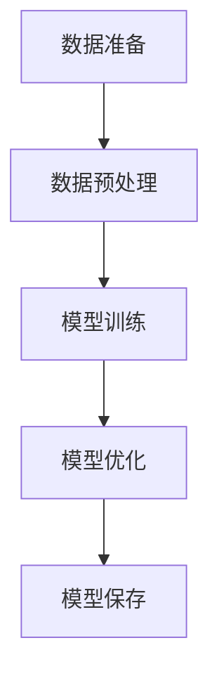
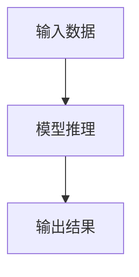

                 


# 电影制作中的AI Agent特效生成

> 关键词：AI Agent，电影特效，生成模型，深度学习，计算机视觉

> 摘要：随着人工智能技术的飞速发展，AI Agent在电影制作中的应用越来越广泛，尤其是在特效生成领域。本文将深入探讨AI Agent在电影特效中的应用，从基本概念到核心算法，从系统架构到实际案例，全面解析AI Agent如何改变电影特效的生成方式。

---

# 第1章: AI Agent与电影特效的背景介绍

## 1.1 AI Agent的基本概念

### 1.1.1 AI Agent的定义与特点
AI Agent（人工智能代理）是指能够感知环境、自主决策并执行任务的智能体。其特点包括：
- **自主性**：能够在没有外部干预的情况下自主完成任务。
- **反应性**：能够实时感知环境变化并做出反应。
- **学习能力**：通过数据和经验不断优化自身性能。
- **交互性**：能够与人类或其他系统进行有效交互。

### 1.1.2 AI Agent在电影制作中的作用
AI Agent在电影特效中的作用主要体现在以下几个方面：
- **自动化处理**：能够自动识别和处理复杂的特效需求。
- **实时生成**：能够实时生成高质量的特效画面。
- **个性化定制**：能够根据导演的需求生成个性化的效果。

### 1.1.3 电影特效的基本概念与分类
电影特效是指通过技术手段在电影画面中添加、修改或删除元素的过程。特效的分类包括：
- **视觉特效（VFX）**：通过计算机图形学生成的特效，如爆炸、魔法等。
- **数字特效（CGI）**：通过3D建模和动画生成的特效。
- **后期特效**：在拍摄完成后通过后期处理添加的特效。

---

## 1.2 电影特效的演变历程

### 1.2.1 传统电影特效的制作流程
传统的电影特效制作流程包括以下几个步骤：
1. **前期设计**：绘制特效的草图和分镜。
2. **拍摄阶段**：使用特殊设备或技巧进行拍摄。
3. **后期制作**：通过手工或早期计算机技术进行特效合成。

### 1.2.2 数字化特效的兴起
随着计算机技术的发展，数字化特效逐渐取代了传统特效。数字化特效的优势包括：
- **高效性**：通过计算机算法快速生成特效。
- **精确性**：能够实现高度精确的特效效果。
- **可编辑性**：特效效果可以随时调整和优化。

### 1.2.3 AI Agent在特效制作中的应用背景
AI Agent的出现为电影特效的制作带来了新的可能性。通过AI Agent，特效师可以更高效地生成高质量的特效画面，同时能够处理复杂的场景和人物动作。

---

## 1.3 AI Agent在电影特效中的具体应用

### 1.3.1 AI Agent驱动的特效生成技术
AI Agent驱动的特效生成技术主要包括以下几种：
- **图像生成**：通过GAN（生成对抗网络）生成高质量的特效画面。
- **视频修复**：通过AI修复模糊或损坏的视频片段。
- **场景重建**：通过3D重建技术生成虚拟场景。

### 1.3.2 AI Agent在特效设计中的优势
AI Agent在特效设计中的优势主要体现在以下几个方面：
- **高效性**：能够快速生成特效画面。
- **智能化**：能够根据导演的需求自动生成符合预期的效果。
- **可扩展性**：能够处理复杂的场景和人物动作。

### 1.3.3 电影制作中的AI Agent应用案例
以下是一些经典的AI Agent在电影特效中的应用案例：
- **《阿凡达》**：通过AI Agent生成的3D人物和场景。
- **《星际穿越》**：通过AI Agent生成的黑洞和宇宙场景。
- **《变形金刚》**：通过AI Agent生成的变形机器人特效。

---

## 1.4 本章小结
本章主要介绍了AI Agent的基本概念、电影特效的演变历程以及AI Agent在电影特效中的具体应用。通过本章的学习，读者可以了解AI Agent在电影特效中的重要性以及其在实际制作中的应用前景。

---

# 第2章: AI Agent的核心概念与原理

## 2.1 AI Agent的核心概念

### 2.1.1 AI Agent的基本组成
AI Agent的基本组成包括以下几个部分：
- **感知系统**：能够感知环境中的信息。
- **决策系统**：能够根据感知的信息做出决策。
- **执行系统**：能够根据决策执行相应的动作。

### 2.1.2 AI Agent的核心属性对比
以下是对几种常见AI Agent的核心属性对比：
| AI Agent类型 | 自主性 | 反应性 | 学习能力 | 交互性 |
|--------------|--------|--------|----------|--------|
| GAN          | 高     | 中     | 高       | 低     |
| VAE          | 中     | 高     | 中       | 低     |
| Transformer   | 中     | 高     | 高       | 高     |

### 2.1.3 AI Agent的实体关系图（ER图）
以下是AI Agent的实体关系图：

```mermaid
erDiagram
    actor User {
        string username
        string password
    }
    agent AI_Agent {
        string agent_id
        string model_name
    }
    effect Effect {
        string effect_id
        string description
        date created_date
    }
    User --> AI_Agent : 请求处理
    AI_Agent --> Effect : 生成特效
    User --> Effect : 监控效果
```

---

## 2.2 AI Agent的算法原理

### 2.2.1 基于生成模型的AI Agent算法
生成模型是AI Agent的核心算法之一，主要包括以下几种：
- **生成对抗网络（GAN）**：通过生成器和判别器的对抗训练生成高质量的图像。
- **变分自编码器（VAE）**：通过编码和解码过程生成新的数据。
- **转换器（Transformer）**：通过自注意力机制生成序列数据。

### 2.2.2 AI Agent的训练流程
以下是AI Agent的训练流程：



### 2.2.3 AI Agent的推理过程
以下是AI Agent的推理过程：



---

## 2.3 AI Agent的核心数学模型

### 2.3.1 生成对抗网络（GAN）模型
生成对抗网络的数学模型如下：
$$
\min_{G} \max_{D} \mathbb{E}_{x \sim p_{data}} [\log D(x)] + \mathbb{E}_{z \sim p_{z}} [\log (1 - D(G(z)))]
$$

### 2.3.2 变量自编码器（VAE）模型
变量自编码器的数学模型如下：
$$
\mathcal{L} = \mathbb{E}_{z \sim q(z|x)} [\log p(x|z)] - \text{KL}(q(z|x) || p(z))
$$

### 2.3.3 转换器（Transformer）模型
转换器的数学模型如下：
$$
\text{Attention}(Q, K, V) = \text{softmax}\left(\frac{QK^T}{\sqrt{d_k}}\right)V
$$

---

## 2.4 本章小结
本章主要介绍了AI Agent的核心概念和算法原理，包括生成模型、训练流程和数学公式等内容。通过本章的学习，读者可以深入了解AI Agent在特效生成中的技术细节。

---

# 第3章: AI Agent特效生成的实现技术

## 3.1 图像处理与特效生成

### 3.1.1 图像分割技术
图像分割技术是AI Agent特效生成的重要基础，主要包括以下几种：
- **前景提取**：通过AI Agent提取画面中的前景物体。
- **背景替换**：通过AI Agent替换画面中的背景。
- **图像修复**：通过AI Agent修复画面中的损坏部分。

### 3.1.2 图像生成技术
图像生成技术是AI Agent特效生成的核心技术，主要包括以下几种：
- **风格迁移**：将一种风格的图像转换为另一种风格。
- **超分辨率重建**：将低分辨率图像重建为高分辨率图像。
- **图像增强**：通过AI Agent增强图像的质量。

### 3.1.3 图像融合技术
图像融合技术是AI Agent特效生成的重要技术，主要用于将生成的图像与原始图像进行融合，生成最终的特效效果。

---

## 3.2 基于深度学习的特效生成模型

### 3.2.1 卷积神经网络（CNN）的应用
卷积神经网络在特效生成中的应用包括：
- **图像分类**：用于分类特效类型。
- **目标检测**：用于检测特效中的目标物体。
- **图像分割**：用于分割特效中的前景和背景。

### 3.2.2 图像生成模型（如CycleGAN）的应用
CycleGAN是一种无监督学习模型，主要用于图像到图像的转换，例如将黑白图像转换为彩色图像。

### 3.2.3 3D模型生成技术
3D模型生成技术是AI Agent特效生成的重要技术，主要用于生成高质量的3D人物和场景。

---

## 3.3 基于AI Agent的特效生成流程

### 3.3.1 数据采集与预处理
数据采集与预处理是AI Agent特效生成的第一步，主要包括以下步骤：
1. **数据采集**：采集特效相关的图像和视频数据。
2. **数据预处理**：对数据进行清洗和标注。

### 3.3.2 模型训练与优化
模型训练与优化是AI Agent特效生成的核心步骤，主要包括以下步骤：
1. **模型训练**：使用训练数据训练生成模型。
2. **模型优化**：通过调整超参数优化模型性能。

### 3.3.3 特效生成与渲染
特效生成与渲染是AI Agent特效生成的最后一步，主要包括以下步骤：
1. **特效生成**：通过AI Agent生成特效画面。
2. **特效渲染**：将生成的特效画面渲染到原始画面中。

---

## 3.4 本章小结
本章主要介绍了AI Agent特效生成的实现技术，包括图像处理技术、基于深度学习的特效生成模型以及基于AI Agent的特效生成流程等内容。通过本章的学习，读者可以了解AI Agent在特效生成中的具体实现方法。

---

# 第4章: AI Agent驱动的特效生成系统架构

## 4.1 系统功能模块设计

### 4.1.1 数据采集模块
数据采集模块负责采集特效相关的图像和视频数据，主要包括以下功能：
- **图像采集**：采集特效相关的图像数据。
- **视频采集**：采集特效相关的视频数据。
- **数据存储**：将采集的数据存储到数据库中。

### 4.1.2 模型训练模块
模型训练模块负责训练生成模型，主要包括以下功能：
- **模型选择**：选择合适的生成模型。
- **数据预处理**：对数据进行预处理。
- **模型训练**：使用训练数据训练生成模型。

### 4.1.3 特效生成模块
特效生成模块负责生成特效画面，主要包括以下功能：
- **模型推理**：使用生成模型生成特效画面。
- **特效渲染**：将生成的特效画面渲染到原始画面中。

### 4.1.4 交互控制模块
交互控制模块负责与用户进行交互，主要包括以下功能：
- **用户输入**：接收用户的输入指令。
- **系统响应**：根据用户的输入指令生成相应的特效画面。
- **效果监控**：监控特效生成的效果。

---

## 4.2 系统架构设计

### 4.2.1 分层架构设计
分层架构设计将系统划分为以下几层：
- **表现层**：负责与用户进行交互。
- **业务逻辑层**：负责处理业务逻辑。
- **数据访问层**：负责访问数据库。

### 4.2.2 微服务架构设计
微服务架构设计将系统划分为多个微服务，每个微服务负责一个具体的业务功能。

### 4.2.3 系统接口设计
系统接口设计是系统与其他系统或模块之间的接口，主要包括以下几种：
- **API接口**：通过API接口进行数据交互。
- **消息队列**：通过消息队列进行异步通信。

---

## 4.3 系统交互流程

### 4.3.1 用户输入与系统响应
用户通过表现层输入特效生成的需求，系统通过业务逻辑层处理用户的请求，并通过数据访问层访问数据库。

### 4.3.2 模型调用与数据处理
系统通过API接口调用生成模型，并通过消息队列进行异步通信。

### 4.3.3 特效生成与渲染
生成模型生成特效画面，并通过渲染引擎将生成的特效画面渲染到原始画面中。

---

## 4.4 本章小结
本章主要介绍了AI Agent驱动的特效生成系统的架构设计，包括系统功能模块设计、系统架构设计以及系统交互流程等内容。通过本章的学习，读者可以了解AI Agent在特效生成中的系统实现方式。

---

# 第5章: AI Agent特效生成的项目实战

## 5.1 环境安装与配置
以下是AI Agent特效生成项目的环境安装与配置步骤：
1. **安装Python**：安装Python 3.8及以上版本。
2. **安装深度学习框架**：安装TensorFlow或PyTorch。
3. **安装图像处理库**：安装OpenCV和Pillow。
4. **安装生成模型库**：安装GAN和VAE的相关库。

## 5.2 系统核心实现

### 5.2.1 数据采集与预处理
以下是数据采集与预处理的代码示例：
```python
import cv2
import numpy as np

# 图像采集
def capture_image():
    cap = cv2.VideoCapture(0)
    ret, frame = cap.read()
    if ret:
        cv2.imwrite("input_image.jpg", frame)
    cap.release()

# 图像预处理
def preprocess_image(image_path):
    image = cv2.imread(image_path)
    image = cv2.resize(image, (256, 256))
    image = image / 255.0
    return image

capture_image()
preprocessed_image = preprocess_image("input_image.jpg")
```

### 5.2.2 模型训练与优化
以下是模型训练与优化的代码示例：
```python
import tensorflow as tf
from tensorflow.keras import layers

# 定义生成器模型
def generator_model():
    model = tf.keras.Sequential()
    model.add(layers.Dense(256, activation='relu', input_shape=(100,)))
    model.add(layers.Reshape((8,8,4)))
    model.add(layers.Conv2DTranspose(16, (3,3), padding='same', activation='relu'))
    model.add(layers.Conv2DTranspose(8, (3,3), padding='same', activation='relu'))
    model.add(layers.Conv2DTranspose(4, (3,3), padding='same', activation='relu'))
    model.add(layers.Conv2DTranspose(1, (3,3), padding='same', activation='sigmoid'))
    return model

# 定义判别器模型
def discriminator_model():
    model = tf.keras.Sequential()
    model.add(layers.Conv2D(4, (3,3), padding='same', activation='relu', input_shape=(256,256,1)))
    model.add(layers.Conv2D(8, (3,3), padding='same', activation='relu'))
    model.add(layers.Conv2D(16, (3,3), padding='same', activation='relu'))
    model.add(layers.Flatten())
    model.add(layers.Dense(1, activation='sigmoid'))
    return model

# 定义GAN模型
generator = generator_model()
discriminator = discriminator_model()
gan_model = tf.keras.Sequential()
gan_model.add(generator)
gan_model.add(discriminator)
gan_model.compile(loss='binary_crossentropy', optimizer='adam')
```

### 5.2.3 特效生成与渲染
以下是特效生成与渲染的代码示例：
```python
import cv2
import numpy as np

# 生成随机噪声
noise = np.random.randn(1, 100)
noise = noise.astype(np.float32)

# 生成图像
generated_image = generator.predict(noise)[0]

# 渲染特效
def render_effect(image):
    # 在图像上添加特效
    # 这里可以添加具体的特效生成逻辑
    return image

generated_image_with_effect = render_effect(generated_image)
cv2.imwrite("output_image.jpg", generated_image_with_effect)
```

---

## 5.3 项目小结
本章通过一个具体的项目案例，详细讲解了AI Agent特效生成的实现过程，包括环境安装、模型训练以及特效生成与渲染等内容。通过本章的学习，读者可以掌握AI Agent特效生成的核心技术。

---

# 第6章: AI Agent特效生成的最佳实践

## 6.1 最佳实践 tips
- **数据质量**：确保数据质量，避免数据噪声和偏差。
- **模型选择**：根据具体需求选择合适的生成模型。
- **超参数调整**：通过超参数调整优化模型性能。
- **效果监控**：定期监控特效生成的效果，及时调整模型参数。

## 6.2 小结
通过本章的学习，读者可以掌握AI Agent特效生成的最佳实践方法，避免在实际应用中出现常见的问题。

---

# 作者：AI天才研究院/AI Genius Institute & 禅与计算机程序设计艺术 /Zen And The Art of Computer Programming

---

以上是《电影制作中的AI Agent特效生成》的技术博客文章的完整目录和内容概要。如需进一步扩展或调整，请随时告知！

