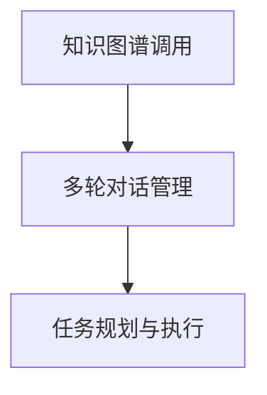
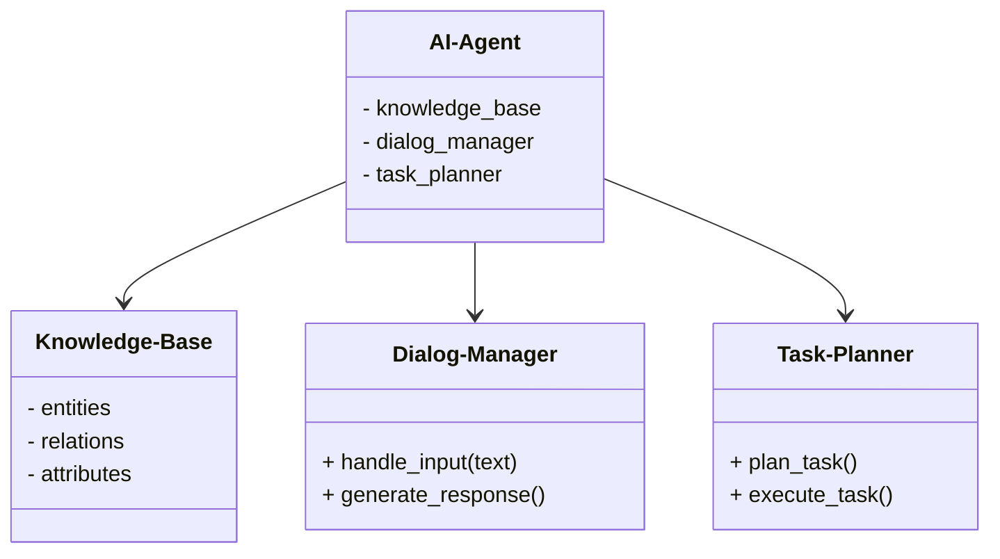
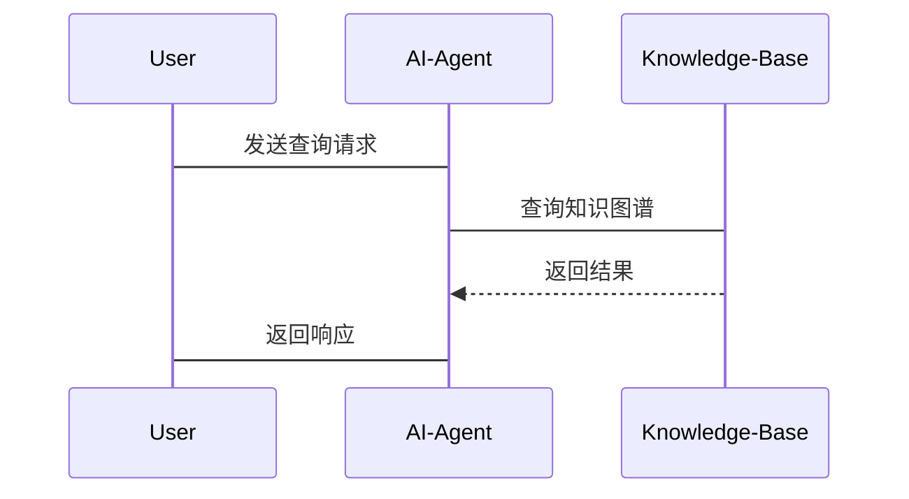
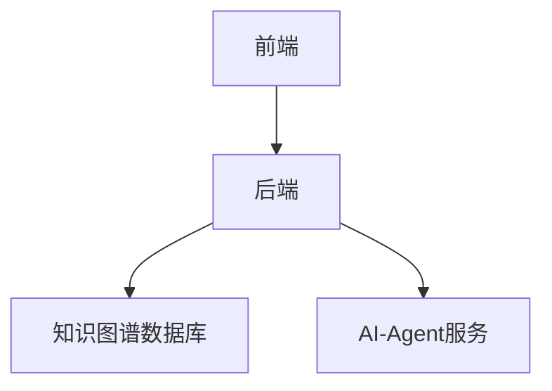

                 


# 知识图谱在AI Agent中的应用

---

## 关键词：
- 知识图谱
- AI Agent
- 知识表示
- 人工智能
- 图神经网络
- 多轮对话
- 任务规划

---

## 摘要：
知识图谱作为一种结构化的知识表示方法，在AI Agent领域发挥着重要作用。本文从知识图谱和AI Agent的基本概念出发，深入分析了知识图谱在AI Agent中的应用，包括知识图谱的构建、AI Agent的系统设计、算法原理、项目实战以及最佳实践。通过结合实际案例和数学模型，本文详细阐述了知识图谱如何赋能AI Agent，提升其智能性和实用性。最终，本文为读者提供了一个全面的知识图谱在AI Agent中的应用框架，帮助读者更好地理解和应用这一技术。

---

# 第1章 知识图谱与AI Agent概述

## 1.1 知识图谱的基本概念
### 1.1.1 知识图谱的定义
知识图谱是一种结构化的知识表示方法，通过三元组（实体-关系-实体）的形式描述世界中的实体及其关系。例如，知识图谱可以表示为“上海是一个城市”或“张三在上海工作”。

### 1.1.2 知识图谱的核心特征
- **结构化**：知识图谱通过图结构将实体和关系表示为节点和边，便于计算机理解和处理。
- **可扩展性**：知识图谱可以通过不断添加新的实体和关系进行扩展。
- **语义丰富性**：知识图谱不仅包含事实性信息，还包含语义信息，能够帮助AI Agent理解上下文。

### 1.1.3 知识图谱的构建流程
1. 数据采集与预处理
2. 实体识别与抽取
3. 关系抽取与构建
4. 知识图谱存储与管理

## 1.2 AI Agent的基本概念
### 1.2.1 AI Agent的定义
AI Agent是一种能够感知环境、自主决策并执行任务的智能体。例如，智能助手（如Siri、Alexa）就是一个典型的AI Agent。

### 1.2.2 AI Agent的类型与特点
- **反应式AI Agent**：基于当前感知做出反应，适用于实时任务。
- **认知式AI Agent**：具备推理和规划能力，适用于复杂任务。
- **学习式AI Agent**：能够通过学习提升自身的智能水平。

### 1.2.3 AI Agent的应用场景
- 智能客服
- 智能助手
- 自动驾驶
- 智慧城市

## 1.3 知识图谱与AI Agent的关系
### 1.3.1 知识图谱如何赋能AI Agent
知识图谱为AI Agent提供了丰富的知识库，帮助其理解上下文、推理和决策。

### 1.3.2 AI Agent如何利用知识图谱提升智能
通过知识图谱，AI Agent可以进行知识推理、意图识别和任务规划。

### 1.3.3 知识图谱与AI Agent的结合案例
- 智能问答系统通过知识图谱提供准确的答案。
- 自动驾驶系统利用知识图谱理解道路环境。

## 1.4 本章小结
本章介绍了知识图谱和AI Agent的基本概念，分析了它们之间的关系，并通过案例展示了知识图谱在AI Agent中的应用。

---

# 第2章 知识图谱的核心概念与算法原理

## 2.1 知识图谱的核心概念
### 2.1.1 知识图谱的组成要素
- **实体**：现实世界中的具体事物，如“人”、“城市”。
- **关系**：实体之间的关联，如“居住”、“工作”。
- **属性**：实体的特征，如“年龄”、“性别”。

### 2.1.2 知识图谱的结构化表示
知识图谱可以通过RDF（资源描述框架）表示，例如：`Person(Xiaoming) ∧ Resident(Xiaoming, Shanghai)`。

### 2.1.3 知识图谱的表示方法
- **三元组表示**：`实体-关系-实体`。
- **图结构表示**：通过节点和边表示实体和关系。

## 2.2 知识图谱的构建流程
### 2.2.1 数据采集与预处理
- 数据来源：文本、数据库、网络爬取。
- 数据清洗：去除噪声数据，提取有用信息。

### 2.2.2 实体识别与抽取
- **基于规则的方法**：通过预定义规则识别实体。
- **基于统计的方法**：通过统计特征识别实体。
- **基于深度学习的方法**：利用神经网络模型识别实体。

### 2.2.3 关系抽取与构建
- **基于模板的方法**：通过预定义模板提取关系。
- **基于规则的方法**：通过语法分析提取关系。
- **基于深度学习的方法**：利用序列标注模型提取关系。

### 2.2.4 知识图谱存储与管理
- **数据库存储**：如Neo4j、MySQL。
- **图数据库**：专门用于存储图结构数据的数据库。

## 2.3 知识图谱的表示方法
### 2.3.1 RDF与三元组表示
RDF通过三元组（主语-谓词-宾语）表示知识，例如：`上海 has capital Beijing`。

### 2.3.2 图结构表示
知识图谱可以通过图结构表示，节点代表实体，边代表关系。

### 2.3.3 知识图谱的可视化
通过图可视化工具（如Gephi）将知识图谱以图形形式展示。

## 2.4 算法原理
### 2.4.1 实体识别与抽取算法
- **条件概率公式**：$P(实体|文本) = \frac{\text{实体出现的次数}}{\text{总文本数}}$。

### 2.4.2 关系抽取算法
- **基于规则的抽取**：通过预定义规则匹配关系。
- **基于深度学习的抽取**：使用序列标注模型（如CRF）抽取关系。

### 2.4.3 知识图谱的推理算法
- **基于规则的推理**：通过逻辑推理得出结论。
- **基于图的推理**：通过遍历图结构进行推理。
- **基于深度学习的推理**：利用图神经网络进行推理。

## 2.5 本章小结
本章详细介绍了知识图谱的核心概念和构建流程，并分析了实体识别、关系抽取和推理算法的原理。

---

# 第3章 AI Agent的系统分析与架构设计

## 3.1 AI Agent的系统分析
### 3.1.1 系统功能设计
- **知识图谱调用**：AI Agent能够调用知识图谱中的知识。
- **多轮对话管理**：AI Agent能够与用户进行多轮对话。
- **任务规划与执行**：AI Agent能够根据知识图谱进行任务规划并执行。

### 3.1.2 系统功能设计图（使用mermaid）


### 3.1.3 系统功能设计类图（使用mermaid）


### 3.1.4 系统功能设计序列图（使用mermaid）


## 3.2 系统架构设计
### 3.2.1 系统架构图（使用mermaid）


### 3.2.2 系统架构设计说明
- **前端**：用户与AI Agent交互的界面。
- **后端**：处理用户请求，调用知识图谱数据库和AI Agent服务。
- **知识图谱数据库**：存储知识图谱数据。
- **AI Agent服务**：负责知识图谱调用、对话管理和任务规划。

## 3.3 接口设计
### 3.3.1 系统接口设计
- **输入接口**：接收用户的查询请求。
- **输出接口**：返回AI Agent的响应。

### 3.3.2 接口设计说明
- **REST API**：例如，`POST /api/query`，用于发送查询请求。
- **返回格式**：JSON格式，例如：`{"result": "答案"}`。

## 3.4 本章小结
本章分析了AI Agent的系统功能设计和架构设计，并通过mermaid图展示了系统的模块结构和交互流程。

---

# 第4章 知识图谱在AI Agent中的应用

## 4.1 知识图谱在AI Agent中的应用
### 4.1.1 知识图谱赋能AI Agent
- 通过知识图谱，AI Agent能够理解上下文、推理和决策。

### 4.1.2 AI Agent利用知识图谱提升智能
- 通过知识图谱，AI Agent能够进行知识推理、意图识别和任务规划。

## 4.2 知识图谱在AI Agent中的具体应用
### 4.2.1 智能问答系统
- AI Agent通过知识图谱提供准确的答案。

### 4.2.2 自然语言理解
- AI Agent通过知识图谱理解用户意图。

### 4.2.3 任务规划与执行
- AI Agent通过知识图谱进行任务规划并执行。

## 4.3 本章小结
本章展示了知识图谱在AI Agent中的具体应用，并分析了其对AI Agent智能提升的作用。

---

# 第5章 项目实战：知识图谱驱动的AI Agent开发

## 5.1 项目概述
### 5.1.1 项目背景
开发一个基于知识图谱的AI Agent，用于智能问答和任务执行。

### 5.1.2 项目目标
- 实现知识图谱的构建与存储。
- 实现AI Agent的知识调用和对话管理。

## 5.2 环境安装
### 5.2.1 知识图谱数据库
- 安装Neo4j：`brew install neo4j`。
- 启动Neo4j：`brew services start neo4j`。

### 5.2.2 AI Agent开发工具
- 安装Python：`brew install python3`。
- 安装相关库：`pip install neo4j-driver`。

## 5.3 知识图谱构建与管理
### 5.3.1 数据采集
- 从网络爬取数据，例如，爬取维基百科数据。

### 5.3.2 数据预处理
- 使用Python脚本清洗数据，提取实体和关系。

### 5.3.3 知识图谱存储
- 使用Neo4j存储知识图谱数据。

## 5.4 AI Agent开发
### 5.4.1 知识图谱调用
- 使用Neo4j驱动连接知识图谱数据库。
- 通过Cypher查询语言查询知识图谱。

### 5.4.2 多轮对话管理
- 使用Python编写对话逻辑，实现意图识别和上下文管理。

### 5.4.3 任务规划与执行
- 通过知识图谱推理任务，执行相应操作。

## 5.5 项目实现代码
### 5.5.1 知识图谱构建代码
```python
from neo4j import GraphDatabase

def create_knowledge_graph(neo4j_uri, neo4j_user, neo4j_password):
    driver = GraphDatabase.driver(neo4j_uri, auth=(neo4j_user, neo4j_password))
    session = driver.session()
    session.run("CREATE (a:Person {name: 'Alice'})")
    session.run("CREATE (b:Person {name: 'Bob'})")
    session.run("CREATE (a)-[:KNOWS]->(b)")
    session.close()

create_knowledge_graph("bolt://localhost:7687", "neo4j", "password")
```

### 5.5.2 AI Agent对话逻辑代码
```python
class AI-Agent:
    def __init__(self, knowledge_graph):
        self.knowledge_graph = knowledge_graph

    def handle_query(self, query):
        # 查询知识图谱
        result = self.knowledge_graph.query(query)
        # 返回结果
        return result

    def start_dialog(self):
        while True:
            query = input("用户输入：")
            response = self.handle_query(query)
            print("AI Agent响应：", response)

agent = AI-Agent(knowledge_graph)
agent.start_dialog()
```

## 5.6 项目实战总结
### 5.6.1 项目实现的关键点
- 知识图谱的构建与存储。
- AI Agent的知识调用和对话管理。

### 5.6.2 项目实现的注意事项
- 确保知识图谱数据的准确性和完整性。
- 处理多轮对话中的上下文管理。

## 5.7 本章小结
本章通过一个具体的项目实战，详细讲解了知识图谱在AI Agent中的应用，展示了如何构建知识图谱并开发AI Agent系统。

---

# 第6章 知识图谱在AI Agent中的最佳实践

## 6.1 知识图谱构建的最佳实践
### 6.1.1 数据来源的选择
- 使用高质量的数据源，确保数据的准确性。

### 6.1.2 数据预处理的关键点
- 清洗数据，去除噪声。
- 提取实体和关系。

## 6.2 AI Agent开发的最佳实践
### 6.2.1 知识图谱调用的优化
- 使用高效的查询语言，如Cypher。
- 索引优化，提高查询效率。

### 6.2.2 对话管理的优化
- 使用上下文管理，提高对话的连贯性。
- 处理歧义情况，提升用户体验。

## 6.3 知识图谱与AI Agent的结合优化
### 6.3.1 知识图谱的动态更新
- 定期更新知识图谱，保持知识的准确性。

### 6.3.2 AI Agent的自适应学习
- 通过反馈机制，优化AI Agent的行为。

## 6.4 本章小结
本章总结了知识图谱在AI Agent中的最佳实践，包括知识图谱的构建优化和AI Agent的开发优化。

---

# 第7章 总结与展望

## 7.1 总结
知识图谱作为一种结构化的知识表示方法，在AI Agent中发挥着重要作用。通过知识图谱，AI Agent能够理解上下文、推理和决策，从而提升其智能性和实用性。

## 7.2 展望
未来，知识图谱在AI Agent中的应用将更加广泛。随着技术的发展，知识图谱将更加智能化和动态化，AI Agent也将具备更强的自主学习和决策能力。

## 7.3 注意事项
在实际应用中，需要注意知识图谱的构建和更新成本，同时要处理多轮对话中的上下文管理和歧义情况。

## 7.4 拓展阅读
建议读者进一步阅读以下资料：
- 知识图谱相关书籍：《知识图谱：概念、方法与应用》。
- AI Agent相关书籍：《人工智能：一种现代方法》。

## 7.5 本章小结
本章总结了全文的主要内容，并展望了知识图谱在AI Agent中的未来发展方向。

---

# 作者：AI天才研究院/AI Genius Institute & 禅与计算机程序设计艺术 /Zen And The Art of Computer Programming

---

通过以上目录和内容设计，您可以开始撰写完整的文章。每个部分都详细展开，确保内容的深度和广度，同时保持逻辑的连贯性和结构的清晰性。

