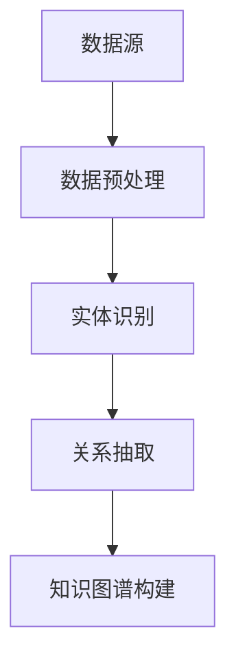
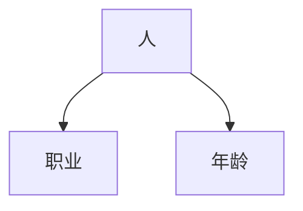
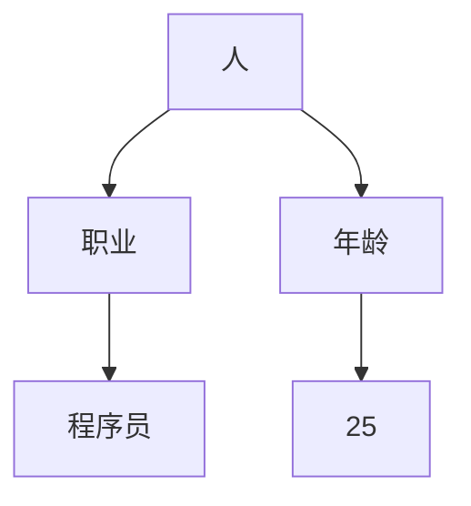
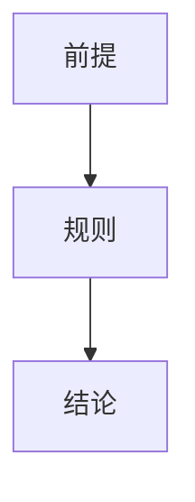
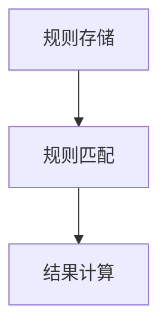
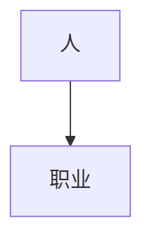
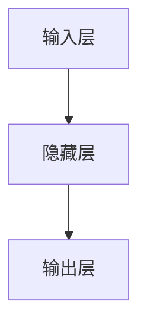
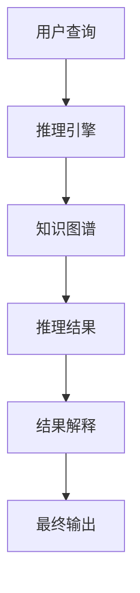

                 


# 知识图谱推理：提升AI Agent的逻辑分析

> **关键词**：知识图谱、AI Agent、逻辑推理、知识图谱构建、推理算法、系统架构  
> **摘要**：知识图谱作为一种强大的语义网络，为AI Agent提供了丰富的语义信息和逻辑推理能力。本文将详细探讨知识图谱的构建、推理算法以及在AI Agent中的应用，通过实际案例分析和系统架构设计，展示如何通过知识图谱推理提升AI Agent的逻辑分析能力。

---

# 第一部分: 知识图谱推理概述

## 第1章: 知识图谱的基本概念

### 1.1 知识图谱的定义与特点

知识图谱是一种以图结构形式表示知识的语义网络，由实体（概念、对象或事件）及其关系构成。与传统数据库不同，知识图谱不仅存储数据，还描述数据之间的语义关系，具有以下特点：

- **语义性**：通过关系和属性描述实体间的语义联系。
- **层次性**：支持复杂的层次结构，便于知识的组织和推理。
- **动态性**：支持实时更新和扩展，适应不断变化的知识需求。

### 1.2 知识图谱的构建过程

知识图谱的构建通常包括数据采集、预处理、实体识别与抽取、关系抽取和构建等步骤。以下是构建流程的简单示意图：



### 1.3 知识图谱的应用场景

知识图谱广泛应用于智能问答、实体链接、推荐系统等领域。例如，在智能问答中，知识图谱可以提供丰富的背景信息，帮助AI Agent更准确地回答问题。

---

## 第2章: 知识图谱推理的背景与意义

### 2.1 知识图谱推理的背景

随着AI Agent的广泛应用，提升其逻辑推理能力成为关键。知识图谱通过提供语义信息，帮助AI Agent更好地理解和处理复杂问题。

### 2.2 知识图谱推理的意义

知识图谱推理能够增强AI Agent的逻辑分析和决策能力，使其在处理复杂任务时表现更出色。

---

## 第3章: 知识图谱推理的核心概念

### 3.1 实体与关系

实体是知识图谱的基本单元，关系描述实体之间的联系。例如，实体“人”与“职业”之间的关系可以用以下Mermaid图表示：



### 3.2 知识图谱的结构

知识图谱的结构层次化，支持复杂的语义网络。以下是一个简单的知识图谱结构示意图：



### 3.3 知识图谱推理的类型

知识图谱推理包括基于规则的推理、基于路径的推理和基于学习的推理。以下是基于规则的推理流程：



---

# 第二部分: 知识图谱推理算法原理

## 第4章: 基于规则的推理算法

### 4.1 基于规则的推理原理

基于规则的推理通过预定义的规则进行推理。例如，规则可以表示为：

$$如果一个人是程序员，则他是从事编程工作的。$$

### 4.2 基于规则的推理实现

规则的存储与管理是关键，通常使用规则引擎进行处理。以下是一个简单的规则匹配流程：



---

## 第5章: 基于路径的推理算法

### 5.1 基于路径的推理原理

基于路径的推理通过在图中寻找路径来推导新的知识。例如，寻找从“人”到“职业”的路径：



### 5.2 基于路径的推理实现

使用广度优先搜索（BFS）或深度优先搜索（DFS）算法进行路径搜索。以下是一个简单的BFS实现：

```python
from collections import deque

def bfs(start, end, graph):
    queue = deque()
    queue.append(start)
    visited = set()
    visited.add(start)
    
    while queue:
        node = queue.popleft()
        if node == end:
            return True
        for neighbor in graph[node]:
            if neighbor not in visited:
                visited.add(neighbor)
                queue.append(neighbor)
    return False
```

---

## 第6章: 基于学习的推理算法

### 6.1 基于学习的推理原理

基于学习的推理使用机器学习模型（如图神经网络）进行推理。以下是一个简单的图神经网络结构：



### 6.2 基于学习的推理实现

使用图神经网络进行推理，以下是一个简单的PyTorch实现示例：

```python
import torch
import torch.nn as nn

class GCN(nn.Module):
    def __init__(self, input_dim, hidden_dim, output_dim):
        super(GCN, self).__init__()
        self.GCN_layer = nn.Linear(input_dim, hidden_dim)
        self.output_layer = nn.Linear(hidden_dim, output_dim)
        
    def forward(self, x):
        x = self.GCN_layer(x)
        x = self.output_layer(x)
        return x

# 示例输入
x = torch.randn(10, 5)  # 10个样本，5个特征
model = GCN(5, 10, 2)
output = model(x)
print(output)
```

---

# 第三部分: 知识图谱推理的系统架构设计

## 第7章: 系统功能设计

### 7.1 系统功能模块

知识图谱推理系统通常包括以下功能模块：

- **知识图谱构建模块**：负责知识图谱的构建和存储。
- **推理引擎模块**：负责根据输入查询进行推理。
- **结果解释模块**：将推理结果转化为可理解的形式。

### 7.2 系统架构设计

以下是知识图谱推理系统的架构示意图：



---

## 第8章: 项目实战

### 8.1 环境配置

安装必要的库：

```bash
pip install networkx
pip install py2neo
pip install torch
```

### 8.2 核心代码实现

以下是基于PyTorch的知识图谱推理代码示例：

```python
import torch
from torch import nn
from torch.utils.data import Dataset, DataLoader

class KnowledgeGraphDataset(Dataset):
    def __init__(self, X, y):
        self.X = X
        self.y = y
    def __len__(self):
        return len(self.X)
    def __getitem__(self, idx):
        return self.X[idx], self.y[idx]

class SimpleNN(nn.Module):
    def __init__(self, input_dim, hidden_dim, output_dim):
        super(SimpleNN, self).__init__()
        self.fc1 = nn.Linear(input_dim, hidden_dim)
        self.fc2 = nn.Linear(hidden_dim, output_dim)
        
    def forward(self, x):
        x = self.fc1(x)
        x = nn.ReLU()(x)
        x = self.fc2(x)
        return x

# 示例数据
X = torch.randn(100, 5)
y = torch.randn(100, 1)

dataset = KnowledgeGraphDataset(X, y)
dataloader = DataLoader(dataset, batch_size=32, shuffle=True)

model = SimpleNN(5, 10, 1)
criterion = nn.MSELoss()
optimizer = torch.optim.Adam(model.parameters(), lr=0.001)

for epoch in range(100):
    for batch_x, batch_y in dataloader:
        outputs = model(batch_x)
        loss = criterion(outputs, batch_y)
        loss.backward()
        optimizer.step()
        optimizer.zero_grad()
```

### 8.3 实际案例分析

通过实际案例分析，展示如何使用知识图谱推理提升AI Agent的逻辑分析能力。例如，在智能问答系统中，通过知识图谱推理可以更准确地回答复杂问题。

---

## 第9章: 最佳实践与总结

### 9.1 最佳实践

- **数据质量**：确保知识图谱的数据准确性和完整性。
- **算法选择**：根据具体任务选择合适的推理算法。
- **系统优化**：优化知识图谱的存储和查询效率。

### 9.2 小结

知识图谱推理是一种强大的技术，能够显著提升AI Agent的逻辑分析能力。通过合理的系统架构设计和算法选择，可以在实际应用中取得优异的效果。

### 9.3 注意事项

- **性能优化**：注意推理算法的计算复杂度和效率。
- **数据安全**：保护知识图谱中的敏感信息。

### 9.4 拓展阅读

- [知识图谱入门](https://zh.wikipedia.org/wiki/知识图谱)
- [图神经网络](https://zh.wikipedia.org/wiki/图神经网络)

---

# 作者：AI天才研究院 & 禅与计算机程序设计艺术

