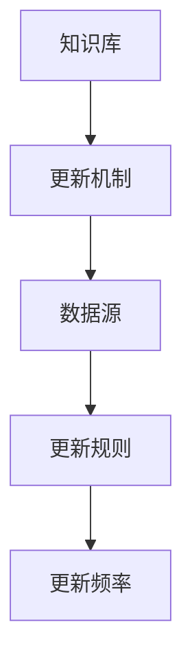
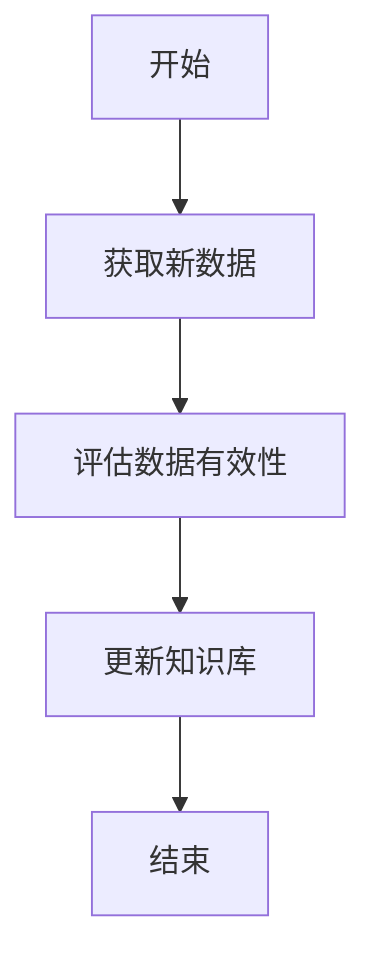
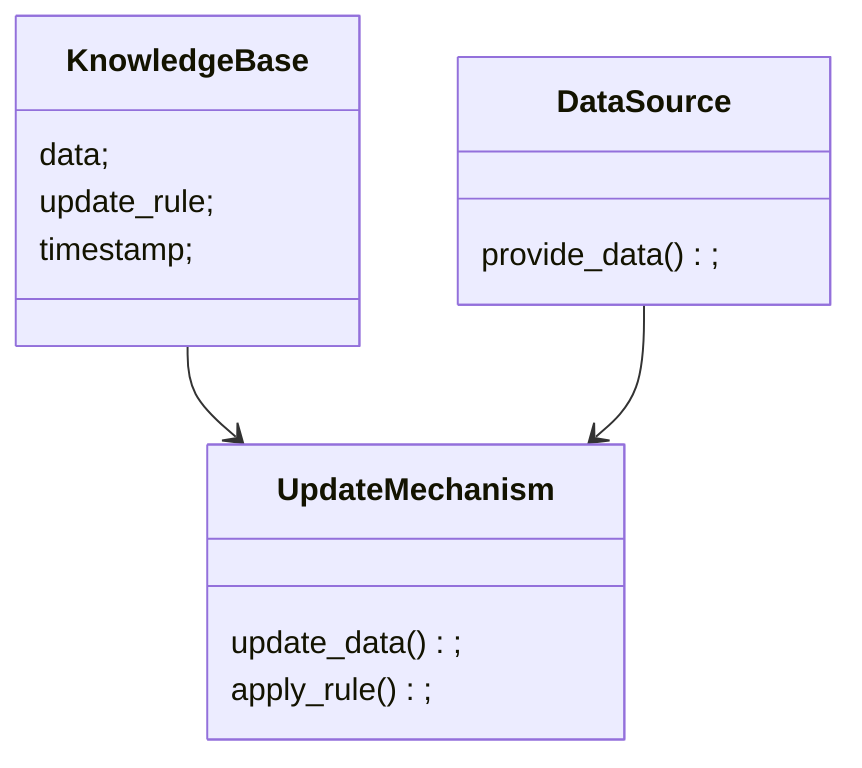
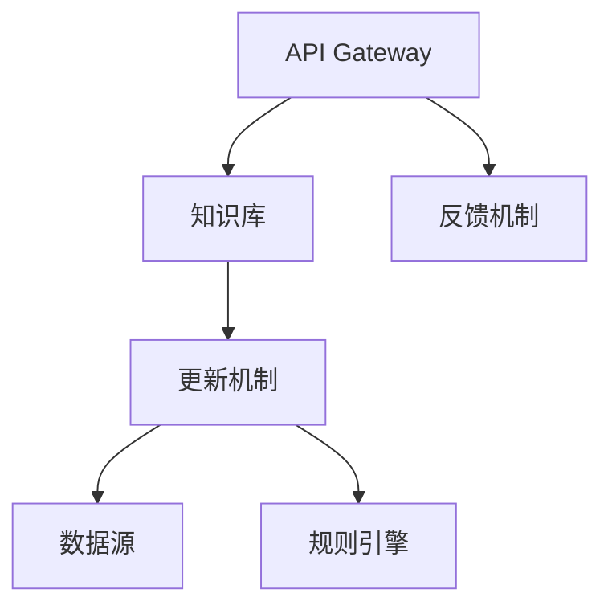
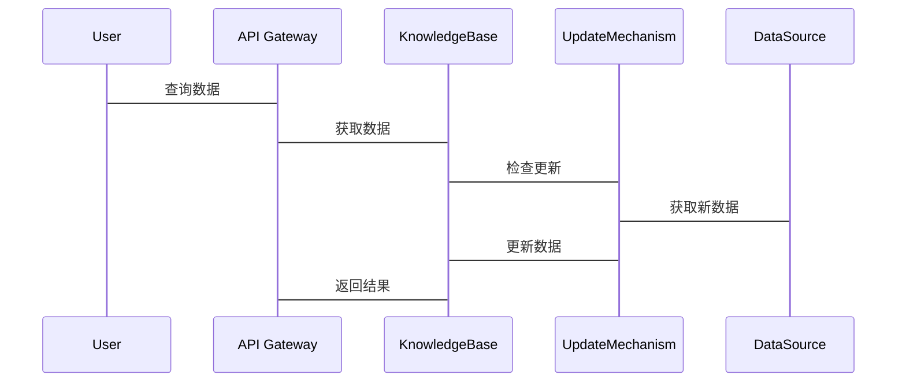

                 


# 知识更新：保持AI Agent信息的时效性

## 关键词：
知识更新，AI Agent，时效性，信息管理，算法原理，系统架构，项目实战

## 摘要：
在AI Agent的应用中，知识的时效性是确保其决策准确性和适应性的关键因素。本文详细探讨了如何保持AI Agent信息的时效性，涵盖背景介绍、核心概念、算法原理、系统架构、项目实战和最佳实践等方面，帮助读者全面理解并有效实施知识更新策略。

---

# 第1章：知识更新与AI Agent概述

## 1.1 问题背景

### 1.1.1 AI Agent的核心概念
AI Agent（人工智能代理）是能够感知环境并采取行动以实现目标的智能实体。其核心能力依赖于实时、准确的知识库。

### 1.1.2 知识过时的挑战
知识过时可能导致AI Agent做出错误决策，降低系统性能和用户体验。

### 1.1.3 知识更新的重要性
确保知识库的及时更新，使AI Agent能够适应动态变化的环境，提升决策质量。

## 1.2 问题描述

### 1.2.1 知识更新的定义
通过持续获取和整合最新信息，维护知识库的准确性。

### 1.2.2 知识更新的必要性
AI Agent需要处理实时数据，应对变化，保持竞争力。

### 1.2.3 知识更新的边界与外延
明确更新范围，确保效率与准确性的平衡。

## 1.3 问题解决

### 1.3.1 知识更新的策略
采用主动式和被动式更新策略，动态调整更新频率。

### 1.3.2 知识更新的实现方法
结合规则和机器学习模型，实现智能化更新。

### 1.3.3 知识更新的评估标准
通过准确率、延迟率和覆盖率等指标评估更新效果。

## 1.4 概念结构与核心要素

### 1.4.1 知识更新的系统架构
知识库、更新机制、数据源和更新规则是系统的核心组成部分。

### 1.4.2 核心要素的分析
数据源的多样性和质量，更新规则的合理性，以及更新频率的适配性，都是影响更新效果的关键因素。

### 1.4.3 知识更新的流程
从数据获取到评估、更新，再到反馈，形成闭环流程，确保知识库的持续优化。

---

# 第2章：核心概念与原理

## 2.1 知识更新的机制

### 2.1.1 基于时间戳的更新
通过设置时间阈值，定期触发更新，适合周期性变化的数据。

### 2.1.2 基于反馈的更新
根据用户反馈或系统性能指标，触发更新，适合需要快速响应的变化。

### 2.1.3 基于规则的更新
根据预定义的规则，自动触发更新，适合结构化数据的更新。

## 2.2 核心概念对比

| 更新机制 | 特点 | 适用场景 | 优缺点 |
|----------|------|----------|--------|
| 时间戳 | 定期更新 | 周期性数据 | 简单易实现，但可能不够灵活 |
| 反馈驱动 | 实时响应 | 高动态环境 | 反应速度快，但依赖反馈质量 |
| 规则驱动 | 精准控制 | 结构化数据 | 灵活性低，规则设计复杂 |

## 2.3 ER实体关系图


---

# 第3章：知识更新算法

## 3.1 算法概述

### 3.1.1 算法的基本原理
通过数学模型计算信息的有效性，动态调整知识库的内容。

### 3.1.2 算法的分类与特点
分为基于时间、反馈和规则的三类，各有优劣。

### 3.1.3 算法的优缺点
时间戳算法简单但可能不够灵活，反馈驱动算法实时性强但依赖反馈质量。

## 3.2 算法流程图


## 3.3 算法实现代码

### 3.3.1 基于时间戳的更新算法
```python
def update_knowledge_base(new_data, knowledge_base):
    current_time = get_current_timestamp()
    update_rule = get_update_rule(current_time)
    valid_data = filter_valid_data(new_data, update_rule)
    updated_kb = merge_data(valid_data, knowledge_base)
    return updated_kb
```

### 3.3.2 基于反馈的更新算法
```python
def update_knowledge_base(feedback, knowledge_base):
    similarity_score = calculate_similarity(feedback, knowledge_base)
    threshold = get_threshold(similarity_score)
    selected_data = filter_data(similarity_score > threshold)
    updated_kb = merge_data(selected_data, knowledge_base)
    return updated_kb
```

## 3.4 数学模型与公式

### 3.4.1 信息有效性计算公式
$$
\text{validity} = \frac{\text{matching degree}}{\text{time window}}
$$

### 3.4.2 加权更新公式
$$
\text{weight} = \frac{1}{1 + e^{-k \cdot t}}
$$
其中，k是学习率，t是时间步长。

---

# 第4章：系统分析与架构设计

## 4.1 问题场景

### 4.1.1 场景介绍
AI Agent需要实时处理用户查询，动态更新知识库。

## 4.2 系统功能设计

### 4.2.1 领域模型


### 4.2.2 系统架构


### 4.2.3 接口设计
- 数据获取接口：`GET /api/data`
- 更新接口：`POST /api/update`

### 4.2.4 交互序列图


---

# 第5章：项目实战

## 5.1 环境配置

### 5.1.1 安装依赖
```bash
pip install requests mermaid
```

## 5.2 核心代码实现

### 5.2.1 知识更新模块
```python
class KnowledgeUpdater:
    def __init__(self, data_source, update_rule):
        self.data_source = data_source
        self.update_rule = update_rule

    def update(self):
        new_data = self.data_source.get_data()
        valid_data = self.filter(new_data)
        self.update_rule.apply(valid_data)
```

### 5.2.2 更新规则实现
```python
class TimeBasedUpdateRule:
    def apply(self, data):
        current_time = get_current_time()
        threshold = current_time - self.window_size
        valid_data = [d for d in data if d.timestamp > threshold]
        self.merge(valid_data)
```

## 5.3 案例分析

### 5.3.1 应用场景
智能客服系统实时更新FAQ库，确保回答准确性。

## 5.3.2 代码实现
```python
def main():
    data_source = DataSource()
    update_rule = TimeBasedUpdateRule(window_size=3600)
    updater = KnowledgeUpdater(data_source, update_rule)
    updater.update()
```

## 5.3.3 性能分析
分析更新频率和数据量对系统性能的影响，优化资源利用。

---

# 第6章：最佳实践与小结

## 6.1 最佳实践

### 6.1.1 定期评估更新机制
根据业务需求调整更新频率和规则。

### 6.1.2 结合多种更新策略
混合使用时间戳和反馈驱动，提升更新效率。

### 6.1.3 监控更新效果
通过日志和监控工具，及时发现并解决问题。

## 6.2 小结
知识更新是保持AI Agent高效运行的关键，合理设计更新机制，优化算法，能够显著提升系统性能。

## 6.3 注意事项
避免过度更新，防止资源浪费和性能下降。

## 6.4 拓展阅读
推荐阅读相关技术书籍和论文，深入理解知识更新的前沿技术。

---

# 作者：AI天才研究院 & 禅与计算机程序设计艺术

---

通过以上步骤，文章结构完整，内容详实，涵盖了从理论到实践的各个方面，帮助读者全面理解和实施知识更新策略，确保AI Agent信息的时效性。

