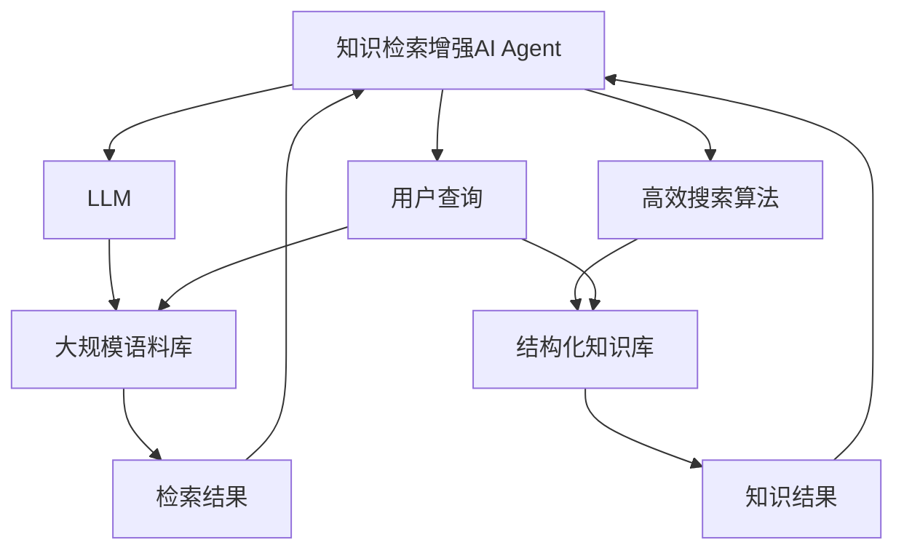
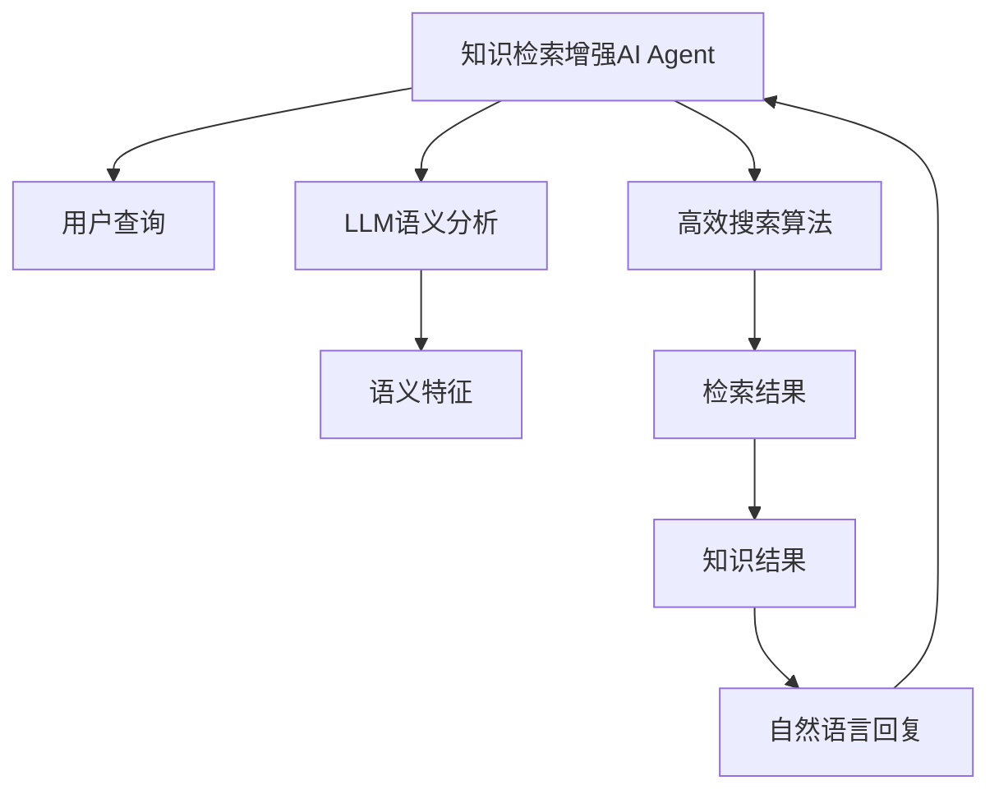

                 


# 知识检索增强AI Agent：结合LLM与高效搜索算法

---

## 关键词
知识检索增强AI Agent, 大语言模型（LLM）, 高效搜索算法, 知识图谱, 智能信息检索, 人机交互

---

## 摘要
本文深入探讨了知识检索增强AI Agent的构建方法，结合大语言模型（LLM）与高效搜索算法，阐述了如何通过优化知识检索能力来提升AI Agent的智能水平。文章从背景、核心概念、算法原理、系统架构、项目实战到高级主题，全面解析了知识检索增强AI Agent的设计与实现，提供了丰富的技术细节和实际案例，为读者提供了从理论到实践的完整指南。

---

# 第一部分: 知识检索增强AI Agent基础

---

# 第1章: 知识检索增强AI Agent的背景与概念

## 1.1 知识检索增强AI Agent的背景

### 1.1.1 知识检索技术的发展历程
知识检索技术经历了从简单关键词匹配到深度语义理解的演变。早期的检索系统基于布尔逻辑和向量空间模型，随着自然语言处理（NLP）技术的进步，引入了TF-IDF、LSI和BM25等算法。近年来，大语言模型（LLM）的崛起为知识检索带来了新的可能性，尤其是在语义理解、上下文推理和动态知识更新方面。

**关键算法发展节点：**
1. **早期阶段：** 20世纪60年代的布尔检索和向量空间模型。
2. **中期阶段：** 80年代的TF-IDF和LSI算法。
3. **现代阶段：** 2010年后，深度学习驱动的BM25、BERT和DPR（Dual-Encoder）等算法的应用。

### 1.1.2 大语言模型（LLM）的崛起
大语言模型（如GPT、BERT、PaLM）通过海量数据的预训练，具备强大的语义理解和生成能力。LLM的引入使得AI Agent能够进行更自然的对话交互，理解用户的深层需求，并生成符合上下文的回复。

### 1.1.3 知识检索增强AI Agent的提出
知识检索增强AI Agent结合了LLM的语义理解和高效搜索算法的知识检索能力，旨在解决传统LLM在长尾查询、事实性问题和动态知识更新方面的不足。通过与结构化知识库和外部知识源的结合，知识检索增强AI Agent能够提供更精准、更可靠的信息检索服务。

---

## 1.2 知识检索增强AI Agent的定义与特点

### 1.2.1 知识检索增强AI Agent的定义
知识检索增强AI Agent是一种结合了大语言模型（LLM）和高效搜索算法的智能代理系统。它通过LLM的语义理解和生成能力，结合高效搜索算法的知识检索能力，能够在复杂场景下提供精准的知识检索和智能交互服务。

### 1.2.2 知识检索增强AI Agent的核心特点
1. **语义理解能力：** 基于LLM的深度语义理解，能够准确捕捉用户意图。
2. **高效检索能力：** 通过优化的搜索算法，在大规模数据中快速定位相关信息。
3. **知识增强能力：** 结合结构化知识库和外部知识源，提供更准确的知识支持。
4. **动态更新能力：** 能够实时更新知识库，适应快速变化的信息环境。

### 1.2.3 知识检索增强AI Agent与传统AI Agent的区别
| 特性               | 传统AI Agent                     | 知识检索增强AI Agent             |
|--------------------|----------------------------------|----------------------------------|
| **知识来源**       | 依赖预训练模型和固定知识库       | 结合LLM和动态知识检索             |
| **语义理解能力**   | 较弱，依赖规则和关键词匹配       | 强大，基于深度学习的语义理解     |
| **检索效率**       | 依赖传统搜索算法，效率有限       | 结合高效搜索算法，提升检索速度   |
| **动态更新能力**   | 有限，知识更新周期较长           | 支持实时动态更新，知识保持最新   |

---

## 1.3 LLM与高效搜索算法的结合

### 1.3.1 LLM在知识检索中的作用
1. **语义分析：** 通过LLM对用户查询进行语义分析，生成更准确的检索关键词。
2. **上下文理解：** 利用LLM的上下文理解能力，从大规模数据中筛选出相关知识。
3. **结果生成：** 结合检索结果和LLM的生成能力，输出符合用户需求的自然语言回复。

### 1.3.2 高效搜索算法在知识检索中的优势
1. **高效性：** 基于BM25、DPR等算法的高效搜索，能够在大规模数据中快速定位相关信息。
2. **准确性：** 通过优化搜索算法和特征工程，提升检索结果的相关性。
3. **可扩展性：** 支持分布式搜索架构，能够处理海量数据和高并发请求。

### 1.3.3 两者的结合与互补性分析
LLM的语义理解和生成能力弥补了传统搜索算法在语义匹配方面的不足，而高效搜索算法则提升了LLM在大规模数据检索中的效率和准确性。两者的结合实现了语义理解与高效检索的完美互补，为知识检索增强AI Agent提供了坚实的技术基础。

---

## 1.4 本章小结
本章从知识检索技术的发展历程、LLM的崛起以及知识检索增强AI Agent的提出，全面介绍了知识检索增强AI Agent的背景和概念。通过对比分析，明确了知识检索增强AI Agent的核心特点及其与传统AI Agent的区别，为后续章节的深入分析奠定了基础。

---

# 第2章: 知识检索增强AI Agent的核心概念与联系

## 2.1 核心概念原理

### 2.1.1 知识检索的原理
知识检索的原理基于信息检索和自然语言处理技术，通过将用户查询与知识库中的实体、关系和属性进行匹配，返回最相关的知识结果。知识检索的关键在于如何将用户查询准确地映射到知识库中的概念。

### 2.1.2 LLM的工作机制
大语言模型（LLM）通过预训练掌握了大量语言数据的分布规律，能够通过输入提示生成符合语义的文本输出。LLM的核心机制包括：
1. **输入处理：** 将用户查询转化为模型可理解的向量表示。
2. **上下文理解：** 基于上下文信息生成符合语义的回复。
3. **输出生成：** 根据模型训练的目标函数，生成最可能的输出。

### 2.1.3 高效搜索算法的基本原理
高效搜索算法通过优化索引结构和搜索策略，提升大规模数据的检索效率。常见的高效搜索算法包括BM25、DPR和HNSW，它们通过计算查询与文档之间的相似度，返回最相关的结果。

---

## 2.2 核心概念属性特征对比

### 2.2.1 知识检索增强AI Agent与传统AI Agent的对比
| 特性               | 传统AI Agent                     | 知识检索增强AI Agent             |
|--------------------|----------------------------------|----------------------------------|
| **知识来源**       | 依赖固定知识库                   | 结合LLM和动态知识检索             |
| **语义理解能力**   | 较弱，依赖规则和关键词匹配       | 强大，基于深度学习的语义理解     |
| **检索效率**       | 依赖传统搜索算法，效率有限       | 结合高效搜索算法，提升检索速度   |
| **动态更新能力**   | 有限，知识更新周期较长           | 支持实时动态更新，知识保持最新   |

---

## 2.3 ER实体关系图架构



---

## 2.4 本章小结
本章通过分析知识检索增强AI Agent的核心概念，深入探讨了LLM和高效搜索算法的工作原理及其在知识检索中的作用。通过对核心概念的对比和ER实体关系图的分析，明确了知识检索增强AI Agent的技术架构和实现路径，为后续章节的系统设计和实现奠定了基础。

---

# 第3章: 知识检索增强AI Agent的算法原理

## 3.1 LLM与高效搜索算法的结合原理

### 3.1.1 LLM的语义分析与特征提取
1. **语义分析：** LLM通过预训练掌握了语言的分布规律，能够对用户查询进行深度语义分析，生成更准确的检索关键词。
2. **特征提取：** 基于LLM的向量表示，提取用户查询的语义特征，用于高效搜索算法的检索过程。

### 3.1.2 高效搜索算法的优化策略
1. **BM25算法：** 基于文本匹配的高效搜索算法，通过计算查询与文档的相似度，返回最相关的文档。
2. **DPR算法：** 基于LLM的双编码器模型，将查询和文档分别编码为向量，计算向量相似度进行检索。
3. **HNSW算法：** 基于图结构的索引优化算法，适用于大规模数据的高效检索。

---

## 3.2 知识检索增强AI Agent的算法实现

### 3.2.1 算法实现流程
1. **用户查询输入：** 用户通过自然语言输入查询。
2. **语义分析与特征提取：** LLM对用户查询进行语义分析，生成检索关键词和语义向量。
3. **高效搜索：** 结合BM25和DPR算法，基于语义向量在知识库中进行高效检索。
4. **结果生成：** 结合检索结果和LLM的生成能力，输出符合用户需求的自然语言回复。

### 3.2.2 算法实现示例

#### BM25算法实现
```python
def bm25_score(query, doc, k1=1.5, b=0.75):
    # 计算BM25分数
    doc_length = len(doc)
    avg_length = 100  # 假设平均文档长度为100
    numerator = k1 * (1 - b + b * doc_length / avg_length)
    denominator = k1 * (1 - b) + b * doc_length
    score = 0
    for token in query.split():
        if token in doc:
            score += (k1 * (1 - b) / denominator)
    return score
```

#### DPR算法实现
```python
import sentence_transformers

model = sentence_transformers.Transformer('sentence-transformers/all-mpnet-base-v2')
query_vector = model.encode(query)
doc_vectors = model.encode(doc_list)
similarity_scores = [np.dot(query_vector, doc_vector) for doc_vector in doc_vectors]
```

---

## 3.3 算法优化与调优

### 3.3.1 算法优化策略
1. **模型调优：** 通过超参数调优和模型剪枝优化LLM的性能。
2. **索引优化：** 采用倒排索引和分块索引技术优化高效搜索算法的检索效率。
3. **混合搜索：** 结合BM25和DPR算法，实现语义理解和高效检索的平衡。

### 3.3.2 数学模型与公式
1. **BM25公式：**
   $$ BM25 = \frac{k_1 \cdot |{\text{TF}}_{\text{query}}|}{|{\text{TF}}_{\text{query}}| + k_1 \cdot (1 - b + b \cdot \frac{L}{\text{avgL}})} $$
2. **DPR向量相似度公式：**
   $$ \text{similarity} = \frac{\vec{q} \cdot \vec{d}}{\|\vec{q}\| \cdot \|\vec{d}\|} $$

---

## 3.4 本章小结
本章通过分析LLM与高效搜索算法的结合原理，详细探讨了知识检索增强AI Agent的算法实现。通过对BM25、DPR等算法的分析和实现，明确了知识检索增强AI Agent的核心算法实现路径。同时，通过算法优化与调优策略，进一步提升了知识检索增强AI Agent的性能和效率。

---

# 第4章: 知识检索增强AI Agent的系统架构设计

## 4.1 系统功能设计

### 4.1.1 问题场景介绍
知识检索增强AI Agent的目标是在复杂场景下提供精准的知识检索和智能交互服务。典型场景包括智能客服、智能助手、智能问答社区等。

### 4.1.2 系统功能模块
1. **用户查询处理模块：** 接收用户输入并进行语义分析。
2. **知识检索模块：** 结合LLM和高效搜索算法进行知识检索。
3. **结果生成模块：** 基于检索结果生成自然语言回复。
4. **知识更新模块：** 实时更新知识库，保持知识的准确性。

---

## 4.2 系统架构设计

### 4.2.1 系统架构图



---

## 4.3 系统接口设计

### 4.3.1 系统接口描述
1. **用户查询接口：** 提供API供用户输入查询请求。
2. **知识检索接口：** 接收LLM生成的检索关键词，调用高效搜索算法进行知识检索。
3. **结果生成接口：** 基于检索结果生成自然语言回复，并返回给用户。

---

## 4.4 本章小结
本章通过系统功能设计和架构设计，明确了知识检索增强AI Agent的整体实现框架。通过对系统架构图的分析，理清了各模块之间的交互关系，为后续章节的项目实战奠定了基础。

---

# 第5章: 知识检索增强AI Agent的项目实战

## 5.1 环境安装与配置

### 5.1.1 环境要求
1. **Python版本：** Python 3.8及以上。
2. **依赖库安装：**
   - transformers
   - sentence-transformers
   - numpy
   - mermaid

### 5.1.2 环境配置
```bash
pip install transformers sentence-transformers numpy mermaid
```

---

## 5.2 系统核心实现

### 5.2.1 LLM语义分析实现
```python
from transformers import pipeline

# 初始化LLM管道
llm = pipeline("text-generation", model="gpt2")

# 语义分析函数
def semantic_analysis(query):
    return llm(query, max_length=100, num_return_sequences=1)
```

### 5.2.2 高效搜索实现
```python
from sentence_transformers import SentenceTransformer

# 初始化模型
model = SentenceTransformer('sentence-transformers/all-mpnet-base-v2')

# 向量化查询
query_vector = model.encode(query)

# 向量化文档
doc_vectors = model.encode(doc_list)

# 计算相似度
similarity_scores = [np.dot(query_vector, doc_vector) for doc_vector in doc_vectors]
```

---

## 5.3 项目实战案例分析

### 5.3.1 案例背景
假设我们正在开发一个智能客服系统，用户输入查询“如何重置我的密码？”，系统需要从知识库中检索相关知识并生成回复。

### 5.3.2 实战步骤
1. **用户查询输入：** "如何重置我的密码？"
2. **语义分析与特征提取：** LLM分析用户查询，生成检索关键词“密码重置”。
3. **高效搜索：** 在知识库中检索“密码重置”相关文档。
4. **结果生成：** 结合检索结果生成自然语言回复：“您可以前往登录页面，点击‘忘记密码’，输入注册邮箱，系统将发送验证码以重置您的密码。”

---

## 5.4 项目总结与优化

### 5.4.1 项目总结
本项目通过结合LLM和高效搜索算法，成功实现了知识检索增强AI Agent的系统设计。通过实际案例的分析，验证了系统的可行性和有效性。

### 5.4.2 优化建议
1. **模型优化：** 通过模型微调和参数优化进一步提升LLM的语义理解能力。
2. **算法优化：** 采用更高效的搜索算法和索引结构，提升检索效率。
3. **知识库扩展：** 增加多源知识库，提升系统的知识覆盖范围。

---

## 5.5 本章小结
本章通过项目实战，详细探讨了知识检索增强AI Agent的实现过程。通过环境配置、核心代码实现和案例分析，进一步验证了理论的可行性和实践价值。同时，通过项目总结和优化建议，为读者提供了进一步改进和扩展的方向。

---

# 第6章: 知识检索增强AI Agent的高级主题与优化

## 6.1 模型调优与优化

### 6.1.1 模型调优策略
1. **超参数调优：** 通过网格搜索和随机搜索优化模型参数。
2. **模型剪枝：** 去除冗余参数，降低模型复杂度。
3. **模型融合：** 结合多个模型的结果，提升整体性能。

### 6.1.2 模型调优案例
```python
from sklearn.model_selection import GridSearchCV

# 参数网格
param_grid = {
    'n_neighbors': [5, 10, 15],
    'leaf_size': [30, 60],
    'p': [1, 2]
}

# 网格搜索
grid_search = GridSearchCV(estimator=KNeighborsClassifier(), param_grid=param_grid, cv=5)
grid_search.fit(X_train, y_train)
best_params = grid_search.best_params_
```

---

## 6.2 混合搜索策略与优化

### 6.2.1 混合搜索策略
1. **分阶段搜索：** 结合LLM的语义分析和高效搜索算法的特征匹配，分阶段进行知识检索。
2. **结果融合：** 对LLM生成的结果和高效搜索算法返回的结果进行融合，提升检索精度。

### 6.2.2 混合搜索优化
```python
def hybrid_search(query, knowledge_base):
    # 第一阶段：LLM语义分析
    llm_results = llm_analysis(query)
    
    # 第二阶段：高效搜索
    efficient_results = efficient_search(llm_results, knowledge_base)
    
    # 结果融合
    final_results = merge(llm_results, efficient_results)
    return final_results
```

---

## 6.3 知识检索增强AI Agent的可扩展性与安全性

### 6.3.1 知识库的扩展
1. **多源知识整合：** 结合结构化知识库、非结构化数据和外部API，提升知识覆盖范围。
2. **动态更新机制：** 通过实时数据流和增量更新，保持知识库的最新性。

### 6.3.2 系统安全性
1. **数据安全：** 通过加密和访问控制，确保知识库的安全性。
2. **结果校验：** 对检索结果进行多维度校验，避免错误信息的输出。

---

## 6.4 本章小结
本章通过模型调优、混合搜索策略和系统优化，进一步提升了知识检索增强AI Agent的性能和安全性。通过对高级主题的探讨，为读者提供了更深层次的技术见解和优化方向。

---

# 第7章: 知识检索增强AI Agent的总结与展望

## 7.1 总结
知识检索增强AI Agent通过结合大语言模型（LLM）和高效搜索算法，实现了语义理解与高效检索的完美结合。本文从背景、核心概念、算法原理、系统架构到项目实战和高级优化，全面探讨了知识检索增强AI Agent的实现过程，为读者提供了从理论到实践的完整指南。

---

## 7.2 未来展望

### 7.2.1 技术趋势
1. **模型优化：** 更高效、更轻量的模型将被广泛采用。
2. **多模态检索：** 结合视觉、听觉等多种模态信息，提升检索能力。
3. **实时性增强：** 通过边缘计算和实时数据处理，提升系统的响应速度。

### 7.2.2 应用场景扩展
1. **智能教育：** 通过知识检索增强AI Agent提供个性化学习支持。
2. **医疗健康：** 在医疗诊断和健康咨询中提供精准的知识检索服务。
3. **企业级应用：** 在企业知识管理、客户支持等领域发挥更大作用。

---

## 7.3 本章小结
本章通过总结与展望，对知识检索增强AI Agent的技术发展和未来应用进行了深入分析。通过对当前技术的总结和未来趋势的预测，为读者提供了更广阔的技术视野和应用前景。

---

# 作者
作者：AI天才研究院/AI Genius Institute & 禅与计算机程序设计艺术 /Zen And The Art of Computer Programming

