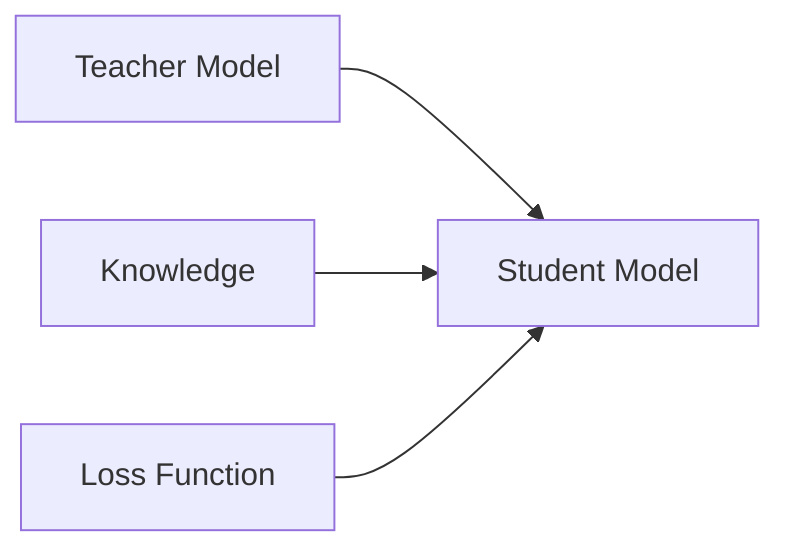
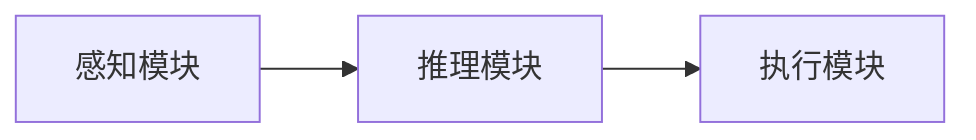
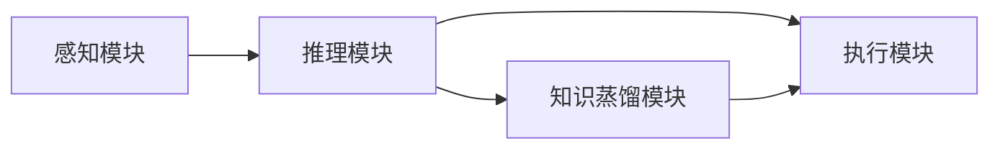

                 


# 知识蒸馏在AI Agent轻量化中的应用

## 关键词：知识蒸馏，AI Agent，轻量化，机器学习，迁移学习，深度学习

## 摘要：  
知识蒸馏是一种通过将大型模型的知识迁移到小型模型来实现模型轻量化的重要技术。本文将从背景介绍、核心概念、算法原理、系统架构、项目实战和最佳实践等方面，详细探讨知识蒸馏在AI Agent轻量化中的应用。通过理论分析与实践案例结合，本文旨在帮助读者理解如何利用知识蒸馏技术，有效降低AI Agent的计算复杂度，同时保持或提升其性能。

---

# 第1章: 知识蒸馏与AI Agent轻量化背景

## 1.1 知识蒸馏的基本概念  
知识蒸馏是一种机器学习技术，通过将大型模型（Teacher Model）的知识迁移到小型模型（Student Model），使小型模型能够继承大型模型的性能。其核心思想是将复杂的知识简化为可传递的形式，从而实现模型的轻量化。

### 1.1.1 知识蒸馏的定义与核心思想  
知识蒸馏（Knowledge Distillation）是一种通过教师模型（Teacher Model）和学生模型（Student Model）之间的知识传递，使学生模型能够学习到教师模型的知识。核心思想包括以下几点：
- **知识传递**：教师模型通过输出概率分布或其他特征，向学生模型传递知识。
- **蒸馏过程**：学生模型通过模仿教师模型的输出，逐步逼近教师模型的性能。
- **模型压缩**：通过蒸馏，学生模型在参数量和计算复杂度上远小于教师模型，但性能接近甚至超越教师模型。

### 1.1.2 知识蒸馏在AI Agent中的应用背景  
AI Agent是一种能够感知环境、执行任务并做出决策的智能体。在实际应用中，AI Agent需要具备高效的推理能力和快速的响应速度。然而，复杂的AI模型往往参数量大、计算复杂度高，难以在资源受限的场景中部署。知识蒸馏技术为解决这一问题提供了有效的解决方案。

### 1.1.3 知识蒸馏的优势与局限性  
知识蒸馏的优势：
- **模型轻量化**：通过蒸馏，可以在不损失性能的前提下，显著减少模型的参数量和计算复杂度。
- **迁移性**：适用于不同任务和数据集，能够在资源受限的场景中快速部署。
- **灵活性**：支持多种模型结构和任务，适用性强。

知识蒸馏的局限性：
- **依赖教师模型**：蒸馏效果严重依赖教师模型的质量，若教师模型性能不佳，蒸馏后的学生模型也无法达到理想效果。
- **计算成本**：蒸馏过程需要多次迭代，计算成本较高。
- **领域适应性**：蒸馏后的模型在特定领域的适应性可能需要额外的微调。

---

## 1.2 AI Agent的基本概念  
AI Agent是一种能够感知环境、执行任务并做出决策的智能体。它广泛应用于自然语言处理、计算机视觉、机器人控制等领域。

### 1.2.1 AI Agent的定义与分类  
AI Agent的定义：
- AI Agent是一个能够感知环境、采取行动以实现目标的实体。
- 它可以是软件程序、机器人或其他智能系统。

AI Agent的分类：
- **按智能水平**：
  - 单智Agent：只能完成单一任务。
  - 多智Agent：能够处理复杂任务，具备自主决策能力。
- **按环境类型**：
  - 简单环境：与环境的交互简单直接。
  - 复杂环境：环境动态复杂，任务目标多样。
- **按应用领域**：
  - 自然语言处理Agent。
  - 计算机视觉Agent。
  - 机器人控制Agent。

### 1.2.2 AI Agent的核心功能与应用场景  
AI Agent的核心功能：
- **感知**：通过传感器或数据输入感知环境。
- **推理**：基于感知信息进行逻辑推理，做出决策。
- **行动**：根据决策执行具体操作。

应用场景：
- **智能客服**：通过自然语言处理帮助用户解决问题。
- **自动驾驶**：通过计算机视觉和决策系统实现自动驾驶。
- **智能助手**：通过语音交互协助用户完成日常任务。

### 1.2.3 AI Agent与传统AI的区别  
AI Agent与传统AI的区别：
- **自主性**：AI Agent具备自主决策能力，而传统AI依赖外部指令。
- **环境交互**：AI Agent能够与环境动态交互，而传统AI通常在静态环境中运行。
- **适应性**：AI Agent能够根据环境变化调整行为，而传统AI通常需要重新训练。

---

## 1.3 知识蒸馏在AI Agent轻量化中的作用  
知识蒸馏技术在AI Agent轻量化中发挥着关键作用，主要体现在以下几个方面：

### 1.3.1 轻量化AI Agent的必要性  
AI Agent的轻量化需求：
- **资源受限场景**：在移动设备、边缘计算等资源受限的场景中，AI Agent需要具备轻量化的特性。
- **快速部署**：轻量化模型可以快速部署到各种设备中，减少计算成本。
- **实时响应**：轻量化模型能够实现快速推理，满足实时响应的需求。

### 1.3.2 知识蒸馏如何实现AI Agent的轻量化  
知识蒸馏通过将教师模型的知识迁移到学生模型，显著减少了模型的参数量和计算复杂度，同时保持或提升模型的性能。具体步骤如下：
1. **教师模型训练**：首先训练一个性能优秀的教师模型。
2. **知识蒸馏过程**：通过蒸馏过程，将教师模型的知识迁移到学生模型中。
3. **学生模型优化**：通过优化算法，进一步提升学生模型的性能。

### 1.3.3 轻量化AI Agent的应用前景  
随着AI技术的快速发展，轻量化AI Agent的应用前景广阔：
- **移动设备**：在手机、平板等移动设备上部署轻量化AI Agent，实现本地智能服务。
- **边缘计算**：在边缘设备上部署轻量化AI Agent，减少云端依赖，提升响应速度。
- **物联网**：在物联网设备中部署轻量化AI Agent，实现智能感知和决策。

---

## 1.4 本章小结  
本章主要介绍了知识蒸馏和AI Agent的基本概念，以及知识蒸馏在AI Agent轻量化中的作用。通过本章的介绍，读者可以理解知识蒸馏技术在AI Agent轻量化中的重要性，为后续章节的学习奠定基础。

---

# 第2章: 知识蒸馏的核心概念与原理  

## 2.1 知识蒸馏的原理  
知识蒸馏的原理主要包括以下几个方面：

### 2.1.1 知识蒸馏的基本流程  
知识蒸馏的基本流程包括以下步骤：
1. **教师模型训练**：首先训练一个性能优秀的教师模型。
2. **蒸馏过程**：通过蒸馏过程，将教师模型的知识迁移到学生模型中。
3. **学生模型优化**：通过优化算法，进一步提升学生模型的性能。

### 2.1.2 知识蒸馏的关键技术  
知识蒸馏的关键技术包括：
- **温度调整**：通过调整输出概率分布的“温度”，使学生模型能够更好地逼近教师模型的输出。
- **蒸馏损失函数**：通过定义合适的蒸馏损失函数，衡量学生模型与教师模型之间的差异。
- **知识集成**：将教师模型的特征和标签信息进行集成，提升学生模型的性能。

### 2.1.3 知识蒸馏的数学模型  
知识蒸馏的数学模型如下所示：

$$
\text{蒸馏损失} = \lambda \cdot D_{KL}(P_{\text{teacher}} || P_{\text{student}}) + (1-\lambda) \cdot \text{交叉熵损失}(P_{\text{label}}, P_{\text{student}})
$$

其中：
- $\lambda$：蒸馏系数，控制蒸馏损失和交叉熵损失的权重。
- $D_{KL}$：KL散度，衡量两个概率分布之间的差异。
- $P_{\text{teacher}}$：教师模型的输出概率分布。
- $P_{\text{student}}$：学生模型的输出概率分布。
- $P_{\text{label}}$：真实标签的概率分布。

---

## 2.2 知识蒸馏的核心概念对比  

### 2.2.1 知识蒸馏与模型压缩的对比  
| 对比维度 | 知识蒸馏 | 模型压缩 |
|----------|----------|----------|
| 核心思想 | 将教师模型的知识迁移到学生模型 | 直接减少模型参数量 |
| 适用场景 | 需要保持或提升性能的情况下 | 需要显著减少模型规模的情况下 |
| 优缺点   | 保持性能，但需要额外的训练过程 | 参数减少明显，但可能损失部分性能 |

### 2.2.2 知识蒸馏与模型剪枝的对比  
| 对比维度 | 知识蒸馏 | 模型剪枝 |
|----------|----------|----------|
| 核心思想 | 将教师模型的知识迁移到学生模型 | 删除模型中冗余的参数或结构 |
| 适用场景 | 需要保持或提升性能的情况下 | 需要显著减少模型规模的情况下 |
| 优缺点   | 保持性能，但需要额外的训练过程 | 参数减少明显，但可能损失部分性能 |

### 2.2.3 知识蒸馏与知识迁移的对比  
| 对比维度 | 知识蒸馏 | 知识迁移 |
|----------|----------|----------|
| 核心思想 | 将教师模型的知识迁移到学生模型 | 将知识从一个任务迁移到另一个任务 |
| 适用场景 | 需要保持或提升性能的情况下 | 需要跨任务迁移的情况下 |
| 优缺点   | 保持性能，但需要额外的训练过程 | 适用于跨任务迁移，但可能需要更多的调整 |

---

## 2.3 知识蒸馏的ER实体关系图  


---

## 2.4 本章小结  
本章主要介绍了知识蒸馏的核心概念与原理，包括基本流程、关键技术、数学模型以及与其他轻量化技术的对比。通过本章的介绍，读者可以深入理解知识蒸馏的原理和优势，为后续章节的学习奠定基础。

---

# 第3章: 知识蒸馏算法的原理与实现  

## 3.1 知识蒸馏算法的流程  

### 3.1.1 知识蒸馏的基本流程  
知识蒸馏的基本流程包括以下步骤：
1. **教师模型训练**：首先训练一个性能优秀的教师模型。
2. **蒸馏过程**：通过蒸馏过程，将教师模型的知识迁移到学生模型中。
3. **学生模型优化**：通过优化算法，进一步提升学生模型的性能。

### 3.1.2 知识蒸馏的关键步骤  
知识蒸馏的关键步骤包括：
- **教师模型输出**：教师模型对输入样本进行推理，得到概率分布或特征表示。
- **学生模型学习**：学生模型通过模仿教师模型的输出，逐步逼近教师模型的性能。
- **蒸馏损失计算**：通过计算学生模型与教师模型之间的差异，优化学生模型的参数。

### 3.1.3 知识蒸馏的优化策略  
知识蒸馏的优化策略包括：
- **调整温度系数**：通过调整温度系数，控制输出概率分布的“软化”程度。
- **结合交叉熵损失**：将蒸馏损失与交叉熵损失结合，平衡教师模型和真实标签的影响。
- **多教师蒸馏**：引入多个教师模型，通过多教师蒸馏进一步提升学生模型的性能。

---

## 3.2 知识蒸馏算法的数学模型  

### 3.2.1 蒸馏损失函数  
蒸馏损失函数的定义如下：

$$
\text{蒸馏损失} = \lambda \cdot D_{KL}(P_{\text{teacher}} || P_{\text{student}}) + (1-\lambda) \cdot \text{交叉熵损失}(P_{\text{label}}, P_{\text{student}})
$$

其中：
- $\lambda$：蒸馏系数，控制蒸馏损失和交叉熵损失的权重。
- $D_{KL}$：KL散度，衡量两个概率分布之间的差异。
- $P_{\text{teacher}}$：教师模型的输出概率分布。
- $P_{\text{student}}$：学生模型的输出概率分布。
- $P_{\text{label}}$：真实标签的概率分布。

### 3.2.2 蒸馏过程中的温度调整  
温度调整是知识蒸馏中的一个重要技巧。通过调整温度系数，可以控制输出概率分布的“软化”程度。具体公式如下：

$$
P_{\text{teacher}} = \text{Softmax}(\frac{Z_{\text{teacher}}}{T})
$$

其中：
- $Z_{\text{teacher}}$：教师模型的输出 logits。
- $T$：温度系数，$T > 1$时，概率分布更分散，$T < 1$时，概率分布更集中。

---

## 3.3 知识蒸馏算法的实现  

### 3.3.1 环境安装与配置  
要实现知识蒸馏算法，首先需要安装以下环境：
- **Python**：推荐使用Python 3.6及以上版本。
- **深度学习框架**：推荐使用TensorFlow或PyTorch。
- **依赖库**：安装必要的库，例如numpy、scikit-learn等。

### 3.3.2 核心代码实现  

```python
import tensorflow as tf
import numpy as np

# 定义教师模型
def teacher_model(input):
    model = tf.keras.Sequential([
        tf.keras.layers.Dense(128, activation='relu'),
        tf.keras.layers.Dense(10, activation='softmax')
    ])
    return model

# 定义学生模型
def student_model(input):
    model = tf.keras.Sequential([
        tf.keras.layers.Dense(64, activation='relu'),
        tf.keras.layers.Dense(10, activation='softmax')
    ])
    return model

# 定义蒸馏损失函数
def distillation_loss(y_true, y_pred, y_teacher, T=1.0, alpha=0.5):
    loss Classification = tf.keras.losses.sparse_categorical_crossentropy(y_true, y_pred)
    loss Distillation = tf.keras.losses.KLDivergence()(
        tf.nn.softmax(y_teacher / T), tf.nn.softmax(y_pred / T)
    )
    return alpha * loss_Classification + (1 - alpha) * loss_Distillation

# 训练教师模型
teacher = teacher_model(input)
teacher.compile(optimizer='adam', loss='sparse_categorical_crossentropy', metrics=['accuracy'])
teacher.fit(X_train, y_train, epochs=10, batch_size=32)

# 训练学生模型
student = student_model(input)
student.compile(optimizer='adam', loss=lambda y_true, y_pred: distillation_loss(y_true, y_pred, teacher.predict(X_train), T=2.0, alpha=0.5))
student.fit(X_train, y_train, epochs=10, batch_size=32)
```

### 3.3.3 代码解读与分析  
上述代码实现了一个简单的知识蒸馏算法，主要包括以下步骤：
1. **定义教师模型和学生模型**：教师模型和学生模型的结构不同，教师模型通常比学生模型复杂。
2. **定义蒸馏损失函数**：蒸馏损失函数包括交叉熵损失和KL散度损失，通过调整系数$\alpha$和温度系数$T$，实现知识蒸馏。
3. **训练教师模型**：首先训练教师模型，得到教师模型的输出。
4. **训练学生模型**：通过蒸馏损失函数，训练学生模型，使其逼近教师模型的输出。

---

## 3.4 本章小结  
本章详细介绍了知识蒸馏算法的原理与实现，包括基本流程、数学模型、优化策略和代码实现。通过本章的介绍，读者可以理解知识蒸馏算法的核心思想，并能够通过代码实现简单的知识蒸馏过程。

---

# 第4章: 知识蒸馏在AI Agent系统中的架构设计  

## 4.1 系统功能设计  
AI Agent系统的主要功能包括：
- **感知环境**：通过传感器或数据输入感知环境。
- **推理与决策**：基于感知信息进行逻辑推理，做出决策。
- **执行操作**：根据决策执行具体操作。

### 4.1.1 系统功能模块  
AI Agent系统的主要功能模块包括：
1. **感知模块**：负责感知环境信息。
2. **推理模块**：负责逻辑推理和决策。
3. **执行模块**：负责执行具体操作。

### 4.1.2 功能模块的交互关系  
功能模块的交互关系如下：



---

## 4.2 系统架构设计  

### 4.2.1 系统架构概述  
AI Agent系统的架构设计如下：



### 4.2.2 知识蒸馏模块的设计  
知识蒸馏模块的主要功能包括：
- **教师模型输出**：教师模型对输入样本进行推理，得到概率分布或特征表示。
- **学生模型学习**：学生模型通过模仿教师模型的输出，逐步逼近教师模型的性能。
- **蒸馏损失计算**：通过计算学生模型与教师模型之间的差异，优化学生模型的参数。

---

## 4.3 系统接口设计  

### 4.3.1 系统输入接口  
AI Agent系统的输入接口包括：
- **感知输入**：环境传感器的输入数据。
- **用户输入**：用户的操作指令或输入数据。

### 4.3.2 系统输出接口  
AI Agent系统的输出接口包括：
- **推理结果**：推理模块的输出结果。
- **执行操作**：执行模块的输出操作。

---

## 4.4 系统交互流程  

### 4.4.1 系统交互流程概述  
系统交互流程如下：
1. **感知环境**：感知模块接收环境传感器的输入数据。
2. **推理与决策**：推理模块基于感知数据进行逻辑推理，做出决策。
3. **执行操作**：执行模块根据决策结果执行具体操作。
4. **知识蒸馏**：知识蒸馏模块通过蒸馏过程，优化推理模块的性能。

### 4.4.2 知识蒸馏模块的交互流程  
知识蒸馏模块的交互流程如下：


---

## 4.5 本章小结  
本章主要介绍了AI Agent系统的架构设计，包括功能模块、系统架构、接口设计和交互流程。通过本章的介绍，读者可以理解知识蒸馏技术在AI Agent系统中的应用，为后续章节的学习奠定基础。

---

# 第5章: 知识蒸馏在AI Agent轻量化中的项目实战  

## 5.1 项目背景与目标  
### 5.1.1 项目背景  
随着AI技术的快速发展，AI Agent的应用场景越来越广泛。然而，复杂的AI模型往往参数量大、计算复杂度高，难以在资源受限的场景中部署。知识蒸馏技术为解决这一问题提供了有效的解决方案。

### 5.1.2 项目目标  
本项目的目标是通过知识蒸馏技术，实现一个轻量化AI Agent系统，能够在资源受限的场景中高效运行。

---

## 5.2 项目实现  

### 5.2.1 环境安装与配置  
要实现本项目，首先需要安装以下环境：
- **Python**：推荐使用Python 3.6及以上版本。
- **深度学习框架**：推荐使用TensorFlow或PyTorch。
- **依赖库**：安装必要的库，例如numpy、scikit-learn等。

### 5.2.2 核心代码实现  

```python
import tensorflow as tf
import numpy as np

# 定义教师模型
def teacher_model(input):
    model = tf.keras.Sequential([
        tf.keras.layers.Dense(128, activation='relu'),
        tf.keras.layers.Dense(10, activation='softmax')
    ])
    return model

# 定义学生模型
def student_model(input):
    model = tf.keras.Sequential([
        tf.keras.layers.Dense(64, activation='relu'),
        tf.keras.layers.Dense(10, activation='softmax')
    ])
    return model

# 定义蒸馏损失函数
def distillation_loss(y_true, y_pred, y_teacher, T=1.0, alpha=0.5):
    loss Classification = tf.keras.losses.sparse_categorical_crossentropy(y_true, y_pred)
    loss Distillation = tf.keras.losses.KLDivergence()(
        tf.nn.softmax(y_teacher / T), tf.nn.softmax(y_pred / T)
    )
    return alpha * loss_Classification + (1 - alpha) * loss_Distillation

# 训练教师模型
teacher = teacher_model(input)
teacher.compile(optimizer='adam', loss='sparse_categorical_crossentropy', metrics=['accuracy'])
teacher.fit(X_train, y_train, epochs=10, batch_size=32)

# 训练学生模型
student = student_model(input)
student.compile(optimizer='adam', loss=lambda y_true, y_pred: distillation_loss(y_true, y_pred, teacher.predict(X_train), T=2.0, alpha=0.5))
student.fit(X_train, y_train, epochs=10, batch_size=32)
```

### 5.2.3 项目实战分析  
通过上述代码实现，我们可以看到知识蒸馏技术在AI Agent轻量化中的具体应用。教师模型经过训练后，通过蒸馏过程将知识迁移到学生模型中，显著减少了模型的参数量和计算复杂度，同时保持或提升模型的性能。

---

## 5.3 本章小结  
本章通过一个具体的项目实战，详细介绍了知识蒸馏技术在AI Agent轻量化中的应用。通过本章的介绍，读者可以理解知识蒸馏技术的实际应用价值，并能够通过代码实现简单的知识蒸馏过程。

---

# 第6章: 知识蒸馏在AI Agent轻量化中的最佳实践  

## 6.1 知识蒸馏的最佳实践  

### 6.1.1 选择合适的教师模型  
选择合适的教师模型是知识蒸馏成功的关键。通常，教师模型应该具备以下特点：
- **性能优秀**：教师模型应该在源任务上表现出色。
- **结构复杂**：教师模型通常比学生模型复杂，能够提供丰富的特征信息。
- **可解释性强**：教师模型的输出应该具有较高的可解释性，便于蒸馏过程中的信息提取。

### 6.1.2 设置合理的蒸馏参数  
设置合理的蒸馏参数是知识蒸馏成功的重要因素。通常需要考虑以下参数：
- **温度系数**：温度系数$T$的设置直接影响输出概率分布的“软化”程度。
- **蒸馏系数**：蒸馏系数$\alpha$的设置需要平衡蒸馏损失和交叉熵损失的影响。
- **训练策略**：训练策略包括训练轮数、批量大小、学习率等，需要根据具体任务进行调整。

### 6.1.3 优化学生模型的性能  
优化学生模型的性能是知识蒸馏成功的关键。通常可以采取以下措施：
- **网络结构优化**：通过调整学生模型的网络结构，使其能够更好地逼近教师模型的输出。
- **正则化技术**：通过引入正则化技术，防止学生模型过拟合。
- **数据增强**：通过数据增强技术，增加训练数据的多样性，提升学生模型的泛化能力。

---

## 6.2 知识蒸馏在AI Agent轻量化中的注意事项  

### 6.2.1 知识蒸馏的依赖性  
知识蒸馏的依赖性：
- **教师模型的质量**：蒸馏效果严重依赖教师模型的质量，若教师模型性能不佳，蒸馏后的学生模型也无法达到理想效果。
- **蒸馏参数的设置**：蒸馏参数的设置需要根据具体任务进行调整，否则可能影响蒸馏效果。

### 6.2.2 知识蒸馏的计算成本  
知识蒸馏的计算成本：
- **训练时间**：蒸馏过程需要多次迭代，计算成本较高。
- **计算资源**：蒸馏过程需要大量的计算资源，可能需要高性能计算设备。

### 6.2.3 知识蒸馏的适用场景  
知识蒸馏的适用场景：
- **资源受限场景**：在移动设备、边缘计算等资源受限的场景中，知识蒸馏技术能够显著减少模型的计算复杂度。
- **快速部署场景**：知识蒸馏技术可以通过轻量化模型快速部署到各种设备中，减少云端依赖，提升响应速度。

---

## 6.3 知识蒸馏的扩展阅读  

### 6.3.1 知识蒸馏的改进方法  
知识蒸馏的改进方法包括：
- **多教师蒸馏**：引入多个教师模型，通过多教师蒸馏进一步提升学生模型的性能。
- **自适应蒸馏**：根据任务需求，自适应地调整蒸馏参数和教师模型。
- **领域适应性**：通过领域适应性蒸馏，提升学生模型在特定领域的适应性。

### 6.3.2 知识蒸馏的最新研究  
知识蒸馏的最新研究包括：
- **自监督蒸馏**：通过自监督学习，实现无标签数据的知识蒸馏。
- **无监督蒸馏**：通过无监督学习，实现无标签数据的知识蒸馏。
- **多模态蒸馏**：通过多模态数据，实现跨模态的知识蒸馏。

---

## 6.4 本章小结  
本章主要介绍了知识蒸馏在AI Agent轻量化中的最佳实践，包括最佳实践、注意事项和扩展阅读。通过本章的介绍，读者可以理解知识蒸馏技术的实际应用价值，并能够根据具体任务进行调整和优化。

---

# 作者：AI天才研究院/AI Genius Institute & 禅与计算机程序设计艺术 /Zen And The Art of Computer Programming  

---

通过以上章节的详细讲解，我们全面探讨了知识蒸馏在AI Agent轻量化中的应用，从理论到实践，从算法到系统设计，为读者提供了一个全面的知识框架。希望本文能够帮助读者更好地理解知识蒸馏技术，并能够在实际应用中灵活运用这一技术，实现AI Agent的轻量化和高效部署。

