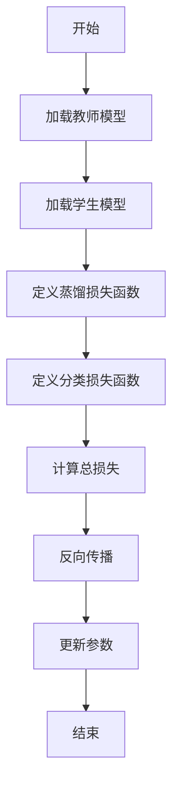
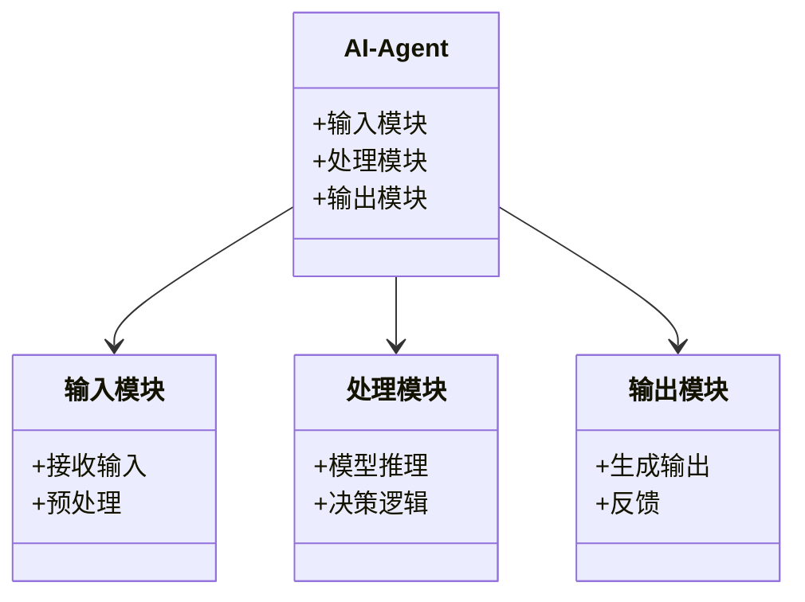

                 


# 知识蒸馏技术在AI Agent轻量化中的创新应用

> 关键词：知识蒸馏技术, AI Agent, 模型压缩, 轻量化设计, 人工智能

> 摘要：随着人工智能技术的快速发展，AI Agent（人工智能代理）在各个领域的应用日益广泛。然而，AI Agent的复杂性和计算成本也带来了挑战，尤其是在资源受限的环境中。知识蒸馏技术作为一种有效的模型压缩方法，能够将复杂模型的知识迁移到更小、更高效的模型中，从而实现AI Agent的轻量化设计。本文将深入探讨知识蒸馏技术的核心原理、算法实现及其在AI Agent轻量化中的创新应用，并通过实际案例分析其优势与挑战。

---

## 第1章 知识蒸馏技术概述

### 1.1 知识蒸馏技术的定义与核心概念

知识蒸馏技术是一种用于模型压缩的技术，旨在将复杂模型（教师模型）的知识迁移到简单模型（学生模型）中。通过蒸馏过程，学生模型能够继承教师模型的决策能力和性能，同时显著降低计算复杂度和资源消耗。

#### 1.1.1 知识蒸馏的定义
知识蒸馏技术通过教师模型的预测概率分布（软标签）或类别标签（硬标签）作为监督信号，指导学生模型的学习过程。与传统迁移学习不同，蒸馏技术直接传递教师模型的知识，而非依赖特征提取。

#### 1.1.2 知识蒸馏的核心概念
- **教师模型（Teacher Model）**：复杂、性能强大的模型，用于生成指导信息。
- **学生模型（Student Model）**：简单的模型，目标是通过蒸馏过程学习教师模型的知识。
- **软标签（Soft Labels）**：教师模型输出的概率分布，通常通过.softmax函数生成。
- **硬标签（Hard Labels）**：教师模型输出的类别标签，通常通过argmax函数生成。

#### 1.1.3 知识蒸馏技术的背景与意义
随着深度学习模型的复杂性不断增加，计算资源的消耗也急剧上升。知识蒸馏技术通过压缩模型体积，降低了计算成本，同时保持了模型的性能，为AI Agent在资源受限环境中的应用提供了可能。

---

### 1.2 AI Agent的基本概念与轻量化需求

#### 1.2.1 AI Agent的定义与分类
AI Agent是一种能够感知环境、自主决策并执行任务的智能体。根据功能和应用场景，AI Agent可以分为以下几类：
- **简单反射型Agent**：基于当前输入做出反应，无内部状态。
- **基于模型的反射型Agent**：具有环境模型，能够规划动作。
- **目标驱动型Agent**：根据目标选择最优动作。
- **实用驱动型Agent**：通过效用函数优化决策。

#### 1.2.2 AI Agent的轻量化需求
AI Agent的应用场景多样，包括自动驾驶、智能助手、机器人控制等。在资源受限的环境中，AI Agent需要满足以下轻量化需求：
- **低计算资源消耗**：减少对计算能力的需求。
- **低存储需求**：降低模型体积和参数数量。
- **快速响应**：提高推理速度。

#### 1.2.3 轻量化AI Agent的挑战与机遇
- **挑战**：AI Agent的性能与模型复杂性密切相关，轻量化可能导致性能下降。
- **机遇**：知识蒸馏技术能够有效平衡模型复杂性和性能，为AI Agent的轻量化提供了新的思路。

---

## 第2章 知识蒸馏技术的核心原理

### 2.1 知识蒸馏技术的核心概念

知识蒸馏技术通过教师模型的软标签或硬标签，指导学生模型的学习过程。以下是知识蒸馏技术的核心步骤：

#### 2.1.1 知识蒸馏的基本原理
1. **教师模型训练**：训练一个复杂、性能强大的教师模型。
2. **软标签生成**：教师模型对输入样本生成概率分布（软标签）。
3. **学生模型训练**：学生模型通过最小化软标签与自身输出的差异，学习教师模型的知识。

#### 2.1.2 知识蒸馏的关键步骤
1. **知识表示**：通过教师模型的输出表示知识。
2. **知识传递**：通过损失函数将知识迁移到学生模型。
3. **模型优化**：通过优化算法调整学生模型参数。

#### 2.1.3 知识蒸馏与传统蒸馏技术的对比
| 对比维度 | 知识蒸馏 | 传统蒸馏技术 |
|----------|----------|--------------|
| 知识表示 | 软标签（概率分布） | 硬标签（类别标签） |
| 适用场景 | 高维特征学习 | 低维特征学习 |
| 性能优势 | 更细粒度的知识迁移 | 较粗粒度的知识迁移 |

---

### 2.2 知识蒸馏技术的数学模型与公式

知识蒸馏技术的核心数学模型是基于KL散度的损失函数：

$$ L = \lambda \cdot KL(D_{\text{teacher}}(y) \| D_{\text{student}}(y)) $$

其中：
- $$ D_{\text{teacher}}(y) $$ 表示教师模型输出的概率分布。
- $$ D_{\text{student}}(y) $$ 表示学生模型输出的概率分布。
- $$ \lambda $$ 是调节系数，用于平衡蒸馏损失和其他损失（如分类损失）。

---

## 第3章 知识蒸馏技术的算法实现

### 3.1 知识蒸馏算法的流程图

以下是一个简单的知识蒸馏算法流程图：



---

### 3.2 知识蒸馏算法的Python实现

以下是一个简单的知识蒸馏算法实现示例：

```python
import torch
import torch.nn as nn
import torch.optim as optim

class TeacherModel(nn.Module):
    def __init__(self):
        super().__init__()
        self.fc = nn.Linear(10, 5)

    def forward(self, x):
        return torch.softmax(x, dim=1)

class StudentModel(nn.Module):
    def __init__(self):
        super().__init__()
        self.fc = nn.Linear(10, 5)

    def forward(self, x):
        return torch.softmax(x, dim=1)

def distillation_loss(student_output, teacher_output, alpha=0.5):
    criterion = nn.KLDivLoss()
    loss_kl = criterion(torch.log(student_output), torch.log(teacher_output))
    return alpha * loss_kl

teacher = TeacherModel()
student = StudentModel()
optimizer = optim.Adam(student.parameters())

for epoch in range(num_epochs):
    optimizer.zero_grad()
    # 前向传播
    teacher_output = teacher(x)
    student_output = student(x)
    # 计算损失
    loss_kl = distillation_loss(student_output, teacher_output)
    loss_total = loss_kl
    # 反向传播
    loss_total.backward()
    optimizer.step()
```

---

## 第4章 AI Agent的轻量化设计与实现

### 4.1 轻量化AI Agent的系统架构

以下是一个轻量化AI Agent的系统架构图：



---

### 4.2 轻量化AI Agent的实现方案

#### 4.2.1 实现方案的设计思路
1. **模型压缩**：使用知识蒸馏技术压缩教师模型，生成轻量级学生模型。
2. **系统优化**：优化AI Agent的输入、处理和输出模块，减少资源消耗。
3. **性能测试**：通过实验验证轻量化AI Agent的性能和资源消耗。

#### 4.2.2 实现方案的核心代码
以下是一个轻量化AI Agent的实现示例：

```python
class LightAIAssistant:
    def __init__(self):
        self.model = StudentModel()
        self.model.load_state_dict(torch.load('student.pth'))

    def process_input(self, input_data):
        # 输入预处理
        processed_data = self.preprocess(input_data)
        return processed_data

    def generate_output(self, processed_data):
        # 模型推理
        output = self.model.predict(processed_data)
        return output
```

---

## 第5章 知识蒸馏技术在AI Agent中的创新应用

### 5.1 知识蒸馏技术的应用场景

知识蒸馏技术在AI Agent中的应用场景包括：

1. **低功耗设备**：如智能手表、嵌入式设备等，需要轻量级AI Agent。
2. **实时推理**：如自动驾驶、实时语音识别等，需要快速响应。
3. **边缘计算**：在边缘设备中部署AI Agent，减少云依赖。

---

### 5.2 知识蒸馏技术的创新点

知识蒸馏技术的创新点在于：

1. **高效知识传递**：通过软标签实现细粒度的知识传递，提高学生模型的性能。
2. **模型压缩效果**：显著降低模型体积，减少计算成本。
3. **多任务学习**：支持多任务知识蒸馏，提升AI Agent的综合能力。

---

## 第6章 总结与展望

### 6.1 总结

知识蒸馏技术通过压缩复杂模型，实现了AI Agent的轻量化设计，为资源受限环境中的AI应用提供了新的解决方案。本文详细探讨了知识蒸馏技术的核心原理、算法实现及其在AI Agent中的创新应用，并通过实际案例展示了其优势与挑战。

### 6.2 未来研究方向

1. **多模态蒸馏**：探索多模态知识蒸馏技术，提升AI Agent的多任务能力。
2. **自适应蒸馏**：研究自适应蒸馏算法，动态优化知识传递过程。
3. **分布式蒸馏**：探索分布式蒸馏技术，提升大规模模型的压缩效率。

### 6.3 应用建议

在实际应用中，建议结合具体场景选择合适的蒸馏技术，并通过实验验证其效果。同时，需要注意模型压缩可能导致的性能损失，通过优化算法和系统设计，平衡模型复杂性和性能。

---

## 作者

作者：AI天才研究院/AI Genius Institute & 禅与计算机程序设计艺术 /Zen And The Art of Computer Programming

