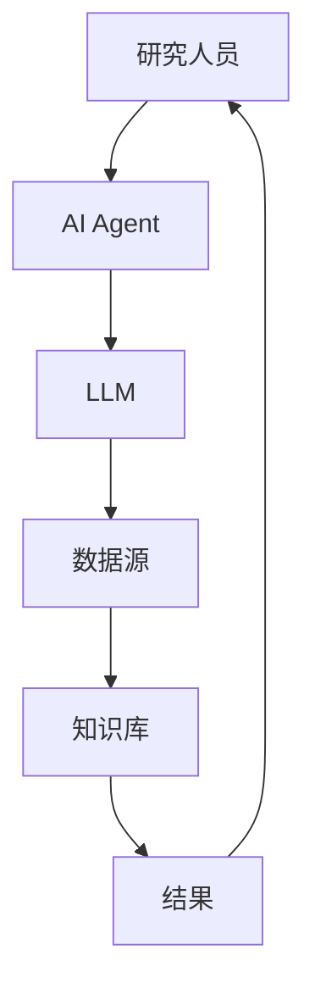
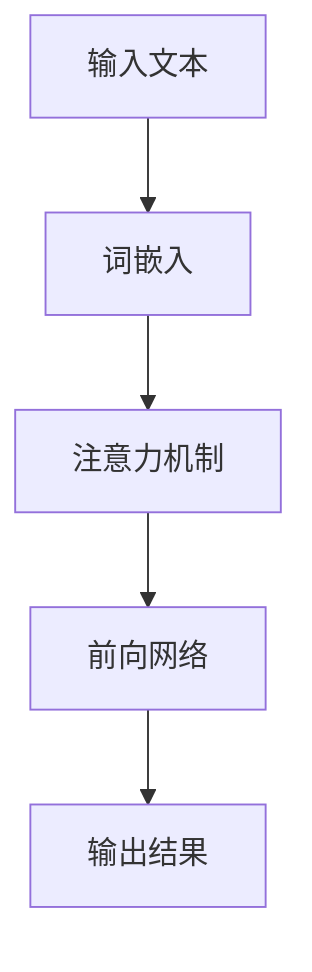
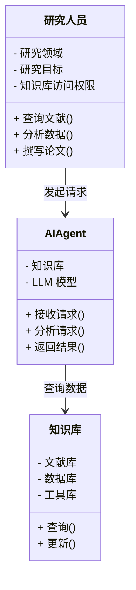

                 


# 研发助手 AI Agent：LLM 在科研过程中的辅助作用

## 关键词：AI Agent，LLM，科研，自然语言处理，人工智能技术，研发工具，知识库

## 摘要：本文探讨了AI Agent在科研过程中的辅助作用，详细介绍了大语言模型（LLM）如何帮助研究人员进行文献检索、数据分析、论文撰写等任务。通过分析AI Agent的核心概念、算法原理、系统架构以及实际案例，展示了LLM在科研中的巨大潜力和实际应用价值。

---

## 第1章：研发助手 AI Agent 的概述

### 1.1 AI Agent 的基本概念

#### 1.1.1 AI Agent 的定义
AI Agent（人工智能代理）是指能够感知环境、执行任务并做出决策的智能实体。它通过与用户的交互或环境的反馈，自主完成特定目标。AI Agent可以是软件程序、机器人或其他智能设备。

#### 1.1.2 AI Agent 的核心特征
- **自主性**：能够自主决策和行动，无需外部干预。
- **反应性**：能够实时感知环境并做出反应。
- **目标导向**：基于目标驱动行为，优化决策过程。
- **学习能力**：通过数据和经验不断优化自身能力。

#### 1.1.3 AI Agent 的分类与应用场景
AI Agent可以分为**简单反射型**、**基于模型的反应型**、**目标驱动型**和**实用驱动型**。在科研领域，AI Agent主要用于文献检索、数据分析、论文撰写、实验设计等场景。

### 1.2 LLM 在 AI Agent 中的作用

#### 1.2.1 大语言模型的定义与特点
大语言模型（LLM，Large Language Model）是一种基于深度学习的自然语言处理模型，具有以下特点：
- **大规模训练数据**：通常基于互联网文本或专业领域数据训练。
- **强大的上下文理解能力**：能够理解长文本的语义和逻辑。
- **多任务能力**：可以通过微调完成多种任务，如翻译、问答、文本生成等。

#### 1.2.2 LLM 在 AI Agent 中的应用价值
LLM作为AI Agent的核心模块，提供了强大的自然语言处理能力，能够帮助研究人员完成以下任务：
- **文献检索与整理**：自动查找相关文献并提取关键信息。
- **数据分析与可视化**：将实验数据转换为图表和报告。
- **论文撰写与优化**：自动生成论文草稿并提出改进建议。

#### 1.2.3 LLM 与传统 AI 的对比
| 对比维度 | LLM | 传统 AI |
|----------|------|----------|
| 数据需求 | 高   | 较低     |
| 任务通用性 | 高   | 较低     |
| 模型复杂度 | 高   | 较低     |
| 应用场景 | 多样化 | 专业化    |

### 1.3 研发过程中的 AI Agent 辅助作用

#### 1.3.1 科研过程的阶段划分
科研过程通常包括以下阶段：
1. **问题定义**：明确研究目标和方向。
2. **文献调研**：收集和分析相关领域的研究成果。
3. **实验设计**：设计实验方案并执行。
4. **数据分析**：处理实验数据并得出结论。
5. **论文撰写**：整理研究成果并撰写论文。

#### 1.3.2 AI Agent 在各阶段的具体作用
- **问题定义阶段**：AI Agent可以提供领域内的最新研究进展，帮助研究人员明确研究方向。
- **文献调研阶段**：AI Agent可以自动检索文献并生成文献综述。
- **实验设计阶段**：AI Agent可以提供实验方案建议并预测实验结果。
- **数据分析阶段**：AI Agent可以自动处理数据并生成可视化图表。
- **论文撰写阶段**：AI Agent可以协助撰写论文并检查语法错误。

#### 1.3.3 边界与外延
AI Agent在科研中的应用边界主要在于其语言理解和生成能力的限制。目前，AI Agent主要辅助研究人员完成基础性、重复性任务，而复杂的创造性任务仍需人类主导。

---

## 第2章：AI Agent 的核心概念与联系

### 2.1 AI Agent 的核心概念

#### 2.1.1 AI Agent 的功能模块
- **感知模块**：负责接收输入信息并进行解析。
- **决策模块**：基于感知信息做出决策。
- **执行模块**：根据决策执行具体任务。
- **学习模块**：通过反馈优化自身能力。

#### 2.1.2 LLM 在 AI Agent 中的数学模型
大语言模型通常基于Transformer架构，其核心公式为：
$$
\text{Attention}(Q, K, V) = \text{softmax}\left(\frac{QK^T}{\sqrt{d_k}}\right)V
$$

其中：
- $Q$：查询向量。
- $K$：键向量。
- $V$：值向量。
- $d_k$：键向量的维度。

#### 2.1.3 AI Agent 的系统架构
AI Agent的系统架构通常包括以下部分：
1. **用户接口**：与用户进行交互。
2. **任务管理模块**：负责任务的分解和调度。
3. **知识库**：存储相关领域的知识和数据。
4. **LLM 模块**：提供自然语言处理能力。
5. **执行模块**：调用外部工具或系统执行任务。

### 2.2 核心概念的对比分析

#### 2.2.1 AI Agent 与传统 AI 的对比
- **AI Agent**：具有自主性和目标导向性，能够独立完成任务。
- **传统 AI**：通常专注于特定任务，缺乏自主性和目标导向性。

#### 2.2.2 LLM 与其他 AI 技术的对比
- **LLM**：基于大规模数据训练，具有强大的语言处理能力。
- **传统 NLP 技术**：依赖于规则和特征工程，处理能力有限。

#### 2.2.3 AI Agent 在科研中的独特优势
- **智能化**：能够理解并执行复杂的任务。
- **高效性**：能够快速处理大量数据并生成结果。
- **可扩展性**：可以应用于多个科研领域。

### 2.3 实体关系图与流程图

#### 2.3.1 AI Agent 实体关系图
```mermaid
er
    actor 研究人员
    actor 研发过程
    actor AI Agent
    actor LLM
    actor 数据源
    actor 知识库
```

#### 2.3.2 AI Agent 工作流程图


---

## 第3章：AI Agent 的算法原理讲解

### 3.1 大语言模型的训练过程

#### 3.1.1 监督学习与微调
- **监督学习**：模型在标注数据上进行训练，学习输入输出的映射关系。
- **微调**：在特定领域数据上进行微调，提升模型在该领域的表现。

#### 3.1.2 强化学习
- 模型通过与环境交互获得奖励，优化自身的策略。

#### 3.1.3 模型流程图


### 3.2 算法实现

#### 3.2.1 环境安装
```bash
pip install transformers
```

#### 3.2.2 核心代码实现
```python
from transformers import AutoModelForMaskedLM, AutoTokenizer

model_name = "bert-base-uncased"
model = AutoModelForMaskedLM.from_pretrained(model_name)
tokenizer = AutoTokenizer.from_pretrained(model_name)
```

---

## 第4章：系统分析与架构设计方案

### 4.1 系统功能设计

#### 4.1.1 领域模型类图


### 4.2 系统架构设计

#### 4.2.1 系统架构图


---

## 第5章：项目实战

### 5.1 环境安装
```bash
pip install transformers
```

### 5.2 核心代码实现
```python
from transformers import AutoModelForMaskedLM, AutoTokenizer

model_name = "bert-base-uncased"
model = AutoModelForMaskedLM.from_pretrained(model_name)
tokenizer = AutoTokenizer.from_pretrained(model_name)
```

### 5.3 案例分析
通过实际案例展示AI Agent在科研中的应用，例如帮助研究人员自动撰写论文摘要或分析实验数据。

---

## 第6章：最佳实践、小结与注意事项

### 6.1 最佳实践
- **数据质量**：确保训练数据的多样性和代表性。
- **模型选择**：根据具体任务选择合适的模型和参数。
- **人机协作**：AI Agent应作为辅助工具，而非替代研究人员。

### 6.2 小结
本文详细探讨了AI Agent在科研过程中的辅助作用，展示了大语言模型如何帮助研究人员提高效率。未来，随着技术的进步，AI Agent将在更多科研领域发挥重要作用。

### 6.3 注意事项
- AI Agent的应用需遵守相关法律法规和伦理规范。
- 在使用AI Agent时，需注意数据隐私和安全问题。

---

## 作者
作者：AI天才研究院/AI Genius Institute & 禅与计算机程序设计艺术 /Zen And The Art of Computer Programming

---

以上是完整的技术博客文章，涵盖了从背景介绍到项目实战的各个方面，内容详实且结构清晰。

