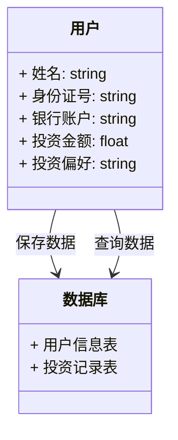
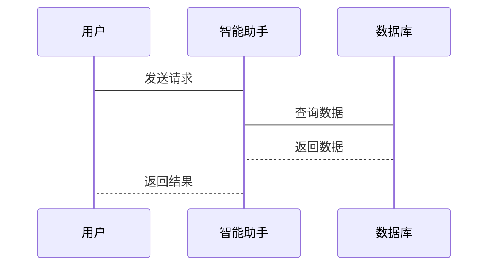

                 


# 确保投资理财智能助手的数据安全与隐私保护

> 关键词：数据安全，隐私保护，投资理财，智能助手，加密技术，访问控制，合规性

> 摘要：本文旨在探讨如何确保投资理财智能助手的数据安全与隐私保护。随着数字化投资理财工具的普及，用户数据的安全性与隐私保护变得至关重要。本文从数据安全的核心概念、加密算法的原理、系统架构设计以及实际项目实现等方面，详细分析了如何在投资理财智能助手中构建 robust 的数据安全与隐私保护机制。通过理论与实践相结合的方式，本文为读者提供了全面的技术指导。

---

## 第一部分: 数据安全与隐私保护的背景与核心概念

### 第1章: 数据安全与隐私保护的背景介绍

#### 1.1 数据安全的重要性

##### 1.1.1 数字化时代的数据价值
在数字化时代，数据已成为最重要的资产之一。对于投资理财智能助手而言，用户提供的个人信息、财务数据、交易记录等都具有高度的商业价值。这些数据不仅包含了用户的敏感信息，还可能被用于金融犯罪或商业竞争。

##### 1.1.2 投资理财中的数据特点
投资理财智能助手处理的数据具有以下特点：
- **敏感性**：涉及用户的财务状况、投资偏好等。
- **多样性**：包括用户的基本信息、交易记录、市场数据等。
- **实时性**：需要快速处理和响应用户的操作。

##### 1.1.3 数据安全问题的现状与趋势
近年来，数据泄露事件频发，尤其是在金融领域。投资理财智能助手作为直接接触用户敏感数据的工具，面临着更高的安全风险。此外，随着法规的日益严格（如GDPR、CCPA等），数据安全与隐私保护已成为企业和开发者不可忽视的责任。

---

#### 1.2 投资理财智能助手的背景与需求

##### 1.2.1 智能投资理财助手的功能与目标
投资理财智能助手通常具备以下功能：
- 提供个性化的投资建议。
- 管理用户的财务资产。
- 监测市场动态。
- 自动生成投资报告。

其目标是通过智能化的手段，帮助用户优化投资决策，提升投资效率。

##### 1.2.2 用户数据的敏感性与隐私保护需求
投资理财数据的敏感性体现在以下几个方面：
- 用户的个人身份信息（如姓名、身份证号）。
- 财务数据（如银行账户、投资金额）。
- 投资行为数据（如交易记录、投资偏好）。

为了保护用户的隐私，投资理财智能助手必须在数据的采集、存储、传输和使用过程中，采取严格的安全措施。

##### 1.2.3 相关法律法规与合规要求
在全球范围内，数据保护法规日益严格。例如：
- **欧盟《通用数据保护条例》（GDPR）**：要求企业明确数据处理的目的，并获得用户的同意。
- **加州《消费者隐私法案》（CCPA）**：赋予消费者对其数据的更多控制权。
- **中国《个人信息保护法》**：明确规定了数据处理者的责任和义务。

投资理财智能助手的开发者必须确保其产品符合这些法律法规的要求。

---

#### 1.3 数据安全与隐私保护的核心问题

##### 1.3.1 数据泄露的风险
数据泄露可能导致以下后果：
- 用户的财务损失。
- 企业的声誉受损。
- 法律责任追究。

##### 1.3.2 数据滥用的潜在危害
数据滥用可能表现为：
- 未经授权的第三方获取用户数据。
- 数据被用于不当的商业用途。

##### 1.3.3 数据加密与访问控制的必要性
为了防止数据泄露和滥用，必须采取以下措施：
- 数据在存储和传输过程中进行加密。
- 实施严格的访问控制策略，确保只有授权人员能够访问敏感数据。

---

#### 1.4 本章小结

本章从数据安全的重要性、投资理财智能助手的背景与需求以及数据安全与隐私保护的核心问题三个方面进行了分析。我们认识到，在数字化时代，数据安全与隐私保护是投资理财智能助手成功的关键因素之一。接下来，我们将深入探讨数据安全与隐私保护的核心概念与技术。

---

## 第二部分: 数据安全与隐私保护的核心概念与技术

### 第2章: 数据安全与隐私保护的核心概念

#### 2.1 数据安全的基本原理

##### 2.1.1 数据加密的原理与方法
数据加密是保护数据安全的核心技术之一。常见的加密方法包括：
- **对称加密**：使用相同的密钥进行加密和解密（如AES）。
- **非对称加密**：使用公钥加密和私钥解密（如RSA）。

##### 2.1.2 数据完整性与真实性保障
数据完整性确保数据在传输过程中未被篡改，常用的技术包括哈希函数（如SHA-256）。

##### 2.1.3 数据访问控制的机制
访问控制通过权限管理，确保只有授权的用户或系统能够访问敏感数据。

#### 2.2 数据隐私保护的实现方式

##### 2.2.1 数据匿名化技术
数据匿名化通过去标识化技术，去除数据中可以唯一识别个人的信息。

##### 2.2.2 数据最小化原则
数据最小化要求仅收集实现功能所必需的数据。

##### 2.2.3 数据持有者的责任与义务
数据持有者必须确保数据的合规性，采取技术措施防止数据泄露。

#### 2.3 数据安全与隐私保护的对比分析

##### 2.3.1 数据安全与隐私保护的联系与区别
- **联系**：数据安全是实现隐私保护的基础。
- **区别**：数据安全关注数据的整体保护，而隐私保护关注个人数据的保护。

##### 2.3.2 数据安全与隐私保护的权衡与协调
在实际应用中，需要在数据的可用性与安全性之间找到平衡点。

##### 2.3.3 数据安全与隐私保护的法律框架
不同国家和地区的法律法规对数据安全与隐私保护的要求有所不同。

---

#### 2.4 本章小结

本章详细介绍了数据安全与隐私保护的核心概念，包括数据加密、访问控制、数据匿名化等技术。通过对比分析，我们明确了数据安全与隐私保护的联系与区别。接下来，我们将深入探讨数据安全与隐私保护的算法原理。

---

## 第三部分: 数据安全与隐私保护的算法原理

### 第3章: 数据加密算法的原理与实现

#### 3.1 对称加密算法

##### 3.1.1 AES加密算法的原理
AES（高级加密标准）是一种常用的对称加密算法，其加密过程如下：
1. 将明文分为多个块。
2. 对每个块进行加密，生成密文。

##### 3.1.2 AES加密的数学模型
AES的加密过程涉及多个线性变换，其数学模型可以表示为：
$$ C = E(K, P) $$ 
其中，$C$ 是密文，$K$ 是密钥，$P$ 是明文。

##### 3.1.3 AES加密的Python实现代码
```python
from cryptography.hazmat.primitives.ciphers import Cipher, algorithms, modes
from cryptography.hazmat.primitives.asymmetric import padding
import os

key = os.urandom(16)  # 16字节的随机密钥
cipher = Cipher(algorithms.AES(256), modes.ECB())
encryptor = cipher.encryptor()
ciphertext = encryptor.update(b"明文") + encryptor.finalize()
```

#### 3.2 非对称加密算法

##### 3.2.1 RSA加密算法的原理
RSA是一种常用的非对称加密算法，其加密过程如下：
1. 生成公钥和私钥。
2. 使用公钥对明文进行加密。
3. 使用私钥对密文进行解密。

##### 3.2.2 RSA加密的数学模型
RSA的加密过程涉及大数运算，其数学模型可以表示为：
$$ C = (P \mod N)^e \mod N $$
其中，$C$ 是密文，$P$ 是明文，$N$ 是模数，$e$ 是公钥指数。

##### 3.2.3 RSA加密的Python实现代码
```python
from cryptography.hazmat.primitives.asymmetric.rsa import generate_private_key, PublicKey
import os

key = generate_private_key(2048)
public_key = key.public_key()
ciphertext = public_key.encrypt(b"明文", padding.PKCS1v15())
```

#### 3.3 哈希函数

##### 3.3.1 SHA-256哈希函数的原理
SHA-256是一种常见的哈希函数，其哈希值长度为256位。

##### 3.3.2 SHA-256哈希函数的数学模型
哈希函数的数学模型可以表示为：
$$ H(P) = \text{SHA-256}(P) $$
其中，$P$ 是明文，$H(P)$ 是哈希值。

##### 3.3.3 SHA-256哈希函数的Python实现代码
```python
import hashlib

hash_object = hashlib.sha256(b"明文").hexdigest()
print(hash_object)
```

#### 3.4 数据加密算法的对比分析

##### 3.4.1 对称加密与非对称加密的优缺点对比
| 特性             | 对称加密          | 非对称加密         |
|------------------|-------------------|---------------------|
| 加密速度         | 快               | 慢                 |
| 密钥管理         | 易               | 难                 |
| 适用场景         | 数据加密          | 数字签名、公钥加密 |

##### 3.4.2 哈希函数在数据完整性中的应用
哈希函数可以用于验证数据的完整性，确保数据在传输过程中未被篡改。

##### 3.4.3 数据加密算法的适用场景分析
- 对称加密适用于数据量大、对加密速度要求高的场景。
- 非对称加密适用于需要数字签名或公钥加密的场景。

---

#### 3.5 本章小结

本章详细介绍了几种常用的数据加密算法，包括对称加密、非对称加密和哈希函数。通过对这些算法的原理和实现的分析，我们明确了它们的优缺点及适用场景。接下来，我们将探讨投资理财智能助手的系统架构设计。

---

## 第四部分: 数据安全与隐私保护的系统架构设计

### 第4章: 投资理财智能助手的系统分析

#### 4.1 系统功能需求分析

##### 4.1.1 用户数据的采集与处理
投资理财智能助手需要采集用户的个人信息、财务数据等，并进行清洗和预处理。

##### 4.1.2 数据存储与管理
数据存储需要考虑数据的安全性和可用性，通常采用数据库技术。

##### 4.1.3 数据传输与通信
数据在传输过程中需要加密，以防止被截获和篡改。

#### 4.2 系统功能设计

##### 4.2.1 领域模型类图


##### 4.2.2 系统架构图


##### 4.2.3 系统接口与交互序列图


#### 4.3 系统架构设计

##### 4.3.1 问题场景介绍
在投资理财智能助手的系统架构设计中，需要考虑数据的安全性和可用性。例如，如何防止数据被未经授权的访问，如何确保数据在传输过程中的完整性。

##### 4.3.2 项目介绍
本项目旨在设计一个投资理财智能助手，确保其数据安全与隐私保护。

##### 4.3.3 系统功能设计
系统功能设计包括数据采集、数据存储、数据传输和数据处理四个部分。

##### 4.3.4 系统架构设计
系统架构设计采用分层架构，包括用户层、业务逻辑层和数据访问层。

##### 4.3.5 系统接口设计
系统接口设计需要考虑数据的加密传输和权限控制。

##### 4.3.6 系统交互序列图
系统交互序列图描述了用户与智能助手之间的交互流程，确保数据的安全传输。

---

#### 4.4 本章小结

本章通过系统分析与架构设计，明确了投资理财智能助手的系统功能需求、架构设计和接口设计。我们通过领域模型类图、系统架构图和系统交互序列图，详细描述了系统的架构设计。接下来，我们将探讨投资理财智能助手的项目实现。

---

## 第五部分: 投资理财智能助手的项目实战

### 第5章: 项目实战

#### 5.1 环境安装

##### 5.1.1 安装Python环境
需要安装Python 3.6或更高版本。

##### 5.1.2 安装相关库
需要安装以下Python库：
- `cryptography`: 用于加密操作。
- `pymysql`: 用于数据库连接。

##### 5.1.3 安装步骤
```bash
pip install cryptography pymysql
```

#### 5.2 系统核心实现

##### 5.2.1 核心代码实现
```python
from cryptography.hazmat.primitives.ciphers import Cipher, algorithms, modes
from cryptography.hazmat.primitives.asymmetric import padding
import pymysql
import os

# 数据加密函数
def encrypt_data(key, data):
    cipher = Cipher(algorithms.AES(256), modes.ECB())
    encryptor = cipher.encryptor()
    return encryptor.update(data) + encryptor.finalize()

# 数据解密函数
def decrypt_data(key, ciphertext):
    cipher = Cipher(algorithms.AES(256), modes.ECB())
    decryptor = cipher.decryptor()
    return decryptor.update(ciphertext) + decryptor.finalize()

# 数据库连接函数
def connect_db():
    conn = pymysql.connect(host='localhost', user='root', password='password', db='investment')
    return conn

# 数据存储函数
def save_data(key, data):
    encrypted_data = encrypt_data(key, data)
    conn = connect_db()
    cursor = conn.cursor()
    cursor.execute("INSERT INTO user_data (encrypted_data) VALUES (%s)", encrypted_data)
    conn.commit()
    conn.close()

# 数据查询函数
def retrieve_data(key, user_id):
    conn = connect_db()
    cursor = conn.cursor()
    cursor.execute("SELECT encrypted_data FROM user_data WHERE user_id = %s", user_id)
    result = cursor.fetchone()
    if result:
        decrypted_data = decrypt_data(key, result[0])
        return decrypted_data
    else:
        return None
```

##### 5.2.2 代码功能解读
- `encrypt_data`函数：对数据进行AES加密。
- `decrypt_data`函数：对密文进行AES解密。
- `connect_db`函数：连接数据库。
- `save_data`函数：将加密后的数据存储到数据库。
- `retrieve_data`函数：从数据库中检索数据并解密。

#### 5.3 项目实战

##### 5.3.1 实际案例分析
假设我们有一个投资理财智能助手，需要存储用户的财务数据。我们可以通过上述代码实现数据的加密存储和解密检索。

##### 5.3.2 项目实现分析
通过上述代码，我们可以实现数据的安全存储和传输，确保用户的隐私得到保护。

##### 5.3.3 项目小结
本章通过实际案例分析和代码实现，展示了如何在投资理财智能助手中实现数据的安全存储和传输。我们通过加密技术和数据库连接，确保了用户的隐私和数据安全。

---

## 第六部分: 数据安全与隐私保护的最佳实践

### 第6章: 最佳实践

#### 6.1 小结
通过本文的探讨，我们了解了投资理财智能助手的数据安全与隐私保护的核心概念、算法原理和系统架构设计。我们通过实际案例分析和代码实现，展示了如何在投资理财智能助手中实现数据的安全存储和传输。

#### 6.2 注意事项
- 定期进行安全审计。
- 及时更新安全补丁。
- 培训员工的安全意识。

#### 6.3 拓展阅读
- 《网络安全：数据加密与解密的艺术》
- 《投资理财智能助手的系统设计与实现》

---

## 作者：AI天才研究院/AI Genius Institute & 禅与计算机程序设计艺术 /Zen And The Art of Computer Programming

---

通过本文的详细分析，我们希望读者能够全面理解投资理财智能助手的数据安全与隐私保护的实现方法，并能够在实际项目中加以应用。

