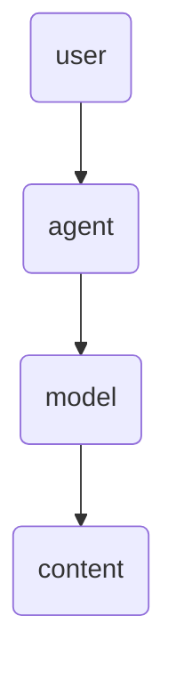
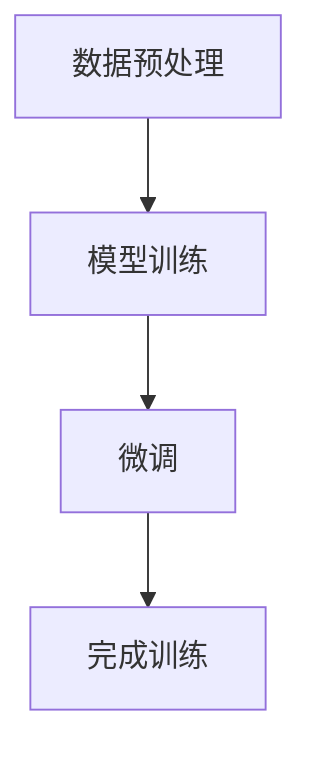
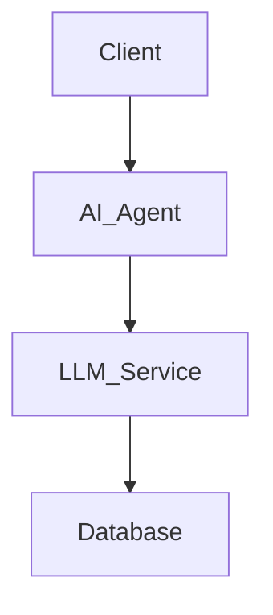

                 


# 社交媒体 AI Agent：LLM 辅助内容管理与互动

## 关键词：社交媒体，AI Agent，LLM，内容管理，互动，大语言模型

## 摘要：本文探讨了AI Agent在社交媒体中的应用，特别是如何利用大语言模型（LLM）进行内容管理和用户互动。文章详细介绍了LLM的基本原理、算法实现、系统架构，并通过实际案例展示了如何在社交媒体中部署AI Agent，优化内容管理和提升用户体验。

---

## 第1章：背景介绍

### 1.1 问题背景

#### 1.1.1 社交媒体内容管理的挑战

社交媒体平台每天生成海量内容，包括帖子、评论、私信等。这些内容需要及时处理，以确保平台的安全性和用户体验。然而，人工管理不仅效率低下，还可能因疏忽导致问题，如虚假信息传播、用户投诉等。

#### 1.1.2 LLM在内容管理中的作用

大语言模型（LLM）如GPT-3、GPT-4具备强大的文本生成和理解能力，能够自动分类、审核内容，识别有害信息，优化用户体验。LLM的应用显著提高了内容管理的效率和准确性。

---

## 第2章：核心概念与联系

### 2.1 LLM的基本原理

#### 2.1.1 Transformer模型简介

Transformer模型由编码器和解码器组成，通过自注意力机制捕捉文本中的长程依赖关系。编码器将输入文本转化为向量表示，解码器生成目标文本。

数学公式：
$$
\text{Self-attention}(Q, K, V) = \text{softmax}\left(\frac{QK^T}{\sqrt{d_k}}\right)V
$$

其中，$Q$、$K$、$V$分别为查询、键、值矩阵，$d_k$为键的维度。

#### 2.1.2 LLM与社交媒体的结合

通过LLM，AI Agent可以自动生成回复、分类内容、识别情感倾向。例如，当用户发布带有负面情绪的评论时，AI Agent可以迅速识别并采取适当措施。

### 2.2 核心概念对比

下表对比了不同LLM模型的特点：

| 模型名称 | 参数量（亿） | 主要特点               |
|----------|--------------|-----------------------|
| GPT-3    | 175          | 多任务通用性           |
| GPT-4    | 数万亿        | 更强的推理与生成能力   |
| BERT      | 110M         | 适合文本分类与理解     |

### 2.3 实体关系图

以下是社交媒体AI Agent的实体关系图：



---

## 第3章：算法原理讲解

### 3.1 LLM的训练与推理

#### 3.1.1 训练流程

训练过程包括数据预处理、模型训练、微调：

1. **数据预处理**：清洗、格式化数据，分割训练集和验证集。
2. **模型训练**：使用分布式训练优化器（如Adam）更新模型参数。
3. **微调**：在特定任务数据上进行微调，提升模型的针对性。

流程图如下：



#### 3.1.2 推理过程

推理时，给定输入，模型生成输出：

```python
import tensorflow as tf
from tensorflow.keras.models import Model

def generate_text(model, tokenizer, input_text):
    input_ids = tokenizer(input_text, return_tensors='tf')
    generated_tokens = model.generate(input_ids.input_ids, max_length=100)
    return tokenizer.decode(generated_tokens[0], skip_special_tokens=True)
```

---

## 第4章：系统分析与架构设计

### 4.1 功能模块划分

系统主要功能模块包括：

- **内容生成模块**：自动生成回复、标题。
- **内容审核模块**：识别有害信息、抄袭。
- **用户互动模块**：个性化推荐、情感分析。

### 4.2 系统架构设计

采用微服务架构：



### 4.3 接口设计

API接口如下：

- POST `/generate`: 提供输入，生成文本。
- POST `/classify`: 分类内容。
- GET `/suggest`: 提供推荐内容。

---

## 第5章：项目实战

### 5.1 环境搭建

安装必要的库：

```bash
pip install tensorflow transformers mermaid4jupyter
```

### 5.2 核心代码实现

内容生成代码：

```python
from transformers import GPT2LMHeadModel, GPT2Tokenizer

tokenizer = GPT2Tokenizer.from_pretrained('gpt2')
model = GPT2LMHeadModel.from_pretrained('gpt2')

def generate_content(prefix):
    inputs = tokenizer(prefix, return_tensors='pt')
    outputs = model.generate(inputs.input_ids, max_length=50)
    return tokenizer.decode(outputs[0], skip_special_tokens=True)
```

### 5.3 案例分析

假设用户发布一条负面评论，AI Agent识别后触发预警机制，通知管理员处理，并自动生成回复。

---

## 第6章：最佳实践与小结

### 6.1 最佳实践

1. **模型选择**：根据任务选择合适的模型。
2. **数据安全**：确保训练数据的隐私和合规性。
3. **持续优化**：定期更新模型，适应新内容。

### 6.2 小结

本文详细探讨了LLM在社交媒体AI Agent中的应用，从原理到实现，展示了如何优化内容管理和提升互动效率。

---

## 参考文献

1. Radford, A., et al. "Language models are few-shot learners." arXiv preprint arXiv:1909.01032 (2019).
2. Vaswani, A., et al. "Attention is all you need." Advances in neural information processing systems. (2017).

---

## 作者

作者：AI天才研究院

