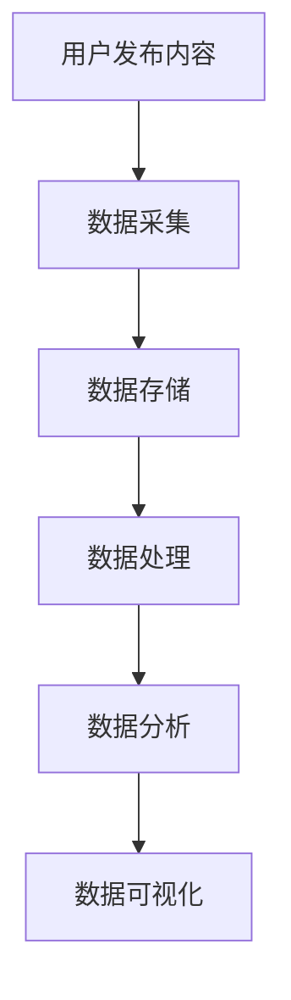

                 


# 社交媒体数据的利用

## 关键词：社交媒体、数据利用、文本挖掘、情感分析、数据可视化、机器学习、数据隐私

## 摘要：社交媒体数据利用是当前数据科学领域的热点之一。本文系统地介绍了社交媒体数据的定义、类型、采集与处理方法，深入探讨了文本挖掘、情感分析等核心算法的原理与实现，结合实际案例分析了社交媒体数据在商业决策、用户行为分析等场景中的应用价值。同时，本文还探讨了数据隐私与安全这一重要挑战，并提出了相应的解决方案。

---

## 第一部分：社交媒体数据的背景与概念

### 第1章：社交媒体数据的背景与现状

#### 1.1 社交媒体的定义与发展

社交媒体是指基于互联网的平台，允许用户创建、分享、互动和传播内容的在线社区。随着互联网的快速发展，社交媒体已经成为人们日常生活和工作中不可或缺的一部分。

- **1.1.1 社交媒体的定义**
  - 社交媒体是用户通过互联网进行互动、分享和交流的平台，典型平台包括Facebook、Twitter、Instagram等。
  - 社交媒体的核心功能包括信息发布、用户互动、内容分享和社交网络构建。

- **1.1.2 社交媒体的发展历程**
  - 早期的社交媒体以静态网页和简单的用户互动为主。
  - 近年来，随着移动互联网和人工智能技术的发展，社交媒体的功能更加多样化，支持视频、直播、AR/VR等多种形式的内容。

- **1.1.3 当前社交媒体的主要平台与特点**
  - Facebook：全球最大的社交网络，注重用户关系和内容分享。
  - Twitter：以短文本（推特）为主，适合实时信息传播和社交网络构建。
  - Instagram：以图片和短视频为主，注重视觉内容的传播。

#### 1.2 社交媒体数据的重要性

社交媒体数据是指在社交媒体平台上生成的所有结构化和非结构化数据，包括用户信息、内容信息、用户行为数据等。社交媒体数据的利用对于企业和社会具有重要意义。

- **1.2.1 数据在社交媒体中的核心地位**
  - 用户信息：包括用户ID、用户名、邮箱、密码等。
  - 内容信息：包括文本、图片、视频等。
  - 用户行为数据：包括点赞、评论、分享、关注等操作。

- **1.2.2 社交媒体数据的类型与分类**
  - 用户数据：用户的个人信息和行为数据。
  - 内容数据：用户发布的内容，包括文本、图片、视频等。
  - 关系数据：用户之间的关注、点赞、评论等关系。

- **1.2.3 数据驱动的决策优势**
  - 通过分析用户行为数据，可以洞察用户的偏好和需求。
  - 通过分析内容数据，可以进行舆情监控、情感分析，帮助企业进行市场决策。

#### 1.3 社交媒体数据利用的挑战与机遇

- **1.3.1 数据隐私与安全问题**
  - 用户数据的隐私保护是社交媒体数据利用中的重要挑战。
  - 数据泄露和滥用可能导致严重的法律和伦理问题。

- **1.3.2 数据量与处理难度的平衡**
  - 社交媒体数据量巨大，如何高效处理和存储是一个技术挑战。
  - 数据的实时性要求高，需要高效的处理算法和架构。

- **1.3.3 数据利用的商业价值与社会影响**
  - 商业价值：社交媒体数据可以用于精准营销、广告投放、品牌监控等。
  - 社会影响：社交媒体数据可以用于社会舆论分析、公共事件预警、社会治理等。

---

## 第二部分：社交媒体数据的核心概念与联系

### 第2章：社交媒体数据的核心概念

#### 2.1 社交媒体数据的属性特征对比

- **2.1.1 数据类型对比（文本、图片、视频等）**
  - 文本数据：包括用户评论、帖子内容等，适合进行文本挖掘和情感分析。
  - 图片数据：包括用户上传的照片，适合进行图像识别和内容分类。
  - 视频数据：包括短视频和直播，适合进行视频分析和内容推荐。

- **2.1.2 数据来源的多样性**
  - 用户生成内容（UGC）：用户主动发布的内容。
  - 用户行为数据：用户在平台上的互动行为，如点赞、评论、分享等。
  - 用户关系数据：用户之间的关注、粉丝关系等。

- **2.1.3 数据时效性与实时性分析**
  - 社交媒体数据具有很强的时效性，如热点事件的舆论变化。
  - 实时数据分析可以帮助企业快速响应市场变化。

#### 2.2 社交媒体数据的ER实体关系图

```mermaid
erDiagram
    actor 用户 {
        <属性> 用户ID
        <属性> 用户名
        <属性> 密码
        <属性> 邮箱
    }
    actor 内容 {
        <属性> 内容ID
        <属性> 内容类型
        <属性> 内容文本
        <属性> 发布时间
    }
    actor 关系 {
        <属性> 用户ID
        <属性> 关注者ID
        <属性> 关系时间
    }
    用户 --> 内容 : 发布
    用户 --> 关系 : 关注
    用户 --> 互动 : 点赞、评论
```

#### 2.3 社交媒体数据的流程图



---

## 第三部分：社交媒体数据的算法原理

### 第3章：文本挖掘与情感分析

#### 3.1 文本挖掘算法原理

- **3.1.1 基于TF-IDF的关键词提取**
  - TF-IDF（Term Frequency-Inverse Document Frequency）是一种常用的文本特征提取方法。
  - 公式：$$TF-IDF(t) = TF(t) \times ID

