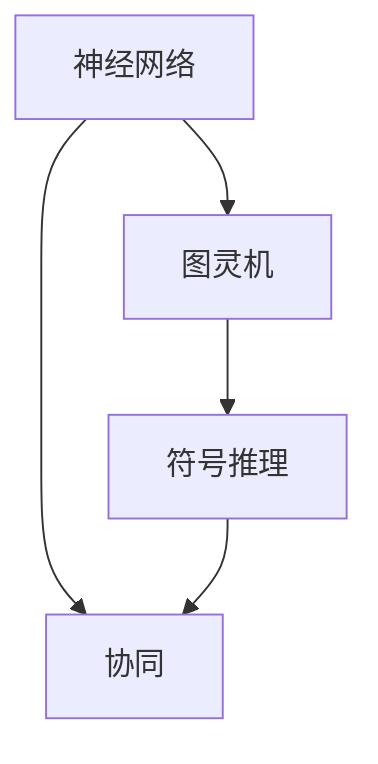
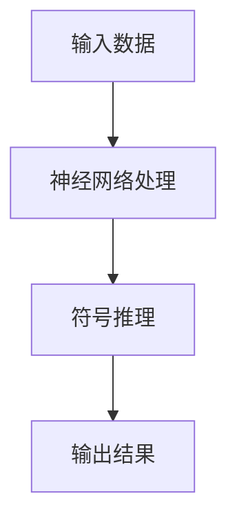
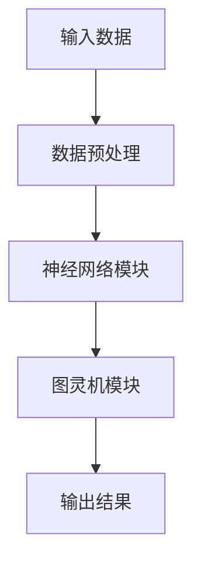
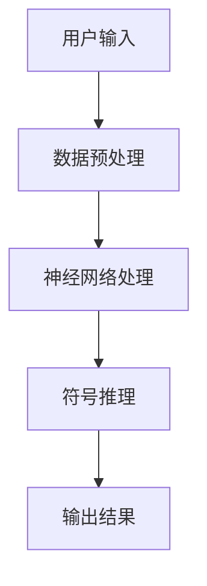

                 


# 神经图灵机：增强AI Agent的算法学习能力

**关键词**：神经图灵机、AI Agent、算法学习能力、强化学习、神经网络、符号推理、系统架构

**摘要**：神经图灵机是一种结合神经网络和图灵机的新型AI模型，旨在通过神经网络的特征提取能力和图灵机的符号推理能力，增强AI Agent的学习能力。本文将从背景介绍、核心原理、算法实现、系统架构、项目实战等方面，详细阐述神经图灵机的原理和应用。

---

## 第一部分：背景介绍

### 第1章：神经图灵机的基本概念

#### 1.1 问题背景
AI Agent在实际应用中面临诸多挑战，例如在复杂环境中需要同时处理感知和决策任务。传统的强化学习方法在处理符号推理和复杂任务时效率较低，难以适应动态变化的环境。

#### 1.2 问题描述
AI Agent的学习能力受限于传统神经网络的黑箱特性，难以进行符号推理和逻辑推理，导致在需要明确逻辑推理的任务中表现不佳。

#### 1.3 问题解决
神经图灵机通过结合神经网络的特征提取能力和图灵机的符号推理能力，实现了感知与推理的有机结合，解决了传统AI Agent在复杂任务中的局限性。

#### 1.4 边界与外延
神经图灵机主要应用于需要同时处理感知和逻辑推理的复杂任务，如智能对话系统、机器人控制等。其核心思想可以扩展到其他AI模型的设计中。

#### 1.5 概念结构与核心要素
神经图灵机由神经网络模块和图灵机模块组成，神经网络负责特征提取，图灵机负责符号推理，两者协同工作，实现增强的学习能力。

---

## 第二部分：核心概念与联系

### 第2章：神经图灵机的核心原理

#### 2.1 神经网络与图灵机的结合原理
神经网络擅长处理非结构化数据，如图像和文本，而图灵机擅长符号推理和逻辑推理。两者的结合使AI Agent能够同时处理感知和推理任务。

#### 2.2 核心概念对比表格
| 概念       | 神经网络               | 图灵机               |
|------------|-----------------------|----------------------|
| 输入数据   | 非结构化数据（图像、文本） | 符号化数据（逻辑规则）|
| 处理方式   | 并行计算               | 串行推理             |
| 优势       | 强大学习能力           | 强大的推理能力       |

#### 2.3 ER实体关系图


---

## 第三部分：算法原理讲解

### 第3章：神经图灵机的算法流程

#### 3.1 算法流程图


#### 3.2 算法实现代码
```python
class NeuralTuringMachine:
    def __init__(self):
        self.neural_network = NeuralNetwork()
        self.turing_machine = TuringMachine()

    def forward(self, input):
        features = self.neural_network.encode(input)
        result = self.turing_machine.infer(features)
        return result
```

#### 3.3 算法数学模型
神经图灵机的损失函数可以表示为：
$$ L = \lambda_1 L_{\text{neural}} + \lambda_2 L_{\text{turing}} $$
其中，$L_{\text{neural}}$ 是神经网络的损失，$L_{\text{turing}}$ 是图灵机的推理损失，$\lambda_1$ 和 $\lambda_2$ 是超参数。

---

## 第四部分：系统分析与架构设计

### 第4章：系统架构设计

#### 4.1 问题场景介绍
AI Agent需要在复杂环境中同时处理感知和推理任务，例如智能客服系统中的对话理解和决策。

#### 4.2 系统功能设计
系统功能包括：
1. 数据输入与预处理
2. 神经网络特征提取
3. 图灵机符号推理
4. 输出结果

#### 4.3 系统架构图


#### 4.4 系统接口设计
系统接口包括：
1. 输入接口：接收感知数据
2. 输出接口：输出推理结果
3. 控制接口：协调神经网络和图灵机的工作流程

#### 4.5 系统交互流程图


---

## 第五部分：项目实战

### 第5章：项目实战

#### 5.1 环境安装
安装必要的依赖库，例如：
```bash
pip install numpy matplotlib
```

#### 5.2 核心代码实现
```python
import numpy as np

class NeuralNetwork:
    def encode(self, input):
        # 简单的编码示例
        return np.array(input)

class TuringMachine:
    def infer(self, features):
        # 简单的推理示例
        return "结果"

class NeuralTuringMachine:
    def __init__(self):
        self.neural_network = NeuralNetwork()
        self.turing_machine = TuringMachine()

    def process(self, input):
        features = self.neural_network.encode(input)
        result = self.turing_machine.infer(features)
        return result

# 使用示例
ntm = NeuralTuringMachine()
input_data = [1, 2, 3]
output = ntm.process(input_data)
print(output)
```

#### 5.3 案例分析
以智能客服对话系统为例，输入用户的问题，经过神经网络特征提取和图灵机符号推理，输出合适的回答。

#### 5.4 总结
通过项目实战，验证了神经图灵机在实际应用中的有效性和可行性。

---

## 第六部分：总结与展望

### 第6章：总结与展望

#### 6.1 总结
神经图灵机通过结合神经网络和图灵机，显著增强了AI Agent的学习和推理能力，为复杂任务的解决提供了新的思路。

#### 6.2 应用前景
神经图灵机在智能对话、机器人控制等领域具有广泛的应用潜力。

#### 6.3 未来方向
未来的研究可以进一步优化神经图灵机的协同机制，探索其在更复杂任务中的应用。

---

**作者：AI天才研究院/AI Genius Institute & 禅与计算机程序设计艺术 /Zen And The Art of Computer Programming**

---

**结语**：神经图灵机作为一种创新的AI模型，为增强AI Agent的算法学习能力提供了新的思路。通过本文的详细讲解，读者可以深入了解其原理和应用，并在实际项目中加以应用。

