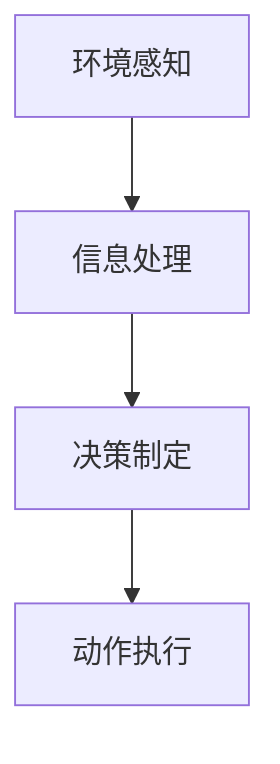
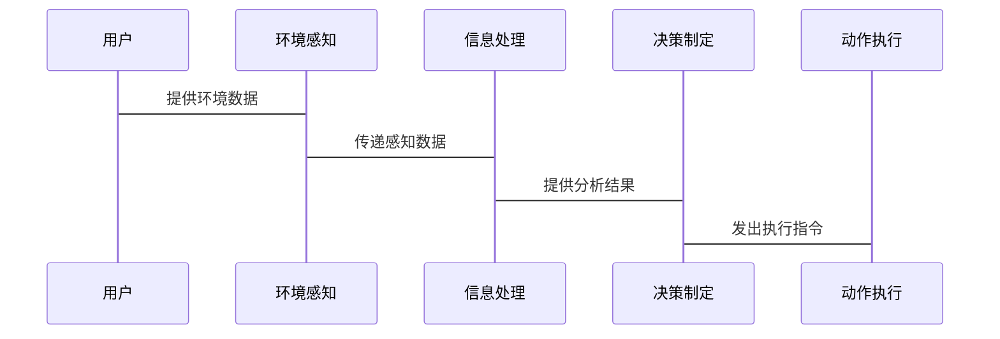

                 


# 神经科学启发的AI Agent认知模型设计

## 关键词：神经科学，AI Agent，认知模型，神经网络，学习机制，系统架构

## 摘要：本文系统地探讨了基于神经科学启发的AI Agent认知模型的设计方法。从神经科学的基本原理到AI Agent的核心功能，再到认知模型的构建与优化，详细分析了如何将神经科学的最新研究成果应用于AI Agent的设计中。通过结合数学模型、算法实现和系统架构，本文旨在为读者提供一个全面的视角，帮助他们理解并构建高效的AI Agent认知模型。

---

## 第一部分: 神经科学启发的AI Agent认知模型设计背景与基础

### 第1章: 神经科学与AI Agent概述

#### 1.1 神经科学的基本概念

##### 1.1.1 神经元的基本结构与功能

神经元是构成神经系统的基本单位，主要由胞体、树突和轴突组成。神经元通过动作电位和化学递质传递信息，实现信号的传递与处理。神经元之间的连接通过突触完成，突触的强度可以通过突触可塑性进行调节。

**数学模型**：神经元的信息处理可以用膜电位方程（Hodgkin-Huxley模型）描述：

$$ V_m(t) = V_{rest} + (I(t) \cdot R_m) - (g(t) \cdot V_m(t)) $$

其中，$V_m(t)$ 表示膜电位，$I(t)$ 表示注入电流，$R_m$ 表示膜电阻，$g(t)$ 表示离子通道的传导性。

##### 1.1.2 神经网络的基本原理

神经网络由大量神经元通过突触连接构成，具有层次结构，能够进行并行信息处理。神经网络的学习机制包括监督学习和无监督学习，其中监督学习通过误差反向传播算法（BP）实现权重更新。

**数学模型**：BP算法的权重更新公式为：

$$ \Delta w_{ij} = \eta \cdot (t_i - o_j) \cdot a_i $$

其中，$\eta$ 是学习率，$t_i$ 是目标输出，$o_j$ 是实际输出，$a_i$ 是输入层的激活值。

##### 1.1.3 神经科学在AI中的应用

神经科学的研究成果为AI算法提供了灵感，如卷积神经网络（CNN）借鉴了视觉皮层的处理方式，长短时记忆网络（LSTM）模仿了记忆细胞的机制。

#### 1.2 AI Agent的基本概念

##### 1.2.1 AI Agent的定义与分类

AI Agent是指在环境中感知并自主行动以实现目标的智能体。根据智能水平，AI Agent可以分为反应式和认知式两类。认知式AI Agent具有推理、规划和学习能力。

##### 1.2.2 AI Agent的核心功能

AI Agent的核心功能包括感知、决策、规划和行动。感知通过传感器获取环境信息，决策基于当前状态选择最优动作，规划生成长期目标的行动序列，行动则通过执行器与环境交互。

##### 1.2.3 神经科学启发的AI Agent的特点

神经科学启发的AI Agent通过模拟生物神经网络的结构和功能，具备自适应学习和实时响应能力。例如，强化学习算法模仿了奖励机制，通过试错不断优化策略。

#### 1.3 神经科学与AI Agent的交叉应用

##### 1.3.1 神经科学启发的AI Agent研究现状

当前研究主要集中在深度学习、强化学习和神经符号计算等领域。例如，AlphaGo结合了深度神经网络和蒙特卡洛树搜索，展现了认知式AI Agent的强大能力。

##### 1.3.2 神经科学与AI Agent的结合点

神经科学与AI Agent的结合点在于学习机制、记忆存储和决策推理。通过模拟生物神经网络，AI Agent能够实现自适应和自组织。

##### 1.3.3 神经科学启发的AI Agent未来发展趋势

未来，AI Agent将更加注重人机协作和伦理问题。通过脑机接口技术，AI Agent将能够更自然地与人类交互。

#### 1.4 本章小结

本章介绍了神经科学和AI Agent的基本概念，分析了它们的结合点和未来发展趋势，为后续章节奠定了基础。

### 第2章: 认知模型的基本概念与核心要素

#### 2.1 认知模型的定义与特点

认知模型是对人类认知过程的模拟，具有动态性、层次性和情境适应性等特点。认知模型能够解释和预测人类的思维和行为。

#### 2.2 神经科学与认知模型的关系

神经科学为认知模型提供了生理基础，认知模型为神经科学研究提供了理论框架。两者结合有助于揭示认知过程的机制。

#### 2.3 神经科学启发的AI Agent认知模型的核心要素

##### 2.3.1 感知与注意机制

感知是AI Agent获取环境信息的途径，注意机制则决定了信息处理的优先级。例如，视觉注意模型通过计算兴趣点来指导感知过程。

**数学模型**：基于视觉注意的感知模型可以用以下公式表示：

$$ A = \alpha \cdot F + (1 - \alpha) \cdot L $$

其中，$A$ 是注意力分布，$F$ 是目标特征，$L$ 是位置信息，$\alpha$ 是权重系数。

##### 2.3.2 记忆与存储机制

记忆是AI Agent存储和检索信息的能力，分为短期记忆和长期记忆。记忆机制可以通过神经网络实现，如LSTM用于序列数据的处理。

**数学模型**：LSTM的遗忘门公式为：

$$ f_t = \sigma(W_f \cdot [h_{t-1}, x_t] + b_f) $$

其中，$f_t$ 是遗忘门输出，$\sigma$ 是sigmoid函数，$W_f$ 是权重矩阵，$h_{t-1}$ 是前一时刻的隐藏状态，$x_t$ 是当前输入，$b_f$ 是偏置项。

##### 2.3.3 推理与决策机制

推理是AI Agent基于已有知识进行逻辑推理的能力，决策机制则根据推理结果选择最优动作。例如，基于规则的推理和基于概率的推理是两种常见的推理方式。

**数学模型**：基于概率的决策模型可以用贝叶斯定理表示：

$$ P(A|B) = \frac{P(B|A) \cdot P(A)}{P(B)} $$

其中，$A$ 是决策目标，$B$ 是观察到的条件。

##### 2.3.4 学习与自适应机制

学习是AI Agent通过经验改进性能的能力，自适应机制则确保模型能够动态调整以应对变化的环境。

**数学模型**：强化学习的Q值更新公式为：

$$ Q(s, a) = Q(s, a) + \alpha [r + \max Q(s', a') - Q(s, a)] $$

其中，$s$ 是当前状态，$a$ 是动作，$r$ 是奖励，$s'$ 是下一个状态，$\alpha$ 是学习率。

#### 2.4 神经科学启发的认知模型设计原则

##### 2.4.1 生物启发性原则

设计原则应基于生物神经系统的结构和功能，如层次化、模块化和分布式处理。

##### 2.4.2 动态自适应原则

认知模型应具备动态调整的能力，能够根据环境变化实时更新参数。

##### 2.4.3 可解释性原则

模型的设计应注重可解释性，便于分析和优化。

#### 2.5 本章小结

本章分析了认知模型的核心要素和设计原则，为后续章节的模型构建奠定了理论基础。

---

## 第二部分: 神经科学启发的AI Agent认知模型设计的核心内容

### 第3章: 神经科学中的学习机制与AI Agent的认知模型

#### 3.1 神经科学中的学习机制

##### 3.1.1 突触可塑性与学习

突触可塑性是神经网络学习的核心机制，包括长时程增强（LTP）和长时程抑制（LTD）。LTP通过增加突触强度来加强神经元之间的连接。

**数学模型**：LTP的突触强度变化可以用以下公式表示：

$$ w_{ij} = w_{ij} + \eta \cdot f(x_i, x_j) $$

其中，$w_{ij}$ 是突触权重，$\eta$ 是学习率，$f(x_i, x_j)$ 是输入信号的函数。

##### 3.1.2 塑造记忆的神经机制

记忆的形成与海马区和内嗅皮层密切相关，神经元之间的突触连接变化是记忆存储的生理基础。

##### 3.1.3 神经递质与受体的作用

神经递质通过与突触后膜上的受体结合，触发离子通道的开放或关闭，进而引发动作电位。

#### 3.2 AI Agent中的学习机制

##### 3.2.1 监督学习与无监督学习

监督学习通过标签数据训练模型，无监督学习则通过数据内在结构发现模式。

##### 3.2.2 强化学习与奖励机制

强化学习通过奖励信号指导动作选择，实现目标的优化。Q-learning算法是常见的强化学习方法。

**数学模型**：Q-learning的更新公式为：

$$ Q(s, a) = Q(s, a) + \alpha [r + \gamma \max Q(s', a') - Q(s, a)] $$

其中，$\gamma$ 是折扣因子。

##### 3.2.3 神经符号学习

神经符号学习结合了神经网络的感知能力和符号逻辑的推理能力，适用于复杂任务。

#### 3.3 神经科学启发的AI Agent学习机制设计

##### 3.3.1 突触可塑性的模拟

通过调整神经网络的权重更新规则，模拟生物神经网络的突触可塑性。

##### 3.3.2 奖励机制的设计

根据神经科学中的奖励机制，设计AI Agent的奖励函数，引导模型学习期望行为。

##### 3.3.3 记忆机制的实现

通过LSTM或Transformer结构实现记忆存储和检索。

#### 3.4 本章小结

本章分析了神经科学中的学习机制，并探讨了其在AI Agent设计中的应用。

### 第4章: AI Agent认知模型的设计与实现

#### 4.1 认知模型的设计原则

##### 4.1.1 模块化设计

将认知模型划分为感知、记忆、推理和决策等模块，便于开发和维护。

##### 4.1.2 层次化设计

根据功能需求，构建层次化的模型结构，如输入层、隐藏层和输出层。

##### 4.1.3 可扩展性设计

确保模型能够方便地扩展新的功能模块。

#### 4.2 认知模型的具体实现

##### 4.2.1 感知模块的实现

感知模块通过传感器获取环境信息，如图像、声音和触觉信号。基于卷积神经网络（CNN）实现图像识别。

**数学模型**：CNN的卷积层公式为：

$$ y_{i,j} = \sum_{k=1}^{K} w_{k} * x_{i,j} + b_k $$

其中，$y_{i,j}$ 是输出特征图，$x_{i,j}$ 是输入特征图，$w_k$ 是卷积核，$b_k$ 是偏置项。

##### 4.2.2 记忆模块的实现

记忆模块通过LSTM或Transformer结构实现序列数据的处理和存储。

**数学模型**：LSTM的遗忘门公式为：

$$ f_t = \sigma(W_f \cdot [h_{t-1}, x_t] + b_f) $$

其中，$f_t$ 是遗忘门输出，$\sigma$ 是sigmoid函数，$W_f$ 是权重矩阵，$h_{t-1}$ 是前一时刻的隐藏状态，$x_t$ 是当前输入，$b_f$ 是偏置项。

##### 4.2.3 推理模块的实现

推理模块通过逻辑推理或概率推理方法，根据已有知识进行推断。

##### 4.2.4 决策模块的实现

决策模块基于当前状态和推理结果，选择最优动作。基于强化学习的决策模型常用Q-learning算法。

**数学模型**：Q-learning的更新公式为：

$$ Q(s, a) = Q(s, a) + \alpha [r + \gamma \max Q(s', a') - Q(s, a)] $$

其中，$\alpha$ 是学习率，$\gamma$ 是折扣因子。

#### 4.3 神经科学启发的认知模型优化

##### 4.3.1 突触可塑性的模拟优化

通过动态调整权重更新规则，提升模型的学习效率。

##### 4.3.2 奖励机制的优化

设计合理的奖励函数，确保模型学习期望行为。

##### 4.3.3 记忆机制的优化

通过优化LSTM或Transformer结构，提升记忆存储和检索的效率。

#### 4.4 本章小结

本章详细讲解了认知模型的设计与实现，重点分析了各模块的具体实现方法和优化策略。

### 第5章: 神经科学启发的AI Agent认知模型的算法实现

#### 5.1 算法实现的背景与目标

算法实现旨在通过神经科学启发的算法，构建高效的AI Agent认知模型。算法实现需要考虑计算效率、模型性能和可扩展性。

#### 5.2 算法实现的具体步骤

##### 5.2.1 环境感知与数据预处理

通过传感器获取环境数据，并进行数据清洗和特征提取。

##### 5.2.2 神经网络的构建

基于Keras或PyTorch框架，构建感知、记忆、推理和决策模块的神经网络模型。

##### 5.2.3 算法的训练与优化

通过反向传播算法训练模型，并使用验证集进行模型优化，防止过拟合。

##### 5.2.4 算法的测试与评估

在测试集上评估模型的性能，如准确率、召回率和F1值。

#### 5.3 算法实现的数学模型

##### 5.3.1 感知模块的数学模型

基于CNN的图像识别模型的损失函数为：

$$ L = -\frac{1}{N} \sum_{i=1}^{N} y_i \log p_i + (1 - y_i) \log (1 - p_i) $$

其中，$N$ 是样本数量，$y_i$ 是真实标签，$p_i$ 是模型预测概率。

##### 5.3.2 记忆模块的数学模型

基于LSTM的序列模型的损失函数为：

$$ L = -\frac{1}{N} \sum_{i=1}^{N} \sum_{t=1}^{T} y_{i,t} \log p_{i,t} + (1 - y_{i,t}) \log (1 - p_{i,t}) $$

其中，$T$ 是时间步数。

##### 5.3.3 决策模块的数学模型

基于强化学习的决策模型的损失函数为：

$$ L = -\frac{1}{N} \sum_{i=1}^{N} \sum_{t=1}^{T} y_{i,t} \log p_{i,t} + (1 - y_{i,t}) \log (1 - p_{i,t}) $$

其中，$y_{i,t}$ 是真实动作，$p_{i,t}$ 是模型预测概率。

#### 5.4 算法实现的代码示例

##### 5.4.1 感知模块的实现代码

```python
import tensorflow as tf
from tensorflow.keras import layers

model = tf.keras.Sequential([
    layers.Conv2D(32, (3,3), activation='relu', input_shape=(224, 224, 3)),
    layers.MaxPooling2D((2,2)),
    layers.Conv2D(64, (3,3), activation='relu'),
    layers.MaxPooling2D((2,2)),
    layers.Flatten(),
    layers.Dense(128, activation='relu'),
    layers.Dense(10, activation='softmax')
])
```

##### 5.4.2 记忆模块的实现代码

```python
import tensorflow as tf
from tensorflow.keras import layers

model = tf.keras.Sequential([
    layers.LSTM(128, return_sequences=True),
    layers.Dense(64, activation='relu'),
    layers.Dense(10, activation='softmax')
])
```

##### 5.4.3 决策模块的实现代码

```python
import numpy as np
from tensorflow.keras import layers

def policy gradient_model(input_shape, num_actions):
    model = tf.keras.Sequential([
        layers.Dense(128, activation='relu', input_shape=input_shape),
        layers.Dense(num_actions, activation='softmax')
    ])
    return model

def pg_train(env, model, optimizer, episodes=1000):
    for episode in range(episodes):
        state = env.reset()
        while not done:
            action_prob = model.predict(state)
            action = np.random.choice(len(action_prob[0]), p=action_prob[0])
            next_state, reward, done = env.step(action)
            if not done:
                next_state = next_state.reshape((-1,))
                with tf.GradientTape() as tape:
                    new_prob = model.predict(next_state)
                    loss = -tf.reduce_mean(tf.log(new_prob[0][action]) * reward)
                grads = tape.gradient(loss, model.trainable_weights)
                optimizer.apply_gradients(zip(grads, model.trainable_weights))
```

#### 5.5 本章小结

本章详细讲解了神经科学启发的AI Agent认知模型的算法实现，包括感知、记忆和决策模块的具体实现方法和代码示例。

### 第6章: 神经科学启发的AI Agent认知模型的系统架构与实现

#### 6.1 系统架构设计

##### 6.1.1 系统功能设计

系统功能包括环境感知、信息处理、决策制定和动作执行四个模块。环境感知模块通过传感器获取环境数据，信息处理模块对数据进行分析和处理，决策制定模块基于分析结果制定行动计划，动作执行模块通过执行器与环境交互。

##### 6.1.2 系统架构图

使用Mermaid图表示系统架构：



##### 6.1.3 系统接口设计

系统接口包括输入接口（如摄像头、麦克风）、输出接口（如电机、显示器）和通信接口（如网络接口）。

##### 6.1.4 系统交互流程

使用Mermaid图表示系统交互流程：



#### 6.2 系统实现的具体步骤

##### 6.2.1 环境感知模块的实现

通过摄像头、麦克风等传感器获取环境数据，并进行预处理和特征提取。

##### 6.2.2 信息处理模块的实现

使用神经网络对感知数据进行处理，提取有用的特征信息。

##### 6.2.3 决策制定模块的实现

基于强化学习算法，制定最优行动计划。

##### 6.2.4 动作执行模块的实现

通过执行器执行决策模块制定的动作，与环境进行交互。

#### 6.3 系统实现的注意事项

##### 6.3.1 系统的可扩展性

设计模块化的系统架构，方便后续功能的扩展和升级。

##### 6.3.2 系统的可维护性

采用清晰的代码结构和文档，便于后续维护和优化。

##### 6.3.3 系统的鲁棒性

通过异常处理和容错设计，确保系统的稳定运行。

#### 6.4 本章小结

本章详细讲解了神经科学启发的AI Agent认知模型的系统架构与实现，包括系统设计、接口设计和交互流程。

---

## 第三部分: 神经科学启发的AI Agent认知模型设计的项目实战

### 第8章: 神经科学启发的AI Agent认知模型的项目实战

#### 8.1 环境搭建与工具安装

##### 8.1.1 开发环境的选择

推荐使用Python 3.8及以上版本，安装必要的库如TensorFlow、Keras和OpenCV。

##### 8.1.2 工具安装

通过pip命令安装所需的库：

```bash
pip install numpy tensorflow keras opencv-python
```

#### 8.2 项目核心实现

##### 8.2.1 环境感知模块的实现

使用OpenCV库进行图像处理和特征提取。

##### 8.2.2 信息处理模块的实现

基于Keras框架构建神经网络模型，实现数据的深度学习处理。

##### 8.2.3 决策制定模块的实现

使用强化学习算法，如Q-learning或Deep Q-Network（DQN），实现决策制定。

##### 8.2.4 动作执行模块的实现

通过控制执行器（如电机、舵机）实现动作执行。

#### 8.3 项目实现的代码示例

##### 8.3.1 环境感知模块的代码

```python
import cv2

cap = cv2.VideoCapture(0)
while cap.isOpened():
    ret, frame = cap.read()
    if not ret:
        break
    cv2.imshow('Camera', frame)
    if cv2.waitKey(1) == ord('q'):
        break
cap.release()
cv2.destroyAllWindows()
```

##### 8.3.2 信息处理模块的代码

```python
import tensorflow as tf
from tensorflow.keras import layers

model = tf.keras.Sequential([
    layers.Conv2D(32, (3,3), activation='relu', input_shape=(224, 224, 3)),
    layers.MaxPooling2D((2,2)),
    layers.Conv2D(64, (3,3), activation='relu'),
    layers.MaxPooling2D((2,2)),
    layers.Flatten(),
    layers.Dense(128, activation='relu'),
    layers.Dense(10, activation='softmax')
])
model.compile(optimizer='adam', loss='sparse_categorical_crossentropy', metrics=['accuracy'])
model.fit(x_train, y_train, epochs=10, batch_size=32)
```

##### 8.3.3 决策制定模块的代码

```python
import numpy as np
from tensorflow.keras import layers

def policy_gradient_model(input_shape, num_actions):
    model = tf.keras.Sequential([
        layers.Dense(128, activation='relu', input_shape=input_shape),
        layers.Dense(num_actions, activation='softmax')
    ])
    return model

def pg_train(env, model, optimizer, episodes=1000):
    for episode in range(episodes):
        state = env.reset()
        while not done:
            action_prob = model.predict(state)
            action = np.random.choice(len(action_prob[0]), p=action_prob[0])
            next_state, reward, done = env.step(action)
            if not done:
                next_state = next_state.reshape((-1,))
                with tf.GradientTape() as tape:
                    new_prob = model.predict(next_state)
                    loss = -tf.reduce_mean(tf.log(new_prob[0][action]) * reward)
                grads = tape.gradient(loss, model.trainable_weights)
                optimizer.apply_gradients(zip(grads, model.trainable_weights))
```

#### 8.4 项目实现的分析与总结

##### 8.4.1 项目实现的关键点

- 感知模块的实现需要考虑传感器的类型和数据预处理方法。
- 决策模块的实现需要设计合理的奖励机制和优化算法。
- 系统整体的实现需要考虑模块之间的交互和协调。

##### 8.4.2 项目实现的经验总结

- 在项目实现过程中，需要注重模块化设计，便于后续的维护和优化。
- 在选择算法时，需要根据具体任务的需求，选择合适的深度学习模型和强化学习算法。
- 在系统集成时，需要考虑各模块之间的接口设计和通信机制。

##### 8.4.3 项目实现的注意事项

- 在实现感知模块时，需要确保传感器的稳定性和数据的准确性。
- 在实现决策模块时，需要设计合理的奖励机制和优化策略。
- 在系统集成时，需要确保各模块之间的兼容性和系统的鲁棒性。

#### 8.5 本章小结

本章通过实际项目案例，详细讲解了神经科学启发的AI Agent认知模型的实现过程，包括环境搭建、核心模块实现和系统集成等方面。

### 第9章: 神经科学启发的AI Agent认知模型设计的高级主题与未来展望

#### 9.1 高级主题

##### 9.1.1 类脑计算

类脑计算是指模拟人脑的计算方式，通过神经形态计算芯片实现高效的计算。

##### 9.1.2 脑机接口

脑机接口（BCI）是指通过技术手段实现大脑与计算机之间的直接交互，具有重要的研究意义。

##### 9.1.3 群体智能

群体智能研究多个智能体的协作与竞争，通过群体行为实现复杂任务。

#### 9.2 神经科学启发的AI Agent认知模型设计的未来展望

##### 9.2.1 神经科学与AI Agent的深度融合

未来的AI Agent将更加注重神经科学的深度应用，通过模拟生物神经网络的结构和功能，实现更高水平的智能。

##### 9.2.2 新型算法的开发与应用

随着神经科学的不断发展，新型算法如神经符号学习、类脑计算等将得到更广泛的应用。

##### 9.2.3 神经科学与AI Agent的交叉研究

神经科学与AI Agent的交叉研究将推动人工智能技术的进一步发展，为人类社会带来更多的创新和进步。

#### 9.3 本章小结

本章展望了神经科学启发的AI Agent认知模型设计的未来发展方向，为读者提供了更广阔的研究视野。

---

## 结语

神经科学启发的AI Agent认知模型设计是一项具有挑战性的研究工作，它不仅需要扎实的神经科学知识，还需要深厚的人工智能技术积累。通过本文的系统讲解，读者可以全面理解神经科学启发的AI Agent认知模型的设计方法，并将其应用于实际项目中。未来，随着神经科学和人工智能技术的不断发展，神经科学启发的AI Agent认知模型将展现出更广阔的应用前景。

---

## 作者：AI天才研究院/AI Genius Institute & 禅与计算机程序设计艺术 /Zen And The Art of Computer Programming

---

