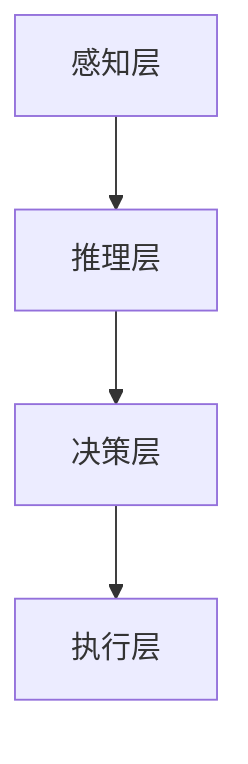

                 


# 神经符号AI在AI Agent逻辑推理中的实践

## 关键词：神经符号AI，AI Agent，逻辑推理，符号逻辑，神经网络，知识图谱

## 摘要：  
神经符号AI是一种结合了符号逻辑和神经网络的新型AI技术，它在AI Agent的逻辑推理中展现了强大的潜力。本文将从神经符号AI的基本概念出发，深入探讨其在AI Agent中的应用，包括核心原理、算法设计、系统架构和实际案例。通过结合符号逻辑与神经网络的优势，神经符号AI能够实现更高效、更准确的逻辑推理，为AI Agent的发展提供了新的方向。

---

# 第一部分：神经符号AI与AI Agent概述

## 第1章：神经符号AI的基本概念

### 1.1 什么是神经符号AI？
神经符号AI是符号逻辑与神经网络的结合体，它将符号逻辑的可解释性和神经网络的强大学习能力相结合，能够进行复杂逻辑推理和知识表示。

### 1.2 AI Agent的基本概念
AI Agent是一种智能体，能够感知环境、自主决策并执行任务。它广泛应用于自动驾驶、机器人、自然语言处理等领域。

### 1.3 神经符号AI在AI Agent中的作用
神经符号AI为AI Agent提供了强大的逻辑推理能力，使其能够处理复杂问题，并在动态环境中做出最优决策。

---

# 第二部分：神经符号AI的核心原理

## 第2章：符号逻辑与神经网络的结合

### 2.1 符号逻辑的基本原理
符号逻辑通过符号表示和规则推理，能够进行逻辑判断和知识推理。

### 2.2 神经网络的基本原理
神经网络通过学习数据特征，能够进行模式识别和预测。

### 2.3 神经符号AI的结合方式
神经符号AI将符号逻辑与神经网络相结合，利用符号逻辑的可解释性和神经网络的自适应性，实现更强大的推理能力。

---

## 第3章：神经符号AI的逻辑推理机制

### 3.1 知识表示与推理
神经符号AI通过知识图谱进行知识表示，并利用符号逻辑进行推理。

### 3.2 神经符号AI的推理过程
神经符号AI通过神经网络提取特征，结合符号逻辑进行推理，最终得出结论。

---

# 第三部分：神经符号AI的算法与数学模型

## 第4章：神经符号AI的算法设计

### 4.1 神经符号AI的算法流程
1. 输入数据
2. 神经网络提取特征
3. 符号逻辑推理
4. 输出结果

### 4.2 算法实现
通过Python代码实现神经符号AI的算法，结合神经网络和符号逻辑进行推理。

```python
# 示例代码
class NeuralSymbolicAI:
    def __init__(self):
        self.neural_network = NeuralNetwork()
        self.symbolic_logic = SymbolicLogic()

    def infer(self, input):
        features = self.neural_network.extract_features(input)
        result = self.symbolic_logic.reason(features)
        return result
```

### 4.3 算法优化
通过优化神经网络和符号逻辑的结合，提高推理效率和准确性。

---

## 第5章：数学模型与公式

### 5.1 神经网络的数学模型
神经网络的输出可以通过以下公式表示：
$$ y = \sigma(Wx + b) $$
其中，$W$ 是权重矩阵，$x$ 是输入，$b$ 是偏置，$\sigma$ 是激活函数。

### 5.2 符号逻辑的数学表示
符号逻辑可以通过逻辑公式表示：
$$ P \land Q \rightarrow R $$

### 5.3 神经符号AI的联合模型
神经符号AI的推理可以通过以下公式表示：
$$ f(x) = \text{NeuralNetwork}(x) \land \text{SymbolicLogic}(x) $$

---

# 第四部分：系统架构与实现

## 第6章：系统架构设计

### 6.1 系统功能设计
AI Agent的功能包括感知、推理、决策和执行。

### 6.2 系统架构图
使用Mermaid图展示系统架构：


### 6.3 接口设计
系统接口包括输入接口、推理接口和输出接口。

---

## 第7章：项目实战

### 7.1 环境安装
安装必要的库：
```bash
pip install neural-networks symbolic-logic
```

### 7.2 核心代码实现
实现神经符号AI的推理功能：
```python
def neural_symbolic_inference(input):
    features = extract_features(input)
    result = symbolic_reasoning(features)
    return result
```

### 7.3 实际案例分析
通过具体案例分析神经符号AI的应用，如自动驾驶中的路径规划。

---

## 第8章：总结与展望

### 8.1 总结
神经符号AI结合了符号逻辑和神经网络的优势，为AI Agent的逻辑推理提供了新的可能性。

### 8.2 未来展望
未来，神经符号AI将在更多领域得到应用，并进一步优化其算法和系统架构。

---

# 作者：AI天才研究院/AI Genius Institute & 禅与计算机程序设计艺术 /Zen And The Art of Computer Programming

