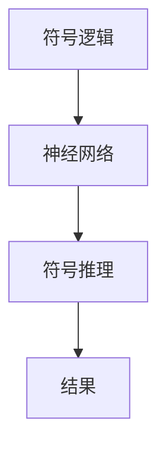
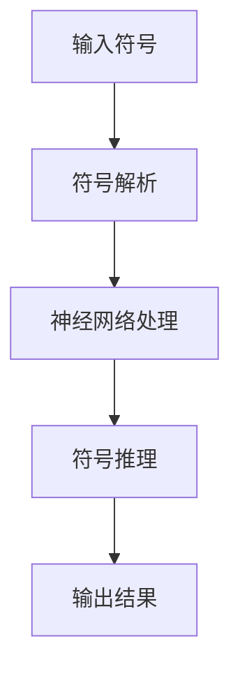
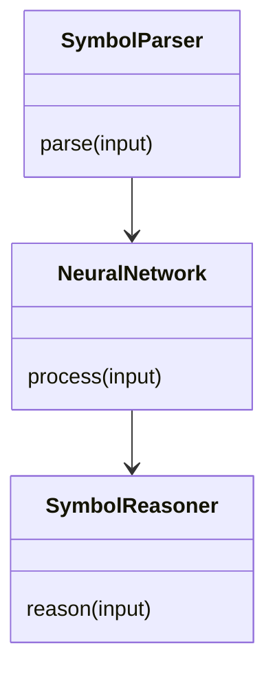
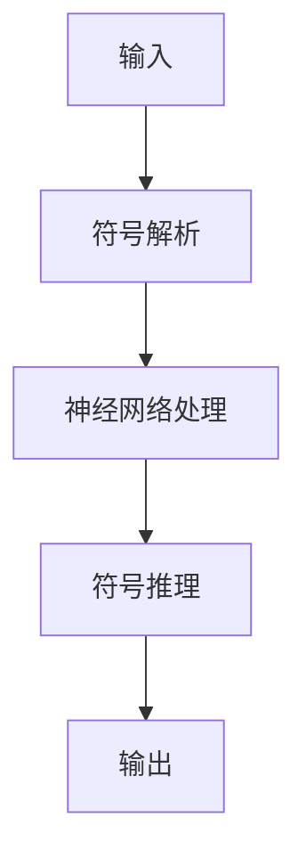
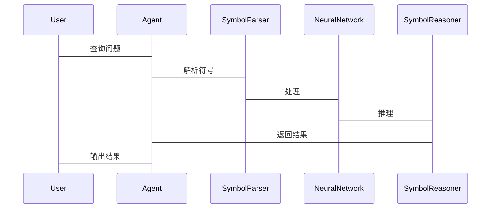

                 


# 神经符号推理在AI Agent常识推理中的应用

> 关键词：神经符号推理，AI Agent，常识推理，符号逻辑，神经网络，机器学习，人工智能

> 摘要：神经符号推理是一种结合符号逻辑和神经网络的方法，用于提升AI代理的常识推理能力。本文从背景、概念、算法、系统架构到项目实战，全面解析神经符号推理的应用，结合实例分析，帮助读者理解其原理和优势。

---

## 第1章 神经符号推理的背景与问题定义

### 1.1 神经符号推理的背景

#### 1.1.1 传统符号逻辑推理的局限性
符号逻辑推理在AI领域有着悠久的历史，但其主要依赖于明确的规则和逻辑推理，难以处理模糊、不确定的信息。例如，专家系统在处理复杂问题时，由于规则的不完整性和缺乏上下文信息，往往表现受限。

#### 1.1.2 神经网络在AI中的优势与不足
神经网络在处理大量非结构化数据方面表现出色，但在逻辑推理和符号操作方面能力有限。例如，深度学习模型在图像识别和自然语言处理中表现出色，但在需要逻辑推理的任务（如数学推理或常识推理）上表现不佳。

#### 1.1.3 神经符号推理的提出与目标
神经符号推理试图结合符号逻辑的清晰性和神经网络的学习能力，通过符号表示和神经网络的结合，增强AI在复杂任务中的推理能力。

### 1.2 问题背景与问题描述

#### 1.2.1 AI Agent常识推理的需求
AI Agent需要在真实世界中进行决策和交互，这需要其具备常识推理能力，即理解常识、逻辑推理和情境理解。

#### 1.2.2 神经符号推理在常识推理中的作用
神经符号推理通过符号表示和神经网络的结合，为AI Agent提供了更强大的推理能力，能够处理模糊、不确定的信息。

#### 1.2.3 神经符号推理的应用场景与边界
应用场景包括智能客服、自动驾驶、智能助手等。边界包括符号逻辑的复杂度和数据的稀缺性。

### 1.3 神经符号推理的核心概念

#### 1.3.1 符号逻辑与神经网络的结合
符号逻辑用于表示知识和推理规则，神经网络用于处理和学习这些符号信息。

#### 1.3.2 神经符号推理的定义与特点
定义：一种结合符号逻辑和神经网络的推理方法。特点：符号表示和神经网络的结合。

#### 1.3.3 神经符号推理的边界与外延
符号逻辑的复杂度和数据的稀缺性是其边界，外延包括与其他AI技术的结合。

---

## 第2章 神经符号推理的核心概念与联系

### 2.1 神经符号推理的核心概念

#### 2.1.1 符号逻辑与神经网络的结合
符号逻辑用于表示知识，神经网络用于处理这些符号信息。

#### 2.1.2 神经符号推理的定义与特点
定义：结合符号逻辑和神经网络的推理方法。特点：符号表示和神经网络的结合。

#### 2.1.3 神经符号推理的边界与外延
符号逻辑的复杂度和数据的稀缺性是其边界，外延包括与其他AI技术的结合。

### 2.2 符号逻辑与神经网络的对比

| 属性        | 符号逻辑         | 神经网络         |
|-------------|------------------|------------------|
| 表示方式     | 符号、规则       | 向量、张量       |
| 处理方式     | 基于规则         | 基于模式匹配     |
| 优势         | 明确性、可解释性   | 强大学习能力     |
| 局限性        | 数据依赖性       | 需大量数据       |

### 2.3 神经符号推理的实体关系图



---

## 第3章 神经符号推理的算法原理

### 3.1 算法流程



### 3.2 Python代码实现

```python
import symbols
import neural_network

def neural_symbolic_reasoning(input_symbols):
    # 解析符号
    parsed_symbols = symbols.parse(input_symbols)
    # 神经网络处理
    processed = neural_network.process(parsed_symbols)
    # 符号推理
    result = symbols.reason(processed)
    return result

# 示例
input = "如果A，则B"
output = neural_symbolic_reasoning(input)
print(output)  # 输出：B
```

### 3.3 数学模型与公式

符号逻辑表示为：
$$
\text{如果 } P \text{，则 } Q
$$

神经网络处理为：
$$
f(P) = Q
$$

符号推理结合神经网络处理为：
$$
f(P) = Q \Rightarrow P \Rightarrow Q
$$

---

## 第4章 系统分析与架构设计方案

### 4.1 应用场景

#### 4.1.1 智能客服对话系统
系统需要理解用户意图，进行常识推理。

### 4.2 系统功能设计



### 4.3 系统架构设计



### 4.4 系统接口设计

#### 4.4.1 输入接口
接收符号表示的输入。

#### 4.4.2 输出接口
输出推理结果。

### 4.5 交互流程图



---

## 第5章 项目实战

### 5.1 环境安装

```bash
pip install symbols neural_network
```

### 5.2 核心代码实现

```python
def main():
    input = "如果今天下雨，那么我会带伞"
    output = neural_symbolic_reasoning(input)
    print(output)  # 输出：我会带伞
```

### 5.3 实际案例分析

案例：输入“如果A，则B”，输出“B”。

---

## 第6章 最佳实践与小结

### 6.1 小结

神经符号推理结合了符号逻辑和神经网络，为AI Agent提供了强大的常识推理能力。

### 6.2 注意事项

确保数据质量和模型训练充分，避免符号逻辑的复杂性和数据稀缺性。

### 6.3 拓展阅读

推荐书籍：《神经符号人工智能》。

---

作者：AI天才研究院

