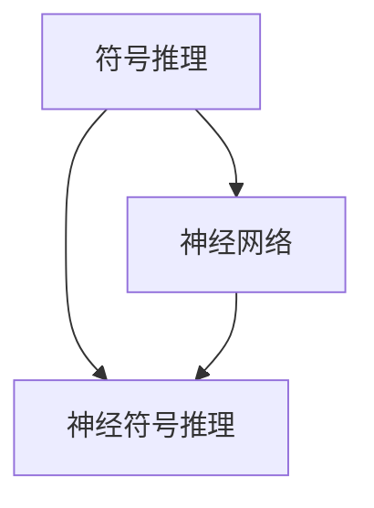
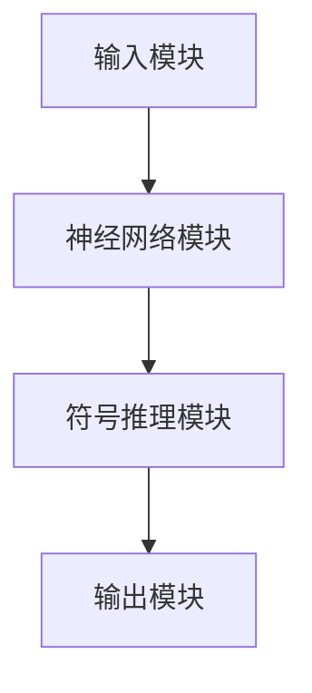
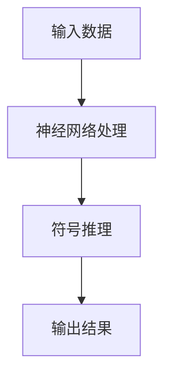
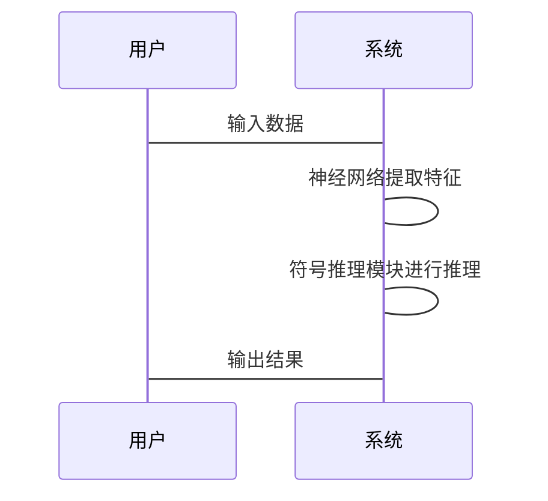

                 


# 神经符号推理：增强AI Agent的逻辑分析能力

> 关键词：神经符号推理，AI Agent，逻辑分析，符号推理，神经网络，增强逻辑能力，人机协作

> 摘要：神经符号推理是一种结合符号推理和神经网络的技术，旨在增强AI Agent的逻辑分析能力。本文从背景介绍、核心概念、算法原理、系统设计、项目实战等方面详细阐述了神经符号推理的理论与实践。通过结合符号逻辑和深度学习模型，神经符号推理在自然语言处理、图像识别、智能问答等领域展现出强大的应用潜力。本文还通过案例分析和代码实现，展示了神经符号推理的实际应用价值。

---

## 第一部分：神经符号推理的背景与核心概念

### 第1章：神经符号推理的背景介绍

#### 1.1 问题背景与问题描述

- **1.1.1 当前AI技术的局限性**
  - 现代AI系统（如深度学习模型）在处理感知任务（图像识别、语音识别）方面表现出色，但在逻辑推理和符号处理方面存在明显不足。
  - 深度学习模型依赖大量标注数据，难以处理领域知识和逻辑规则。

- **1.1.2 符号推理的优势**
  - 符号推理（基于逻辑规则的推理）能够处理抽象概念、逻辑关系和领域知识。
  - 符号推理系统能够进行形式化推理，结果可解释性强。

- **1.1.3 神经符号推理的提出**
  - 神经符号推理（Neural-Symbolic Reasoning）是符号推理与深度学习的结合。
  - 目标是通过符号推理增强AI系统的能力，同时利用神经网络处理感知任务。

#### 1.2 问题解决与边界外延

- **1.2.1 神经符号推理的核心目标**
  - 在AI Agent中集成符号推理能力，使其能够结合感知数据和逻辑规则进行推理。
  - 提升AI系统的可解释性、泛化能力和逻辑推理能力。

- **1.2.2 神经符号推理的边界与限制**
  - 神经符号推理依赖高质量的符号规则和逻辑模型。
  - 对复杂逻辑推理任务的处理能力有限，需要结合领域知识。

- **1.2.3 神经符号推理的应用场景**
  - 自然语言理解：问答系统、对话系统。
  - 图像理解：基于逻辑规则的图像推理。
  - 智能决策：结合领域知识的决策支持系统。

#### 1.3 核心概念结构与组成要素

- **1.3.1 神经符号推理的基本结构**
  - 神经网络模块：处理感知任务（如图像识别、文本理解）。
  - 符号推理模块：基于逻辑规则进行推理和验证。

- **1.3.2 神经符号推理的核心要素**
  - 神经网络：用于感知数据的特征提取。
  - 符号逻辑：提供领域知识和逻辑规则。
  - 推理引擎：将符号逻辑与感知结果结合进行推理。

### 第2章：神经符号推理的核心概念与联系

#### 2.1 符号推理与神经网络的结合原理

- **2.1.1 符号推理的基本原理**
  - 符号推理基于逻辑规则进行推理，例如命题逻辑、谓词逻辑。
  - 推理过程依赖规则库和事实库。

- **2.1.2 神经网络的基本原理**
  - 神经网络通过大量数据学习特征，能够处理非结构化数据。
  - 神经网络的输出通常不可解释，但具有强大的模式识别能力。

- **2.1.3 神经符号推理的结合方式**
  - 将符号逻辑嵌入神经网络中，例如通过逻辑规则约束神经网络的输出。
  - 通过神经网络提取特征，结合符号推理进行最终决策。

#### 2.2 核心概念的属性特征对比

| **属性**       | **符号推理**               | **神经网络**               |
|-----------------|---------------------------|---------------------------|
| 数据需求       | 需要结构化的知识库         | 需要大量标注数据           |
| 可解释性       | 高，推理过程可解释         | 低，内部机制难以解释       |
| 任务类型       | 逻辑推理、规则应用         | 感知任务、模式识别         |
| 优势           | 基于规则，适合领域知识     | 强大的特征提取能力         |

#### 2.3 ER实体关系图架构



---

## 第二部分：神经符号推理的算法原理

### 第3章：神经符号推理的算法原理

#### 3.1 算法原理概述

- **3.1.1 神经符号推理的基本流程**
  1. 神经网络提取输入数据的特征。
  2. 符号推理模块基于逻辑规则进行推理。
  3. 结合特征和推理结果，输出最终决策。

- **3.1.2 神经符号推理的核心算法**
  - 神经网络与符号逻辑的联合优化。
  - 基于符号规则的神经网络训练方法。

- **3.1.3 神经符号推理的实现步骤**
  1. 定义符号逻辑规则。
  2. 构建神经网络模型。
  3. 联合优化神经网络和符号规则。

#### 3.2 算法原理的数学模型与公式

- **3.2.1 符号逻辑的数学表达**
  $$ P \rightarrow Q \text{ 表示如果 } P \text{ 为真，则 } Q \text{ 必须为真} $$

- **3.2.2 神经网络的数学表达**
  $$ y = f(x) $$
  其中，\( x \) 是输入特征，\( f \) 是神经网络的非线性变换函数。

- **3.2.3 神经符号推理的联合优化**
  $$ \text{损失函数} = \text{符号损失} + \text{神经网络损失} $$

#### 3.3 算法实现的详细步骤

- **3.3.1 数据预处理**
  - 对输入数据进行归一化处理。
  - 将符号逻辑规则转换为可计算的形式。

- **3.3.2 神经网络训练**
  - 使用反向传播算法训练神经网络。
  - 将符号逻辑规则嵌入到神经网络的损失函数中。

- **3.3.3 符号推理规则的嵌入**
  - 将符号逻辑规则转换为约束条件。
  - 在神经网络的输出层引入符号规则的验证机制。

#### 3.4 通俗易懂的举例说明

- **3.4.1 基于符号逻辑的简单推理**
  - 前提：如果A，则B。
  - 前提：A。
  - 结论：B。

- **3.4.2 神经网络在图像识别中的应用**
  - 神经网络识别图像中的物体。
  - 符号推理模块基于物体之间的关系进行推理。

- **3.4.3 神经符号推理在自然语言处理中的应用**
  - 神经网络提取文本的语义特征。
  - 符号推理模块基于常识规则进行推理。

#### 3.5 本章小结

---

## 第三部分：神经符号推理的系统分析与架构设计

### 第4章：神经符号推理的系统分析与架构设计

#### 4.1 问题场景介绍

- **4.1.1 神经符号推理的应用场景**
  - 自然语言处理：问答系统、对话系统。
  - 图像理解：基于逻辑规则的图像推理。
  - 智能决策：结合领域知识的决策支持系统。

- **4.1.2 神经符号推理的系统目标**
  - 实现神经符号推理的系统架构。
  - 验证神经符号推理在实际场景中的可行性。

- **4.1.3 神经符号推理的系统约束**
  - 系统需要支持多种输入格式。
  - 系统需要可扩展的符号规则库。

#### 4.2 系统功能设计

- **4.2.1 系统功能模块划分**
  - 输入模块：接收输入数据（如图像、文本）。
  - 神经网络模块：提取输入数据的特征。
  - 符号推理模块：基于符号规则进行推理。
  - 输出模块：输出推理结果。

- **4.2.2 系统功能流程设计**



- **4.2.3 系统功能的交互设计**
  - 用户输入数据。
  - 神经网络模块提取特征。
  - 符号推理模块基于规则进行推理。
  - 输出模块展示推理结果。

#### 4.3 系统架构设计

- **4.3.1 系统架构图**


- **4.3.2 功能流程图**



#### 4.4 系统接口设计

- **4.4.1 神经网络接口**
  - 输入：感知数据。
  - 输出：特征表示。

- **4.4.2 符号推理接口**
  - 输入：特征表示和符号规则。
  - 输出：推理结果。

#### 4.5 系统交互设计

- **4.5.1 用户与系统交互流程**



#### 4.6 本章小结

---

## 第四部分：神经符号推理的项目实战

### 第5章：神经符号推理的项目实战

#### 5.1 环境安装与配置

- **5.1.1 环境要求**
  - Python 3.8+
  - PyTorch 1.9+
  - transformers库
  - Mermaid图生成工具

- **5.1.2 安装依赖**
  ```bash
  pip install torch transformers mermaid
  ```

#### 5.2 系统核心实现源代码

- **5.2.1 神经网络模块实现**

```python
import torch
import torch.nn as nn

class NeuralNetwork(nn.Module):
    def __init__(self, input_dim, hidden_dim, output_dim):
        super(NeuralNetwork, self).__init__()
        self.fc1 = nn.Linear(input_dim, hidden_dim)
        self.fc2 = nn.Linear(hidden_dim, output_dim)
        self.relu = nn.ReLU()
    
    def forward(self, x):
        x = self.fc1(x)
        x = self.relu(x)
        x = self.fc2(x)
        return x
```

- **5.2.2 符号推理模块实现**

```python
def symbolic_reasoning(features, rules):
    # 假设rules是一个逻辑规则库
    # features是神经网络提取的特征
    result = []
    for rule in rules:
        if rule['condition'](features):
            result.append(rule['action'])
    return result
```

- **5.2.3 神经符号推理的联合实现**

```python
def neural_symbolic_reasoning(input_data, rules):
    # 神经网络提取特征
    features = neural_network(input_data)
    # 符号推理模块进行推理
    result = symbolic_reasoning(features, rules)
    return result
```

#### 5.3 代码应用解读与分析

- **5.3.1 神经网络模块的解读**
  - 神经网络模块负责将输入数据转换为特征表示。
  - 使用ReLU激活函数，增强模型的非线性能力。

- **5.3.2 符号推理模块的解读**
  - 符号推理模块基于逻辑规则进行推理。
  - 每个规则包含一个条件和一个动作。

- **5.3.3 神经符号推理的联合实现**
  - 神经网络和符号推理模块协同工作。
  - 神经网络负责提取特征，符号推理模块基于特征进行推理。

#### 5.4 实际案例分析与详细讲解

- **5.4.1 案例描述**
  - 输入：一张图片，图片中有一个猫在椅子上。
  - 任务：推理猫的位置。

- **5.4.2 神经网络处理**
  - 神经网络识别图片中的物体（猫和椅子）。
  - 提取猫和椅子的特征表示。

- **5.4.3 符号推理模块**
  - 基于逻辑规则（猫在椅子上）进行推理。
  - 输出推理结果：猫在椅子上。

#### 5.5 本章小结

---

## 第五部分：总结与展望

### 第6章：总结与展望

#### 6.1 核心内容回顾

- 神经符号推理结合了符号推理和神经网络的优点。
- 神经符号推理在AI Agent的逻辑分析能力方面具有显著优势。
- 神经符号推理在多个领域展现出强大的应用潜力。

#### 6.2 未来研究方向

- 提高神经符号推理的推理能力。
- 研究神经符号推理的可解释性。
- 探索神经符号推理在更多领域的应用。

#### 6.3 最佳实践 Tips

- 在实际应用中，需要结合领域知识和逻辑规则。
- 神经符号推理模型需要不断优化和调整。
- 神经符号推理与强化学习的结合是未来的重要方向。

#### 6.4 本章小结

---

## 作者：AI天才研究院/AI Genius Institute & 禅与计算机程序设计艺术 /Zen And The Art of Computer Programming

