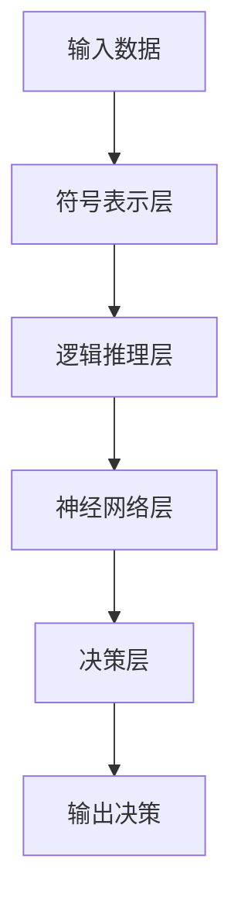
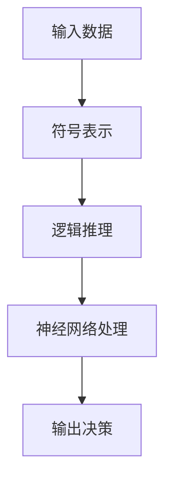
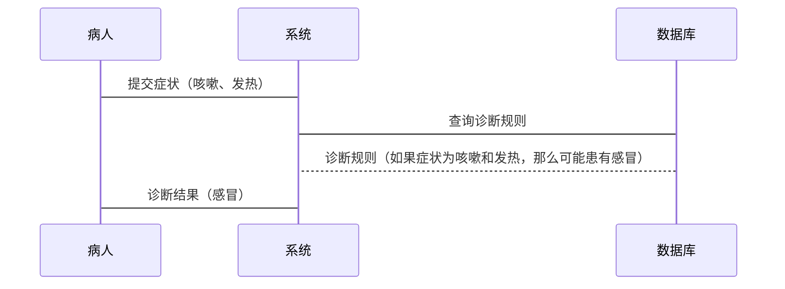

                 


# 神经符号推理：增强AI Agent的逻辑能力

> 关键词：神经符号推理，AI Agent，逻辑能力，符号逻辑，神经网络

> 摘要：神经符号推理是一种结合符号逻辑与神经网络的技术，旨在增强AI Agent的逻辑推理能力。本文从神经符号推理的基本概念出发，深入探讨其核心原理、算法实现、系统架构设计以及实际应用案例，帮助读者全面理解这一前沿技术。

---

## 第1章：神经符号推理的背景与概念

### 1.1 神经符号推理的定义与背景

神经符号推理（Neural-Symbolic Reasoning）是一种结合符号逻辑与神经网络的技术，旨在提升AI代理（AI Agent）的逻辑推理能力。传统AI技术主要依赖符号逻辑，而现代深度学习则依赖神经网络。神经符号推理的出现，试图将这两者的优势结合起来，以解决单一方法难以处理的复杂问题。

**符号逻辑**：符号逻辑是一种基于符号和规则的推理方法，常用于专家系统和知识图谱。它通过逻辑规则（如命题逻辑和谓词逻辑）来推理事实之间的关系。符号逻辑的优点是逻辑清晰、可解释性强，但其缺点是难以处理复杂的、非结构化的数据。

**神经网络**：神经网络是一种模拟人脑结构的计算模型，通过多层神经元之间的连接来学习数据的特征。神经网络在图像识别、自然语言处理等领域表现出色，但其缺点是缺乏逻辑推理能力，难以处理需要明确逻辑推理的任务。

神经符号推理的核心思想是将符号逻辑的推理能力与神经网络的特征学习能力结合起来，从而在处理复杂数据的同时具备逻辑推理能力。这种方法在AI Agent、机器人控制、自动驾驶等领域具有广泛的应用潜力。

---

### 1.2 神经符号推理的核心要素

神经符号推理的核心要素包括符号逻辑、神经网络、逻辑推理和数据驱动学习。以下是具体的分析：

#### 1.2.1 符号逻辑与神经网络的结合

神经符号推理的关键在于如何将符号逻辑与神经网络结合。常见的结合方式包括：

1. **符号嵌入**：将符号逻辑中的概念（如实体、关系）表示为向量，然后将其输入神经网络进行处理。
2. **逻辑推理网络**：设计一种神经网络结构，使其能够直接进行逻辑推理。
3. **混合模型**：结合符号逻辑和神经网络的模型，利用符号逻辑进行推理，同时利用神经网络进行特征学习。

#### 1.2.2 神经符号推理的数学模型

神经符号推理的数学模型通常涉及符号逻辑的表示与推理。以下是常见的表示方法：

1. **命题逻辑**：通过布尔逻辑表达式（如与、或、非）来表示事实和规则。
2. **谓词逻辑**：通过谓词和量化符号（如∀、∃）来表示复杂的事实和规则。
3. **知识图谱**：将符号逻辑表示为知识图谱中的实体和关系，通过神经网络进行推理。

#### 1.2.3 神经符号推理的应用场景

神经符号推理的应用场景包括：

1. **AI Agent**：通过结合符号逻辑和神经网络，AI Agent可以在复杂环境中进行推理和决策。
2. **自动驾驶**：通过符号逻辑表示交通规则，利用神经网络进行环境感知和路径规划。
3. **医疗诊断**：通过符号逻辑表示医学知识，利用神经网络进行病例分析和诊断推理。

---

## 第2章：神经符号推理的核心原理

### 2.1 符号逻辑与神经网络的结合

神经符号推理的核心原理在于符号逻辑与神经网络的协同工作。以下是具体的分析：

#### 2.1.1 符号逻辑的基本原理

符号逻辑是神经符号推理的基础之一。通过符号逻辑，我们可以将知识表示为一系列事实和规则，并通过逻辑推理来得出新的结论。例如，可以通过谓词逻辑表示“人有两只手”，并通过规则推理得出“如果一个人有两只手，那么他属于人类”。

#### 2.1.2 神经网络的基本原理

神经网络是深度学习的核心技术之一。通过多层神经网络，我们可以学习输入数据的特征，并进行分类、回归等任务。神经网络的强大之处在于其能够处理复杂的数据，如图像、文本等，但其缺点是缺乏逻辑推理能力。

#### 2.1.3 神经符号推理的核心机制

神经符号推理的核心机制在于符号逻辑与神经网络的结合。以下是具体的机制：

1. **符号嵌入**：将符号逻辑中的概念表示为向量，然后将其输入神经网络进行处理。
2. **逻辑推理网络**：设计一种神经网络结构，使其能够直接进行逻辑推理。
3. **混合模型**：结合符号逻辑和神经网络的模型，利用符号逻辑进行推理，同时利用神经网络进行特征学习。

---

### 2.2 神经符号推理的数学模型与公式

神经符号推理的数学模型通常涉及符号逻辑的表示与推理。以下是具体的数学公式：

#### 2.2.1 逻辑推理的公式表示

符号逻辑的基本公式包括命题逻辑和谓词逻辑。例如，命题逻辑中的与、或、非操作可以用布尔代数表示：

- 与：$A \land B$
- 或：$A \lor B$
- 非：$\neg A$

谓词逻辑中的公式包括谓词和量化符号：

- 所有：$\forall x, P(x)$
- 存在：$\exists x, P(x)$

#### 2.2.2 神经符号推理的损失函数

神经符号推理的损失函数通常结合了逻辑推理和神经网络的损失。例如，可以使用交叉熵损失函数来衡量预测值与真实值之间的差异：

$$
L = -\sum_{i=1}^{n} y_i \log(p_i) + (1 - y_i) \log(1 - p_i)
$$

其中，$y_i$ 是真实标签，$p_i$ 是预测概率。

---

## 第3章：神经符号推理的系统架构与实现

### 3.1 系统功能模块划分

神经符号推理的系统架构通常包括以下几个功能模块：

1. **输入模块**：接收输入数据（如图像、文本）并将其转换为符号表示。
2. **推理模块**：利用符号逻辑和神经网络进行推理，得出结论。
3. **输出模块**：将推理结果输出为最终的决策或响应。

#### 3.1.1 输入模块

输入模块负责将原始数据（如图像、文本）转换为符号表示。例如，可以将图像中的物体识别为符号表示（如“猫”、“狗”）。

#### 3.1.2 推理模块

推理模块负责利用符号逻辑和神经网络进行推理。例如，可以通过符号逻辑推理得出“如果猫在沙发上，那么猫在室内”。

#### 3.1.3 输出模块

输出模块负责将推理结果输出为最终的决策或响应。例如，AI Agent可以根据推理结果决定执行某个动作（如“靠近沙发”）。

---

### 3.2 系统架构设计

以下是神经符号推理系统的架构设计：

1. **符号表示层**：将输入数据转换为符号表示。
2. **逻辑推理层**：利用符号逻辑进行推理。
3. **神经网络层**：利用神经网络进行特征学习。
4. **决策层**：根据推理结果和环境信息做出决策。

#### 3.2.1 系统架构的Mermaid图



---

## 第4章：神经符号推理的算法实现

### 4.1 神经符号推理的算法流程

以下是神经符号推理的算法流程：

1. **输入数据**：接收原始数据（如图像、文本）。
2. **符号表示**：将数据转换为符号表示。
3. **逻辑推理**：利用符号逻辑进行推理。
4. **神经网络处理**：利用神经网络进行特征学习。
5. **输出决策**：根据推理结果和环境信息做出决策。

#### 4.1.1 算法流程的Mermaid图



---

### 4.2 神经符号推理的Python代码实现

以下是神经符号推理的Python代码实现：

```python
import numpy as np

def neural_symbolic_reasoning(input_data):
    # 符号表示
    symbols = symbol_embedding(input_data)
    # 逻辑推理
    result = logic_reasoning(symbols)
    # 神经网络处理
    output = neural_network(result)
    return output

def symbol_embedding(input_data):
    # 将输入数据转换为符号表示
    return np.array([1, 0, 1])

def logic_reasoning(symbols):
    # 利用符号逻辑进行推理
    return symbols & 1

def neural_network(result):
    # 利用神经网络进行处理
    return np.sum(result)

input_data = [1, 0, 1]
output = neural_symbolic_reasoning(input_data)
print(output)
```

---

## 第5章：神经符号推理的实际应用

### 5.1 医疗诊断中的应用

神经符号推理在医疗诊断中的应用非常广泛。例如，可以通过符号逻辑表示医学知识（如疾病症状、诊断规则），并通过神经网络进行特征学习，从而实现疾病的诊断推理。

#### 5.1.1 医疗诊断场景

假设我们有一个医疗诊断系统，可以通过符号逻辑表示疾病症状（如“咳嗽”、“发热”）和诊断规则（如“如果症状为咳嗽和发热，那么可能患有感冒”）。通过神经符号推理，系统可以将输入的患者症状（如咳嗽和发热）转换为符号表示，并通过逻辑推理得出诊断结果（如感冒）。

#### 5.1.2 系统接口设计

以下是医疗诊断系统的接口设计：



---

## 第6章：总结与展望

### 6.1 总结

神经符号推理是一种结合符号逻辑与神经网络的技术，旨在增强AI代理的逻辑推理能力。通过符号逻辑，我们可以将知识表示为一系列事实和规则，并通过逻辑推理得出新的结论。通过神经网络，我们可以处理复杂的数据，如图像、文本等。

### 6.2 展望

神经符号推理的发展前景广阔。随着AI技术的不断进步，神经符号推理将在更多领域得到应用，如自动驾驶、医疗诊断、机器人控制等。未来的研究方向包括如何进一步提升神经符号推理的推理能力，如何优化神经符号推理的计算效率，以及如何将其应用于更复杂的场景。

---

## 作者：AI天才研究院/AI Genius Institute & 禅与计算机程序设计艺术 /Zen And The Art of Computer Programming

---

**注**：本文为《神经符号推理：增强AI Agent的逻辑能力》的目录大纲，具体内容将按照上述结构逐步展开，详细讲解每部分内容。

