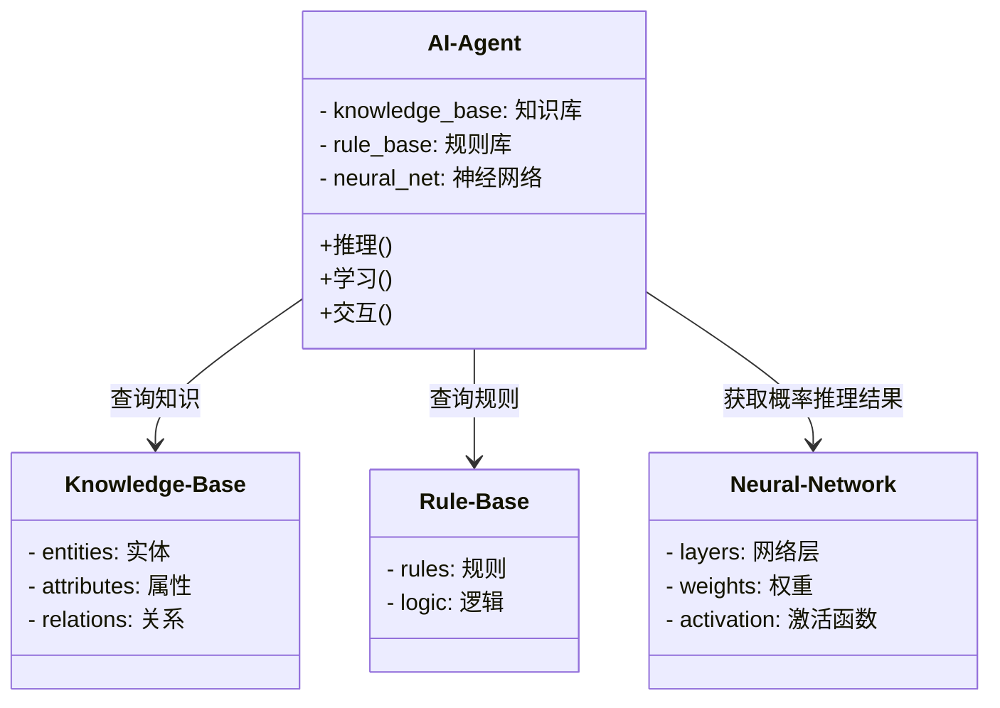

                 


# 神经符号融合：增强AI Agent的推理能力

> 关键词：神经符号融合、AI Agent、符号推理、神经网络、知识表示、逻辑推理

> 摘要：本文深入探讨了神经符号融合在增强AI Agent推理能力中的应用。通过结合符号推理与神经网络，我们能够构建更强大的AI系统，具备逻辑推理和深度学习能力。本文从背景、核心概念、算法原理、系统架构到项目实战，全面解析神经符号融合的理论与实践。

---

# 第一部分: 神经符号融合的背景与基础

## 第1章: 神经符号融合的概述

### 1.1 AI Agent的发展历程

#### 1.1.1 从符号AI到神经网络
- 符号AI的黄金时代：基于规则的专家系统，如MYCIN和EMYCIN。
- 神经网络的崛起：感知机、BP网络、CNN和RNN的突破。

#### 1.1.2 符号推理与神经网络的结合
- 神经符号AI的初步探索：将符号规则嵌入神经网络中。
- 当前趋势：神经符号融合成为AI Agent的核心技术。

#### 1.1.3 神经符号融合的意义与目标
- 解决传统符号AI的局限性：规则难以扩展和自适应。
- 弥补神经网络的不足：弱化逻辑推理能力。
- 实现强人工智能的关键一步。

### 1.2 符号推理的基本概念

#### 1.2.1 符号表示的核心要素
- 实体（Entity）：具体事物或概念。
- 属性（Attribute）：实体的特征或状态。
- 关系（Relation）：实体之间的联系。
- 事实（Fact）：符号表示的基本单位。

#### 1.2.2 逻辑推理的基本原理
- 命题逻辑：通过命题和推理规则得出结论。
- 统一推理：将符号表示转换为逻辑表达式进行推理。

#### 1.2.3 知识表示的形式
- 一阶逻辑（FOL）：最常用的符号表示方法。
- 语义网络：基于节点和弧的结构化表示。
- 框架表示法：基于槽位和填充的表示方法。

### 1.3 神经网络的基础知识

#### 1.3.1 神经网络的定义与特点
- 神经网络：模拟人脑神经元结构的计算模型。
- 特点：并行计算、非线性表达、自适应学习。

#### 1.3.2 深度学习的核心算法
- 卷积神经网络（CNN）：擅长图像处理。
- 循环神经网络（RNN）：擅长序列数据处理。
- Transformer：基于自注意力机制的网络结构。

#### 1.3.3 神经符号融合的意义
- 结合符号推理的可解释性和神经网络的自适应性。
- 提供更强大的推理能力，适用于复杂场景。

---

## 第2章: 神经符号融合的核心概念

### 2.1 神经符号融合的定义与特点

#### 2.1.1 定义
- 神经符号融合：将符号推理与神经网络结合，构建具备逻辑推理和深度学习能力的AI系统。

#### 2.1.2 核心特点
- **可解释性**：符号推理提供明确的逻辑规则。
- **自适应性**：神经网络具备自学习能力。
- **综合推理能力**：结合符号和神经网络的优势。

### 2.2 神经符号融合的核心概念对比

#### 2.2.1 符号推理与神经网络的对比

| **特性**       | **符号推理**               | **神经网络**               |
|----------------|---------------------------|---------------------------|
| 表示方式       | 基于符号和规则             | 基于数值和向量             |
| 推理方式       | 基于逻辑规则             | 基于概率和统计             |
| 可解释性       | 高                       | 低                       |
| 自适应性       | 低                       | 高                       |

#### 2.2.2 神经符号融合与其他AI技术的对比
- **传统符号AI**：仅依赖规则，难以扩展。
- **纯神经网络**：缺乏逻辑推理能力。
- **神经符号融合**：结合两者优势，具备更强的推理能力。

### 2.3 神经符号融合的ER实体关系图

```mermaid
er
    actor: 用户
    agent: AI Agent
    knowledge_base: 知识库
    rule_base: 规则库
    neural_net

    actor --> agent: 发起请求
    agent --> knowledge_base: 查询知识库
    agent --> rule_base: 查询规则库
    agent --> neural_net: 获取概率推理结果
    agent --> agent: 执行推理
    agent --> actor: 返回结果
```

---

## 第3章: 神经符号融合的核心概念与联系

### 3.1 神经符号融合的原理

#### 3.1.1 符号表示与神经网络的结合
- 符号表示：将符号规则嵌入神经网络中，指导神经网络的学习。
- 神经网络：通过学习数据，优化符号规则的权重。

#### 3.1.2 神经符号融合的计算流程
1. 将符号规则转换为神经网络的输入。
2. 神经网络进行特征提取和概率计算。
3. 符号推理引擎根据概率结果生成最终结论。

#### 3.1.3 神经符号融合的数学模型

$$
f(x) = \sigma(Wx + b)
$$

其中：
- $x$：输入符号表示。
- $W$：权重矩阵。
- $b$：偏置向量。
- $\sigma$：激活函数。

### 3.2 神经符号融合的实现方式

#### 3.2.1 基于符号规则的神经网络增强
- 在神经网络中嵌入符号规则，指导网络的学习过程。

#### 3.2.2 神经网络驱动的符号推理
- 神经网络负责特征提取和概率计算，符号推理引擎基于概率结果生成结论。

#### 3.2.3 神经符号融合的混合架构
- 结合上述两种方式，构建混合架构，兼顾可解释性和自适应性。

### 3.3 神经符号融合的核心概念与联系

#### 3.3.1 符号表示的核心要素
- 实体、属性、关系、事实。

#### 3.3.2 神经网络的核心算法
- CNN、RNN、Transformer。

#### 3.3.3 神经符号融合的计算流程
- 符号表示 → 神经网络 → 概率推理 → 符号推理 → 最终结论。

---

## 第4章: 神经符号融合的算法原理

### 4.1 神经符号融合的核心算法

#### 4.1.1 符号传播网络
- 将符号规则嵌入神经网络，指导网络的传播过程。
- 算法步骤：
  1. 初始化符号表示。
  2. 神经网络进行符号传播。
  3. 生成最终结论。

#### 4.1.2 符号注意力机制
- 在神经网络中引入注意力机制，关注重要的符号信息。
- 算法步骤：
  1. 输入符号表示。
  2. 神经网络计算注意力权重。
  3. 根据注意力权重生成最终结论。

### 4.2 神经符号融合的数学模型

#### 4.2.1 符号传播网络的数学模型
$$
f(x) = \sum_{i=1}^{n} w_i x_i
$$

其中：
- $w_i$：符号规则的权重。
- $x_i$：符号表示的特征。

#### 4.2.2 符号注意力机制的数学模型
$$
\alpha_i = \frac{\exp(a_i)}{\sum_{j=1}^{n} \exp(a_j)}
$$

其中：
- $a_i$：注意力得分。
- $\alpha_i$：注意力权重。

### 4.3 神经符号融合的算法实现

#### 4.3.1 算法实现步骤
1. 初始化符号表示。
2. 神经网络计算符号传播或注意力权重。
3. 生成最终结论。

#### 4.3.2 算法实现代码示例

```python
def neural-symbolic_inference(symbols, weights):
    # 符号传播网络
    for i in range(len(symbols)):
        symbols[i] = symbols[i] * weights[i]
    total = sum(symbols)
    return total

# 符号注意力机制
def attention(symbols):
    # 计算注意力权重
    attention_weights = []
    for i in range(len(symbols)):
        weight = np.exp(symbols[i]) / sum(np.exp(symbols))
        attention_weights.append(weight)
    return attention_weights
```

---

## 第5章: 神经符号融合的系统分析与架构设计

### 5.1 系统分析与设计

#### 5.1.1 问题场景介绍
- 需求：构建一个具备逻辑推理和深度学习能力的AI Agent。
- 约束条件：知识表示、逻辑推理、自适应学习。

#### 5.1.2 系统功能设计



### 5.2 系统架构设计

#### 5.2.1 系统架构图


#### 5.2.2 系统接口设计
- 输入接口：符号表示、规则输入。
- 输出接口：推理结果、学习结果。

#### 5.2.3 系统交互设计

```mermaid
sequenceDiagram
    actor 用户
    agent AI-Agent
    base Knowledge-Base
    rule_base Rule-Base
    neural_net Neural-Network

    用户 -> agent: 发起推理请求
    agent -> base: 查询知识库
    base --> agent: 返回知识
    agent -> rule_base: 查询规则库
    rule_base --> agent: 返回规则
    agent -> neural_net: 获取概率推理结果
    neural_net --> agent: 返回概率结果
    agent --> 用户: 返回最终结论
```

---

## 第6章: 神经符号融合的项目实战

### 6.1 环境配置与安装

#### 6.1.1 系统环境要求
- Python 3.8+
- PyTorch 1.9+
- Transformers库 4.10+
- Mermaid工具（可选）

#### 6.1.2 安装依赖
```bash
pip install torch transformers
```

### 6.2 核心代码实现

#### 6.2.1 符号传播网络实现

```python
import torch

class SymbolicPropagation(torch.nn.Module):
    def __init__(self, input_size, output_size):
        super(SymbolicPropagation, self).__init__()
        self.fc = torch.nn.Linear(input_size, output_size)

    def forward(self, x):
        output = torch.relu(self.fc(x))
        return output
```

#### 6.2.2 符号注意力机制实现

```python
import torch
import torch.nn.functional as F

class SymbolicAttention(torch.nn.Module):
    def __init__(self, input_size, hidden_size):
        super(SymbolicAttention, self).__init__()
        self.W = torch.nn.Parameter(torch.randn(input_size, hidden_size))
        self.u = torch.nn.Parameter(torch.randn(hidden_size, 1))

    def forward(self, x):
        x = torch.relu(torch.mm(x, self.W))
        attention = F.softmax(torch.mm(x, self.u), dim=1)
        return attention
```

### 6.3 项目案例分析与实现

#### 6.3.1 案例分析
- 需求：构建一个具备逻辑推理能力的AI Agent，用于问答系统。

#### 6.3.2 实现步骤
1. 定义符号表示。
2. 初始化神经网络。
3. 进行符号传播或注意力机制计算。
4. 生成最终结论。

#### 6.3.3 代码实现

```python
import torch
import torch.nn as nn

# 符号表示
symbols = torch.randn(1, 5)

# 符号传播网络
class SymbolicPropagation(nn.Module):
    def __init__(self, input_size, output_size):
        super(SymbolicPropagation, self).__init__()
        self.fc = nn.Linear(input_size, output_size)

    def forward(self, x):
        output = torch.relu(self.fc(x))
        return output

# 初始化模型
model = SymbolicPropagation(5, 1)
criterion = nn.MSELoss()
optimizer = torch.optim.Adam(model.parameters(), lr=0.01)

# 训练
for epoch in range(100):
    outputs = model(symbols)
    loss = criterion(outputs, torch.ones_like(outputs))
    loss.backward()
    optimizer.step()

print("训练完成！")
```

### 6.4 项目总结

#### 6.4.1 项目实现的关键点
- 符号表示的定义与转换。
- 神经网络的初始化与训练。
- 符号传播或注意力机制的实现。

#### 6.4.2 项目实现的效果
- 成功构建具备逻辑推理能力的AI Agent。
- 实现符号与神经网络的结合，提升推理能力。

---

## 第7章: 总结与展望

### 7.1 总结

- 神经符号融合结合了符号推理和神经网络的优势。
- 在AI Agent的推理能力提升方面具有重要意义。
- 本文详细探讨了神经符号融合的背景、核心概念、算法原理、系统架构和项目实战。

### 7.2 最佳实践 tips

1. 在符号表示中，优先选择一阶逻辑（FOL）。
2. 神经网络的选择：根据任务选择适合的模型（CNN、RNN、Transformer）。
3. 系统设计中，注重模块化和可扩展性。
4. 项目实战中，建议从简单案例入手，逐步扩展。

### 7.3 未来展望

- 神经符号融合在自然语言处理中的应用。
- 更复杂的符号推理与神经网络结合。
- 神经符号融合在实时推理系统中的应用。

---

## 作者信息

**作者：AI天才研究院/AI Genius Institute & 禅与计算机程序设计艺术 /Zen And The Art of Computer Programming**

---

**全文完**

