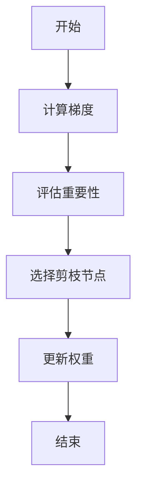
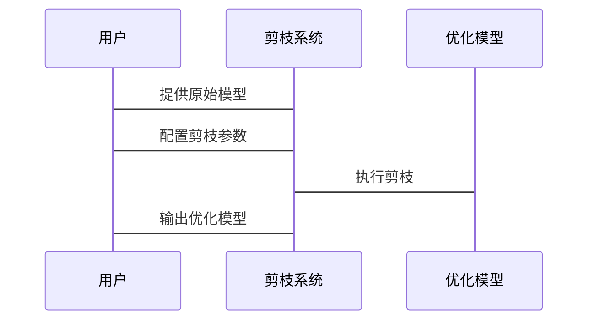

                 


# 神经网络剪枝：优化AI Agent的模型大小

> 关键词：神经网络剪枝，AI Agent，模型优化，模型压缩，深度学习

> 摘要：本文深入探讨了神经网络剪枝的核心概念、算法原理、系统设计与实战应用，旨在为AI Agent的模型优化提供理论支持与实践指导。通过对比分析、流程图、数学公式和代码示例，本文全面解析了神经网络剪枝的技术细节，并结合实际案例展示了其在优化AI Agent模型大小中的重要作用。

---

## 第1章: 神经网络剪枝概述

### 1.1 神经网络剪枝的概念与背景

#### 1.1.1 什么是神经网络剪枝
神经网络剪枝（Neural Network Pruning）是指通过移除或降低神经网络中冗余的部分（如权重或神经元），从而减少模型的大小和计算复杂度的过程。它是深度学习模型优化的重要手段之一。

#### 1.1.2 神经网络剪枝的背景与意义
随着深度学习的快速发展，神经网络模型的规模越来越大，模型的参数数量呈指数级增长。然而，在实际应用中，特别是在资源受限的场景下（如移动设备、边缘计算等），模型的大小和计算效率成为关键问题。神经网络剪枝通过减少模型的冗余部分，有效降低了模型的存储需求和计算成本。

#### 1.1.3 神经网络剪枝的目标与应用
神经网络剪枝的主要目标是：
- 减少模型的参数数量。
- 降低模型的计算复杂度。
- 提高模型的运行效率。

其应用场景包括：
- 移动端AI应用。
- 边缘计算中的模型部署。
- 大规模分布式计算中的资源优化。

---

### 1.2 神经网络剪枝的核心概念

#### 1.2.1 模型压缩与参数裁剪
- **模型压缩**：通过降低模型的参数数量或减少模型的深度/宽度，使模型更加轻量化。
- **参数裁剪**：通过移除模型中重要性较低的参数，减少模型的冗余部分。

#### 1.2.2 网络结构优化与权重优化
- **网络结构优化**：通过调整神经网络的拓扑结构（如减少层数或神经元数量），使模型更加简洁。
- **权重优化**：通过优化权重的分布，使模型在去除冗余部分后仍保持较高的准确性。

#### 1.2.3 剪枝策略与评估指标
- **剪枝策略**：包括贪心剪枝、基于规则的剪枝和基于优化的剪枝。
- **评估指标**：包括模型的准确率、模型的大小、模型的推理速度等。

---

### 1.3 神经网络剪枝的核心原理

#### 1.3.1 剪枝的基本原理
剪枝的基本思想是通过评估模型中各个参数的重要性，选择并移除重要性较低的参数。常见的评估重要性的方法包括：
- **梯度绝对值**：参数梯度的绝对值越大，说明该参数的重要性越高。
- **权重绝对值**：参数的绝对值越大，说明该参数的重要性越高。
- **模型性能变化**：通过删除部分参数后，模型性能的变化幅度来评估参数的重要性。

#### 1.3.2 剪枝与模型复杂度的关系
- **模型复杂度**：模型复杂度与剪枝密切相关。剪枝通过降低模型复杂度，减少模型的过拟合风险。
- **剪枝与过拟合**：剪枝可以有效减少过拟合，但过度剪枝可能导致模型欠拟合。

#### 1.3.3 剪枝对模型性能的影响
- **准确率变化**：剪枝可能对模型的准确率产生一定的影响，但通过合理的剪枝策略，可以在保持较高准确率的同时减少模型的大小。
- **推理速度提升**：剪枝可以显著提高模型的推理速度，特别是在移动设备等资源受限的环境中。

---

### 1.4 本章小结

---

## 第2章: 神经网络剪枝的核心概念与联系

### 2.1 神经网络剪枝的核心概念

#### 2.1.1 模型剪枝与模型压缩
- **模型剪枝**：通过移除模型中冗余的参数或神经元，减少模型的大小。
- **模型压缩**：通过量化、稀疏化等技术，降低模型的存储需求。

#### 2.1.2 模型剪枝与模型蒸馏
- **模型蒸馏**：通过将大模型的知识迁移到小模型中，实现模型的轻量化。
- 区别：剪枝是通过移除冗余部分实现模型优化，而蒸馏是通过知识迁移实现模型优化。

#### 2.1.3 模型剪枝与模型正则化
- **模型正则化**：通过添加正则化项，防止模型过拟合。
- 区别：剪枝是通过移除冗余部分实现优化，而正则化是通过惩罚项实现优化。

---

### 2.2 神经网络剪枝的核心属性对比

#### 2.2.1 模型剪枝与模型压缩的对比
| 对比维度      | 模型剪枝              | 模型压缩              |
|---------------|----------------------|----------------------|
| 核心思想      | 移除冗余部分          | 降低参数精度          |
| 实现方式      | 删除部分参数或神经元  | 量化、稀疏化等技术      |
| 对准确率影响  | 可能降低准确率        | 一般不影响准确率        |

#### 2.2.2 模型剪枝与模型蒸馏的对比
| 对比维度      | 模型剪枝              | 模型蒸馏              |
|---------------|----------------------|----------------------|
| 核心思想      | 移除冗余部分          | 知识迁移              |
| 实现方式      | 删除部分参数或神经元  | 小模型学习大模型知识    |
| 对准确率影响  | 可能降低准确率        | 一般不影响准确率        |

#### 2.2.3 模型剪枝与模型正则化的对比
| 对比维度      | 模型剪枝              | 模型正则化            |
|---------------|----------------------|----------------------|
| 核心思想      | 移除冗余部分          | 通过惩罚项防止过拟合  |
| 实现方式      | 删除部分参数或神经元  | 添加正则化项          |
| 对准确率影响  | 可能降低准确率        | 一般不影响准确率        |

---

### 2.3 神经网络剪枝的ER实体关系图


---

## 第3章: 神经网络剪枝的算法原理

### 3.1 神经网络剪枝的算法概述

#### 3.1.1 贪心剪枝算法
- **贪心剪枝**：逐层评估参数的重要性，逐步移除重要性最低的参数。
- **流程**：
  1. 训练原始模型。
  2. 计算每个参数的重要性（如梯度绝对值）。
  3. 移除重要性最低的参数。
  4. 重复上述步骤，直到达到目标剪枝比例。

#### 3.1.2 基于规则的剪枝算法
- **基于规则的剪枝**：根据预定义的规则（如某些层的重要性较低）进行剪枝。
- **流程**：
  1. 确定需要剪枝的层。
  2. 移除这些层的参数。
  3. 重新训练模型，调整剩余参数。

#### 3.1.3 基于优化的剪枝算法
- **基于优化的剪枝**：通过优化目标函数，自动选择最优的剪枝策略。
- **流程**：
  1. 定义目标函数，包含剪枝项。
  2. 使用优化算法（如梯度下降）进行训练。
  3. 剪枝项引导模型自动移除冗余部分。

---

### 3.2 剪枝算法的数学模型

#### 3.2.1 网络剪枝的数学表达
$$L_{\text{loss}} = L_{\text{original}} + \lambda L_{\text{prune}}$$
其中，$L_{\text{prune}}$ 是剪枝损失，$\lambda$ 是剪枝权重。

#### 3.2.2 剪枝损失的计算公式
$$L_{\text{prune}} = \sum_{i=1}^{n} w_i^2$$
其中，$w_i$ 是模型的权重，$n$ 是权重的总数。

---

### 3.3 剪枝算法的流程图



---

### 3.4 剪枝算法的Python实现示例

```python
def prune_model(model, prune_ratio=0.5):
    # 计算每个权重的重要性
    importance = {}
    for name, param in model.named_parameters():
        if 'weight' in name:
            importance[name] = torch.abs(param.data)
    # 排序并选择要剪枝的权重
    sorted_importance = sorted(importance.items(), key=lambda x: x[1])
    total_params = len(sorted_importance)
    prune_num = int(total_params * prune_ratio)
    prune_indices = set()
    for i in range(prune_num):
        prune_indices.add(sorted_importance[i][0])
    # 移除冗余权重
    new_model = torch.nn.Sequential()
    for name, module in model.named_children():
        if name not in prune_indices:
            new_model.add_module(name, module)
    return new_model
```

---

### 3.5 本章小结

---

## 第4章: 神经网络剪枝的系统设计

### 4.1 问题场景介绍
在AI Agent的应用中，模型的大小和计算效率直接影响其性能。特别是在资源受限的环境中，模型的剪枝优化至关重要。

---

### 4.2 系统功能设计

#### 4.2.1 领域模型


#### 4.2.2 系统架构设计


#### 4.2.3 系统接口设计
- **输入接口**：接收原始模型参数。
- **输出接口**：输出优化后的模型参数。
- **交互接口**：提供剪枝比例、剪枝策略等参数的配置。

#### 4.2.4 系统交互序列图


---

## 第5章: 神经网络剪枝的项目实战

### 5.1 项目环境安装

```bash
pip install tensorflow keras numpy matplotlib
```

### 5.2 核心代码实现

#### 5.2.1 模型训练与剪枝
```python
import tensorflow as tf
from tensorflow.keras import layers

# 定义原始模型
model = tf.keras.Sequential([
    layers.Dense(128, activation='relu'),
    layers.Dense(64, activation='relu'),
    layers.Dense(10, activation='softmax')
])

# 编译模型
model.compile(optimizer='adam', loss='sparse_categorical_crossentropy', metrics=['accuracy'])

# 训练模型
model.fit(x_train, y_train, epochs=10, batch_size=32)

# 执行剪枝
pruned_model = prune_model(model, prune_ratio=0.5)
```

#### 5.2.2 剪枝后的模型评估
```python
# 评估原始模型
original_accuracy = model.evaluate(x_test, y_test)[1]

# 评估剪枝后的模型
pruned_accuracy = pruned_model.evaluate(x_test, y_test)[1]
```

---

### 5.3 项目总结

---

## 第6章: 神经网络剪枝的最佳实践

### 6.1 总结与经验分享
- **经验1**：合理选择剪枝比例，避免过度剪枝导致模型性能下降。
- **经验2**：结合多种剪枝策略，如贪心剪枝与基于规则的剪枝结合使用。
- **经验3**：在剪枝后进行再训练，确保模型性能的稳定性。

### 6.2 注意事项
- **注意1**：剪枝可能会影响模型的准确率，需在性能与效率之间进行权衡。
- **注意2**：剪枝后的模型需要重新训练，以恢复模型性能。

### 6.3 拓展阅读
- 推荐书籍：《深度学习》（Deep Learning）—— Ian Goodfellow
- 推荐论文：《Learning Both Weights and Masks for Efficient Neural Networks》

---

## 作者：AI天才研究院/AI Genius Institute & 禅与计算机程序设计艺术 /Zen And The Art of Computer Programming

