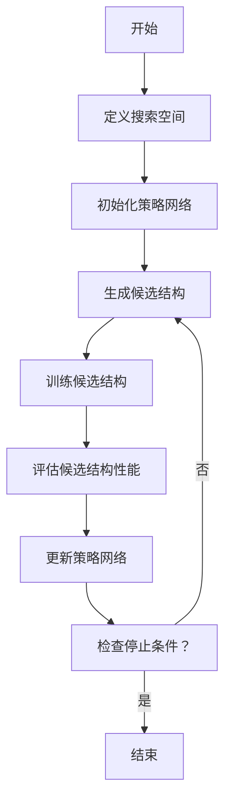
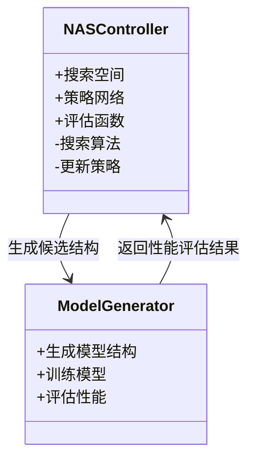

                 


# 神经网络架构搜索：优化AI Agent的模型结构

> 关键词：神经网络架构搜索，AI Agent，模型结构优化，深度学习，强化学习，遗传算法

> 摘要：本文深入探讨了神经网络架构搜索（Neural Architecture Search, NAS）在优化AI Agent模型结构中的应用。通过分析其核心概念、算法原理、系统架构及项目实战，本文旨在帮助读者理解如何通过NAS技术提升AI Agent的性能和效率。文章内容涵盖背景介绍、核心概念与联系、算法原理、数学模型、系统架构设计、项目实战以及总结与扩展，为读者提供全面而深入的指导。

---

## 第一部分：神经网络架构搜索背景介绍

### 第1章：神经网络架构搜索概述

#### 1.1 神经网络架构搜索的基本概念

神经网络架构搜索（Neural Architecture Search, NAS）是一种通过自动化方法搜索最优神经网络结构的技术。与传统的手动设计模型不同，NAS利用算法在搜索空间中自动探索和优化模型结构，从而提升模型的性能和效率。

- **1.1.1 神经网络架构搜索的定义**  
  NAS的目标是通过搜索算法，自动找到最优的神经网络结构，使得在特定任务和数据集上，模型的性能达到最佳。

- **1.1.2 神经网络架构搜索的核心问题**  
  NAS的核心问题在于如何定义搜索空间、设计搜索策略，并在有限的计算资源下高效地找到最优结构。

- **1.1.3 神经网络架构搜索的应用场景**  
  NAS广泛应用于图像分类、自然语言处理、推荐系统等领域，尤其在AI Agent中，NAS能够帮助设计更高效的模型结构，提升任务执行效率。

#### 1.2 神经网络架构搜索的背景与问题背景

随着深度学习的快速发展，模型的复杂性和参数量急剧增加，手动设计最优模型结构变得越来越困难。传统的试错方法不仅效率低下，而且难以覆盖所有可能的结构组合。因此，自动化地搜索最优模型结构成为亟待解决的问题。

- **1.2.1 深度学习模型的复杂性**  
  深度学习模型通常包含数百万甚至数十亿的参数，手动调整每个参数以优化模型结构几乎是不可能的任务。

- **1.2.2 手动设计模型的局限性**  
  手动设计模型结构不仅耗时耗力，而且容易受到设计师经验的限制，难以探索到最优的结构。

- **1.2.3 神经网络架构搜索的必要性**  
  NAS技术的出现，为自动化优化模型结构提供了可能，能够显著提高模型设计的效率和效果。

#### 1.3 神经网络架构搜索的目标与边界

NAS的目标是通过自动化方法找到最优的神经网络结构，同时在搜索过程中需要考虑计算资源的限制，避免过于复杂的结构导致计算成本过高。

- **1.3.1 神经网络架构搜索的目标**  
  在给定的任务和数据集上，找到最优的模型结构，使得模型的性能（如准确率、计算速度等）达到最佳。

- **1.3.2 神经网络架构搜索的边界**  
  NAS的边界包括搜索空间的定义、搜索算法的选择以及计算资源的限制。在实际应用中，需要根据具体任务合理设定这些边界。

- **1.3.3 神经网络架构搜索的外延**  
  NAS的外延包括与其他优化技术（如超参数优化）的结合，以及在不同硬件平台上的应用。

---

## 第二部分：神经网络架构搜索的核心概念与联系

### 第2章：神经网络架构搜索的核心概念

#### 2.1 神经网络架构搜索的核心原理

NAS的核心原理在于通过搜索算法在预定义的搜索空间中寻找最优的模型结构。搜索算法可以基于强化学习、遗传算法或其他优化方法。

- **2.1.1 神经网络架构搜索的基本流程**  
  1. 定义搜索空间：包括可能的层类型（如卷积层、全连接层）、层的连接方式等。  
  2. 选择搜索策略：如强化学习策略、遗传算法等。  
  3. 评估候选结构：通过训练和验证，评估候选结构的性能。  
  4. 更新搜索策略：根据评估结果调整搜索策略，逐步逼近最优结构。

- **2.1.2 神经网络架构搜索的关键技术**  
  - 搜索空间的定义：合理定义搜索空间是NAS成功的关键。  
  - 搜索策略的设计：选择合适的搜索算法以高效地探索搜索空间。  
  - 性能评估指标：准确率、计算速度、模型复杂度等。

#### 2.2 神经网络架构搜索的主要方法

目前，神经网络架构搜索的主要方法包括基于强化学习的架构搜索、基于遗传算法的架构搜索以及基于搜索空间的架构优化。

- **2.2.1 基于强化学习的架构搜索**  
  强化学习（Reinforcement Learning, RL）通过定义一个搜索策略，将模型结构的选择过程视为一个序列决策问题。策略网络通过与环境（即候选结构的性能）交互，逐步学习最优的结构。

- **2.2.2 基于遗传算法的架构搜索**  
  遗传算法（Genetic Algorithm, GA）通过模拟自然进化的过程，对候选结构进行变异和选择，逐步优化模型结构。

- **2.2.3 基于搜索空间的架构优化**  
  通过预定义的搜索空间，利用优化算法（如随机搜索、贝叶斯优化）寻找最优结构。

#### 2.3 神经网络架构搜索的核心要素对比

下表对比了不同NAS方法的核心要素特征：

| **方法**         | **搜索策略**       | **搜索空间**       | **优化目标**       |
|------------------|-------------------|-------------------|-------------------|
| 强化学习          | 策略网络           | 灵活性高           | 最大化性能奖励       |
| 遗传算法          | 变异和选择         | 离散空间           | 最小化适应度函数       |
| 搜索空间优化      | 优化算法（随机搜索、贝叶斯优化） | 确定性空间         | 最小化目标函数         |

---

## 第三部分：神经网络架构搜索的算法原理

### 第3章：神经网络架构搜索的算法流程

#### 3.1 神经网络架构搜索的算法概述

NAS的算法流程通常包括以下几个步骤：  
1. 定义搜索空间；  
2. 选择搜索策略；  
3. 生成候选结构；  
4. 训练并评估候选结构；  
5. 根据评估结果更新搜索策略；  
6. 重复步骤3-5，直到找到最优结构或达到停止条件。

---

#### 3.2 神经网络架构搜索的算法流程图

以下是基于强化学习的NAS算法流程图：



---

#### 3.3 神经网络架构搜索的Python实现示例

以下是一个简单的基于强化学习的NAS算法实现示例：

```python
import torch
import torch.nn as nn
import torch.optim as optim

# 定义策略网络
class PolicyNetwork(nn.Module):
    def __init__(self):
        super(PolicyNetwork, self).__init__()
        self.fc1 = nn.Linear(10, 20)
        self.fc2 = nn.Linear(20, 10)
    
    def forward(self, x):
        x = torch.relu(self.fc1(x))
        x = torch.log_softmax(self.fc2(x), dim=-1)
        return x

# 初始化策略网络
policy_net = PolicyNetwork()
optimizer = optim.Adam(policy_net.parameters(), lr=0.001)

# 定义搜索空间
search_space = [
    'conv2d', 'max_pool2d', 'avg_pool2d', 
    'linear', 'relu', 'sigmoid'
]

# 算法主循环
for epoch in range(100):
    # 生成候选结构
    with torch.no_grad():
        logits = policy_net(torch.randn(1, 10))
        action_probs = torch.exp(logits)
        action = torch.multinomial(action_probs, 1).item()
    
    # 训练候选结构
    model = generate_model(search_space[action])
    loss, accuracy = train_model(model)
    
    # 评估候选结构性能
    reward = accuracy - torch.mean(accuracy)
    
    # 更新策略网络
    optimizer.zero_grad()
    loss_fn = nn.NLLLoss()
    loss = loss_fn(logits, torch.tensor([action]))
    loss.backward()
    optimizer.step()
```

---

#### 3.4 神经网络架构搜索的数学模型

基于强化学习的NAS算法可以表示为以下数学模型：

$$
\text{目标函数} = \max_{\theta} \mathbb{E}_{\pi_\theta} [R(s)]
$$

其中，$R(s)$ 表示在状态 $s$ 下的奖励，$\pi_\theta$ 表示策略网络的参数。算法通过不断更新 $\theta$ 以最大化期望奖励。

---

## 第四部分：系统分析与架构设计方案

### 第4章：系统功能设计

#### 4.1 系统功能模块划分

以下是一个基于NAS的AI Agent系统功能模块划分图：



---

## 第五部分：项目实战

### 第5章：环境安装与核心代码实现

#### 5.1 环境安装

以下是安装所需环境的命令：

```bash
pip install torch numpy matplotlib
```

#### 5.2 系统核心代码实现

以下是一个简单的NAS算法实现示例：

```python
import torch
import torch.nn as nn
import torch.optim as optim

# 定义策略网络
class PolicyNetwork(nn.Module):
    def __init__(self):
        super(PolicyNetwork, self).__init__()
        self.fc1 = nn.Linear(10, 20)
        self.fc2 = nn.Linear(20, 10)
    
    def forward(self, x):
        x = torch.relu(self.fc1(x))
        x = torch.log_softmax(self.fc2(x), dim=-1)
        return x

# 初始化策略网络
policy_net = PolicyNetwork()
optimizer = optim.Adam(policy_net.parameters(), lr=0.001)

# 定义搜索空间
search_space = [
    'conv2d', 'max_pool2d', 'avg_pool2d', 
    'linear', 'relu', 'sigmoid'
]

# 算法主循环
for epoch in range(100):
    # 生成候选结构
    with torch.no_grad():
        logits = policy_net(torch.randn(1, 10))
        action_probs = torch.exp(logits)
        action = torch.multinomial(action_probs, 1).item()
    
    # 训练候选结构
    model = generate_model(search_space[action])
    loss, accuracy = train_model(model)
    
    # 评估候选结构性能
    reward = accuracy - torch.mean(accuracy)
    
    # 更新策略网络
    optimizer.zero_grad()
    loss_fn = nn.NLLLoss()
    loss = loss_fn(logits, torch.tensor([action]))
    loss.backward()
    optimizer.step()
```

---

## 第六部分：总结与扩展

### 第6章：总结

#### 6.1 最佳实践 tips

- **合理定义搜索空间**：确保搜索空间涵盖所有可能的模型结构。  
- **选择合适的搜索算法**：根据任务需求选择强化学习、遗传算法或其他优化方法。  
- **优化计算资源**：合理利用计算资源，避免搜索过程过于耗时。  

#### 6.2 小结

神经网络架构搜索（NAS）是一种强大的技术，能够帮助我们自动化优化AI Agent的模型结构。通过合理定义搜索空间、选择合适的搜索算法，并结合高效的计算资源，我们可以显著提升模型的性能和效率。

#### 6.3 注意事项

- **计算资源的限制**：在实际应用中，需要注意计算资源的限制，避免搜索过程过于耗时。  
- **模型的可解释性**：优化模型结构的同时，也需要关注模型的可解释性。  
- **算法的收敛性**：确保搜索算法能够收敛到最优结构，避免陷入局部最优。

#### 6.4 拓展阅读

- "Neural Architecture Search: A survey"  
- "Efficient Neural Architecture Search via Reinforcement Learning"  
- "DARTS: Differentiable Architecture Search"  

---

## 作者：AI天才研究院/AI Genius Institute & 禅与计算机程序设计艺术 /Zen And The Art of Computer Programming

