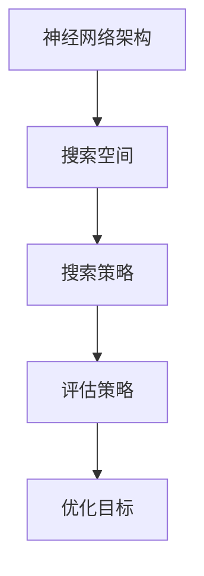
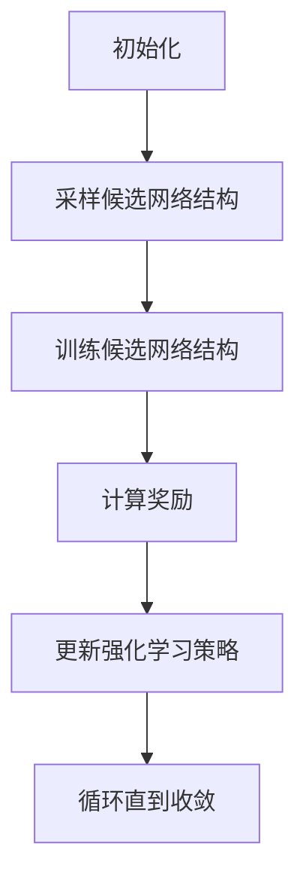
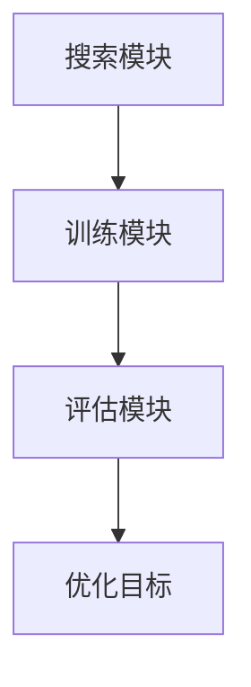

                 


# 神经网络架构搜索：自动化AI Agent模型结构优化

## 关键词：神经网络架构搜索、自动化AI Agent、模型结构优化、算法原理、系统架构设计、项目实战

## 摘要：  
神经网络架构搜索（Neural Architecture Search, NAS）是一种通过自动化方法优化神经网络结构的技术，旨在提高模型性能的同时减少人工设计的复杂性。本文将详细介绍神经网络架构搜索的核心概念、算法原理、系统架构设计，并通过实际案例展示其在AI Agent中的应用。通过本文的学习，读者将能够理解NAS的基本原理、掌握其主要算法、设计一个完整的NAS系统，并通过实战项目提升对NAS技术的掌握。

---

## 正文部分

### 第一部分: 神经网络架构搜索基础

### 第1章: 神经网络架构搜索概述

#### 1.1 神经网络架构搜索的背景与意义  
神经网络架构搜索（NAS）是一种通过自动化方法搜索最优神经网络结构的技术。传统的人工设计神经网络模型的方法耗时且效率低下，尤其是在深度学习模型日益复杂的今天，手动调整每一层的结构参数变得越来越困难。NAS通过自动化的方式，利用搜索算法（如强化学习、遗传算法等）在预定义的搜索空间中寻找最优或近似最优的网络结构，从而提高模型的性能。

#### 1.2 神经网络架构搜索的核心概念  
神经网络架构搜索的核心概念包括以下几个方面：  
1. **搜索空间**：定义可能的网络结构，包括层的类型、连接方式、参数数量等。  
2. **搜索策略**：用于指导搜索过程的策略，如强化学习策略、遗传算法等。  
3. **评估策略**：用于评估候选网络结构性能的指标，如准确率、F1分数等。  

#### 1.3 神经网络架构搜索的现状与挑战  
目前，NAS技术已经在图像分类、自然语言处理等领域取得了显著成果，但仍面临以下挑战：  
1. 计算资源消耗大：NAS需要多次训练不同的网络结构，计算成本较高。  
2. 搜索空间设计复杂：如何设计合理的搜索空间是当前研究的热点问题。  
3. 算法效率问题：如何提高搜索算法的效率是NAS技术进一步发展的关键。  

### 第2章: 神经网络架构搜索的核心概念与联系  

#### 2.1 神经网络架构搜索的核心概念  
神经网络架构搜索的核心概念包括以下几点：  
1. **搜索空间**：定义所有可能的网络结构，包括层的类型、连接方式等。  
2. **搜索策略**：用于指导搜索过程的方法，如强化学习策略、遗传算法等。  
3. **评估策略**：用于评估候选网络结构性能的指标，如准确率、F1分数等。  

#### 2.2 神经网络架构搜索的核心要素对比  
以下是几种核心概念的对比分析：  

| **核心要素** | **描述** |  
|--------------|-----------|  
| 搜索空间     | 定义所有可能的网络结构，包括层的类型、连接方式等。 |  
| 搜索策略     | 指导搜索过程的方法，如强化学习策略、遗传算法等。 |  
| 评估策略     | 用于评估候选网络结构性能的指标，如准确率、F1分数等。 |  

#### 2.3 神经网络架构搜索的实体关系图  
以下是神经网络架构搜索的实体关系图：  


### 第3章: 神经网络架构搜索的算法原理  

#### 3.1 神经网络架构搜索的主要算法  
神经网络架构搜索的主要算法包括以下几种：  
1. **基于强化学习的搜索算法**：通过强化学习代理（Agent）来搜索最优网络结构。  
2. **基于遗传算法的搜索算法**：利用遗传算法的变异和选择机制来优化网络结构。  
3. **基于贝叶斯优化的搜索算法**：通过贝叶斯模型来优化搜索过程。  

#### 3.2 基于强化学习的神经网络架构搜索算法原理  
以下是基于强化学习的NAS算法流程图：  


#### 3.3 基于强化学习的神经网络架构搜索算法的数学模型  
以下是基于强化学习的NAS算法的数学模型：  
奖励函数：  
$$ R = \alpha \cdot \text{准确率} + (1-\alpha) \cdot \text{结构复杂度} $$  
其中，$\alpha$ 是一个超参数，用于平衡准确率和结构复杂度。  

### 第二部分: 神经网络架构搜索的系统架构设计  

### 第4章: 神经网络架构搜索的系统架构设计  

#### 4.1 神经网络架构搜索的系统功能设计  
以下是神经网络架构搜索的系统功能设计：  
1. **问题场景**：定义需要优化的AI任务，如图像分类、自然语言处理等。  
2. **系统功能**：包括搜索空间定义、搜索策略选择、网络结构评估等。  
3. **系统架构**：包括搜索模块、训练模块、评估模块等。  

#### 4.2 神经网络架构搜索的系统架构图  
以下是神经网络架构搜索的系统架构图：  


### 第5章: 神经网络架构搜索的项目实战  

#### 5.1 项目环境安装  
以下是项目环境安装步骤：  
1. 安装Python和必要的库：  
   ```bash  
   pip install numpy tensorflow keras  
   ```  
2. 安装Mermaid和LaTeX插件。  

#### 5.2 系统核心代码实现  
以下是系统核心代码实现：  
```python  
import numpy as np  
import tensorflow as tf  

# 定义搜索空间  
def search_space():  
    layers = [...]  
    connections = [...]  
    return layers, connections  

# 定义强化学习代理  
class NASAgent:  
    def __init__(self, state_space, action_space):  
        self.state_space = state_space  
        self.action_space = action_space  
        self.model = ...  

    def act(self, state):  
        # 返回动作  
        pass  

    def update(self, state, action, reward):  
        # 更新策略  
        pass  

# 定义训练模块  
def train_model(model):  
    # 训练模型并返回准确率  
    pass  

# 定义评估模块  
def evaluate_model(model):  
    # 评估模型并返回奖励  
    pass  

# 主函数  
def main():  
    layers, connections = search_space()  
    agent = NASAgent(..., ...)  
    for _ in range(100):  
        state = get_state()  
        action = agent.act(state)  
        model = build_model(action)  
        reward = evaluate_model(model)  
        agent.update(state, action, reward)  

if __name__ == "__main__":  
    main()  
```

#### 5.3 代码解读与分析  
1. **search_space()函数**：定义可能的网络结构，包括层的类型和连接方式。  
2. **NASAgent类**：定义强化学习代理，包括状态空间、动作空间、策略模型等。  
3. **train_model()函数**：训练候选网络结构并返回准确率。  
4. **evaluate_model()函数**：评估候选网络结构并返回奖励。  
5. **main()函数**：主函数，实现NAS的搜索过程。  

### 第6章: 神经网络架构搜索的最佳实践  

#### 6.1 关键点总结  
1. 确定清晰的搜索空间。  
2. 选择合适的搜索算法。  
3. 设计合理的评估指标。  

#### 6.2 小结  
神经网络架构搜索是一种通过自动化方法优化神经网络结构的技术，能够在复杂任务中显著提高模型性能。  

#### 6.3 注意事项  
1. 确保计算资源充足。  
2. 合理设计搜索空间。  
3. 选择合适的搜索算法。  

#### 6.4 拓展阅读  
1.《神经网络与深度学习》  
2.《强化学习：原理与应用》  
3.《贝叶斯优化：理论与实践》  

---

## 作者：AI天才研究院 & 禅与计算机程序设计艺术

