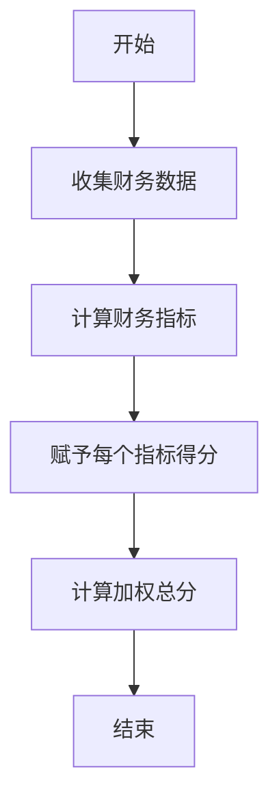
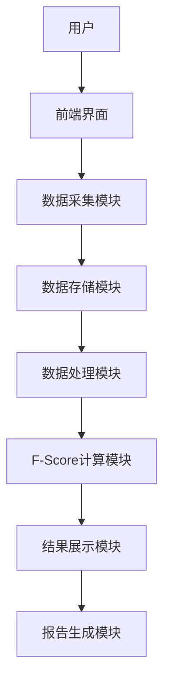
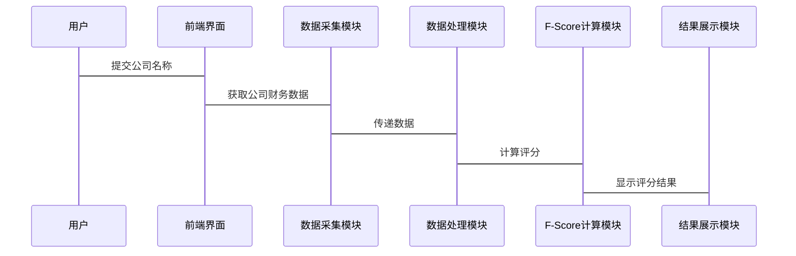

                 


# 约瑟夫·皮奥特罗斯基的F-Score选股模型

## 关键词
- F-Score选股模型
- 价值投资
- 财务健康状况
- 投资决策
- 股票评估

## 摘要
本文详细介绍了约瑟夫·皮奥特罗斯基提出的F-Score选股模型，探讨其在价值投资中的应用及其独特优势。通过分析F-Score的评分体系、算法原理和系统架构，结合实际案例，为投资者提供科学的选股方法。

---

# 第一部分: 约瑟夫·皮奥特罗斯基的F-Score选股模型概述

## 第1章: F-Score选股模型的背景与核心概念

### 1.1 价值投资与选股模型的演进
#### 1.1.1 价值投资的基本原理
- 价值投资的核心理念是寻找市场价格低于其内在价值的股票。
- 分析公司基本面（财务状况、行业地位、管理团队等）是价值投资的关键。

#### 1.1.2 传统选股模型的局限性
- 市盈率（P/E）模型：仅考虑价格与收益的关系，忽视了公司的财务健康状况。
- 市净率（P/B）模型：无法全面评估公司的盈利能力。

#### 1.1.3 F-Score模型的提出与目标
- 提出者：约瑟夫·皮奥特罗斯基。
- 目标：通过财务指标的综合评估，识别财务健康、具有投资价值的公司。

### 1.2 F-Score模型的核心概念
#### 1.2.1 F-Score的基本定义
- F-Score是一种基于财务指标的评分系统，用于评估公司的财务健康状况。
- 总分范围：0（最差）到10（最优）。

#### 1.2.2 F-Score的核心要素
- 主要指标：流动比率、速动比率、债务比率、利息覆盖倍数、净利率、营业收入增长率等。
- 评分权重：根据指标的重要性分配权重。

#### 1.2.3 F-Score的评分标准与计算方法
- 每个指标的得分范围：0-10分。
- 总分计算：加权平均法。

### 1.3 F-Score与传统选股模型的对比
#### 1.3.1 市盈率模型的优缺点
- 优点：简单易懂。
- 缺点：忽视了公司的财务健康状况。

#### 1.3.2 F-Score模型的独特性
- 全面性：考虑了多个财务指标。
- 科学性：通过加权评分，更准确地反映公司的财务状况。

#### 1.3.3 F-Score在投资决策中的优势
- 帮助投资者识别财务健康、具有长期投资价值的公司。
- 降低投资风险。

### 1.4 F-Score模型的应用场景
#### 1.4.1 价值投资中的应用
- 用于筛选低估值、财务健康的企业。

#### 1.4.2 成长型投资中的应用
- 用于评估成长型企业的财务稳定性。

#### 1.4.3 组合投资中的应用
- 作为投资组合的一部分，分散风险。

### 1.5 本章小结
- F-Score模型是一种科学的选股工具，能够帮助投资者更全面地评估公司的财务状况，从而做出更明智的投资决策。

---

## 第2章: F-Score模型的评分体系

### 2.1 F-Score评分体系的构成
#### 2.1.1 财务健康状况的评估维度
- 流动比率（Current Ratio）：衡量公司短期偿债能力。
- 速动比率（Quick Ratio）：进一步衡量短期偿债能力，排除存货影响。
- 债务比率（Debt Ratio）：衡量公司负债水平。
- 利息覆盖倍数（Interest Coverage Ratio）：衡量公司支付利息的能力。
- 净利率（Net Profit Margin）：衡量公司盈利能力。
- 营业收入增长率（Revenue Growth Rate）：衡量公司成长能力。

#### 2.1.2 财务数据的标准化处理
- 数据标准化：将不同公司的财务数据转换为可比的指标。
- 数据清洗：剔除异常值和错误数据。

#### 2.1.3 评分权重的分配原则
- 根据指标的重要性分配权重：例如，净利率和营业收入增长率权重较高。

### 2.2 F-Score评分的具体步骤
#### 2.2.1 数据收集与清洗
- 数据来源：公司财务报表（如资产负债表、利润表）。
- 数据清洗：处理缺失值、异常值。

#### 2.2.2 财务指标的计算与分析
- 计算每个指标的得分：根据标准化后的数据，赋予每个指标0-10分的评分。
- 加权计算：根据权重计算每个指标的最终得分。

#### 2.2.3 评分结果的汇总与解读
- 总分计算：所有指标得分的加权平均。
- 得分解读：得分越高，公司财务状况越健康。

### 2.3 F-Score评分的数学模型
#### 2.3.1 财务指标的计算公式
- 流动比率：$ \text{流动比率} = \frac{\text{流动资产}}{\text{流动负债}} $
- 速动比率：$ \text{速动比率} = \frac{\text{速动资产}}{\text{流动负债}} $
- 债务比率：$ \text{债务比率} = \frac{\text{总负债}}{\text{总资产}} $
- 利息覆盖倍数：$ \text{利息覆盖倍数} = \frac{\text{EBIT}}{\text{利息支出}} $
- 净利率：$ \text{净利率} = \frac{\text{净利润}}{\text{营业收入}} $
- 营收增长率：$ \text{营收增长率} = \frac{\text{当年营业收入} - \text{上期营业收入}}{\text{上期营业收入}} \times 100\% $

#### 2.3.2 评分权重的确定方法
- 根据经验或统计方法确定权重：例如，净利率权重为30%，营收增长率为20%。

#### 2.3.3 总分计算的数学表达式
$$ \text{总分} = \sum (\text{指标得分} \times \text{权重}) $$

### 2.4 F-Score评分的优缺点分析
#### 2.4.1 优点：简单易懂，操作性强
- 计算步骤清晰，易于理解和实施。
- 通过评分体系，能够快速筛选出财务健康的企业。

#### 2.4.2 缺点：依赖历史数据，忽视市场变化
- 仅基于历史财务数据，可能无法反映未来市场变化。
- 忽略了宏观经济环境和行业周期的影响。

#### 2.4.3 改进方向与建议
- 结合市场环境因素：引入宏观经济指标（如GDP增长率、行业景气度）。
- 动态调整权重：根据市场变化和公司特点调整指标权重。

### 2.5 本章小结
- F-Score模型通过综合评估多个财务指标，提供了一种科学的选股方法，但需要结合市场环境和其他因素进行综合判断。

---

## 第3章: F-Score模型的算法原理

### 3.1 F-Score评分的流程图


### 3.2 F-Score评分的Python实现
```python
import pandas as pd
import numpy as np

# 示例数据：假设我们有一个包含财务数据的DataFrame
data = {
    '公司': ['公司A', '公司B', '公司C'],
    '流动资产': [100, 150, 200],
    '流动负债': [50, 75, 100],
    '速动资产': [60, 80, 120],
    '总负债': [80, 100, 120],
    '总资产': [200, 250, 300],
    'EBIT': [20, 30, 40],
    '利息支出': [5, 10, 15],
    '净利润': [10, 15, 20],
    '营业收入': [100, 150, 200]
}
df = pd.DataFrame(data)

# 计算流动比率
df['流动比率'] = df['流动资产'] / df['流动负债']

# 计算速动比率
df['速动比率'] = df['速动资产'] / df['流动负债']

# 计算债务比率
df['债务比率'] = df['总负债'] / df['总资产']

# 计算利息覆盖倍数
df['利息覆盖倍数'] = df['EBIT'] / df['利息支出']

# 计算净利率
df['净利率'] = df['净利润'] / df['营业收入']

# 计算营收增长率
df['营收增长率'] = ((df['营业收入'] - df['营业收入'].shift(1)) / df['营业收入'].shift(1)) * 100

# 定义评分函数
def calculate_fscore(row):
    weights = {'流动比率': 0.1, '速动比率': 0.1, '债务比率': 0.2, 
               '利息覆盖倍数': 0.2, '净利率': 0.3, '营收增长率': 0.1}
    score = 0
    for metric in weights:
        score += row[metric] * weights[metric]
    return score

# 计算F-Score
df['F-Score'] = df.apply(calculate_fscore, axis=1)

print(df)
```

### 3.3 F-Score评分的数学模型
- 每个指标的得分计算：$ \text{指标得分} = \text{指标值} \times \text{权重} $
- 总分计算：$ \text{总分} = \sum (\text{指标得分}) $

### 3.4 F-Score评分的案例分析
- 案例：假设公司A的F-Score得分为7，公司B得分为5，公司C得分为8。
- 结论：公司C的财务状况最好，适合投资。

### 3.5 本章小结
- 通过Python代码实现F-Score评分模型，能够快速、准确地评估公司的财务健康状况。

---

## 第4章: 基于F-Score的选股系统设计

### 4.1 系统功能设计
#### 4.1.1 项目介绍
- 系统名称：F-Score选股系统。
- 功能目标：帮助投资者快速筛选出财务健康、具有投资价值的公司。

#### 4.1.2 系统功能模块
- 数据采集模块：从数据库或网络获取公司财务数据。
- 数据处理模块：清洗和标准化数据。
- F-Score计算模块：计算每个公司的F-Score评分。
- 可视化模块：展示评分结果，生成报告。

### 4.2 系统架构设计


### 4.3 系统接口设计
- 输入接口：公司财务数据。
- 输出接口：F-Score评分结果。

### 4.4 系统交互设计


### 4.5 本章小结
- 通过系统设计，能够实现F-Score评分的自动化计算和结果展示，提高投资决策的效率。

---

## 第5章: F-Score选股模型的项目实战

### 5.1 项目环境安装
- 安装Python和必要的库：pandas、numpy、matplotlib。

### 5.2 核心代码实现
```python
import pandas as pd
import numpy as np

# 数据加载
data = pd.read_csv('company_data.csv')

# 数据清洗
data.dropna()  # 删除缺失值

# F-Score计算
def calculate_fscore(row):
    weights = {'流动比率': 0.1, '速动比率': 0.1, '债务比率': 0.2, 
               '利息覆盖倍数': 0.2, '净利率': 0.3, '营收增长率': 0.1}
    score = 0
    for metric in weights:
        score += row[metric] * weights[metric]
    return score

data['F-Score'] = data.apply(calculate_fscore, axis=1)

# 结果展示
data.sort_values('F-Score', ascending=False).head(10)
```

### 5.3 代码解读与分析
- 数据加载：从CSV文件中读取公司财务数据。
- 数据清洗：删除缺失值。
- F-Score计算：为每个公司计算F-Score评分。
- 结果展示：按评分排序，筛选出评分最高的前10家公司。

### 5.4 案例分析
- 案例：假设从10家公司中筛选出评分最高的5家公司。
- 分析：这些公司在财务健康状况上表现优异，具有较高的投资价值。

### 5.5 本章小结
- 通过项目实战，读者可以掌握F-Score模型的实现方法，并能够在实际投资中应用。

---

## 第6章: F-Score选股模型的最佳实践与总结

### 6.1 最佳实践
- 数据来源：确保数据的准确性和及时性。
- 指标调整：根据市场变化和公司特点，动态调整指标权重。
- 结合其他模型：将F-Score与其他选股模型结合使用，提高投资决策的准确性。

### 6.2 小结
- F-Score模型是一种简单而有效的选股工具，能够帮助投资者快速筛选出财务健康、具有投资价值的公司。
- 在实际应用中，需要结合市场环境和其他因素，进行综合判断。

### 6.3 注意事项
- 数据质量：确保数据的准确性和完整性。
- 模型局限：F-Score模型仅基于历史财务数据，无法预测未来市场变化。
- 风险控制：投资需谨慎，建议分散投资，降低风险。

### 6.4 拓展阅读
- 《投资学基础》：深入理解投资的基本原理。
- 《财务报表分析》：掌握财务报表的分析方法。
- 《价值投资实战》：学习如何在实际投资中应用F-Score模型。

---

## 作者：AI天才研究院/AI Genius Institute & 禅与计算机程序设计艺术 /Zen And The Art of Computer Programming

---

通过本文的详细介绍，读者可以全面了解F-Score选股模型的核心原理、算法实现和实际应用，为投资决策提供科学依据。

