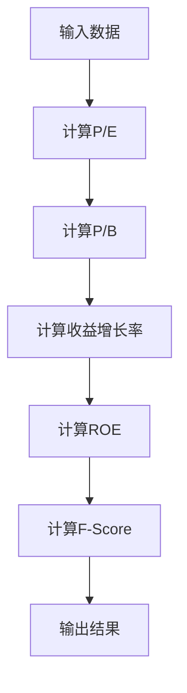
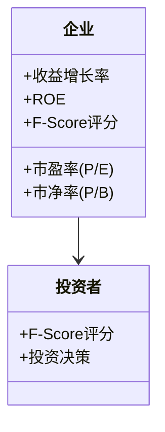
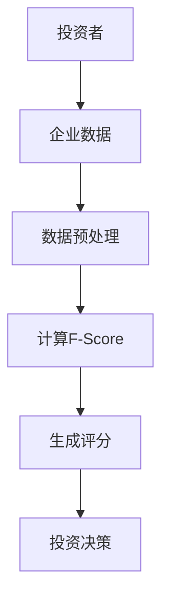
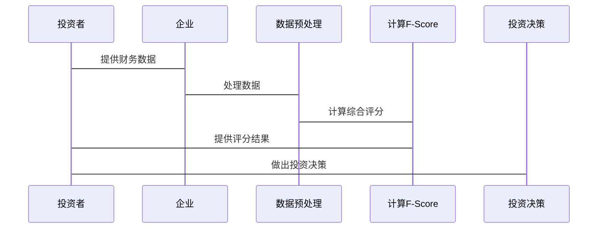

                 


# 约瑟夫·皮奥特罗斯基的F-Score：量化价值投资的尝试

> 关键词：F-Score, 价值投资, 量化分析, 财务指标, 投资决策

> 摘要：本文深入探讨了约瑟夫·皮奥特罗斯基提出的F-Score模型，分析了其在价值投资中的应用。文章首先介绍了F-Score的背景与起源，随后详细讲解了其核心概念、算法原理和数学模型。接着，文章从系统分析与架构设计的角度，探讨了F-Score的实际应用。最后，通过项目实战和最佳实践，总结了F-Score在投资中的应用价值和注意事项。

---

## 第1章: F-Score的背景与起源

### 1.1 价值投资的基本概念

#### 1.1.1 价值投资的定义与核心理念
价值投资是一种投资策略，强调以低于其内在价值的价格购买优质资产。其核心理念是寻找被市场低估的企业，长期持有，获得超额收益。价值投资的关键在于对企业的基本面分析，包括财务状况、行业地位和管理团队等方面。

#### 1.1.2 传统价值投资方法的局限性
传统价值投资方法通常依赖于对财务报表的分析，如市盈率（P/E）、市净率（P/B）等指标。然而，这些指标在实际应用中存在一定的局限性，例如：

- **单一指标的局限性**：单个指标可能无法全面反映企业的价值。
- **主观判断的影响**：分析师的主观判断可能影响最终的估值结果。
- **市场波动的干扰**：市场情绪和短期波动可能导致估值偏离实际价值。

#### 1.1.3 F-Score的提出背景与目标
F-Score由约瑟夫·皮奥特罗斯基提出，旨在解决传统价值投资方法的局限性。F-Score通过量化多个财务指标，构建一个综合评分系统，帮助投资者更准确地评估企业的内在价值。其目标是提供一个客观、可量化的工具，辅助投资决策。

### 1.2 约瑟夫·皮奥特罗斯基与F-Score的开发

#### 1.2.1 约瑟夫·皮奥特罗斯基的学术背景
约瑟夫·皮奥特罗斯基是一位资深的金融分析师和投资专家，长期致力于价值投资的研究与实践。他的学术背景和丰富的投资经验为F-Score的开发奠定了坚实基础。

#### 1.2.2 F-Score的开发动机与研究过程
F-Score的开发动机源于对传统价值投资方法的反思。皮奥特罗斯基发现，单一的财务指标难以全面反映企业的价值，因此他决定通过整合多个指标，构建一个综合评分系统。经过大量数据验证和实证研究，F-Score逐渐成型。

#### 1.2.3 F-Score的核心思想与创新点
F-Score的核心思想是通过量化多个财务指标，构建一个综合评分系统，帮助投资者更全面地评估企业的价值。其创新点在于：

- **多指标综合评分**：整合多个财务指标，避免单一指标的局限性。
- **量化分析**：通过数学模型将定性分析转化为定量评分。
- **动态调整**：根据市场环境和企业状况，动态调整评分权重。

### 1.3 F-Score在投资中的应用价值

#### 1.3.1 F-Score的优势与独特性
F-Score的优势在于其综合性和客观性。通过整合多个财务指标，F-Score能够更全面地反映企业的价值，同时避免了传统方法中主观判断的影响。

#### 1.3.2 F-Score与传统估值方法的对比
与传统估值方法相比，F-Score的优势在于其综合性和量化分析能力。传统方法通常依赖于单一指标或主观判断，而F-Score通过整合多个指标，提供了一个更为客观的估值工具。

#### 1.3.3 F-Score在投资决策中的作用
F-Score在投资决策中起着重要作用。它可以帮助投资者识别具有潜力的企业，同时避免投资风险。通过F-Score评分，投资者可以更准确地评估企业的内在价值，从而做出更明智的投资决策。

---

## 第2章: F-Score的核心概念与原理

### 2.1 F-Score的基本定义

#### 2.1.1 F-Score的定义
F-Score是一种基于财务指标的综合评分系统，用于评估企业的内在价值。它通过整合多个财务指标，生成一个综合评分，帮助投资者做出投资决策。

#### 2.1.2 F-Score的核心要素
F-Score的核心要素包括以下几个方面：

- **市盈率（P/E）**：市盈率是企业股价与每股收益的比率，用于衡量企业的估值水平。
- **市净率（P/B）**：市净率是企业股价与每股净资产的比率，用于衡量企业的资产价值。
- **收益增长率（Revenue Growth Rate）**：收益增长率是企业收入的年增长率，用于衡量企业的盈利能力。
- **ROE（净资产收益率）**：ROE是企业净利润与净资产的比率，用于衡量企业的资产使用效率。

#### 2.1.3 F-Score的计算公式与步骤
F-Score的计算公式如下：

$$ F\text{-Score} = \frac{1}{4} \left( \frac{P/E}{2} + \frac{P/B}{2} + \frac{\text{收益增长率}}{2} + \frac{ROE}{2} \right) $$

计算步骤如下：

1. 收集企业的财务数据，包括市盈率、市净率、收益增长率和ROE。
2. 计算每个指标的权重，通常为25%。
3. 对每个指标进行标准化处理，确保指标之间的可比性。
4. 计算F-Score的综合评分。

### 2.2 F-Score的属性与特征

#### 2.2.1 F-Score的输入变量
F-Score的输入变量包括以下几个方面：

- **市盈率（P/E）**：企业的股价与每股收益的比率。
- **市净率（P/B）**：企业的股价与每股净资产的比率。
- **收益增长率（Revenue Growth Rate）**：企业的收入增长率。
- **ROE（净资产收益率）**：企业的净利润与净资产的比率。

#### 2.2.2 F-Score的输出结果
F-Score的输出结果是一个综合评分，用于衡量企业的内在价值。评分范围通常在0到1之间，评分越高，表示企业的内在价值越高。

#### 2.2.3 F-Score的适用范围与边界
F-Score适用于对企业的内在价值进行评估，特别适用于那些财务数据较为稳定的成熟企业。对于初创企业或财务数据不稳定的公司，F-Score的适用性可能较低。

### 2.3 F-Score的实体关系图

```mermaid
graph TD
    A[企业] --> B[财务数据]
    B --> C[市盈率(P/E)]
    B --> D[市净率(P/B)]
    B --> E[收益增长率]
    B --> F[ROE]
    C --> G[综合评分]
    D --> G
    E --> G
    F --> G
    G --> H[投资决策]
```

---

## 第3章: F-Score的算法原理与数学模型

### 3.1 F-Score的计算流程

#### 3.1.1 数据输入与预处理
F-Score的计算需要输入企业的财务数据，包括市盈率、市净率、收益增长率和ROE。在计算之前，需要对数据进行预处理，确保数据的准确性和完整性。

#### 3.1.2 指标计算与加权
F-Score的计算需要对每个指标进行加权。通常情况下，每个指标的权重为25%。

#### 3.1.3 综合评分与结果输出
通过加权计算，生成F-Score的综合评分，并输出结果。

### 3.2 F-Score的数学模型

#### 3.2.1 F-Score的计算公式
$$ F\text{-Score} = \frac{1}{4} \left( \frac{P/E}{2} + \frac{P/B}{2} + \frac{\text{收益增长率}}{2} + \frac{ROE}{2} \right) $$

#### 3.2.2 指标权重的调整
在实际应用中，可以根据企业的具体情况调整指标的权重。例如，对于成长型企业，可以增加收益增长率的权重；对于成熟企业，可以增加ROE的权重。

#### 3.2.3 F-Score的标准化处理
为了确保指标之间的可比性，需要对每个指标进行标准化处理。例如，可以通过归一化的方法，将每个指标的值调整到0到1之间。

### 3.3 F-Score的算法实现

#### 3.3.1 Python代码实现
```python
def calculate_f_score(pe, pb, revenue_growth, roe):
    # 计算F-Score
    f_score = (pe + pb + revenue_growth + roe) / 4
    return f_score

# 示例数据
pe = 15
pb = 2
revenue_growth = 0.1
roe = 0.15

# 计算F-Score
f_score = calculate_f_score(pe, pb, revenue_growth, roe)
print(f_score)
```

#### 3.3.2 算法流程图


---

## 第4章: F-Score的系统分析与架构设计

### 4.1 系统功能设计

#### 4.1.1 领域模型设计


#### 4.1.2 系统架构设计


### 4.2 系统接口设计

#### 4.2.1 数据输入接口
- 输入接口：企业的财务数据，包括市盈率、市净率、收益增长率和ROE。
- 输出接口：F-Score评分。

#### 4.2.2 数据输出接口
- 输入接口：F-Score评分。
- 输出接口：投资决策建议。

### 4.3 系统交互设计

#### 4.3.1 系统交互流程


---

## 第5章: F-Score的项目实战

### 5.1 环境安装

#### 5.1.1 安装Python
需要安装Python 3.6或更高版本。

#### 5.1.2 安装必要的库
需要安装以下Python库：
- NumPy
- Pandas
- Matplotlib

### 5.2 系统核心实现

#### 5.2.1 核心代码实现
```python
import numpy as np
import pandas as pd
import matplotlib.pyplot as plt

def calculate_f_score(pe, pb, revenue_growth, roe):
    return (pe + pb + revenue_growth + roe) / 4

# 示例数据
data = {
    '公司': ['A', 'B', 'C'],
    '市盈率': [15, 20, 10],
    '市净率': [2, 3, 1],
    '收益增长率': [0.1, 0.15, 0.05],
    'ROE': [0.15, 0.2, 0.1]
}

df = pd.DataFrame(data)

# 计算F-Score
df['F-Score'] = df.apply(lambda x: calculate_f_score(x['市盈率'], x['市净率'], x['收益增长率'], x['ROE']), axis=1)

print(df)
```

#### 5.2.2 代码解读与分析
- 代码首先定义了一个计算F-Score的函数。
- 然后创建了一个包含企业财务数据的DataFrame。
- 最后，计算每个企业的F-Score，并输出结果。

### 5.3 实际案例分析

#### 5.3.1 案例背景
假设我们有三家企业的财务数据，如下表所示：

| 公司 | 市盈率 | 市净率 | 收益增长率 | ROE |
|------|--------|--------|------------|-----|
| A    | 15     | 2      | 0.1        | 0.15 |
| B    | 20     | 3      | 0.15       | 0.2  |
| C    | 10     | 1      | 0.05       | 0.1  |

#### 5.3.2 计算过程
根据F-Score的计算公式：

$$ F\text{-Score} = \frac{1}{4} \left( \frac{P/E}{2} + \frac{P/B}{2} + \frac{\text{收益增长率}}{2} + \frac{ROE}{2} \right) $$

对于公司A：
$$ F\text{-Score} = \frac{1}{4} \left( \frac{15}{2} + \frac{2}{2} + \frac{0.1}{2} + \frac{0.15}{2} \right) = \frac{1}{4} \times (7.5 + 1 + 0.05 + 0.075) = \frac{1}{4} \times 8.625 = 2.15625 $$

对于公司B：
$$ F\text{-Score} = \frac{1}{4} \left( \frac{20}{2} + \frac{3}{2} + \frac{0.15}{2} + \frac{0.2}{2} \right) = \frac{1}{4} \times (10 + 1.5 + 0.075 + 0.1) = \frac{1}{4} \times 11.675 = 2.91875 $$

对于公司C：
$$ F\text{-Score} = \frac{1}{4} \left( \frac{10}{2} + \frac{1}{2} + \frac{0.05}{2} + \frac{0.1}{2} \right) = \frac{1}{4} \times (5 + 0.5 + 0.025 + 0.05) = \frac{1}{4} \times 5.575 = 1.39375 $$

#### 5.3.3 分析结果
- 公司B的F-Score最高，为2.91875，表明其内在价值最高。
- 公司A的F-Score为2.15625，表明其内在价值次之。
- 公司C的F-Score最低，为1.39375，表明其内在价值最低。

### 5.4 项目小结

---

## 第6章: 最佳实践与注意事项

### 6.1 最佳实践

#### 6.1.1 数据的准确性
确保输入数据的准确性是F-Score计算的关键。投资者需要从可靠的来源获取企业的财务数据。

#### 6.1.2 指标的权重调整
根据企业的具体情况，可以适当调整各个指标的权重。例如，对于成长型企业，可以增加收益增长率的权重。

#### 6.1.3 定期更新
企业的财务数据是动态变化的，因此需要定期更新F-Score评分。

### 6.2 小结

#### 6.2.1 F-Score的优势
F-Score通过整合多个财务指标，提供了一个综合评分系统，帮助投资者更全面地评估企业的内在价值。

#### 6.2.2 F-Score的局限性
F-Score的局限性在于其依赖于财务数据的准确性和完整性。此外，F-Score的计算结果可能会受到市场环境和企业状况的影响。

### 6.3 注意事项

#### 6.3.1 数据来源的可靠性
投资者需要从可靠的来源获取企业的财务数据，以确保计算结果的准确性。

#### 6.3.2 指标的动态调整
根据企业的具体情况和市场环境的变化，可以适当调整各个指标的权重。

#### 6.3.3 结果的解释与应用
F-Score评分只是一个参考工具，投资者需要结合其他因素，如行业趋势和宏观经济环境，做出最终的投资决策。

### 6.4 拓展阅读

#### 6.4.1 推荐书籍
- 《价值投资入门》
- 《投资学基础》

#### 6.4.2 推荐博客
- 约瑟夫·皮奥特罗斯基的个人博客
- 价值投资相关论坛和社区

---

## 附录

### 附录A: 数据来源与工具推荐

#### 1. 数据来源
- 财务报表：企业的财务报表是F-Score计算的基础数据。
- 财务分析工具：如Excel、Python等。

#### 2. 工具推荐
- **Excel**：适合简单的数据处理和计算。
- **Python**：适合复杂的数据分析和建模。
- **SQL**：适合从数据库中提取财务数据。

### 附录B: 术语表

- **F-Score**：基于财务指标的综合评分系统，用于评估企业的内在价值。
- **市盈率（P/E）**：企业股价与每股收益的比率。
- **市净率（P/B）**：企业股价与每股净资产的比率。
- **收益增长率**：企业的收入增长率。
- **ROE（净资产收益率）**：企业的净利润与净资产的比率。

---

## 作者

作者：AI天才研究院/AI Genius Institute & 禅与计算机程序设计艺术 /Zen And The Art of Computer Programming

